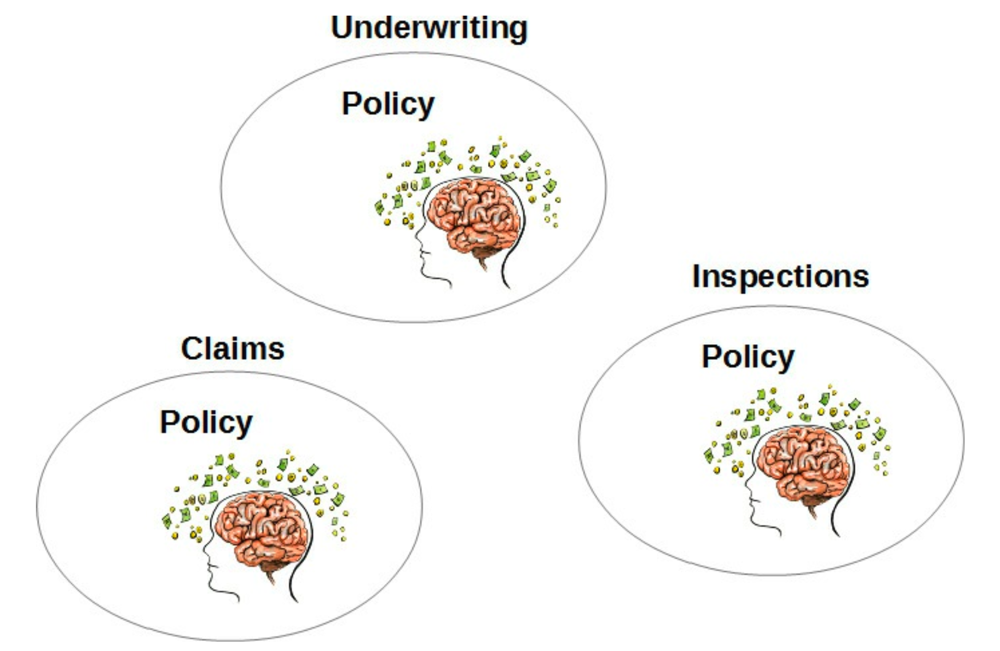
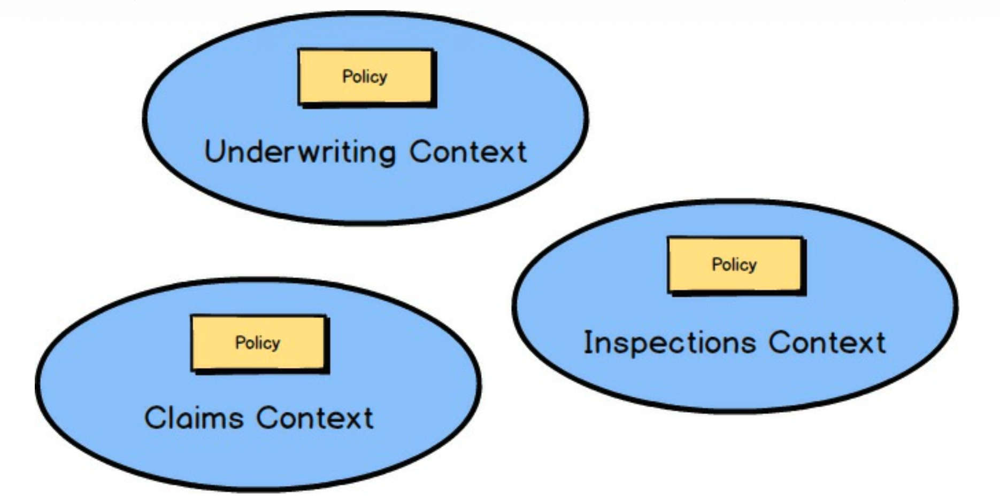

 

## 领域专家与业务驱动因素

业务干系人可能传达过强烈的，或至少是微妙的暗示，这些暗示本可以用来帮助技术团队做出更好的建模选择。
因此，*大泥球 (Big Ball of Mud)* 通常是由于软件开发团队不听取业务专家意见而做出的无节制努力的结果。

 

业务的部门或工作组划分可以很好地指示模型边界应该在哪里。
你往往会发现每个业务功能至少有一位业务专家。
最近有一种按项目分组人员的趋势，而业务部门甚至管理层级下的职能组似乎不那么受欢迎了。
即使面对较新的业务模式，你仍然会发现项目是根据业务驱动因素和组织在专业领域下进行的。
你可能需要以这些术语来思考部门或职能。

当你考虑到每个业务功能可能对同一术语有不同的定义时，你就可以确定需要这种隔离。
考虑名为 “保单 (policy)” 的概念，以及其含义在不同的保险业务功能中如何不同。
你可以很容易地想象，核保中的保单与理赔中的保单和查勘中的保单有很大不同。
更多细节见边栏。

这些业务领域中的每个保单都因不同的原因而存在。
这个事实是无法逃避的，再多的心理体操 (mental gymnastics) 也无法改变这一点。

---
**按功能划分的保单差异**

*核保中的保单*：
在以核保为重点的专业领域中，保单是基于对被保险实体风险的评估而创建的。
例如，在财产保险核保工作中，核保人员会评估给定财产的相关风险，以计算涵盖该财产资产的保单保费。

*查勘中的保单*：
同样，如果我们在财产保险领域工作，保险组织可能有一个负责查勘待保险财产的查勘专业领域。
核保人员在一定程度上依赖查勘期间发现的信息，但仅仅是从财产处于被保险人声称的状态这一角度出发。
假设财产将被保险，查勘细节 ——照片和备注—— 与查勘领域中的保单相关联，其数据可被核保部门参考，以协商核保领域的最终保费成本。

*理赔中的保单*：
理赔专业领域中的保单根据核保领域创建的保单条款，跟踪被保险人的付款请求。
理赔保单需要引用一些核保保单，但将聚焦于，例如，对被保险财产的损害以及理赔人员进行审查以确定应支付的赔款（如果有的话）。

---

如果你试图将这三类保单合并为适用于所有三个业务组的单一保单，你肯定会遇到问题。
如果这个已经过载的保单将来还必须支持第四个和第五个业务概念，问题会变得更加严重。
没有人能赢。

 

<ins>另一方面，DDD 强调通过将不同类型隔离到不同的 *限界上下文 (Bounded Contexts)* 中来接受这些差异</ins>。
承认存在不同的语言，并据此运作。
如果 `Policy` 有三种含义？
那么就存在三个 *限界上下文 (Bounded Contexts)* ，每个都有其自己的 `Policy`，每个 `Policy` 都有其自己独特的属性。
没有必要将这些命名为 `UnderwritingPolicy`、`ClaimsPolicy` 或 `InspectionsPolicy`。
*限界上下文 (Bounded Context)* 的名称处理了该范围界定。
在三个 *限界上下文 (Bounded Context)* 中，名称都只是 `Policy`。

---
**另一个例子：什么是航班？**

在航空业中，“航班 (flight)” 可以有多种含义。
有一种航班被定义为一次起飞和降落，飞机从一个机场飞往另一个机场。
有一种不同类型的航班是根据飞机维护来定义的。
还有另一种航班是根据乘客票务来定义的，可以是直达或经停。
因为 “航班” 的每种用法都只有在其上下文中才能被清楚地理解，所以每种都应该在单独的 *限界上下文 (Bounded Context)* 中建模。
将这三者建模在同一个 *限界上下文 (Bounded Context)* 中将导致混乱的纠缠。

---
