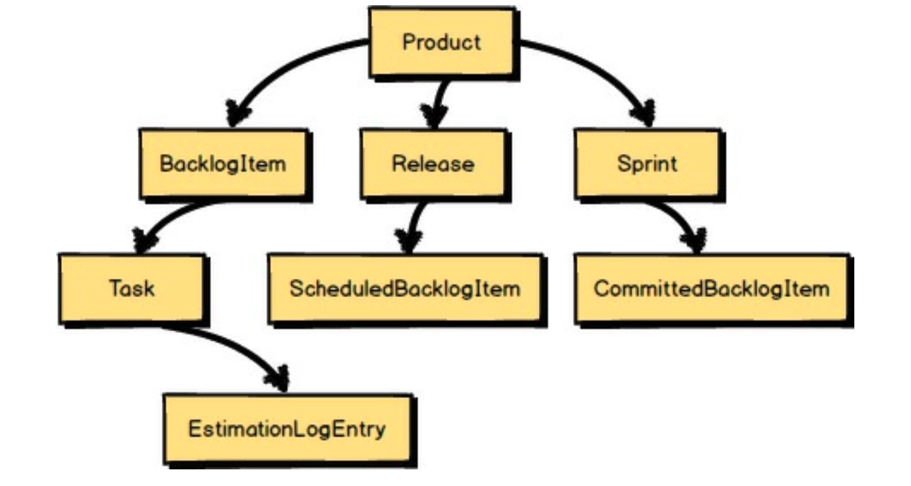
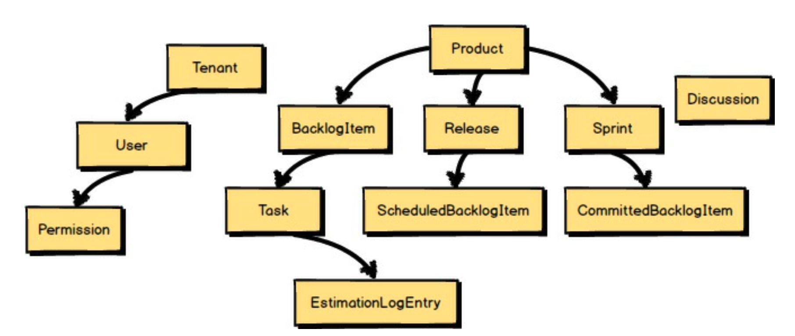
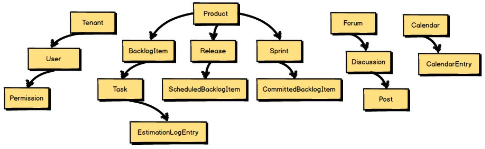
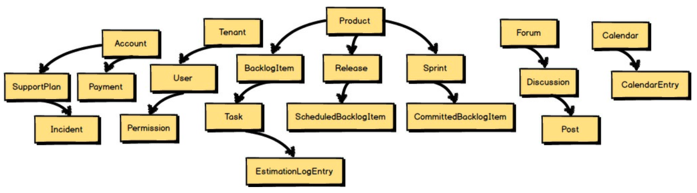
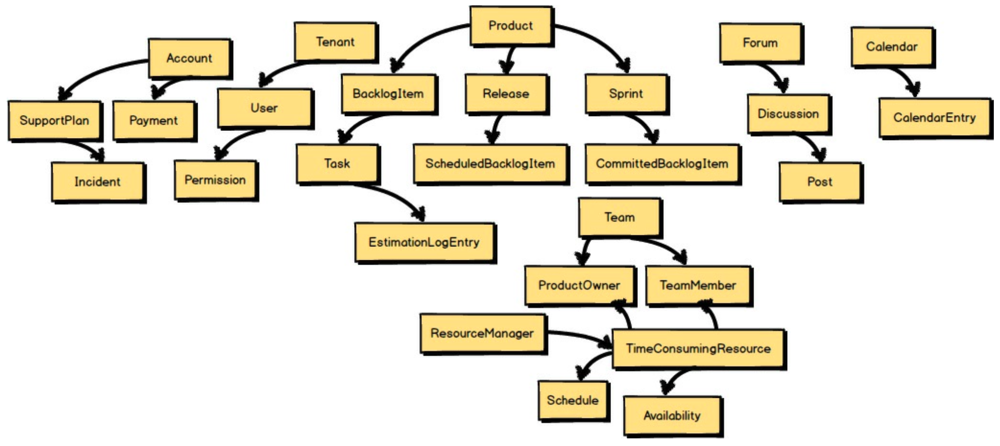
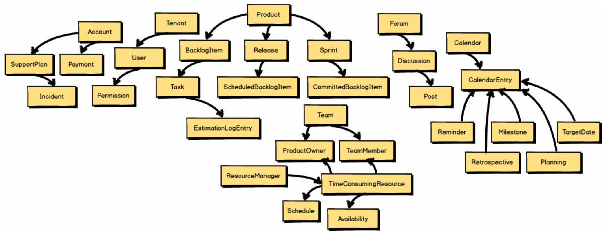
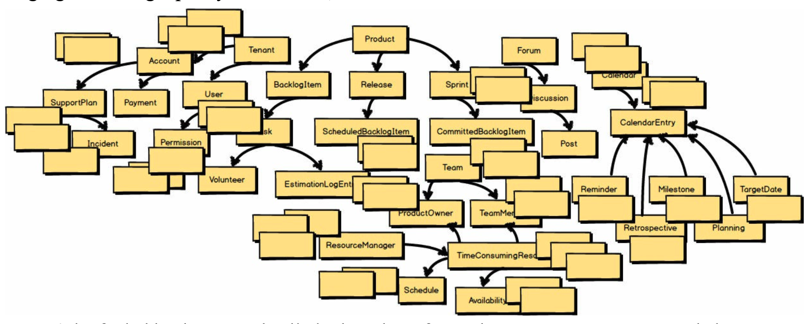

 

## 案例研究

为了让使用 *限界上下文 (Bounded Contexts)* 的理由更加具体，让我用一个示例领域模型来说明。
在这种情况下，我们正在开发一个基于 Scrum 的敏捷项目管理应用程序。
因此，一个核心概念是 `Product`（产品），它代表将要构建的软件，并可能在数年的开发中不断完善。
`Product` 有 `Backlog Items`（待办项）、`Releases`（发布）和 `Sprints`（冲刺）。
每个 `Backlog Item` 有一些 `Tasks`（任务），每个 `Task` 可以有一组 `Estimation Log Entries`（估算日志条目）。
`Releases` 有 `Scheduled Backlog Items`（已安排的待办项），`Sprints` 有 `Committed Backlog Items`（已承诺的待办项）。
到目前为止，一切顺利。
我们已经确定了领域模型的核心概念，并且语言是聚焦且完整的。

 

“哦，对了，” 团队成员说，“我们还需要我们的用户。
而且我们希望促进产品团队内的协作讨论。
让我们将每个订阅组织表示为一个 `Tenant`（租户）。
在 `Tenants` 内，我们将允许注册任意数量的 `Users`（用户），并且 `Users` 将拥有 `Permissions`（权限）。
让我们添加一个称为 `Discussion`（讨论）的概念来表示我们将支持的协作工具之一。”

 

然后团队成员补充道：“嗯，还有其他的协作工具。`Discussion`（讨论）属于 `Forums`（论坛），并且`Discussion`（讨论）有 `Posts`（帖子）。
我们还希望支持 `Shared Calendars`（共享日历）。”

 

他们继续说：“别忘了，我们需要一种让 `Tenants`（租户）进行` Payments`（支付）的方式。
我们还将销售分层的售后支持计划，所以我们需要一种跟踪支持事件的方式。
`Support`(支持）和 `Payments`（支付）都应该在 `Account`（账户）下管理。”

 

还有更多的概念出现了：“每个基于 Scrum 的 `Product`（产品）都有一个特定的 `Team`（团队）来处理该产品。
`Teams`（团队）由一位 `Product Owner`（产品负责人）和一些 `Team memebers`（团队成员）组成。
但是我们如何处理人力资源利用率的问题呢？
嗯，如果我们对团队成员的 `Schedules`（日程安排）以及他们的利用率和可用性进行建模会怎么样？”

 

“你们知道还有什么吗？”
他们问道。
“ `Shared Calendars`（共享日历）不应局限于平淡的 `Calendar Entries`（日历条目）。
我们应该能够识别特定类型的 `Calendar Entries`（日历条目），例如 `Reminders`（提醒）、`Team Milestones`（团队里程碑）、`Planning`（规划）和 `Retrospective Meetings`（回顾会议）以及 `Target Dates`（目标日期）。”

等一下！
你看到团队正在掉入的陷阱了吗？
看看他们已经偏离了最初的核心概念多远：`Product`、`Backlog Items`、`Releases` 和 `Sprints`。
语言不再纯粹关于 Scrum；它已经变得支离破碎和混乱。

 

不要被数量有限的命名概念所迷惑。
对于每个命名的元素，我们可能期望有两到三个额外的概念来支持那些迅速浮现在脑海中的概念。
团队已经在通往交付 *大泥球 (Big Ball of Mud)* 的路上，而项目才刚刚开始。
