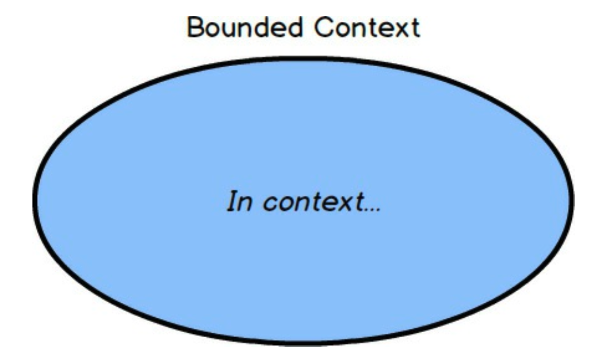
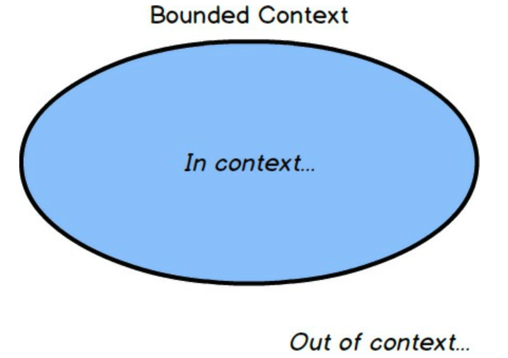
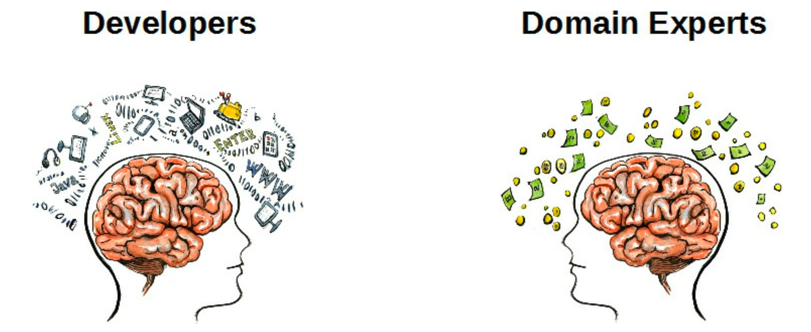
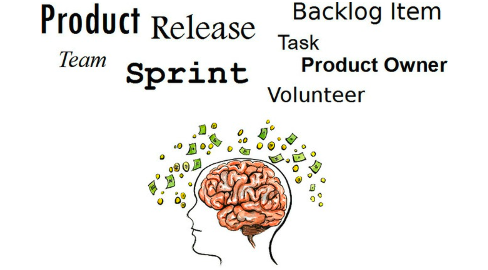
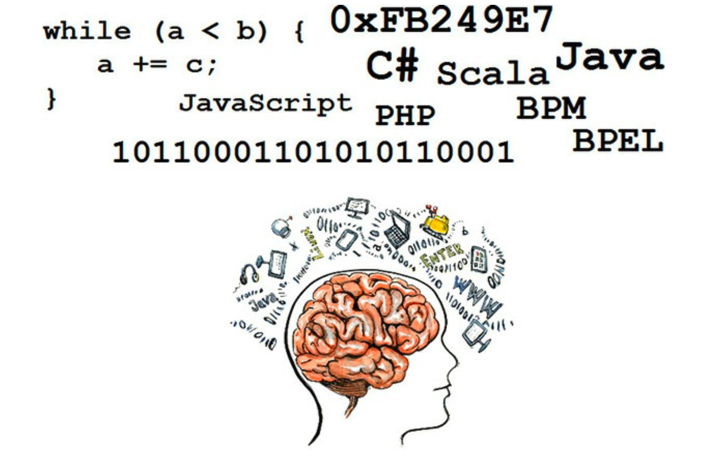
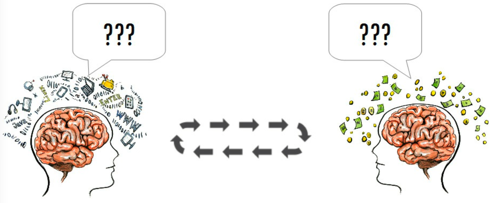

 

## 需要基本的战略设计

DDD 中有哪些工具可以帮助我们避免此类陷阱？
你至少需要两个基本的战略设计工具。
一个是 *限界上下文 (Bounded Context)* ，另一个是 *通用语言 (Ubiquitous Language)* 。
<ins>采用 *限界上下文 (Bounded Context)* 迫使我们回答 “什么是核心？” 这个问题。
*限界上下文 (Bounded Context)* 应该紧密地持有对战略举措至关重要的所有概念，并将其余部分排除在外</ins>。
保留下来的概念是团队 *通用语言 (Ubiquitous Language)* 的一部分。
你将看到 DDD 如何避免单体应用程序的设计。

---
**测试的好处**

由于 *限界上下文 (Bounded Context)* 不是单体，因此在使用它们时还能体验到其他好处。
其中一项好处是，测试将专注于一个模型，因此数量更少，运行速度更快。
虽然这不是使用 *限界上下文 (Bounded Context)* 的主要动机，但它肯定会在其他方面带来回报。

---

 

字面上讲，有些概念会在上下文中，并明确地包含在团队的语言中。

 

<ins>而其他概念则会被排除在上下文之外。
那些通过这种严格的 “仅核心” 筛选的概念，构成了拥有该 *限界上下文 (Bounded Context)* 的团队的 *通用语言 (Ubiquitous Language)* 的一部分</ins>。

---
**注意**

通过这种严格的 “仅核心” 筛选的概念，构成了拥有该 *限界上下文 (Bounded Context)* 的团队的 *通用语言 (Ubiquitous Language)* 的一部分。
边界强调了内部的严谨性。

---

 

<ins>那么，我们如何知道什么是核心呢？
这就是我们必须将两个重要群体聚集到一个有凝聚力的协作团队中的地方：*领域专家 (Domain Experts)* 和软件开发人员</ins>。

 

*领域专家 (Domain Experts)* 自然会更加关注业务问题。
他们的想法将集中在对业务如何运作的愿景上。
在 Scrum 领域中，可以期望 *领域专家 (Domain Experts)* 是一位彻底理解 Scrum 如何在项目上执行的 Scrum Master。

---
**产品负责人还是领域专家？**

你可能想知道 Scrum 产品负责人和 DDD望 *领域专家 (Domain Experts)* 之间有什么区别。
在某些情况下，他们可能是同一个人，即一个人能够同时扮演两个角色。
然而，产品负责人通常更专注于管理和优先排序产品待办列表，并确保项目的概念和技术连续性得以维持，这不应该令人惊讶。
但这并不意味着产品负责人自然是你所在业务核心能力的专家。
确保你的团队中有一位真正的 *领域专家 (Domain Experts)* ，不要用没有必要专业知识的产品负责人来代替。

---

在你的特定业务中，你也有 *领域专家 (Domain Experts)* 。
这不是一个职位头衔，而是描述那些主要关注业务的人。
我们正是从他们的心智模型开始，形成团队 *通用语言 (Ubiquitous Language)* 的基础。

 

另一方面，开发人员专注于软件开发。
如图所示，开发人员可能会被编程语言和技术所吞噬。
然而，在 DDD 项目中工作的开发人员需要小心地抵制这种过于以技术为中心，以至于无法接受核心战略项目的业务导向。
相反，开发人员应该拒绝任何不必要的简洁性，
并能够拥抱由团队在其特定 *限界上下文 (Bounded Context)* 内部逐步开发的 *通用语言 (Ubiquitous Language)* 。

*「开发人员别只顾着用自己熟悉的 “技术黑话” 写代码，而应该主动说业务方听得懂的话，并把业务术语融入代码中。
哪怕这样会让代码 “啰嗦” 一点，也值得，因为这样才能让代码真正反映业务。」*

---
**关注业务复杂性，而非技术复杂性**

你之所以使用 DDD，是因为业务模型复杂性很高。
我们绝不想让领域模型变得比应有的更复杂。
尽管如此，你之所以使用 DDD，是因为业务模型比项目的技术方面更复杂。
这就是为什么开发人员必须与 *领域专家 (Domain Experts)* 一起深入研究业务模型！

---

 

开发人员和 *领域专家 (Domain Experts)* 都应该拒绝让文档凌驾于对话之上的任何倾向。
最好的 *通用语言 (Ubiquitous Language)* 将通过协作反馈循环来开发，该循环提炼出团队的综合心智模型。
公开对话、探索和对当前知识库的挑战，会带来对 *核心域 (Core Domain)* 更深入的洞察。

*「不要迷信文档。
真正好的模型来自团队（开发+领域专家）之间的持续讨论、质疑和碰撞，而不是谁写了一份 “权威” 文档就当圣旨。」*
