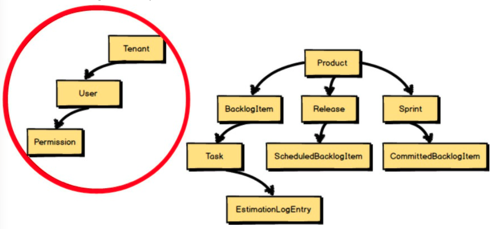
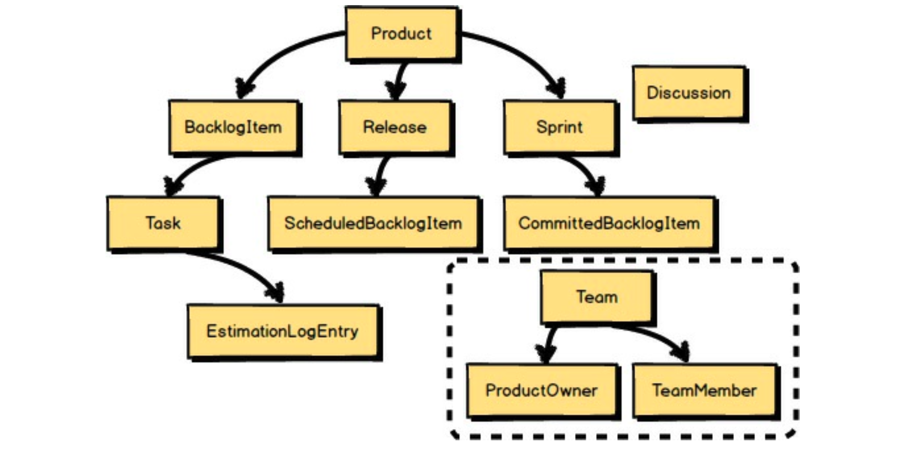
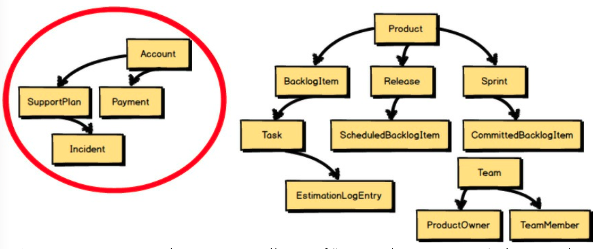
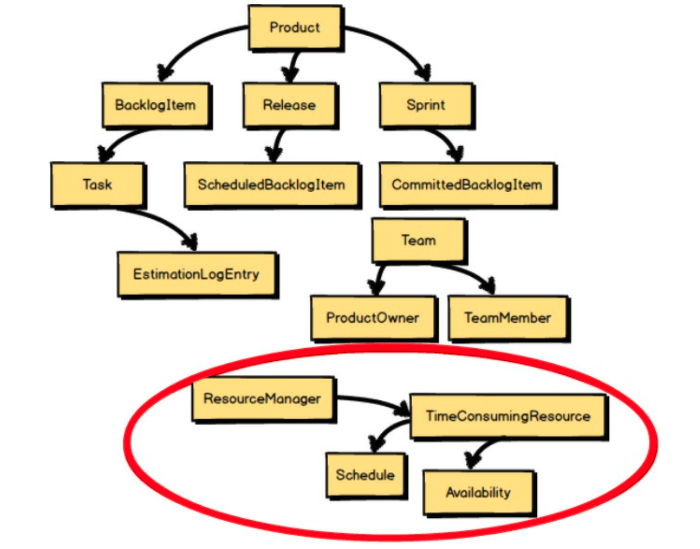
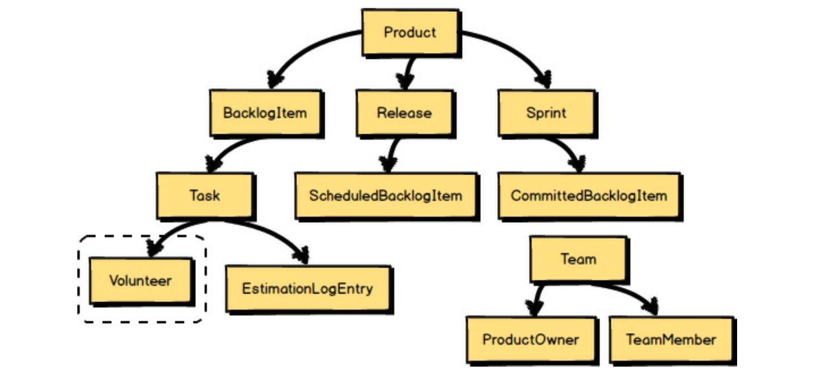
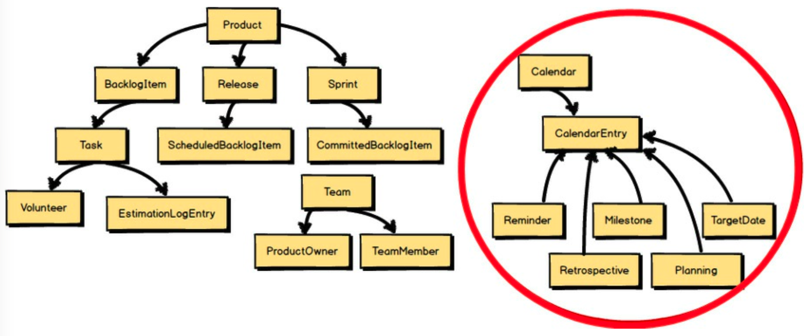
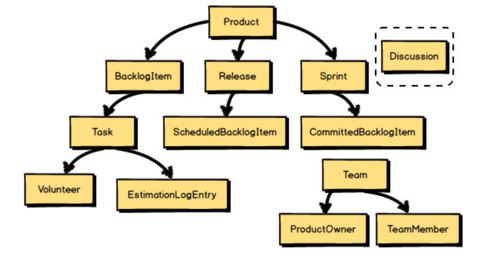
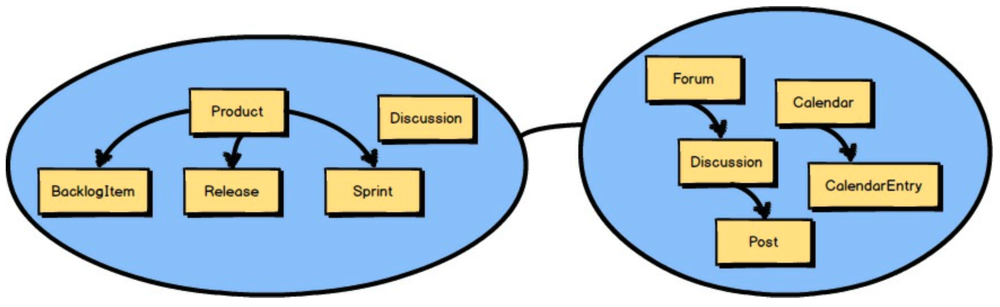
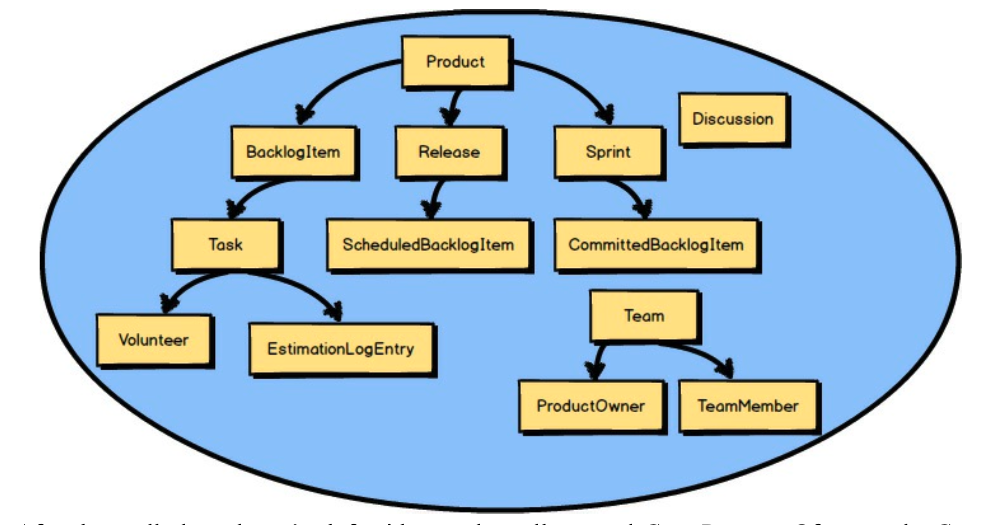
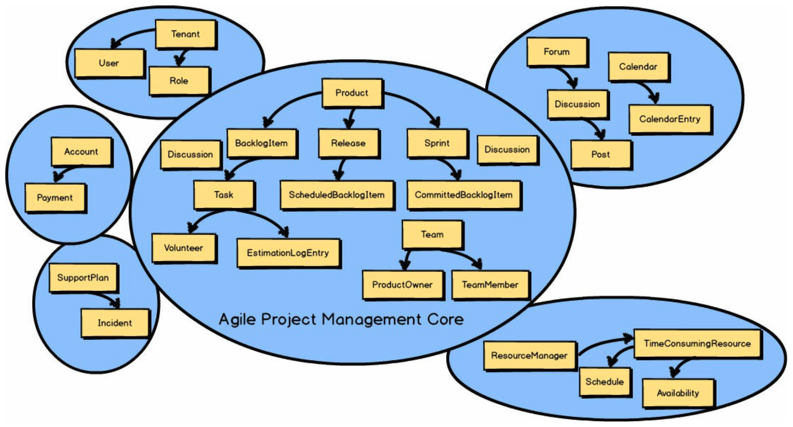

## 挑战与统一

现在回到 “什么是核心？” 这个问题。
使用前面失控且不断扩展的模型，让我们来挑战并统一！

 

<ins>一个非常简单的挑战是，询问每个大型模型概念是否遵循 Scrum 的 *通用语言 (Ubiquitous Language)* </ins>。
那么，它们遵循吗？
例如，`Tenant`、`User` 和 `Permission` 与 Scrum 毫无关系。
<ins>这些概念应该从我们的 Scrum 软件模型中分离出去</ins>。

 

`Tenant`、`User` 和 `Permission` 应该被 `Team`、`ProductOwner` 和 `TeamMember` 取代。
`ProductOwner` 和 `TeamMember` 实际上是租户中的 `User`，但通过使用 `ProductOwner` 和 `TeamMember`，我们遵循了 Scrum 的 *通用语言 (Ubiquitous Language)* 。
当我们谈论 Scrum 产品和团队所做的工作时，它们自然是我们使用的术语。

 

`SupportPlans` 和 `Payments` 真的是 Scrum 项目管理的一部分吗？
这里的答案显然是 “不是”。
诚然，`SupportPlans` 和 `Payments` 都将在租户的 `Account` 下管理，但这些不是我们核心 Scrum 语言的一部分。
<ins>它们不在上下文中，因此从该模型中移除</ins>。

 

引入人力资源利用率关注点呢？
它可能对某些人有用，但它不会被将要处理 `BacklogItemTasks` 的 `TeamMember Volunteers` 直接使用。
<ins>它不在上下文中</ins>。

 

在添加了 `Team`、`ProductOwner` 和 `TeamMember` 之后，建模者意识到他们缺少一个核心概念来允许 `TeamMember` 处理 `Tasks`。
在 Scrum 中，这被称为 `Volunteer`。
<ins>因此，`Volunteer` 概念在上下文中，并被包含在核心模型的语言中</ins>。

 

<ins>尽管基于日历的 `Milestones`（里程碑）、`Retrospectives`（回顾）等是在上下文中，但团队更愿意将这些建模工作留到以后的冲刺中。
它们在上下文中，但目前超出范围</ins>。

 

最后，建模者希望确保他们考虑到主题 `Discussions` 将是核心模型的一部分。
因此，他们对 `Discussion` 进行建模。
<ins>这意味着 `Discussion` 是团队 *通用语言 (Ubiquitous Language)* 的一部分，因此位于 *限界上下文 (Bounded Context)* 内部</ins>。

 

这些语言上的挑战带来了一个更简洁、更清晰的 *通用语言 (Ubiquitous Language)* 模型。
然而，Scrum 模型将如何实现所需的 `Discussions`？
它肯定需要大量的辅助软件组件支持才能使其工作，因此将其建模在我们的 Scrum *限界上下文 (Bounded Context)* 内部似乎不合适。
实际上，完整的协作套件不在上下文中。
<ins>`Discussion` 将通过与另一个 *限界上下文 (Bounded Context)* —— *协作上下文* —— 集成来支持</ins>。

 

经过那番演练，我们剩下的实际 *核心域 (Core Domain)* 要小得多。
当然，核心域将会增长。
我们已经知道 `Planning`（规划）、`Retrospectives`（回顾）、`Milestones`（里程碑）以及相关的基于日历的模型必须及时开发。
<ins>尽管如此，模型只会随着遵循 Scrum 的 *通用语言 (Ubiquitous Language)* 的新概念而增长</ins>。

 

<ins>那么，从 *核心域 (Core Domain)* 中移除的所有其他建模概念呢？
很有可能，其他几个概念（如果不是全部的话）将被组合到它们各自对应的 *限界上下文 (Bounded Context)* 中，
每个上下文都遵循其自己的 *通用语言 (Ubiquitous Language)* 。
稍后你将看到我们如何使用 *上下文映射 (Context Mapping)* 与它们集成</ins>。
