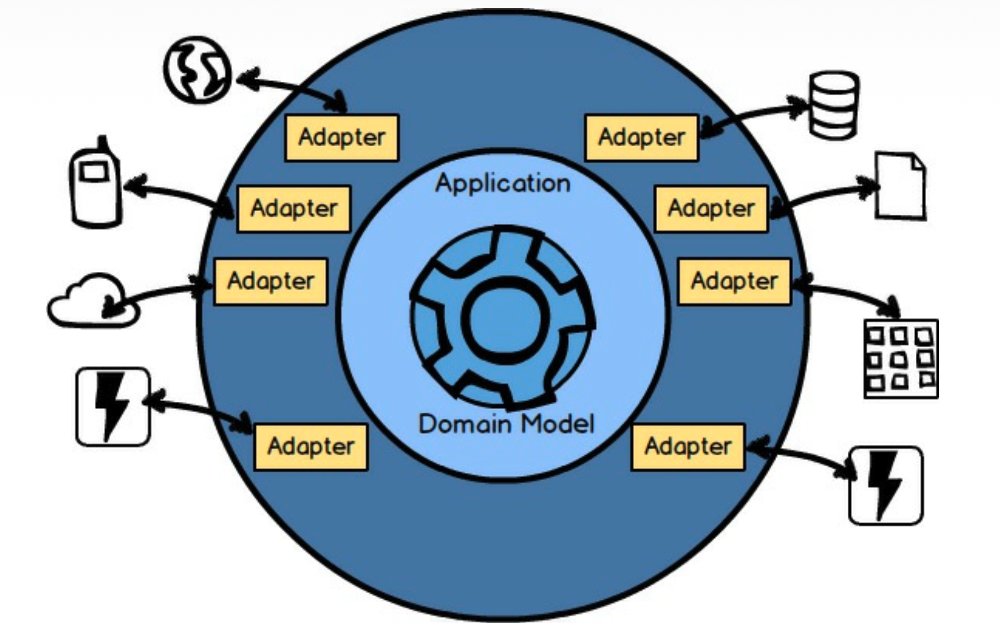
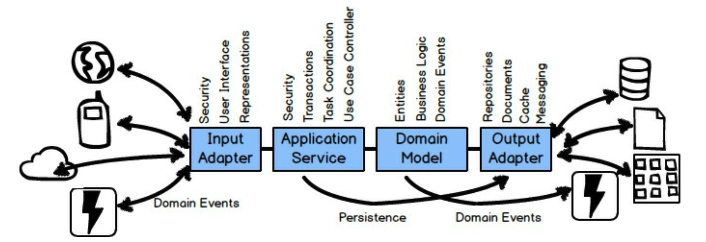

 

## 架构

你可能还想过另一个问题。
*限界上下文 (Bounded Context)* 内部有什么？
<ins>使用这个 *端口与适配器 (Ports and Adapters)* [IDDD](../ref.md#iddd) 架构图，你可以看到 *限界上下文 (Bounded Context)* 不仅仅由领域模型组成</ins>。

 

这些层在 *限界上下文 (Bounded Context)* 中很常见：
*输入适配器 (Input Adapters)* ，例如用户界面控制器、REST 端点和消息监听器；
*应用服务 (Application Services)* ，用于编排用例和管理事务；
还有我们一直在关注的领域模型；
以及 *输出适配器 (Output Adapters)* ，例如持久化管理和消息发送器。
关于这个架构中的各个层有很多可说的，在这样一本精炼的书中详细阐述过于繁琐。
请参阅 [Implementing Domain-Driven Design](../../impl-ddd/README.md) [IDDD](../ref.md#iddd) 第四章以获得详尽的讨论。

---
**无技术的领域模型**

尽管你的架构中会散布着技术，但领域模型应该没有技术。
<ins>一方面，这就是为什么事务由应用服务管理，而不是由领域模型管理</ins>。

---

 *端口与适配器 (Ports and Adapters)* 可以作为基础架构，但它并不是唯一可以与 DDD 一起使用的架构。
 除了端口与适配器，你还可以将 DDD 与以下任何一种架构或架构模式（以及其他模式）结合使用，并根据需要进行混合和匹配：

- 事件驱动架构；*事件溯源 (Event Sourcing)* [IDDD](../ref.md#iddd) 。
注意，事件溯源在本书 [第六章](../ch6/0.md) “领域事件的战术设计” 中讨论。
- 命令查询职责分离（CQRS） [IDDD](../ref.md#iddd) 。
- 反应式架构与 Actor 模型 (Reactive and Actor Model) ；参见《Reactive Messaging Patterns with the Actor Model》[Reactive](../ref.md#reactive) ，该书也详细阐述了 Actor 模型与 DDD 的结合使用。
- 表述性状态传递（REST） [IDDD](../ref.md#iddd) 。
- 面向服务架构（SOA） [IDDD](../ref.md#iddd) 。
- 微服务在《Building Microservices》[Microservices](../ref.md#microservices) 中被解释为本质上等同于 DDD *限界上下文 (Bounded Contexts)* ，
因此你正在阅读的这本书和 [Implementing Domain-Driven Design](../../impl-ddd/README.md) [IDDD](../ref.md#iddd) 都从该角度讨论了微服务的开发。
- 云计算的支持方式与微服务大致相同，因此你在本书、 [Implementing Domain-Driven Design](../../impl-ddd/README.md) [IDDD](../ref.md#iddd) 和《Reactive Messaging Patterns with the Actor Model》[Reactive](../ref.md#reactive) 中读到的任何内容都适用。

关于微服务还需要补充一点。
有些人认为微服务比 DDD *限界上下文 (Bounded Context)* 要小得多。
按照这种定义，微服务只对一个概念进行建模，并管理一种窄类型的数据。
这种微服务的一个例子是 `Product`，另一个是 `BacklogItem`。
如果这是你认为有价值的微服务粒度，
那么请理解 `Product` 微服务和 `BacklogItem` 微服务仍然在同一个更大的、逻辑上的 *限界上下文 (Bounded Context)* 中。
这两个小型微服务组件只有不同的部署单元，这也可能影响它们的交互方式（参见 *上下文映射 (Context Mapping)* ）。
在语言上，它们仍然在同一个基于 Scrum 的上下文和语义边界内。
