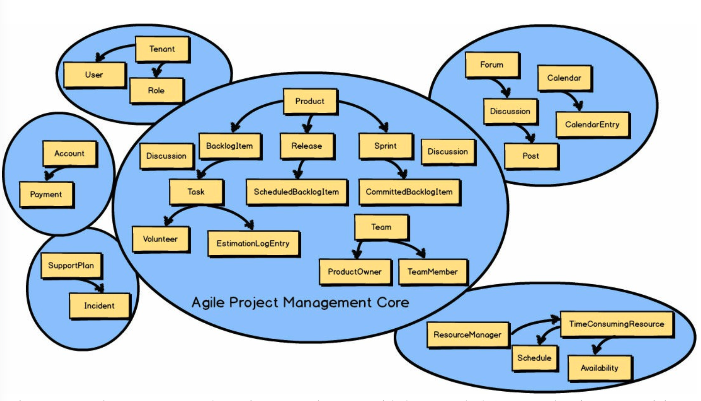
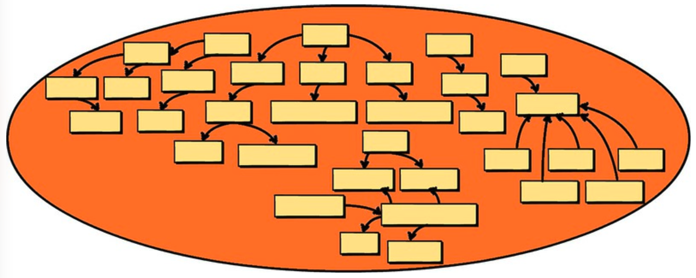
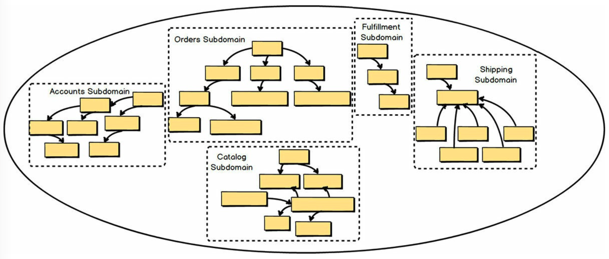
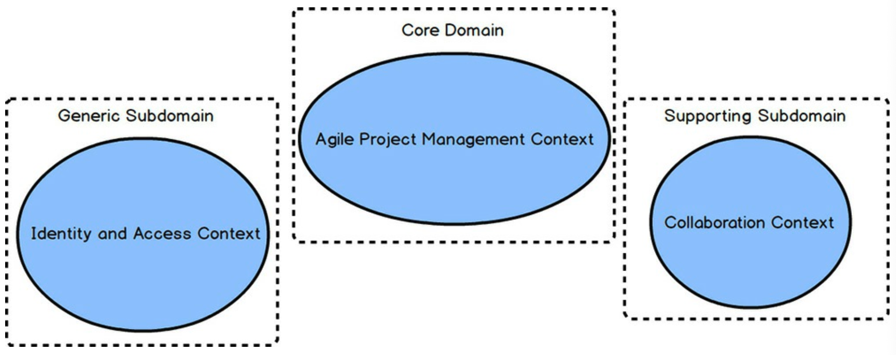

# 第三章 子域的战略设计

 

当你从事 DDD 项目时，总是会有多个 *限界上下文 (Bounded Contexts)* 在发挥作用。
其中一个 *限界上下文 (Bounded Context)* 将是 *核心域 (Core Domain)*，而其他 *限界上下文 (Bounded Contexts)* 中也会有不同的 *子域 (Subdomains)* 。
在上一章中，你看到了根据特定 *通用语言 (Ubiquitous Language)* 划分不同模型并形成多个 *限界上下文(Bounded Context)* 的重要性。
在上图中，有六个 *限界上下文 (Bounded Contexts)* 和六个 *子域 (Subdomains)* 。
<ins>由于使用了 DDD 战略设计，团队实现了最优的建模组合：
每个 *限界上下文 (Bounded Context)* 对应一个 *子域 (Subdomain)* ，每个 *子域 (Subdomain)* 对应一个 *限界上下文 (Bounded Context)*</ins>。
换句话说，*敏捷项目管理核心 (Agile Project Management Core)* 既是一个清晰的 *限界上下文 (Bounded Context)* ，也是一个清晰的 *子域 (Subdomain)* 。
在某些情况下，一个 *限界上下文 (Bounded Context)* 中可能有多个 *子域 (Subdomains)*，但这并不能实现最优的建模结果。

## 什么是子域？

<ins>简单来说，*子域 (Subdomain)* 是整个业务领域的一个子部分。
你可以将 *子域 (Subdomain)* 视为一个单一的、逻辑上的领域模型</ins>。
大多数业务领域通常都太大、太复杂，难以作为整体进行推理，因此我们通常只关注在单个项目中必须使用的 *子域 (Subdomains)* 。
<ins>*子域 (Subdomains)* 可用于逻辑上拆分你的整个业务领域，以便你在大型复杂项目中理解你的问题空间</ins>。

<ins>另一种看待 *子域 (Subdomain)* 的方式是，它是一个清晰的专业领域，设定它负责为你的业务核心领域提供解决方案</ins>。
这意味着特定的 *子域 (Subdomain)* 将有一位或多位 *领域专家 (Domain Experts)* ，他们非常了解特定 *子域 (Subdomain)* 所辅助的业务方面。
*子域 (Subdomain)* 对你的业务也具有或多或少的战略意义。

如果已使用 DDD 来开发它，那么 *子域 (Subdomain)* 将被实现为一个清晰的 *限界上下文 (Bounded Context)* 。
专注于该特定业务领域的 *领域专家 (Domain Experts)* 将是开发该 *限界上下文 (Bounded Context)* 的团队成员。
虽然使用 DDD 开发清晰的 *限界上下文 (Bounded Context)* 是最佳选择，但有时我们只能希望情况如此。

## 子域的类型

项目中有三种主要类型的子域：

- <ins>*核心域 (Core Domain)* ：
这是你在单个、明确定义的领域模型上进行战略投资的地方，投入大量资源，
在明确的 *限界上下文 (Bounded Context)* 中精心打造你的 *通用语言 (Ubiquitous Language)* 。
这在你的组织项目列表中优先级非常高，因为它将使你与所有竞争对手区分开来</ins>。
由于你的组织不可能在所有方面都表现出色，你的 *核心域 (Core Domain)* 划定了它必须在哪些方面表现出色。
要达到进行此类判断所需的深度学习和理解水平，需要投入、协作和实验。
这是组织最需要在软件上投入的地方。
我在本书后面提供了高效且有效地加速和管理此类项目的方法。

- <ins>*支撑子域 (Supporing Subdomain)* ：
这是一种需要定制开发的建模情况，因为不存在现成的解决方案</ins>。
然而，你仍然不会像为 *核心域 (Core Domain)* 那样进行投资。
你可能需要考虑外包这种 *限界上下文 (Bounded Context)* ，以避免将其误认为是具有战略区别性的东西，从而投入过多。
这仍然是一个重要的软件模型，因为没有它，你的 *核心域 (Core Domain)* 就无法成功。

- <ins>*通用子域 (Generic Subdomain)* ：
这种解决方案可能可以现成购买，但也可能外包，甚至由团队内部开发，
但该团队不具备你分配给 *核心域 (Core Domain)* 或甚至不太重要的 *支撑子域 (Supporing Subdomain)* 的那种精英开发人员</ins>。
注意不要将 *通用子域 (Generic Subdomain)* 误认为是 *核心域 (Core Domain)* 。
你不会想在这里进行那种投资。

当讨论正在采用 DDD 的项目时，我们很可能在讨论一个 *核心域 (Core Domain)* 。

## 处理复杂性

业务领域中的某些系统边界很可能是遗留系统，可能是你的组织已创建的，或者是通过软件许可购买的。
在这一点上，你可能无法对这些遗留系统进行太多改进，但当它们对你的 *核心域 (Core Domain)* 项目产生影响时，你仍然需要考虑它们。
<ins>为此，使用 *子域 (Subdomains)* 作为讨论你的 *问题空间 (problem space)* 的工具</ins>。

 

不幸的是，但同样真实的是，一些遗留系统与使用 *限界上下文 (Bounded Context)* 的 DDD 设计方式如此背道而驰，以至于你甚至可能将它们称为 *无界遗留系统 (unbounded legacy systems)* 。
这是因为这样的遗留系统正是我前面所说的 *大泥球 (Big Ball of Mud)* 。
实际上，这个系统充满了多个纠缠不清的模型，这些模型本应被单独设计和实现，但却被混杂在一起，形成了一个非常复杂且相互交织的混乱体。

 

换句话说，当我们讨论一个遗留系统时，该遗留系统内部可能存在一些，甚至许多逻辑领域模型。
将每个这样的逻辑领域模型视为一个 *子域 (Subdomain)* 。
在图中，无界遗留单体 *大泥球 (Big Ball of Mud)* 中的每个逻辑 *子域 (Subdomain)* 都用虚线框标出。
这里有五个逻辑模型或 *子域 (Subdomains)* 。
<ins>将逻辑 *子域 (Subdomain)* 视为如此，有助于我们应对大型系统的复杂性。
这非常有意义，因为它允许我们将 *问题空间 (problem space)* 视为仿佛已经使用 DDD 和多个 *限界上下文 (Bounded Context)* 开发过一样</ins>。

如果我们想象出单独的 *通用语言 (Ubiquitous Language)* ，至少为了理解我们必须如何与它集成，遗留系统看起来就不那么单体和混乱了。
使用 *子域 (Subdomains)* 来思考和讨论此类遗留系统，有助于我们应对大型纠缠模型的严酷现实。
当我们使用这个工具进行推理时，我们可以确定哪些 *子域 (Subdomains)* 对业务更有价值，对我们的项目是必要的，哪些可以被降级到较低的地位。

考虑到这一点，你甚至可以在同一个简单的图中显示你正在开发的，或即将开发的 *核心域 (Core Domain)* 。
这将帮助你理解 *子域 (Subdomains)* 之间的关联和依赖关系。
但我将把关于该讨论的细节留到 *上下文映射 (Context Mapping)* 中。

 

当使用 DDD 时，一个 *限界上下文 (Bounded Context)* 应与单个 *子域 (Subdomain)* 一一对应（1:1）。
也就是说，当使用 DDD 时，
如果有一个 *限界上下文 (Bounded Context)* ，那么目标就是该 *限界上下文 (Bounded Context)* 中有一个 *子域 (Subdomain)* 模型。
这并不总是可能或实际的，但在可能的情况下，以这种方式进行设计很重要。
这将使你的 *限界上下文 (Bounded Context)* 保持清晰，并聚焦于核心战略举措。

<ins>如果你必须在同一个 *限界上下文 (Bounded Context)* （在你的 *核心域 (Core Domain)* 内）中创建第二个模型，
你应该使用一个完全独立的 *模块 (Module)* [IDDD](../ref.md#iddd) 将次要模型与你的 *核心域 (Core Domain)* 隔离开来</ins>。
（DDD *模块 (Module)* 基本上是 Scala 和 Java 中的包，以及 F# 和 C# 中的命名空间。）
这清晰地表达了语言上的声明，即一个模型是核心，另一个仅仅是支撑性的。
这种隔离 *子域 (Subdomain)* 的特定用法是你将在你的 *解决方案空间 (solution space)* 中采用的。

## 总结

总之，你学到了：

- *子域 (Subdomains)* 是什么，以及如何在 *问题空间 (problem space)* 和 *解决方案空间 (solution space)* 中使用它们
- *核心域 (Core Domain)*、*支撑子域 (Supporing Subdomain)* 和 *通用子域 (Generic Subdomain)* 之间的区别
- 如何在考虑与 *大泥球 (Big Ball of Mud)* 遗留系统集成时利用 *子域 (Subdomain)*
- 将你的 DDD  *限界上下文 (Bounded Context)* 与单个 *子域 (Subdomain)* 一对一对齐的重要性
- 当将两者分离到不同的 *限界上下文 (Bounded Context)* 不切实际时，应如何使用 DDD  *模块 (Module)* 将 *支撑子域 (Supporing Subdomain)* 模型与你的 *核心域 (Core Domain)* 模型隔离开

有关 *子域 (Subdomain)* 的详尽说明，请参阅 [Implementing Domain-Driven Design](../../impl-ddd/README.md) [IDDD](../ref.md#iddd) 第二章。
