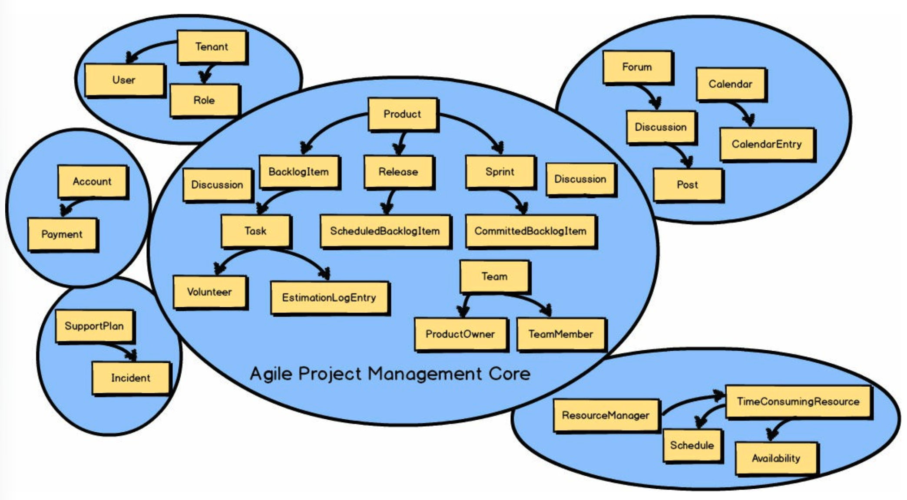
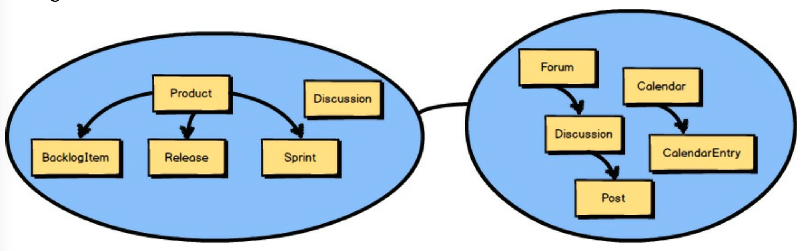
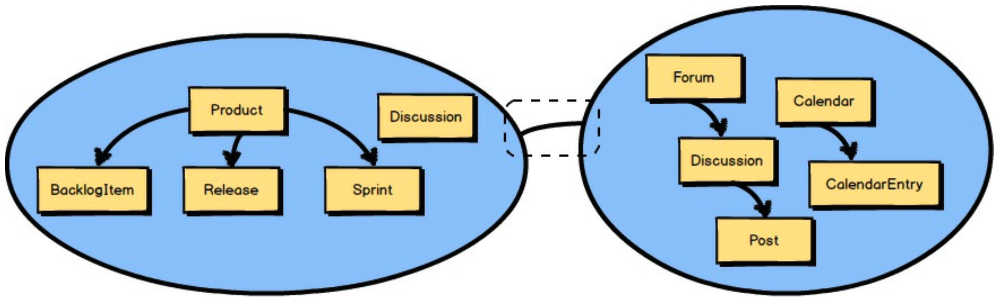

# 第四章 上下文映射的战略设计

 

在前面的章节中，你学到了除了 *核心域 (Core Domain)* 之外，每个 DDD 项目还关联着多个 *限界上下文 (Bounded Contexts)* 。
所有不属于 *敏捷项目管理上下文 (Agile Project Management Context)* ——即 *核心域 (Core Domain)* —— 的概念都被移到了其他几个 *限界上下文 (Bounded Contexts)* 中的一个。

 

<ins>你还学到了敏捷项目管理 *核心域 (Core Domain)* 必须与其他 *限界上下文 (Bounded Contexts)* 集成。
这种集成在 DDD 中被称为 *上下文映射 (Context Mapping)* </ins>。
你可以在前面的 *上下文映射 (Context Map)* 中看到，`Discussion` 同时存在于两个 *限界上下文 (Bounded Contexts)* 中。
回想一下，这是因为 *协作上下文 (Collaboration Context)* 是 `Discussion` 的来源，而 *敏捷项目管理上下文 (Agile Project
Management Context)* 是 `Discussion` 的消费者。

 

此图中的 *上下文映射 (Context Mapping)* 由虚线框内的线条突出显示。
（虚线框不是上下文映射的一部分，仅用于突出显示该线条。）
实际上，正是两个 *限界上下文 (Bounded Contexts)* 之间的这条线代表了一个 *上下文映射 (Context Mapping)* 。
换句话说，这条线表示两个 *限界上下文 (Bounded Contexts)* 以某种方式进行了映射。
在两个 *限界上下文 (Bounded Contexts)* 之间将存在某种团队间的互动以及某种集成。

 

考虑到在两个不同的 *限界上下文 (Bounded Contexts)* 中存在两种 *通用语言 (Ubiquitous Languages)* ，这条线代表了两种语言之间存在的翻译。
举例说明，想象两个团队需要一起工作，但他们跨越国界，不说同一种语言。
要么团队需要一名翻译，要么一个或两个团队必须大量学习对方的语言。
找一个翻译对两个团队来说工作量都更少，但可能在各个方面代价高昂。
例如，想象一个团队需要额外的时间与翻译交谈，然后翻译再将陈述转达给另一个团队。
这在最初几分钟效果很好，但随后变得繁琐。
尽管如此，团队可能发现这比学习和接受一种外语并不断在语言之间切换更好。
当然，这仅描述了两个团队之间的关系。
如果还涉及其他几个团队呢？
同样，在将一种 *通用语言 (Ubiquitous Language)* 翻译成另一种，或以某种方式适配另一种 *通用语言 (Ubiquitous Language)* 时，也存在同样的权衡。

 

当我们谈论 *上下文映射 (Context Mapping)* 时，我们感兴趣的是任意两个 *限界上下文 (Bounded Contexts)* 之间的连线代表何种团队间关系和集成。
它们之间定义良好的边界和契约，支持随时间推移的受控变更。
有几种 *上下文映射 (Context Mapping)* ，包括团队和技术层面的，可以由这条线表示。
在某些情况下，团队间关系和集成映射将混合在一起。
