## 映射的类型

*上下文映射 (Context Mapping)* 线可以代表哪些关系和集成？
我现在将它们介绍给你。

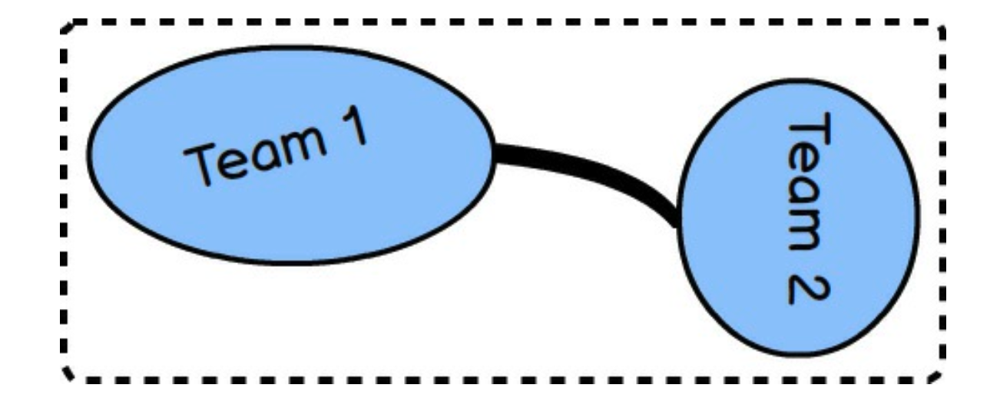

### 合作关系

*合作关系 (Partnership)* 存在于两个团队之间。
每个团队负责一个 *限界上下文 (Bounded Context)* 。
他们建立 *合作关系 (Partnership)* ，以使两个团队对齐一组相互依赖的目标。
据说两个团队将共同成功或共同失败。
<ins>由于他们如此紧密地对齐，他们将频繁会面以同步进度和依赖工作，并且他们将必须使用持续集成来保持他们的集成协调一致。
这种同步由两个团队之间的粗映射线表示。
粗线表示所需的投入水平，相当高</ins>。

长期维持 *合作关系 (Partnership)* 可能具有挑战性，因此许多建立 *合作关系 (Partnership)* 的团队最好限制这种关系的期限。
*合作关系 (Partnership)* 只应在它能提供优势时持续，当优势被投入的消耗所抵消时，应将其重新映射为不同的关系。

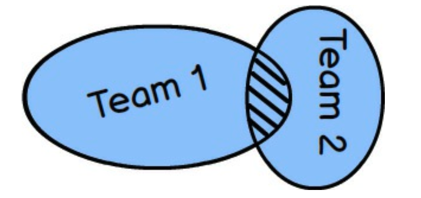

### 共享内核

*共享内核 (Shared Kernel)* ，如上图通过两个 *限界上下文 (Bounded Context)* 的交集所示，描述了共享一个虽小但公共模型的两个（或多个）团队之间的关系。
团队必须就他们将要共享的模型元素达成一致。
可能只有其中一个团队会维护所共享内容的代码、构建和测试。
*共享内核 (Shared Kernel)* 通常最初就很难构想，而且难以维护，因为你必须在团队之间进行开放的沟通，并就构成要共享的模型的内容达成持续的一致。
尽管如此，如果所有相关方都致力于：内核比 *分道扬镳 (Separate Ways)* 更好这一理念，那么成功是可能的（参见后面的章节）。

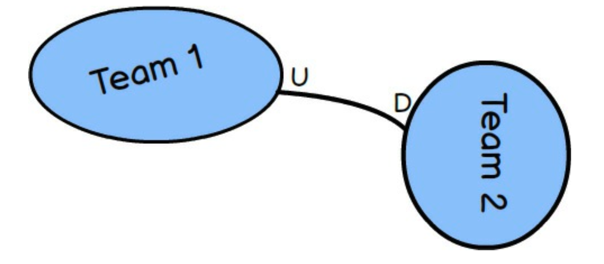

### 客户-供应商

*客户-供应商 (Customer-Supplier)* 描述了两种 *限界上下文 (Bounded Contexts)* 和各自团队之间的关系，
其中 *供应商 (Supplier)* 在上游（图中的 U ），*客户 (Customer)* 在下游（图中的 D ）。
*供应商 (Supplier)* 在这种关系中占据主导地位，因为它必须提供 *客户 (Customer)* 所需的内容。
*客户 (Customer)* 有责任与 *供应商 (Supplier)* 一起规划以满足各种期望，但最终由 *供应商 (Supplier)* 决定 *客户 (Customer)* 将获得什么以及何时获得。
这是一种非常典型且实际的团队间关系，即使在同一组织内也是如此，只要企业文化不允许 *供应商 (Supplier)* 完全自治且对 *客户 (Customer)* 的真正需求无动于衷。

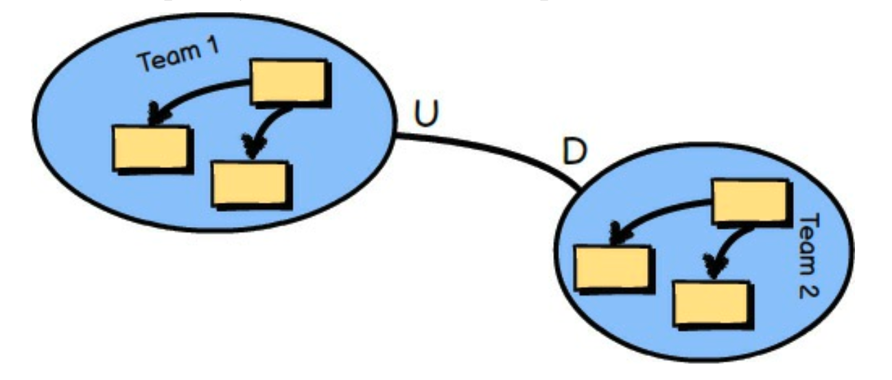

### 跟随者

当存在上游和下游团队，并且上游团队没有动力支持下游团队的特定需求时，就存在 *跟随者 (Conformist)* 关系。
由于各种原因，下游团队无法持续努力将上游模型的 *通用语言 (Ubiquitous Language)* 翻译以适应其特定需求，因此该团队直接遵循上游模型。
例如，当与一个非常大且复杂、已建立良好的模型集成时，团队往往会成为 *跟随者 (Conformist)* 。
示例：考虑在作为 Amazon 的关联卖家之一进行集成时，需要遵循 Amazon.com 的模型。

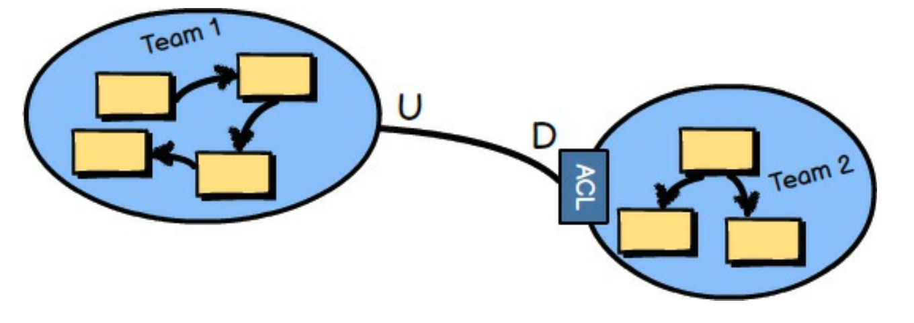

### 防腐层

*防腐层 (Anticorruption Layer)* 是最具防御性的 *上下文映射 (Context Mapping)* 关系，其中下游团队在其 *通用语言 (Ubiquitous Language)* （模型）和上游的 *通用语言 (Ubiquitous Language)* （模型）之间创建一个翻译层。
该层将下游模型与上游模型隔离开来，并在两者之间进行翻译。
因此，这也是一种集成方法。

<ins>只要有可能，你应该尝试在下游模型和上游集成模型之间创建一个 *防腐层 (Anticorruption Layer)* ，以便你能够在集成这边创建专门适合你业务需求的模型概念，并使你完全与外部概念隔离</ins>。 然而，就像雇佣翻译在讲不同语言的两个团队之间进行翻译一样，在某些情况下，各种方面的成本可能过高。

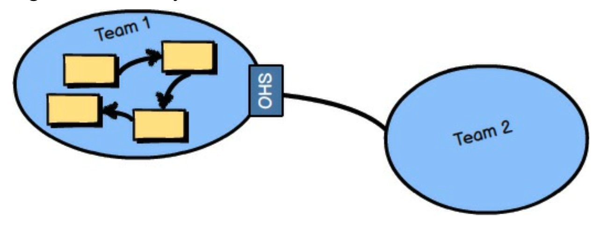

### 开放主机服务

*开放主机服务 (Open Host Service)* 定义了一个协议或接口，将你的 *限界上下文 (Bounded Context)* 作为一组服务来提供访问。
该协议是 “开放” 的，以便所有需要与你的 *限界上下文 (Bounded Context)* 集成的人都可以相对轻松地使用它。
由应用程序编程接口（API）提供的服务文档齐全，使用起来也很愉快。
即使你是此图中的 Team 2，并且没有时间为你的集成端创建一个隔离的 *防腐层 (Anticorruption Layer)* ，成为这个模型的 *跟随者 (Conformist)* 也比你可能遇到的许多遗留系统要容易忍受得多。
我们可以说，*开放主机服务 (Open Host Service)* 的语言比其他类型系统的语言更容易使用。

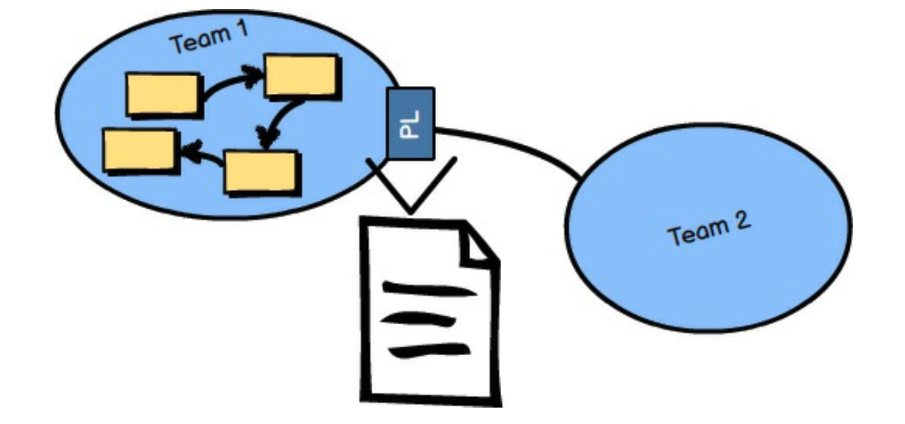

### 发布语言

*发布语言 (Published Language)* ，如上图的图片所示，
是一种文档完善的信息交换语言，使任意数量的消费方 *限界上下文 (Bounded Contexts)* 能够轻松使用和翻译。
读写双方都可以自信地翻译成共享语言或从中翻译出来，确保他们的集成是正确的。
这样的 *发布语言 (Published Language)* 可以使用 XML Schema、JSON Schema 或更优化的线路格式（如 Protobuf 或 Avro）来定义。
通常，*开放主机服务 (Open Host Service)* 会提供和消费 *发布语言 (Published Language)* ，这为第三方提供了最佳的集成体验。
这种组合使得两种 *通用语言 (Ubiquitous Language)* 之间的翻译非常方便。

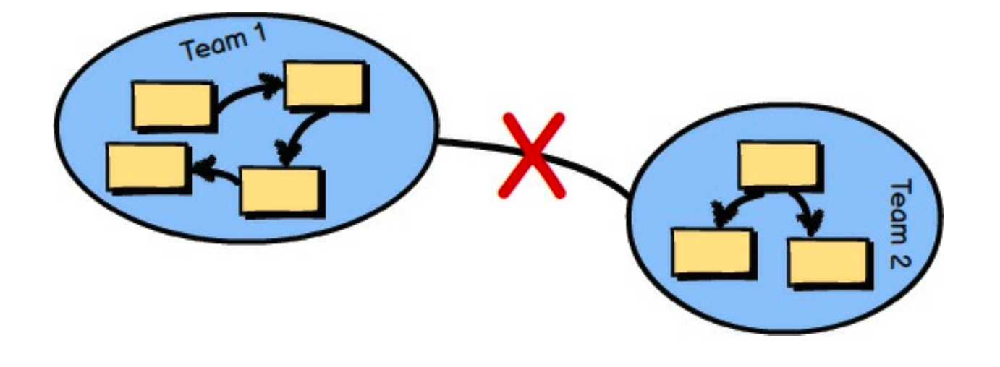

### 分道扬镳

*分道扬镳 (Separate Ways)* 描述了一种情况，即与一个或多个 *限界上下文 (Bounded Context)* 的集成不会通过消费各种 *通用语言 (Ubiquitous Language)* 产生显著的回报。
也许你寻求的功能并不是由任何一种 *通用语言 (Ubiquitous Language)* 完全提供的。
在这种情况下，在你的 *限界上下文 (Bounded Context)* 中生成你自己的专用解决方案，并为这种特殊情况放弃集成。

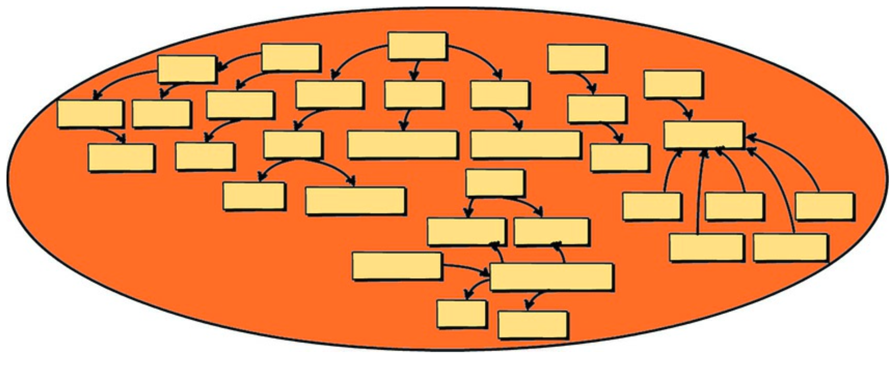

### 大泥球

在前面的章节中，你已经了解了很多关于 *大泥球 (Big Ball of Mud )* 的知识，
但我还是要强调，当你必须在一个这样的系统中工作或与之集成时，你将遇到的严重问题。
你应该像躲避瘟疫一样避免创建你自己的 *大泥球 (Big Ball of Mud )* 。

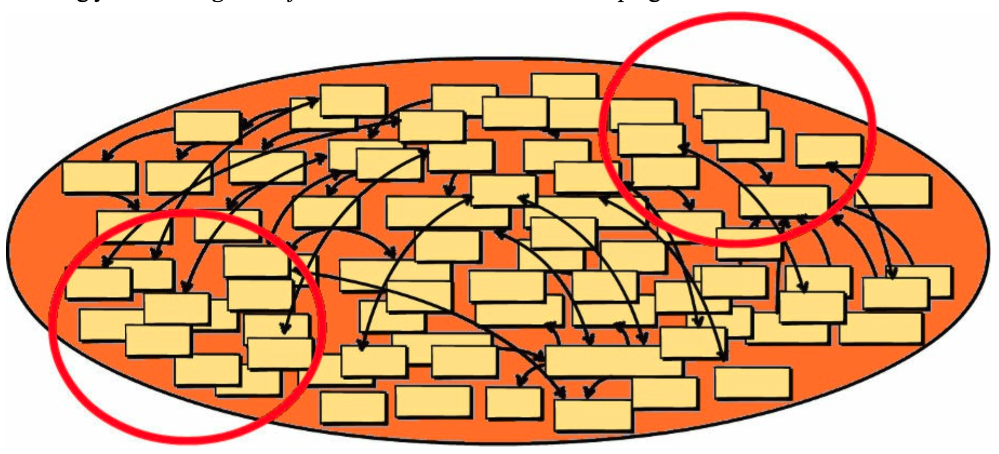

以防这还不够警示，以下是当你负责创建 *大泥球 (Big Ball of Mud)* 时，随着时间的推移会发生的事情：
1. 越来越多的聚合由于不正当的连接和依赖而相互污染。
2. 维护 *大泥球 (Big Ball of Mud )* 的一部分会在整个模型中引起涟漪效应，从而导致 “打地鼠” 式的问题。
3. 只有部落知识和英雄主义 ——即同时说所有语言—— 才能使系统免于完全崩溃。

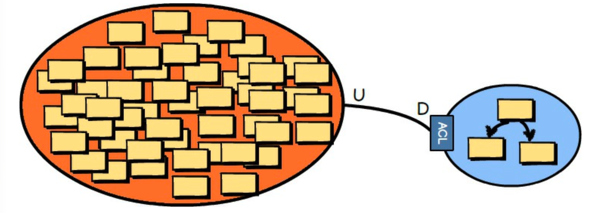

问题在于，在广阔的软件系统世界中，已经存在许多 *大泥球 (Big Balls of Mud)* ，而且毫无疑问，这个数量每个月都会增长。
即使你能够通过运用 DDD 技术避免创建 *大泥球 (Big Balls of Mud)* ，你可能仍然需要与一个或多个 *大泥球 (Big Balls of Mud)* 集成。
如果你必须与一个或多个集成，请尝试针对每个遗留系统创建一个 *防腐层 (Anticorruption Layer)* ，以保护你自己的模型免受那些难以理解的混乱所带来的污染。
无论你做什么，*不要说那种语言* ！
