
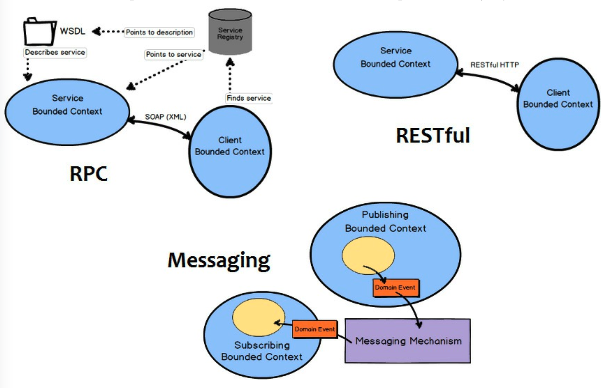

## 善用上下文映射

你可能想知道，为了与给定的 *限界上下文 (Bounded Context)* 集成，会提供哪种特定类型的接口。
这取决于拥有该 *限界上下文 (Bounded Context)* 的团队提供什么。
它可以是基于 SOAP 的 RPC，或者是带有资源的 RESTful 接口，也可以是使用队列或发布-订阅的消息传递接口。
在最不利的情况下，你可能被迫使用数据库或文件系统集成，但我们希望这种情况不会发生。
数据库集成真的应该避免，如果你被迫以这种方式集成，你真的应该确保通过 *防腐层 (Anticorruption Layer)* 来隔离你的消费模型。

让我们来看三种更值得信赖的集成类型。
我们将从最不健壮 (robust) 到最健壮的集成方法依次介绍。
首先我们将看看 RPC，然后是 RESTful HTTP，接着是消息传递。

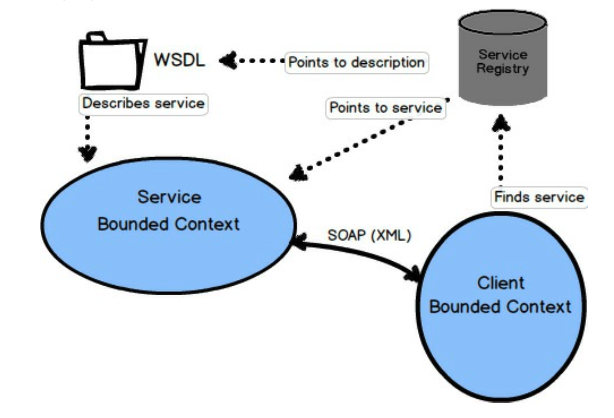

### 基于 SOAP 的 RPC

远程过程调用（RPC）可以通过多种方式工作。
一种流行的使用 RPC 的方式是通过简单对象访问协议（SOAP）。
基于 SOAP 的 RPC 背后的思想是，使从另一个系统使用服务看起来像一个简单的本地过程或方法调用。
尽管如此，SOAP 请求必须通过网络传输，到达远程系统，成功执行，并通过网络返回结果。
这带来了完全网络故障的潜在风险，或者至少是在首次实现集成时未曾预料到的延迟。
此外，基于 SOAP 的 RPC 也意味着客户端 *限界上下文 (Bounded Context)* 与提供服务端的 *限界上下文 (Bounded Context)* 之间的强耦合。

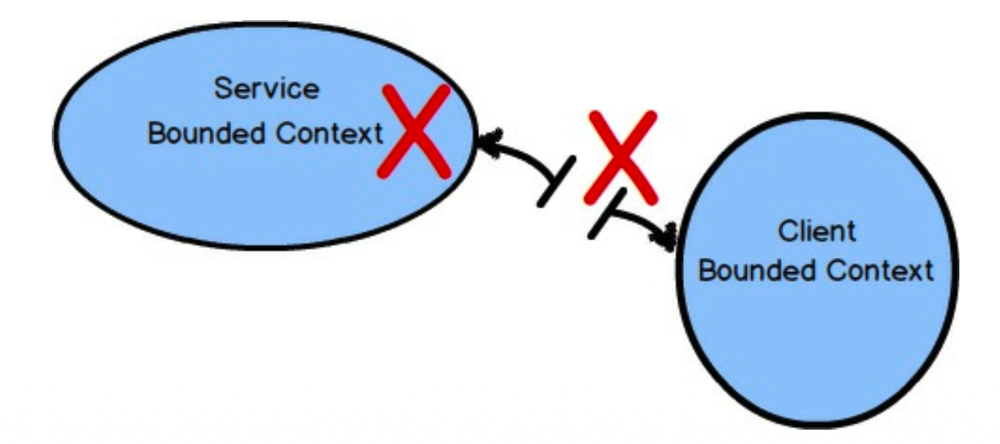
 

RPC（无论使用 SOAP 还是其他方法）的主要问题在于它可能缺乏健壮性。
如果网络出现问题，或者托管 SOAP API 的系统出现问题，你那看似简单的过程调用将完全失败，只返回错误结果。
不要被其表面的易用性所迷惑。

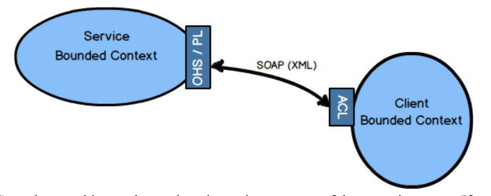
 

当 RPC 有效时 ——而且它大多数时候是有效的—— 它可以是一种非常有用的集成方式。
如果你能影响服务端 *限界上下文 (Bounded Context)* 的设计，那么如果有一个设计良好的API，提供带有 *发布语言 (Published Language)* 的 *开放主机服务 (Open Host Service)* ，这将最符合你的利益。
<ins>无论哪种方式，你的客户端 *限界上下文 (Bounded Context)* 都可以设计一个 *防腐层 (Anticorruption Layer)* ，以将你的模型与不受欢迎的外部影响隔离开来</ins>。

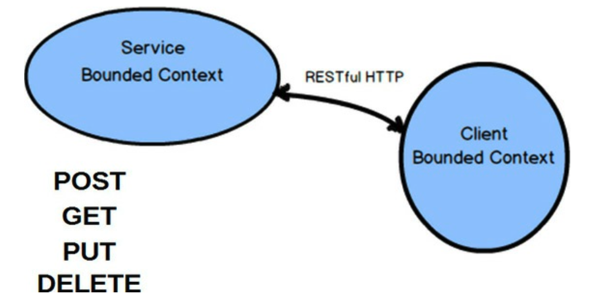
 

### RESTful HTTP

使用 RESTful HTTP 进行集成，将注意力集中在 *限界上下文 (Bounded Contexts)* 之间交换的资源，以及四种主要操作上：POST、GET、PUT 和 DELETE。
许多人发现 REST 集成方法效果很好，因为它有助于他们为分布式计算定义良好的 API。
鉴于互联网和 Web 的成功，很难反驳这一说法。

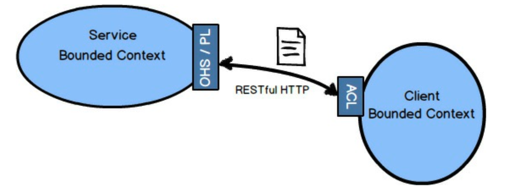
 

当使用 RESTful HTTP 时，有一种非常特定的思维方式。
我不会在本书中深入探讨细节，但在尝试使用 REST 之前，你应该了解一下。书籍《REST in Practice》[RiP](../ref.md#rip) 是一个很好的起点。

一个提供 REST 接口的服务端 *限界上下文 (Bounded Contexts)* 应该提供 *开放主机服务 (Open Host Service)* 和 *发布语言 (Published Language)* 。
资源值得被定义为一种 *发布语言 (Published Language)* ，并与你的 REST URI 结合，它们将形成一个自然的 *开放主机服务 (Open Host Service)* 。

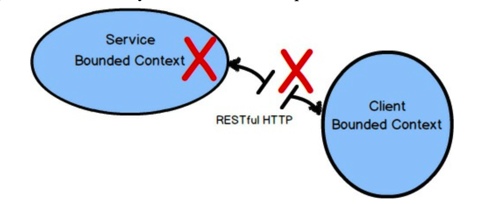
 

RESTful HTTP 往往会因为与 RPC 相同的原因而失败 —— 网络和服务提供商故障，或未预料到的延迟。
然而，RESTful HTTP 是基于互联网的前提，当涉及到可靠性、可扩展性和整体成功时，谁能对 Web 的过往记录提出异议呢？

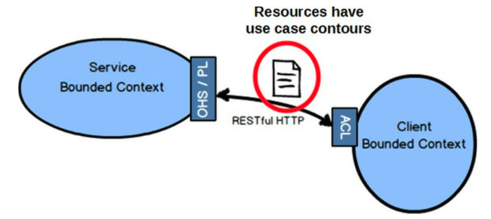
 

使用 REST 时常见的一个错误是设计直接反映领域模型中 *聚合 (Aggregates)* 的资源。
这样做会迫使每个客户端进入 *跟随者 (Conformist)* 关系，如果模型改变形状，资源也会随之改变。
所以你不希望这样做。
相反，资源应该被综合设计，以遵循客户端驱动的用例。
我所说的 “综合” 是指，提供给客户端的资源必须具有它们所需的形状和组成，而不是实际领域模型的样子。
有时，模型看起来就像客户端需要的那样。
但是，驱动资源设计的是客户端的需求，而不是模型当前的组成。

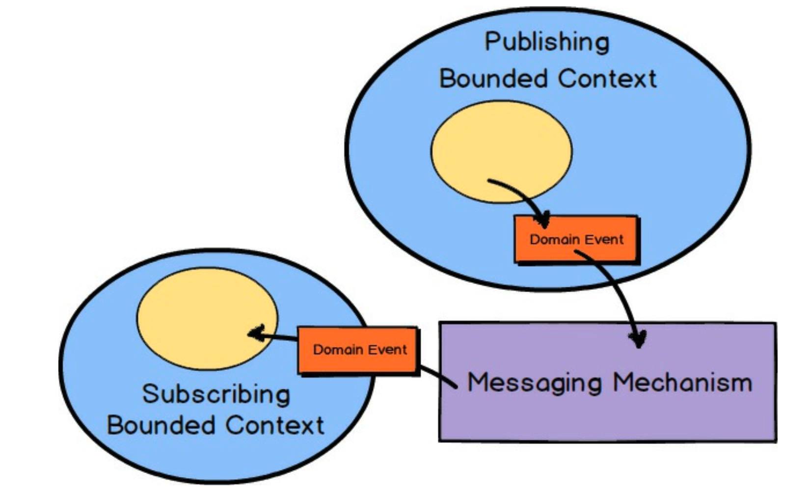
 

### 消息传递

当使用异步消息传递进行集成时，客户端 *限界上下文 (Bounded Context)* 订阅由你自身的或另一个 *限界上下文 (Bounded Context)* 发布的 *领域事件 (Domain Events)* ，可以完成很多工作。
使用消息传递是最健壮的集成形式之一，因为你消除了与阻塞形式（如 RPC 和 REST）相关的大量时间耦合。
由于你已经预见到了消息交换的延迟，你倾向于构建更健壮的系统，因为你从不期望立即得到结果。

---
**使用 REST 实现异步**

通过使用基于 REST 的轮询，对一组顺序增长的资源进行轮询，可以实现异步消息传递。
使用后台处理，客户端将持续轮询一个服务 Atom feed 资源，该资源提供一组不断增长的 *领域事件 (Domain Events)* 。
这是在服务和客户端之间维护异步操作的一种安全方法，同时提供服务中持续发生的最新事件。
如果服务由于某种原因不可用，客户端将在正常间隔内简单地重试，或退避重试，直到 feed 资源再次可用。
这种方法在《实现领域驱动设计》[IDDD](../ref.md#iddd) 中有详细讨论。

---

---
**避免集成连环事故**

当一个客户端 *限界上下文 (Bounded Context)* （C1）与一个服务端 *限界上下文 (Bounded Context)* （S1）集成时，
C1 通常不应向 S1 发出同步的、阻塞的请求，作为处理对其发出的请求的直接结果。
也就是说，当某个其他客户端（C0）向 C1 发出阻塞请求时，不允许 C1 向 S1 发出阻塞请求。
这样做极有可能导致 C0、C1 和 S1 之间的集成连环事故。
这可以通过使用异步消息传递来避免。

---

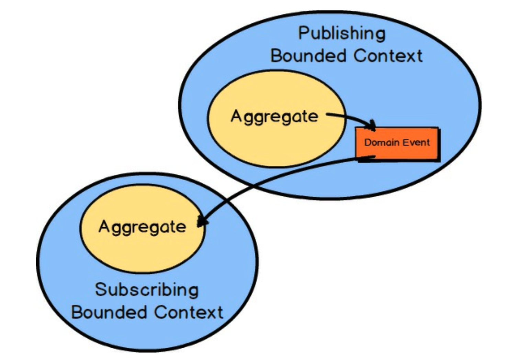
 

通常，一个 *限界上下文 (Bounded Context)* 中的 *聚合 (Aggregates)* 会发布一个 *领域事件 (Domain Events)* ，该事件可以被任意数量的相关方消费。
当订阅的 *限界上下文 (Bounded Context)* 接收到该 *领域事件 (Domain Event)* 时，将根据其类型和值采取某些行动。
通常，它会导致在消费方 *限界上下文 (Bounded Context)* 中创建一个新的 *聚合 (Aggregate)* 或修改一个现有的 *聚合 (Aggregate)* 。

---
**领域事件消费者是跟随者吗？**

你可能想知道 *领域事件 (Domain Events)* 如何被另一个 *限界上下文 (Bounded Context)* 消费，而不会迫使该消费方 *限界上下文 (Bounded Context)* 进入 *跟随者 (Conformist)* 关系。
正如《实现领域驱动设计》[IDDD](../ref.md#iddd) 中所建议的，特别是在 [第 13 章](../../impl-ddd/ch13/0.md) “集成限界上下文” 中，<ins>消费者不应使用事件发布者的事件类型（例如类）。
相反，他们应该只依赖于事件的 schema，即它们的 *发布语言 (Published Language)* 。
这通常意味着，如果事件以 JSON 发布，或者可能是一种更经济实惠的对象格式，消费者应该通过解析事件来获取其数据属性，从而消费事件</ins>。

---

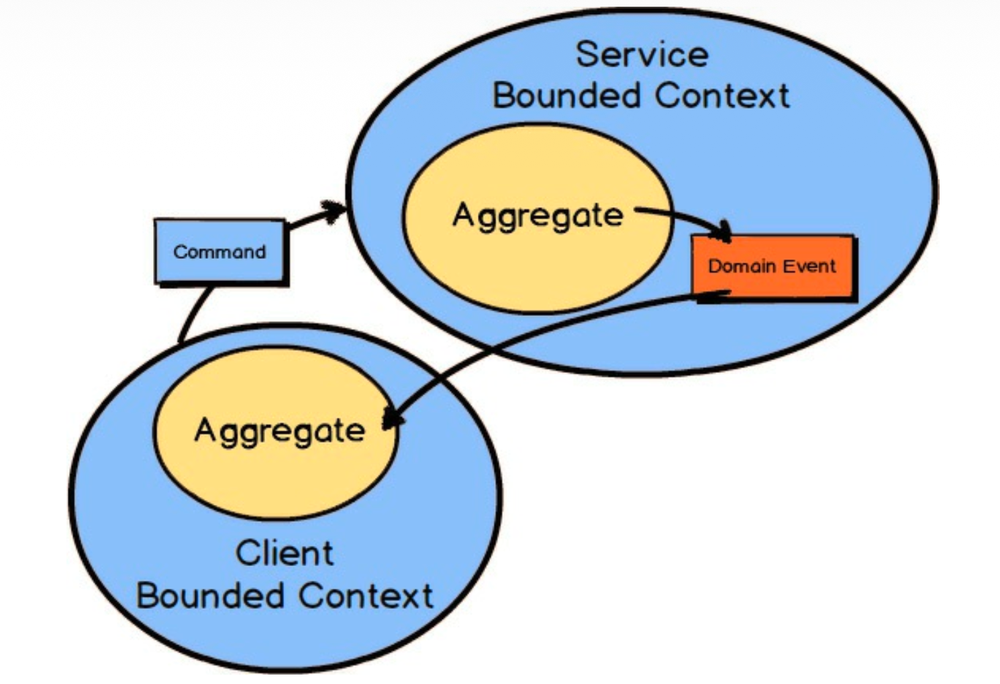
 

当然，上述假设的前提是，订阅方 *限界上下文 (Bounded Context)* 总能从发布方 *限界上下文 (Bounded Context)* 中主动发生的事件中获益。
然而，有时客户端 *限界上下文 (Bounded Context)* 需要主动向服务端 *限界上下文 (Bounded Context)* 发送 *命令消息 (Command Message)* 以强制执行某些操作。
在这种情况下，客户端 *限界上下文 (Bounded Context)* 仍然会以已发布的 *领域事件 (Domain Event)* 的形式接收任何结果。

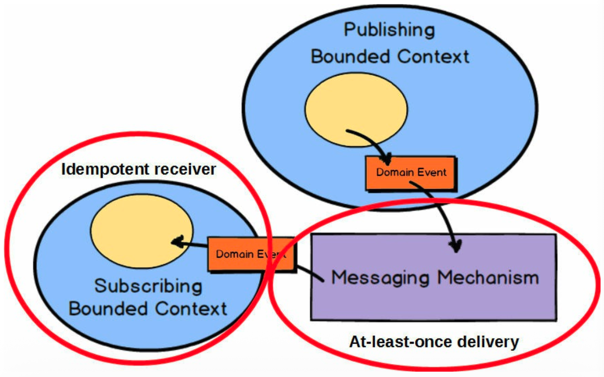
 

在所有使用消息传递进行集成的情况下，整体解决方案的质量将在很大程度上取决于所选消息传递机制的质量。
消息传递机制应支持 *至少一次投递 (At-Least-Once Delivery)*  [Reactive](../ref.md#reactive)，以确保所有消息最终都能被接收。
这也意味着订阅方 *限界上下文 (Bounded Context)* 必须实现为 *幂等接收者 (Idempotent Receiver)* [Reactive](../ref.md#reactive) 。

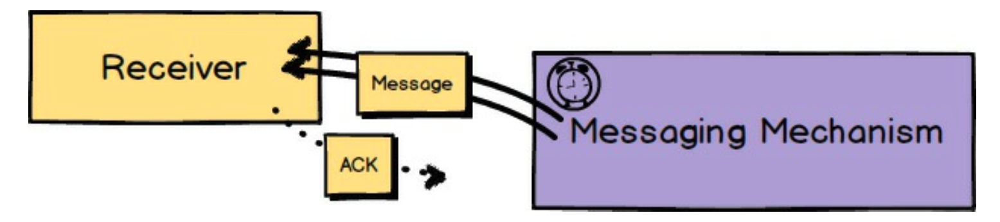
 

 *至少一次投递 (At-Least-Once Delivery)*  [Reactive](../ref.md#reactive) 是一种消息传递模式，其中消息传递机制将定期重新投递给定的消息。
 这将在消息丢失、接收者响应缓慢或宕机，以及接收者未能确认收到的情况下进行。
 由于这种消息传递机制的设计，即使发送者只发送一次，消息也有可能被投递多次。
 然而，当接收者被设计为处理这种情况时，这未必是问题。

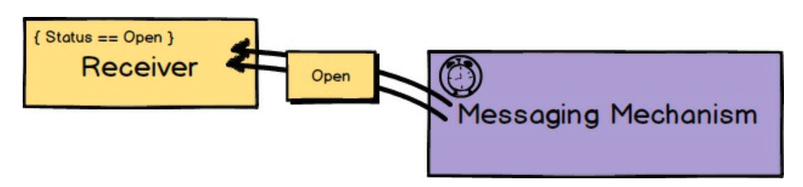
 

每当消息可能被投递多次时，接收者应被设计为正确处理这种情况。
*幂等接收者 (Idempotent Receiver)* [Reactive](../ref.md#reactive) 描述了请求的接收者如何以这样的方式执行操作：
即使执行多次，也会产生相同的结果。
因此，如果同一条消息被多次接收，接收者将以安全的方式处理它。
这可能意味着接收者使用去重并忽略重复的消息，或安全地重新应用与先前投递产生完全相同结果的操作。

由于消息传递机制总是引入异步的 *请求-响应 (Request-Response)*  [Reactive](../ref.md#reactive) 通信，一些延迟既是常见的也是预料之中的。
服务请求（几乎）永远不应阻塞直到服务完成。
因此，以消息传递为出发点进行设计意味着你将始终计划至少一些延迟，这将使你的整体解决方案从一开始就更加健壮。
