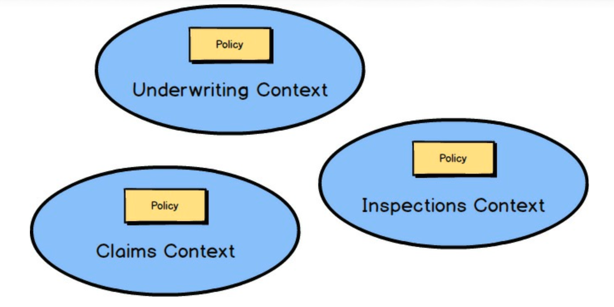
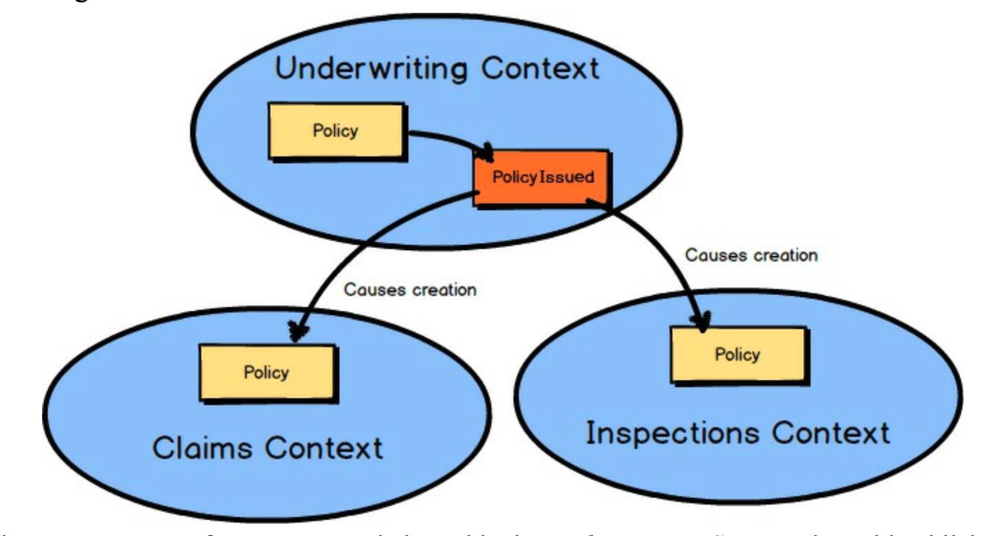
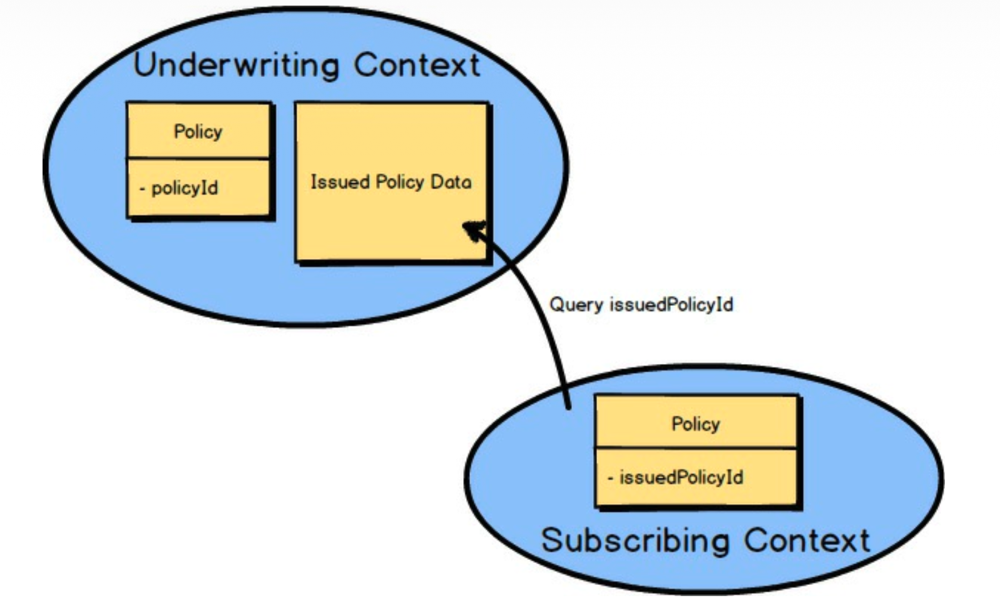
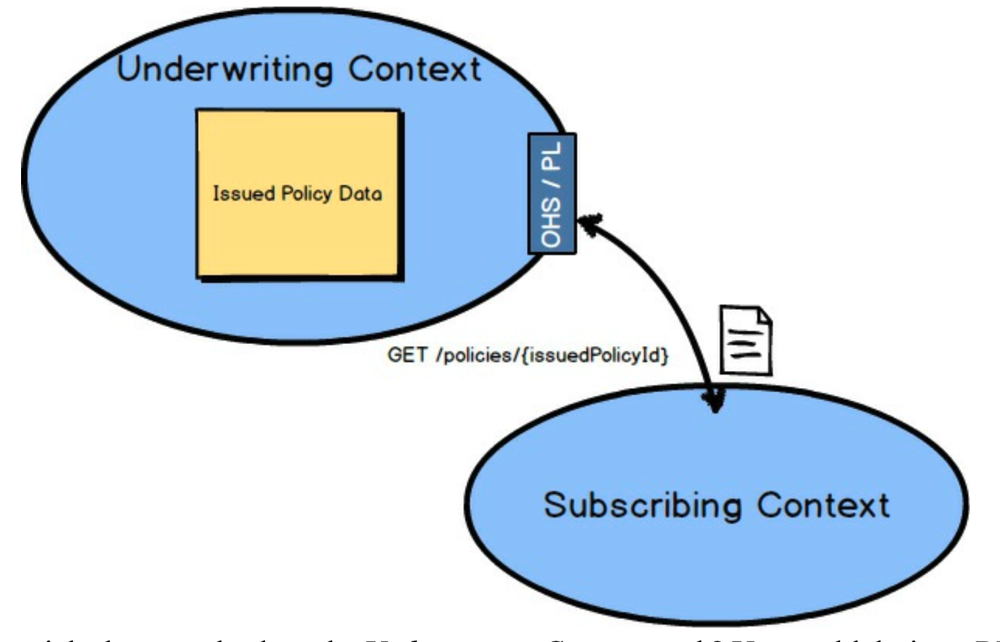
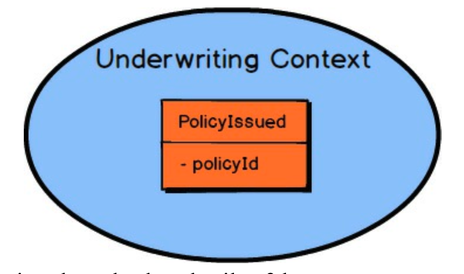
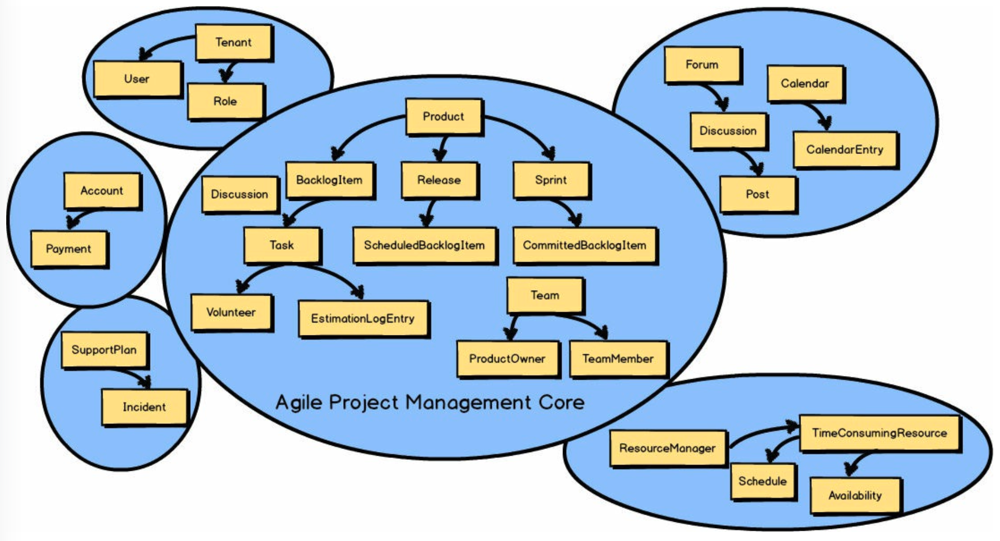

 

## 上下文映射示例

回到 [第二章](../ch2/0.md) “限界上下文与通用语言的战略设计” 中讨论的示例，关于官方 `Policy` 类型的位置出现了一个问题。
记住，在三个不同的 *限界上下文 (Bounded Contexts)* 中有三种不同的 `Policy` 类型。
那么，在保险企业中，“记录保单” 位于哪里？
它可能属于核保部门，因为那是它的起源。
为了这个示例，假设它确实属于核保部门。
那么，其他 *限界上下文 (Bounded Context)* 如何得知它的存在呢？

 

当 `Underwriting Context` 中发布了一个 `Policy` 类型的组件时，它可以发布一个名为 `PolicyIssued` 的 *领域事件 (Domain Event)* 。
通过消息订阅提供，任何其他 *限界上下文 (Bounded Context)* 可以对该 *领域事件 (Domain Event)* 做出反应，这可能包括在订阅的 *限界上下文 (Bounded Context)* 中创建一个相应的 `Policy` 组件。

 

`PolicyIssued` *领域事件 (Domain Event)* 将包含官方 `Policy` 的身份标识。
这里它是 `policyId`。
在订阅 *限界上下文 (Bounded Context)* 中创建的任何组件都将保留该标识，以便追溯到源头的 `Underwriting Context`。
在这个示例中，该标识被保存为 `issuedPolicyId`。
如果需要的 `Policy` 数据超过了 `PolicyIssued` *领域事件 (Domain Event)* 所提供的，订阅 *限界上下文 (Bounded Context)* 总是可以回查 `Underwriting Context` 以获取更多信息。
在这里，订阅 *限界上下文 (Bounded Context)* 使用 `issuedPolicyId` 在 `Underwriting Context` 上执行查询。

---
**数据丰富与回查之间的权衡**

有时，使用足够的数据来丰富 *领域事件 (Domain Events)* 以满足所有消费者的需求是有优势的。
有时，保持 *领域事件 (Domain Events)* 精简，并允许在消费者需要更多数据时进行回查也是有优势的。
第一种选择，数据丰富，允许依赖的消费者拥有更大的自治性。
如果自治是你的主要需求，可以考虑数据丰富。

另一方面，很难预测所有消费者将来在富 *领域事件 (Domain Events)* 中会需要的每一份数据，并且如果你提供所有数据，可能会有过多的数据丰富。
例如，大幅丰富 *领域事件 (Domain Event)* 可能是一个糟糕的安全选择。
如果是这种情况，设计精简的 *领域事件 (Domain Events)* 和一个具有安全性的、供消费者请求的丰富查询模型，可能是你需要做出的选择。

有时，情况会要求两种方法的平衡混合。

---

 

那么，回查 `Underwriting Context` 的查询是如何工作的呢？
你可以在 `Underwriting Context` 上设计一个 RESTful 的 *开放主机服务 (Open Host Service)* 和 *发布语言 (Published Language)* 。
一个带有 `issuedPolicyId` 的简单 HTTP GET 请求将检索 `IssuedPolicyData`。

 

你可能想知道 `PolicyIssued` *领域事件 (Domain Event)* 的数据细节。
我将在 [第六章](../ch6/0.md) “领域事件的战术设计” 中提供 *领域事件 (Domain Event)* 的设计细节。

 

你是否好奇 *敏捷项目管理上下文 (Agile Project Management Context)* 的例子后来怎么样了？
从它切换到保险业务领域，让你可以通过多个例子来审视 DDD。
这应该有助于你更好地掌握 DDD。
别担心，我们将在 [下一章](../ch5/0.md) 回到 *敏捷项目管理上下文 (Agile Project Management Context)* 。
