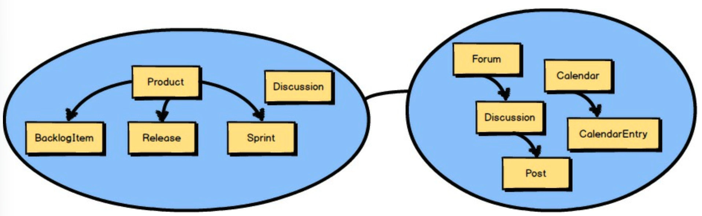
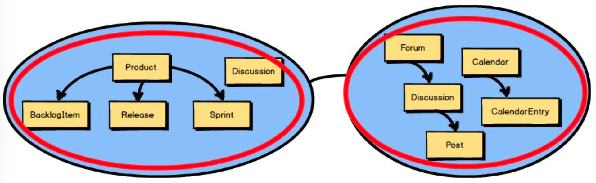
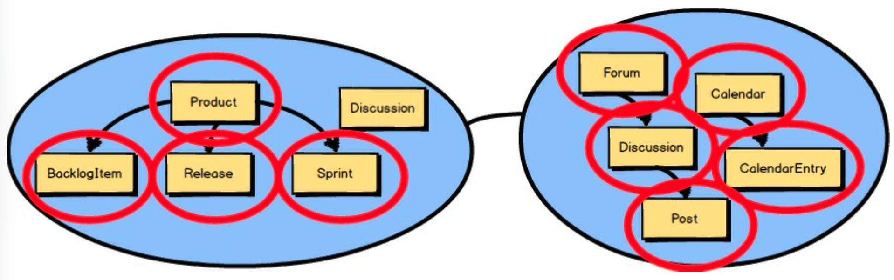
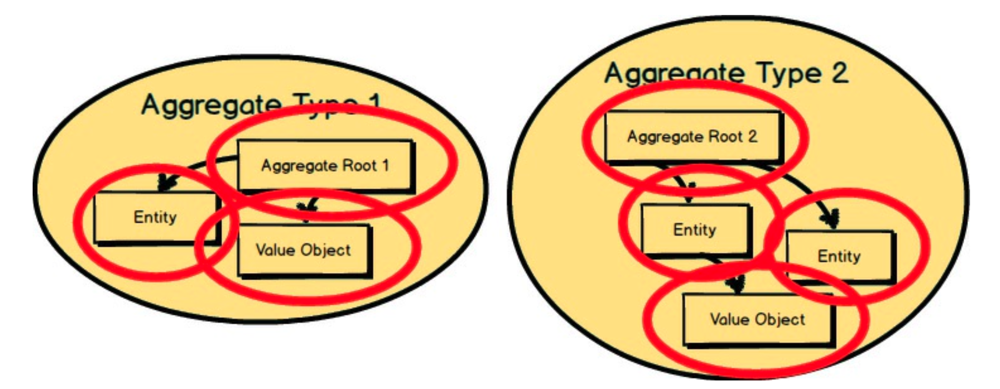
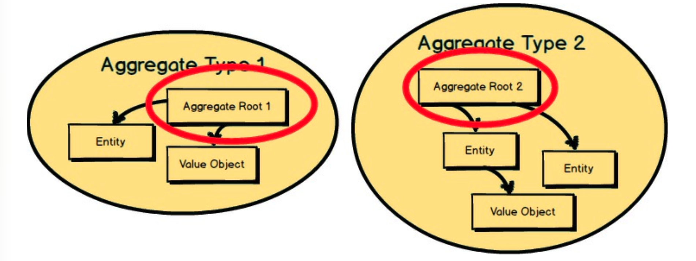
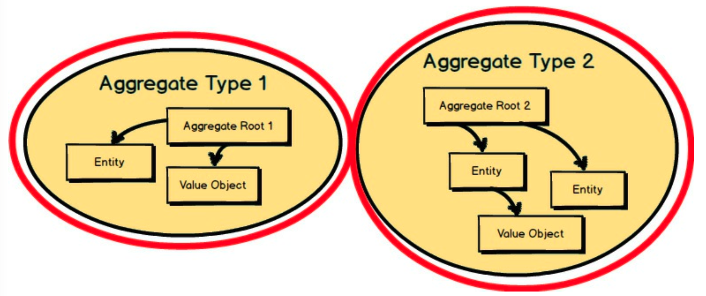
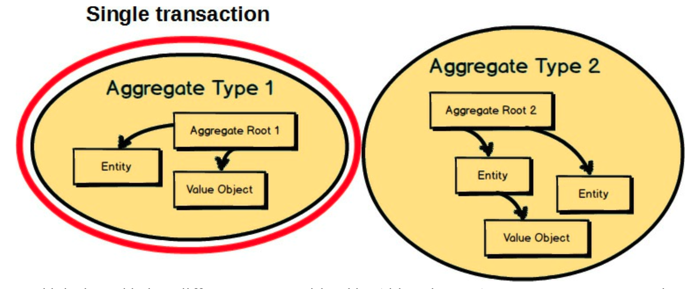
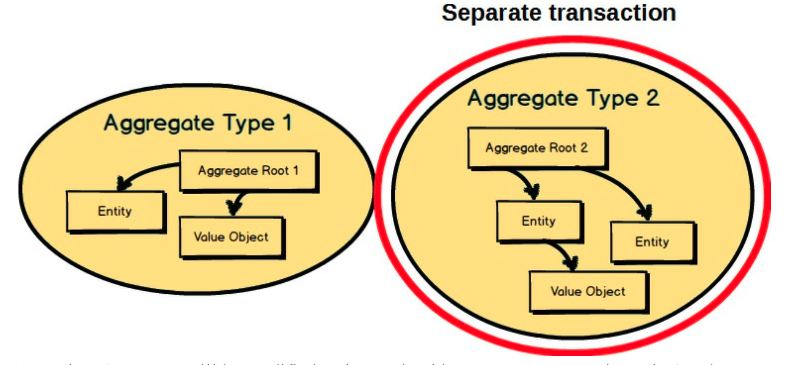
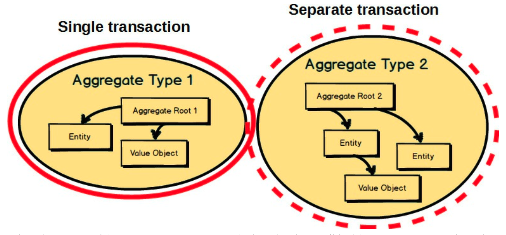

# 第五章 聚合的战术设计

 

到目前为止，我已经讨论了关于 *限界上下文 (Bounded Context)* 、*子域 (Subdomain)* 和 *上下文映射 (Context Mapping)* 的战略设计。这里你看到两个 *限界上下文 (Bounded Context)* ，名为 *敏捷项目管理上下文 (gile Project Management Context)* 的 *核心域 (Core Domain)* 和一个通过 *上下文映射 (Context Mapping)* 集成提供协作工具的 *支撑子域 (Supporting Subdomain)* 。

 

但是，*限界上下文 (Bounded Context)* 内部存在的概念呢？
我已经提到过这些，但接下来我将更详细地介绍它们。
它们很可能是你模型中的 *聚合 (Aggregates)* 。

 

## 为什么使用聚合

在这两个 *限界上下文 (Bounded Contexts)* 内部，你看到的每个带圆圈的概念都是一个 *聚合 (Aggregate)* 。
唯一没有圈起来的概念 ——`Discussion`—— 被建模为一个 *值对象 (Value Object)* 。
即便如此，我们在本章中关注的是 *聚合 (Aggregates)* ，我们将仔细研究如何对 `Product`、`BacklogItem`、`Release` 和 `Sprint` 进行建模。

---
**什么是实体？**

*实体 (Entity)* 对单个事物进行建模。
每个 *实体 (Entity)* 都有一个唯一标识，通过它你可以将其个体性从所有其他相同或不同类型的 *实体 (Entity)* 中区分出来。
很多时候，也许大多数时候，*实体 (Entity)* 是可变的；
也就是说，它的状态会随时间变化。
尽管如此， *实体 (Entity)* 并非必须是可变的，它也可以是不可变的。
将 *实体 (Entity)* 与其他建模工具区分开来的主要因素是它的唯一性 —— 它的个体性 (individuality)。

有关 *实体 (Entity)* 的详尽论述，请参阅《实现领域驱动设计》[IDDD](../ref.md#iddd) 。

---

 

什么是 *聚合 (Aggregate)* ？
这里展示了两个。
每个 *聚合 (Aggregate)* 由一个或多个 *实体 (Entities)* 组成，其中一个 *实体 (Entity)* 被称为 *聚合根 (Aggregate Root)* 。
*聚合 (Aggregates)* 也可以组合 *值对象 (Value Objects)* 。
正如你在这里看到的，*值对象 (Value Objects)* 被用于两个 *聚合 (Aggregates)* 内部。

---
**什么是值对象？**

*值对象 (Value Object)* ，或简称为 *值 (Value)* ，对一个不可变的、概念上的整体进行建模。
在模型中，*值 (Value)* 就是值。
与 *实体 (Entity)* 不同，它没有唯一标识，等价性是通过比较 *值 (Value)* 类型封装的属性来确定的。
此外，*值对象 (Value Object)* 不是一个事物，而是经常被用来描述、量化或衡量一个 *实体 (Entity)* 。

有关 *值对象 (Value Object)* 的详细描述，请参阅《实现领域驱动设计》[IDDD](../ref.md#iddd) 。

---

 

每个 *聚合 (Aggregate)* 的 *根实体 (Root Entity)* 拥有聚集在其内部的所有其他元素。
*根实体 (Root Entity)* 的名称就是该 *聚合 (Aggregate)* 的概念性名称。
你应该选择一个能够恰当描述该 *聚合 (Aggregate)* 所建模的概念整体的名称。

 

每个 *聚合 (Aggregate)* 形成一个事务一致性边界。
这意味着，在单个 *聚合 (Aggregate)* 内部，当控制事务提交到数据库时，根据业务规则，所有组成的部分必须保持一致。
这并不一定意味着你不应该在 *聚合 (Aggregate)* 内部组合那些在事务后不需要保持一致的其他元素。
毕竟，*聚合 (Aggregate)* 也对一个概念整体进行建模。
但你应该首先关注事务一致性。
围绕 `Aggregate Type 1` 和 `Aggregate Type 2` 绘制的外部边界代表了一个单独的事务，该事务将控制原子性地持久化每个对象集群。

---
**事务的更广泛含义**

在某种程度上，应用程序中事务的使用是一个实现细节。
例如，典型的用法是让 *应用服务 (Application Service)* [IDDD](../ref.md#iddd) 代表领域模型控制原子数据库事务。
在另一种架构下，例如 *Actor 模型* [Reactive](../ref.md#reactive) 中，每个 *聚合 (Aggregate)* 实现为一个 Actor，事务可以使用 *事件溯源 (Event Souring)* （见下一章）来处理，而数据库可能不支持原子事务。
无论哪种方式，我所说的 “事务” 是指对聚合的修改如何被隔离，以及业务不变量 ——软件必须始终遵守的规则—— 如何在每个业务操作之后保持一致。
无论这个要求是由原子数据库事务还是其他方式控制，*聚合 (Aggregate)* 的状态，或其通过 *事件溯源 (Event Sourcing)* 的表示，都必须始终安全、正确地转换和维护。

---

事务边界的理由是业务驱动的，因为业务决定了集群在任意给定时间应该处于何种有效状态。
换句话说，如果 *聚合 (Aggregate)* 没有被存储在一个完整且有效的状态下，那么所执行的业务操作根据业务规则将被认为是不正确的。

 

换一种方式来思考这个问题。
考虑一下，虽然这里展示了两个 *聚合 (Aggregate)*，但在单个事务中，只能提交这两个 *聚合 (Aggregate)* 中的一个。
这是一条关于 *聚合 (Aggregate)* 设计的一般规则：在单个事务中，只修改和提交一个 *聚合 (Aggregate)* 实例。
这就是为什么你在事务中只看到 `Aggregate Type 1` 的实例。
我们很快就会看到 *聚合 (Aggregate)* 设计的其他规则。

 

任何其他的 *聚合 (Aggregate)* 将在单独的事务中被修改和提交。
这就是为什么 *聚合 (Aggregate)* 被称为事务一致性边界。
因此，你设计 *聚合 (Aggregate)* 组合的方式，要允许事务一致性和成功。
正如这里所示，`Aggregate Type 2` 的一个实例与 `Aggregate Type 1` 的实例处于不同的事务控制之下。

 

由于这两个 *聚合 (Aggregates)* 的实例被设计为在单独的事务中修改，
我们如何根据对 `Aggregate Type 1` 实例所做的更改来更新 `Aggregate Type 2` 的实例，
而我们的领域模型必须对此做出反应？
这是一个好问题；我们将在本章稍后考虑其答案。

从本节要记住的主要一点是，业务规则是确定在单个事务结束时，什么必须是完整的、完备的和一致的驱动因素。
