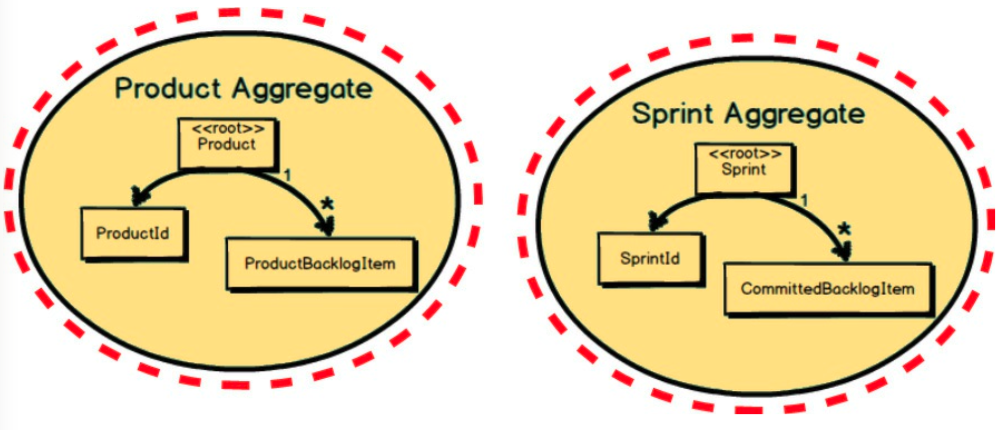
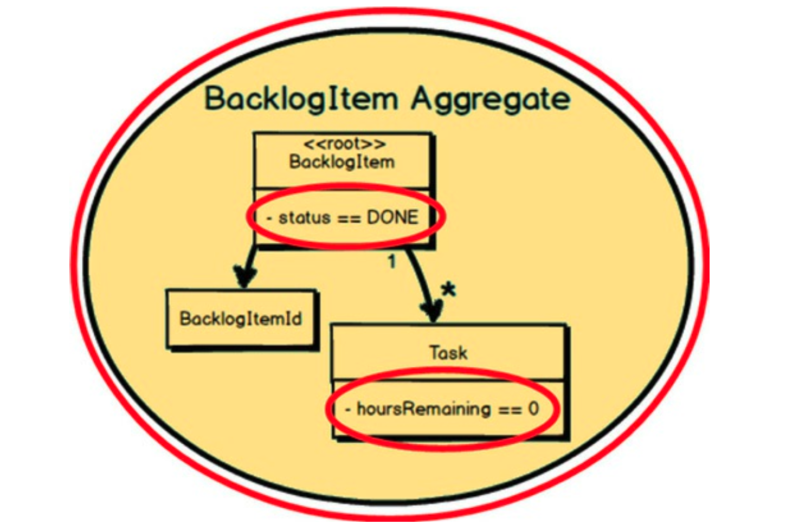
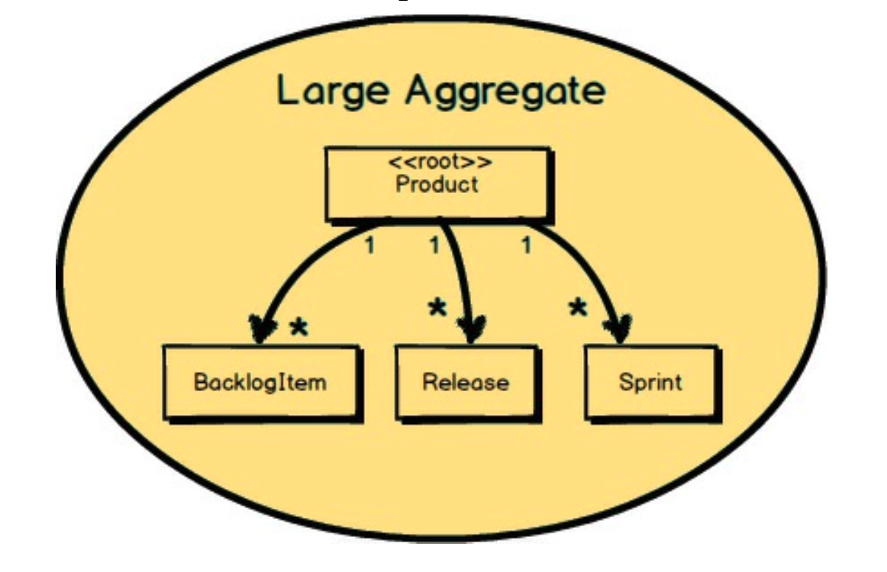
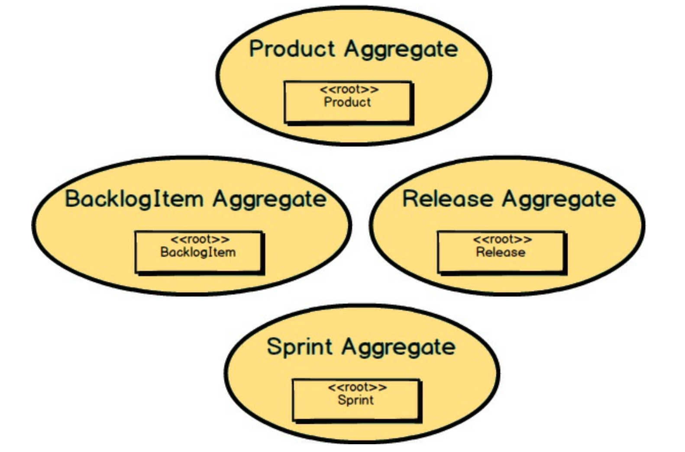
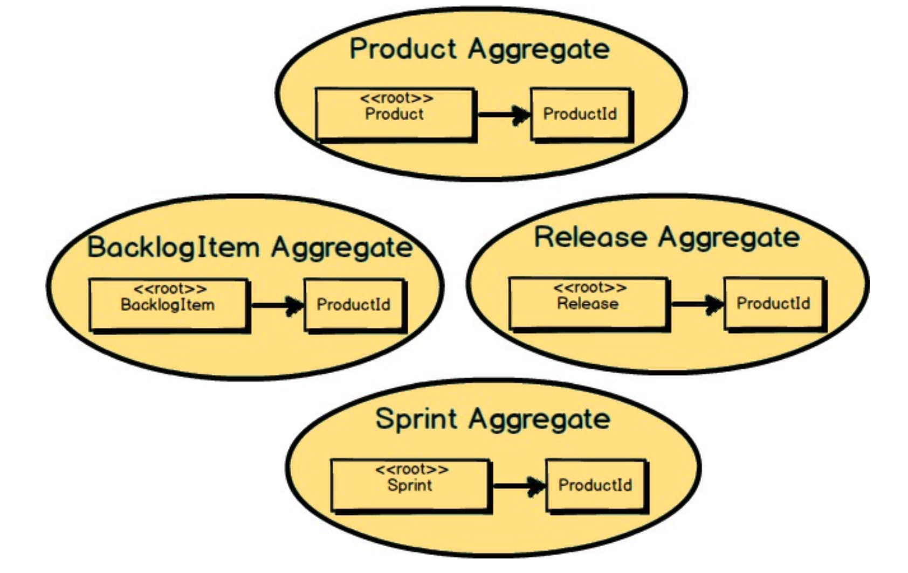
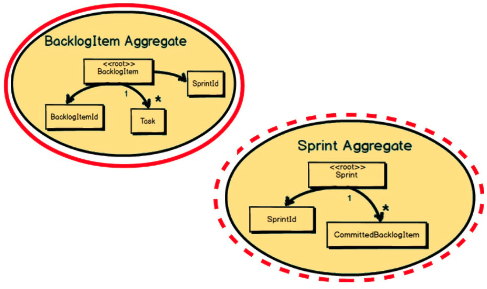
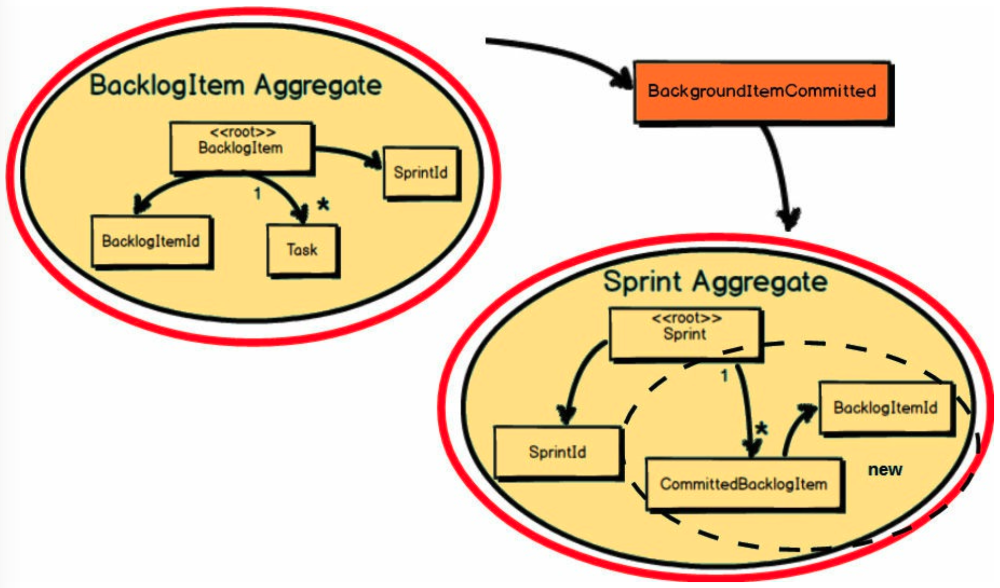
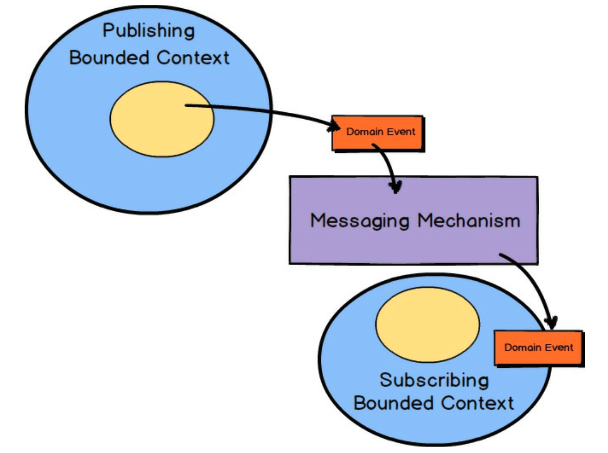
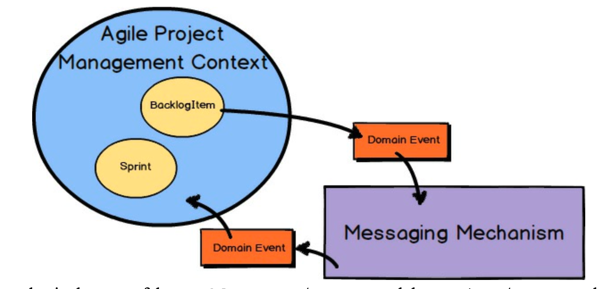

## 聚合的经验法则

接下来，让我们考虑 *聚合 (Aggregate)* 设计的四条基本规则：

1. 在 *聚合 (Aggregate)* 边界内保护业务不变量。
2. 设计小的 *聚合 (Aggregates)* 。
3. 仅通过标识引用其他 *聚合 (Aggregates)* 。
4. 使用最终一致性更新其他 *聚合 (Aggregates)* 。

当然，这些规则不一定由任何 “DDD 警察” 严格强制执行。
它们旨在作为合理的指导，当被深思熟虑地应用时，它们将帮助你设计出有效工作的 *聚合 (Aggregates)* 。
既然如此，我们现在将深入研究每一条规则，看看它们如何在可能的情况下被应用。

 

### 规则 1：在 聚合边界内保护业务不变量

<ins>规则 1 意味着，业务最终应基于事务提交时必须保持一致的内容来确定 *聚合 (Aggregate)* 组合</ins>。
在上图的例子中，`Product` 被设计为在事务结束时，所有组合的 `ProductBacklogItem` 实例必须被核算并与 `Product` 根保持一致。
同样，`Sprint` 被设计为在事务结束时，所有组合的 `CommittedBacklogItem` 实例必须被核算并与 `Sprint` 根保持一致。

 

规则 1 通过另一个例子变得更加清晰。
这里是 `BacklogItem` *聚合 (Aggregate)* 。
有一条业务规则规定：“当所有 `Task` 实例的 `hoursRemaining` 都为零时，`BacklogItem` 的状态必须设置为 `DONE`。”
因此，在事务结束时，必须满足这个非常具体的业务不变量。
业务要求这样做。

 

### 规则 2：设计小的聚合

<ins>这条规则强调，每个 *聚合 (Aggregate)* 的内存占用和事务范围应该相对较小</ins>。
在上图中，所表示的 *聚合 (Aggregate)* 并不小。
在这里，`Product` 实际上包含了一个潜在非常大的 `BacklogItem` 实例集合、一个 `Release` 实例的大集合和一个 `Sprint` 实例的大集合。
随着时间的推移，这些集合可能变得相当大，有数千个 `BacklogItem` 实例，可能有数百个 `Release` 和 `Sprint` 实例。
这种设计方法通常是一个非常糟糕的选择。

 

然而，如果我们打破 `Product` *聚合 (Aggregate)* ，形成四个独立的 *聚合 (Aggregates)* ，这就是我们得到的：一个小型 `Product` *聚合 (Aggregate)* 、一个小型 `BacklogItem` *聚合 (Aggregate)* 、一个小型 `Release` *聚合 (Aggregate)* 和一个小型 `Sprint` *聚合 (Aggregate)* 。
这些聚合加载速度快，占用内存少，垃圾回收也更快。
也许最重要的是，与之前的大集群 `Product` *聚合 (Aggregate)* 相比，这些 *聚合 (Aggregates)* 的事务成功频率会高得多。

遵循这条规则还有一个额外的好处，即每个 *聚合 (Aggregate)* 更容易处理，因为每个关联的任务可以由单个开发人员管理。
这也意味着 *聚合 (Aggregate)* 更容易测试。

<ins>在设计 *聚合 (Aggregates)* 时，另一件需要记住的事情是 *单一职责原则（SRP）* </ins>。
如果你的 *聚合 (Aggregate)* 试图做太多事情，它就没有遵循 SRP，这很可能在其大小上有所体现。
例如，问问自己，你的 `Product` 是一个高度聚焦的 Scrum 产品实现，还是它也在尝试成为其他东西？
更改 `Product` 的原因是什么：是为了让它成为一个更好的 Scrum 产品，还是为了管理待办项、发布和冲刺？
你应该只为了让它成为一个更好的 Scrum 产品而更改 `Product`。

 

### 规则 3：仅通过标识引用其他聚合

现在我们已经将大集群 `Product` 分解为四个较小的 *聚合 (Aggregate)* ，每个聚合在需要时应该如何引用其他聚合？
这里我们遵循 <ins>规则3，“仅通过标识引用其他聚合”</ins>。
在这个例子中，我们看到 `BacklogItem`、`Release` 和 `Sprint` 都通过持有 `ProductId` 来引用 `Product`。
这有助于保持 *聚合 (Aggregates)* 的小型化，并防止在同一个事务中伸手去修改多个 *聚合 (Aggregates)* 。

这进一步有助于保持 *聚合 (Aggregate)* 设计的小型和高效，从而降低内存需求，加快从持久化存储加载的速度。
它还有助于强制执行不在同一事务中修改其他 *聚合 (Aggregate)* 实例的规则。
由于只有其他 *聚合 (Aggregate)* 的标识，无法轻易获得对它们的直接对象引用。

仅通过标识引用的另一个好处是，你的 *聚合 (Aggregate)* 可以很容易地存储在任何类型的持久化机制中，
例如关系数据库、文档数据库、键值存储和数据网格/结构。
这意味着你有多种选择，可以使用 MySQL 关系表、基于 JSON 的存储（如 PostgreSQL 或 MongoDB）、GemFire/Geode、Coherence 和 GigaSpaces。

 

### 规则 4：使用最终一致性更新其他聚合

这里，一个 `BacklogItem` 被承诺到一个 `Sprint` 中。
`BacklogItem` 和 `Sprint` 都必须对此做出反应。
首先，是 `BacklogItem` 知道它已被承诺到某个 `Sprint`。
这在一个事务中管理，当 `BacklogItem` 的状态被修改为包含它所承诺到的 `Sprint` 的 `SprintId` 时。
那么，我们如何确保 `Sprint` 也使用新承诺的 `BacklogItem` 的 `BacklogItemId` 进行更新呢？

 

作为 `BacklogItem` *聚合 (Aggregate)* 事务的一部分，它发布了一个名为 `BacklogItemCommitted` 的 *领域事件 (Domain Event)* 。
`BacklogItem` 事务完成，其状态与 `BacklogItemCommitted`  *领域事件 (Domain Event)* 一起被持久化。
当 `BacklogItemCommitted` 到达本地订阅者时，启动一个事务，并修改 `Sprint` 的状态以持有已承诺 `BacklogItem` 的 `BacklogItemId`。
`Sprint` 将 `BacklogItemId` 保存在一个新的 `CommittedBacklogItem` 实体中。

 

现在回顾一下你在 [第四章](../ch4/0.md) “上下文映射的战略设计” 中学到的内容。
<ins>*领域事件 (Domain Event)* 由 *聚合 (Aggregate)* 发布，并由感兴趣的 *限界上下文 (Bounded Contxt)* 订阅。
消息传递机制通过订阅将 *领域事件 (Domain Event)* 传递给相关方</ins>。
感兴趣的 *限界上下文 (Bounded Contxt)* 可以是发布该 *领域事件 (Domain Event)* 的同一个上下文，也可以是不同的 *限界上下文 (Bounded Contxt)* 。

 

只是在 `BacklogItem` *聚合 (Aggregate)* 和 `Sprint` *聚合 (Aggregate)* 的情况下，发布者和订阅者位于同一个 *限界上下文 (Bounded Contxt)* 中。
对于这种情况，你并非绝对需要使用成熟的消息中间件产品，但由于你已经将其用于向其他限界上下文发布，所以很容易做到这一点。

---
**如果最终一致性看起来令人担忧**

使用最终一致性并没有什么难以置信的困难。
然而，在你获得一些经验之前，你可能会对使用它感到担忧。
如果是这样，你仍然应该根据业务定义的事务边界将模型划分为 *聚合 (Aggregates)* 。
然而，没有什么能阻止你在单个原子数据库事务中提交对两个或更多 *聚合 (Aggregates)* 的修改。
你可能会在你确定会成功的情况下选择使用这种方法，而对所有其他情况使用最终一致性。
这将让你在没有迈出太大第一步的情况下适应这些技术。
只是要明白，这不是 *聚合 (Aggregates)* 的主要使用方式，你可能会因此遇到事务失败。

---
