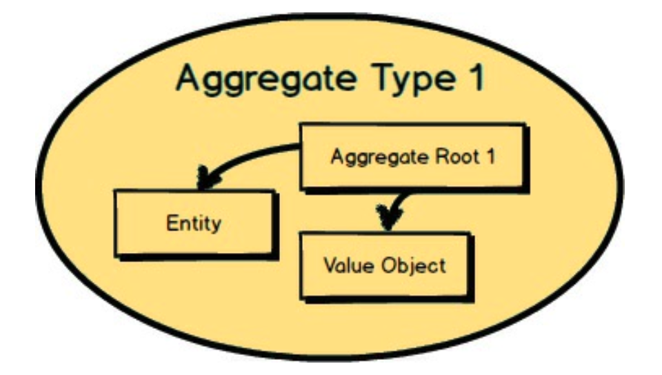
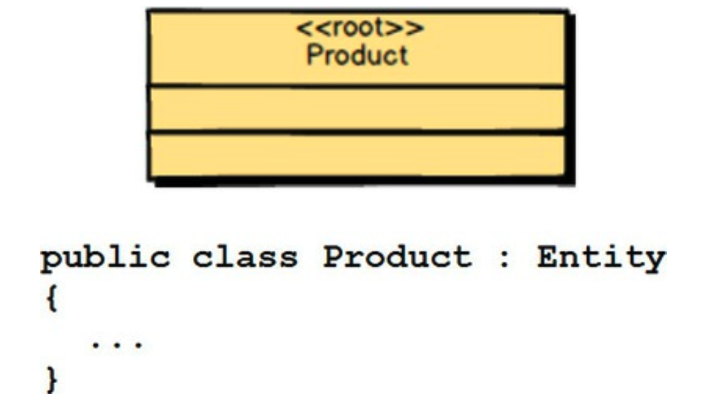
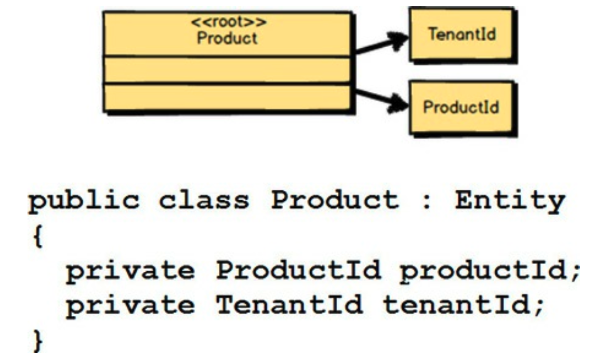
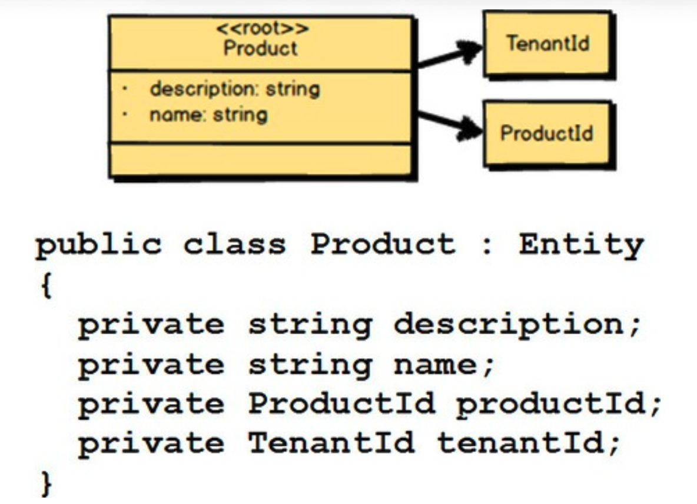
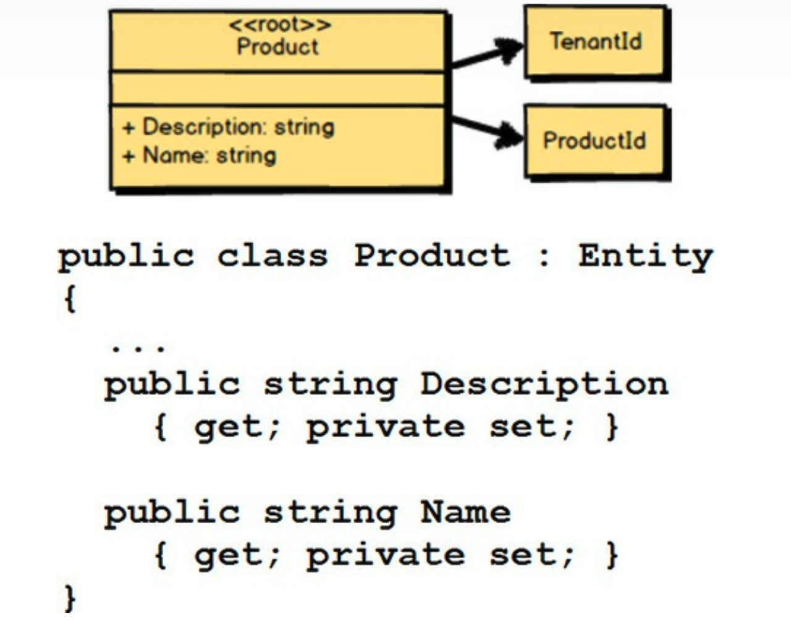
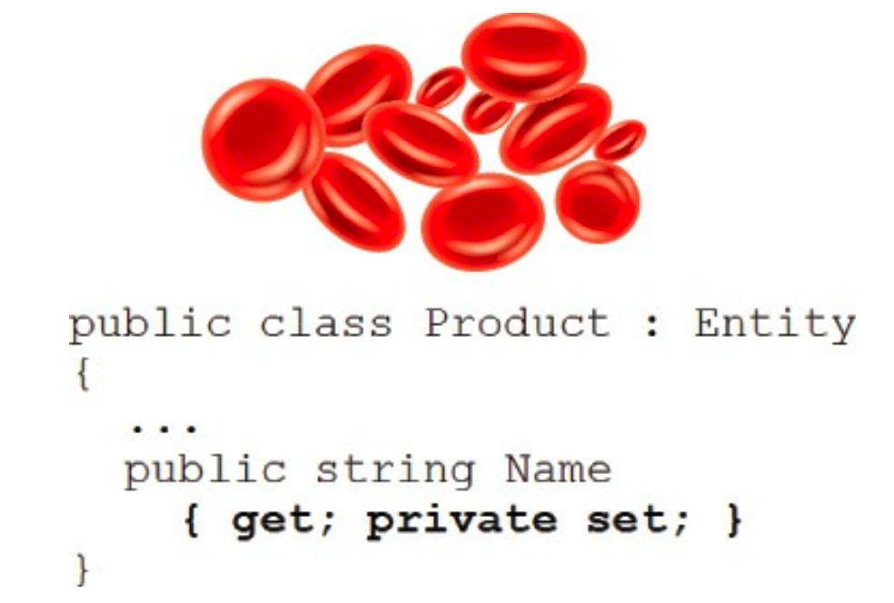
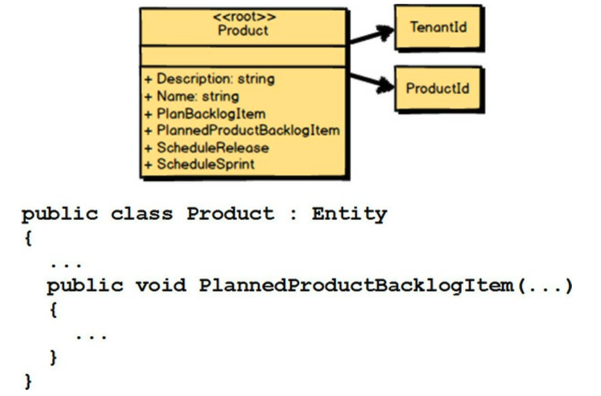
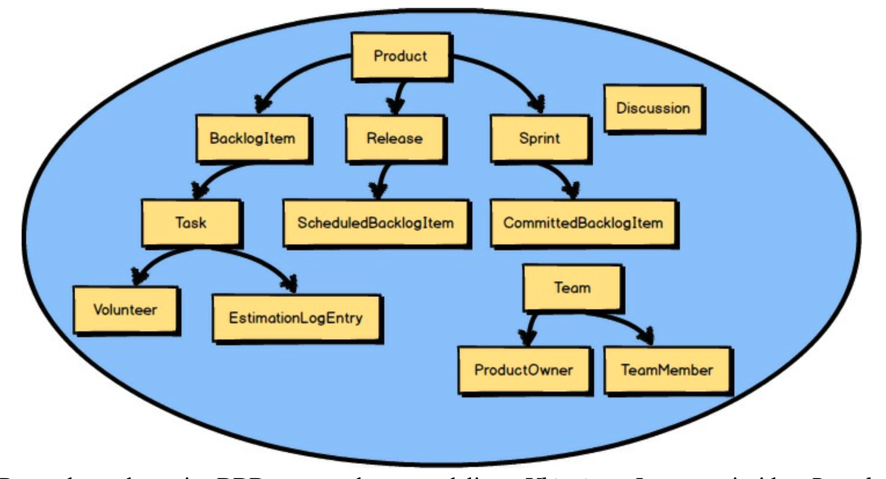
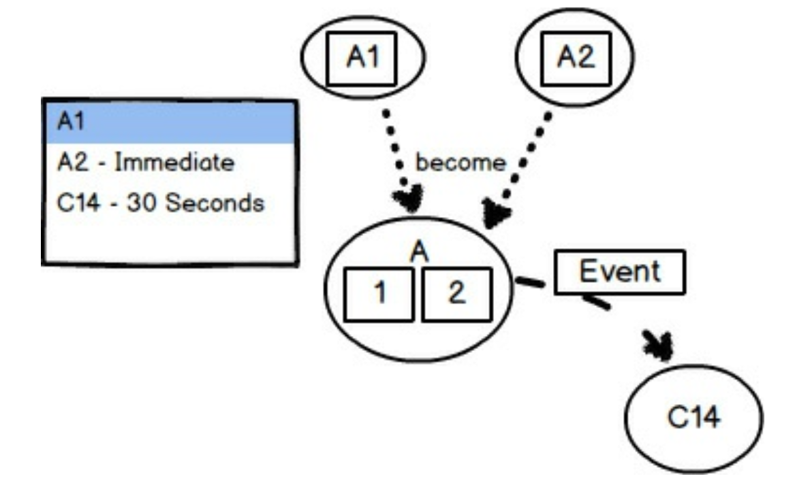

## 建模聚合

 

当你进行领域模型工作并实现 *聚合 (Aggregates)* 时，有几个陷阱在等着你。
一个又大又讨厌的陷阱是 *贫血领域模型 (Anemic Domain Model)* [IDDD](../ref.md#iddd) 。
这是指你使用面向对象的领域模型，但你的所有 *聚合 (Aggregates)* 只有公共访问器（getter 和 setter），没有真正的业务行为。
当建模时关注技术而非业务时，往往会发生这种情况。
设计 *贫血领域模型 (Anemic Domain Model)* 需要你承担领域模型的所有开销，却无法获得它的任何好处。
不要上当！

还要注意将业务逻辑泄露到领域模型之上的应用服务中。
它可能在没有察觉的情况下发生，就像身体贫血一样。
将业务逻辑从服务委托给辅助/工具类也不会有什么好结果。
服务工具类总是表现出身份危机，永远无法保持逻辑一致。
将你的业务逻辑放在你的领域模型中，否则就会遭受 *贫血领域模型 (Anemic Domain Model)* 带来的错误。

---
**函数式编程呢？**

当使用函数式编程时，规则会发生很大变化。
<ins>虽然在面向对象编程中 *贫血领域模型 (Anemic Domain Model)* 是个坏主意，但在应用函数式编程时，它在某种程度上是常态。
这是因为函数式编程提倡数据和行为的分离</ins>。
你的数据被设计为不可变的数据结构或记录类型，而你的行为被实现为对特定类型的不可变记录进行操作的纯函数。
函数不会修改作为参数接收的数据，而是返回新值。
这些新值可能是 *聚合 (Aggregate)* 的新状态，或是代表 *聚合 (Aggregate)* 状态转换的 *领域事件 (Domain Event)* 。

我在本章中主要讨论了面向对象的方法，因为它仍然是最广泛使用且最易理解的。
然而，如果你正在使用函数式语言和方法进行 DDD，请注意，其中一些指导不适用，或至少受制于重写的规则。

---

 

接下来，我将向你展示实现基本 *聚合 (Aggregate)* 设计所需的一些技术组件。
我假设你使用的是 Scala、C#、Java 或其他面向对象的编程语言。
以下示例使用 C#，但 Scala、F#、Java、Ruby、Python 以及其他语言的程序员也能很好地理解。

 

你首先要做的是为你的 *聚合根实体 (Aggregate Root Entity)* 创建一个类。
这里是 `Product` *根实体 (Root Entity)* 的 UML（统一建模语言）表示。
还包括 C# 中的 `Product` 类，它扩展了一个名为 `Entity` 的基类。
这个基类只是处理标准的 *实体 (Entity)* 类的事情。
有关 *实体 (Entity)* 和 *聚合 (Aggregate)* 设计与实现的详尽讨论，请参阅《实现领域驱动设计》[IDDD](../ref.md#iddd) 。

 

每个 *聚合根实体 (Aggregate Root Entity)* 都必须具有全局唯一的标识。
*敏捷项目管理上下文 (Agile Project Management Context)* 中的 `Product` 实际上有两种形式的全局唯一标识。
`TenantId` 将 *根实体 (Root Entity)* 限定在给定的订阅者组织内。
（每个订阅服务的组织被称为租户，因此具有唯一的标识。）
第二个标识 `ProductId` 也是全局唯一的。
这个第二个标识将 `Product` 与同一租户内的所有其他 `Product` 区分开来。
C# 代码中还包括在 `Product` 内声明的这两个标识。

---
**值对象的使用**

在这里，`TenantId` 和 `ProductId` 都被建模为不可变的 *值对象 (Value Objects)* 。

---

 

接下来，你捕获查找 *聚合 (Aggregate)* 所必需的任何内在属性或字段。
对于 `Product`，有 `description` 和 `name`。
用户可以搜索其中之一或两者来查找每个 `Product`。
我还提供了声明这两个内在属性的 C# 代码。

 

当然，你可以添加简单行为，例如内在属性的读取访问器（getter）。
在 C# 中，这可能会使用公共属性 getter 来完成。
但是，你可能不希望将 setter 暴露为公共的。
如果没有公共 setter，属性/属性值如何更改？
当使用面向对象方法（C#、Scala 和 Java）时，你使用行为方法来更改内部状态。
如果使用函数式方法（F#、Scala 和 Clojure），函数将返回与作为参数传递的值不同的新值。

 

你应该肩负起对抗 *贫血领域模型 (Anemic Domain Model)* [IDDD](../ref.md#iddd) 的使命。
<ins>如果你暴露了公共 setter 方法，它可能很快导致贫血，因为在模型外部实现设置 `Product` 值的逻辑。
在这样做之前请三思，并记住这个警告</ins>。

 

最后，你添加任何复杂的行为。
这里我们有四个新方法：`PlanBacklogItem()`、`PlannedProductBacklogItem()`、`ScheduleRelease()` 和 `ScheduleSprint()`。
这些方法各自的 C# 代码应该被添加到类中。

 

记住，当使用 DDD 时，我们总是在 *限界上下文 (Bounded Context)* 内部对 *通用语言 (Ubiquitous Language)* 进行建模。
因此，`Product` *聚合 (Aggregate)* 的所有组成部分都是根据 *通用语言 (Ubiquitous Language)* 建模的。
你不是随意编造这些组成的部分。
每一处设计都体现了紧密协作团队中 *领域专家 (Domain Experts)* 与开发人员达成的共识。

### 谨慎选择你的抽象

一个有效的软件模型总是基于一组针对业务运作方式的抽象。
然而，我们需要为每个被建模的概念选择适当的抽象层次。

<ins>如果你遵循 *通用语言 (Ubiquitous Language)* 的方向，你通常会创建适当的抽象。
正确地建模抽象要容易得多，因为至少是你建模语言的起源是由领域专家传达的</ins>。
尽管如此，有时，那些过于热衷于解决错误问题的软件开发人员，会试图强行引入过度的抽象。

例如，在 *敏捷项目管理上下文 (Agile Project Management Context)* 中，我们处理的是 Scrum。
对我们一直在讨论的 `Product`、`BacklogItem`、`Release` 和 `Sprint` 概念进行建模是合理的。
即便如此，如果软件开发人员较少关心对 Scrum 的 *通用语言 (Ubiquitous Language)* 进行建模，而更感兴趣的是为所有当前和未来的 Scrum 概念建模一个解决方案呢？

如果朝这个方向发展，开发人员可能会提出像 `ScrumElement` 和 `ScrumElementContainer` 这样的抽象。
`ScrumElement` 可以满足当前对 `Product` 和 `BacklogItem` 的需求，
而 `ScrumElementContainer` 可以代表更明确的 `Release` 和 `Sprint` 概念。
`ScrumElement` 会有一个 `typeName` 属性，在适当的情况下将其设置为 `"Product"` 或 `"BacklogItem"`。
我们可以为 `ScrumElementContainer` 设计同类型的 `typeName` 属性，并允许在其上设置 `"Release"` 或 `"Sprint"` 值。

你看到这种方法的问题了吗？
问题不止一两个，但考虑以下几点：

- 软件模型的语言与 *领域专家 (Domain Experts)* 的心智模型不匹配。
- 抽象层次过高，当你开始对每种类型的细节进行建模时，你会陷入大麻烦。
- 这将导致在每个类中创建特殊情况，并可能导致一个复杂的类层次结构，用通用方式解决明确的问题。
- 你会拥有比所需多得多的代码，因为你试图解决一个本就不应该存在的、无法解决的问题。
- 通常，错误抽象的语言甚至会渗透到用户界面中，这会给用户带来困惑。
- 你会浪费相当多的时间和金钱。
- 你永远无法预先满足所有未来的需求，这意味着如果将来添加新的 Scrum 概念，你现有的模型将被证明无法预见这些需求。

走这样的道路对某些人来说可能显得奇怪，但这种错误的抽象层次经常被用于受技术启发的实现中。

<ins>不要被这种诱人的、高度抽象的实现陷阱所迷惑。
根据你的团队所精炼的 *领域专家 (Domain Experts)* 的心智模型，明确地对 *通用语言 (Ubiquitous Language)* 进行建模</ins>。
通过建模业务今天的需求，你将节省大量的时间、预算、代码和尴尬。
更重要的是，你将通过建模一个准确且有用的、反映有效设计的 *限界上下文 (Bounded Context)* ，为业务提供极大的帮助。

### 合理调整聚合大小

<ins>你可能想知道如何确定 *聚合 (Aggregates)* 的边界，并防止大集群的设计，同时仍然维持一致性边界，它可以保护真正业务不变量。
在这里，我提供了一个有价值的设计方法</ins>。
如果你已经创建了大集群的 *聚合 (Aggregates)* ，你可以使用这种方法重构为较小的 *聚合 (Aggregates)* ，但我不会从那个角度开始。

<ins>考虑这些设计步骤，它们将帮助你达到一致性边界目标</ins>：

1. <ins>首先关注 *聚合 (Aggregate)* 设计的第 2 条规则，“设计小的聚合” 。
从创建每个只有一个 *实体 (Entity)* 的 *聚合 (Aggregate)* 开始，该 *实体 (Entity)* 将作为 *聚合根 (Aggregate Root)* 。
甚至不要尝试在单个边界中放置两个 *实体 (Entities)* 。
这个机会很快就会到来。
用你认为与单个 *根实体 (Root Entity)* 最密切相关的字段/属性来填充每个 *实体 (Entities)* 。
这里的一个大提示是，定义识别和查找 *聚合 (Aggregate)* 所需的每个字段/属性，以及构造 *聚合 (Aggregate)* 并使其处于有效初始状态所需的任何额外的内在字段/属性</ins>。

2. <ins>现在将你的注意力放在 *聚合 (Aggregate)* 设计的第 1 条规则上，“在聚合边界内保护业务不变量”。
通过上一步操作你已经确认，当单 *实体聚合 (Entity Aggregate)* 被持久化时，至少所有内在字段/属性必须是最新的。
但现在你需要一次查看你的每个 *聚合 (Aggregates)* 。
当你对 `Aggregate A1 ` 这样做时，询问 *领域专家 (Domain Experts)* ，你所定义的任何其他 *聚合 (Aggregates)* 是否必须因对 `Aggregate A1` 所做的更改而更新。
列出每个 *聚合 (Aggregates)* 及其一致性规则，这将指明所有联动更新的时效要求。
换句话说，`Aggregate A1` 将是一个列表的标题，如果其他 *聚合 (Aggregate)* 类型将因 A1 更新而更新，它们将被列在 A1 下</ins>。

3. <ins>现在询问 *领域专家 (Domain Experts)* ，直到这些联动更新的发生，可能经过多长时间。
这将导致两种规范：(a) 立即，以及 (b) 在 N 秒/分钟/小时/天内。
一种找到正确业务阈值的可能方法是，提出一个明显不可接受的夸张时间范围（例如数周或数月）。
这很可能会导致业务专家回应一个可接受的时间范围</ins>。

4. <ins>对于每个立即时间范围（3a），你应该强烈考虑将这两个 *实体 (Entities)* 组合在同一个 *聚合 (Aggregate)* 边界内。
这意味着，例如，`Aggregate A1` 和 `Aggregate A2` 实际上将被组合成一个新的 `Aggregate A[1,2]`。
现在，之前定义的 `Aggregate A1` 和 `Aggregate A2` 将不再存在。
只有 `Aggregate A[1,2]`</ins>。

5. <ins>对于每个可以在给定经过时间后更新的 *聚合 (Aggregate)*（3b），你将使用 *聚合 (Aggregate)* 设计的第 4 条规则来更新他们，“使用最终一致性更新其他聚合”</ins>。

 

在这张图中，我们的焦点是建模 `Aggregate A1` 。
请注意，从 A1 的一致性规则列表中可以看出，A2 具有即时时间范围，而 C14 具有最终（30 秒）时间范围。
因此，A1 和 A2 被建模为一个单一的 `Aggregate A[1,2]` 。
在运行时，`Aggregate A[1,2]` 发布一个导致 `Aggregate C14` 最终更新的 *领域事件 (Domain Event)* 。

<ins>要注意，业务方不应坚持要求每个 *聚合 (Aggregate)* 都落在 3a 规范（即时一致性）之内。
当设计会议中的许多人受到数据库设计和数据建模的影响时，这种倾向会特别强烈。
这些利益相关者将持有非常以事务为中心的观点。
然而，业务方实际上不太可能在每种情况下都需要即时一致性</ins>。
要改变这种想法，你可能需要花时间证明，由于多个用户在不同组合部分（现在是大型集群 *聚合 (Aggregate)* ）上的并发更新，事务将如何失败。
此外，你可以指出这种大型集群设计会带来多少内存开销。
显然，这些正是我们一开始试图避免的问题。

<ins>这个练习表明，最终一致性是业务驱动的，而不是技术驱动的</ins>。
当然，你将不得不找到一种在技术上实现多个 *聚合 (Aggregates)* 之间最终更新的方法，正如前一章关于 *上下文映射 (Context Mapping)* 所讨论的那样。
即便如此，只有业务方才能确定在不同 *实体 (Entities)* 之间进行更新的可接受时间范围。
有些是即时的，或事务性的，这意味着它们必须由同一个 *聚合 (Aggregate)* 管理。
有些是最终的，这意味着它们可以通过 *领域事件 (Domain Event)* 和消息传递等方式进行管理。
考虑如果业务只通过纸质系统运行，它会如何操作，这可以为在软件模型中的业务操作，各种领域驱动操作应如何工作，提供一些有价值的见解。

### 可测试单元

你还应该将 *聚合 (Aggregates)* 设计为对单元测试的良好封装。
复杂的 *聚合 (Aggregates)* 很难测试。
遵循前面的设计指导将帮助你建模可测试的 *聚合 (Aggregates)* 。

单元测试不同于验证业务规范（验收测试），
正如 [第二章](../ch2/0.md) “限界上下文与通用语言的战略设计” 和 [第七章](../ch7/0.md) “加速与管理工具” 中所讨论的。
单元测试的开发将在场景规范验收测试创建之后进行。
我们在这里关心的是测试 *聚合 (Aggregates)* 是否正确执行了它应该执行的操作。
你想对所有操作进行测试，以确保 *聚合 (Aggregates)* 的正确性、质量和稳定性。
你可以使用单元测试框架来实现这一点，并且有大量关于如何有效进行单元测试的文献可用。
这些单元测试将直接与你的 *限界上下文 (Bounded Context)* 关联，并保存在其源代码仓库中。

