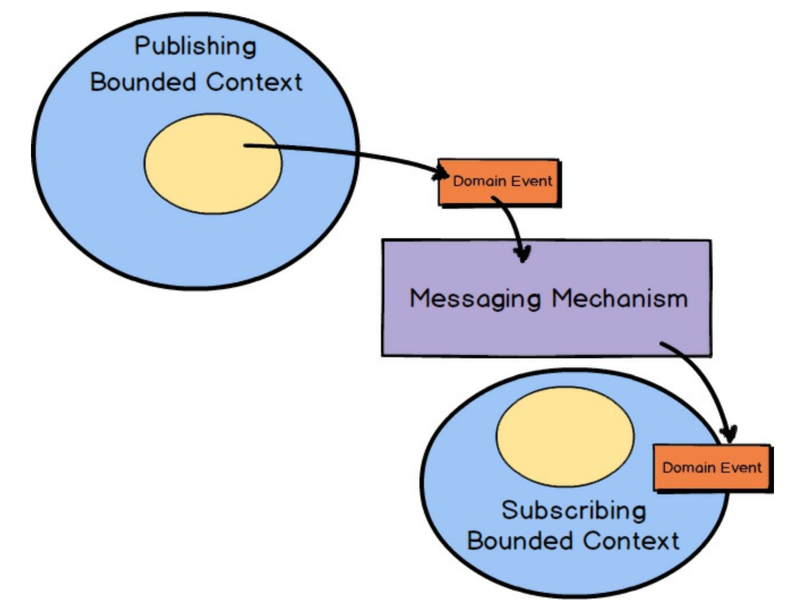

# 第六章 领域事件的战术设计

 

在前面的章节中，你已经看到了一些关于 *领域事件 (Domain Events)* 如何使用的例子。
*领域事件 (Domain Event)* 是 *限界上下文 (Bounded Context)* 中发生的某个具有业务重要性的记录。
到目前为止，你已经知道 *领域事件 (Domain Event)* 是战略设计中一个非常重要的工具。
尽管如此，在战术设计中，*领域事件 (Domain Event)* 经常被概念化，并成为你 *核心域 (Core Domain)* 的一部分。

要充分领略使用 *领域事件 (Domain Event)* 所带来的强大威力，请考虑因果一致性 (causal consistency) 这一概念。
如果业务领域中具有因果关系的操作 ——即一个操作引起另一个操作—— 在分布式系统的每个依赖节点上以相同的顺序被看到，则该领域提供了因果一致性 [Causal](../ref.md#causal) 。
这意味着具有因果关系的操作必须以特定的顺序发生，因此，除非先发生另一件事，否则一件事就无法发生。
也许这意味着，除非确定对另一个 *聚合 (Aggregate)* 执行了特定的操作，否则就不能创建或修改一个 *聚合 (Aggregate)* ：

1. Sue 发布了一条消息说：“我的钱包丢了！”
2. Gary 回复说：“太糟糕了！”
3. Sue 发布了一条消息说：“别担心，我找到我的钱包了！”
4. Gary 回复说：“太好了！”

如果这些消息在分布式节点上被复制，但不是按因果顺序，
那么看起来可能就像是 Gary 回复了 “太好了！” 对 “我的钱包丢了！” 这条消息。
“太好了！” 这条消息与 “我的钱包丢了！” 没有直接的因果关系，这绝对不是 Gary 想让 Sue 或任何人看到的内容。
因此，如果未能以正确的方式实现因果性，整体领域将是错误的，或者至少是误导性的。
通过创建和发布顺序正确的 *领域事件 (Domain Event)* ，可以轻松实现这种因果的、线性化的系统架构。

通过战术设计工作，*领域事件 (Domain Event)* 在你的领域模型中变成了现实，因此可以在你自己的 *限界上下文 (Bounded Context)* 中以及被其他上下文发布和消费。
这是一种非常强大的方式，可以告知感兴趣的监听者已发生的重要事件。
现在你将学习如何建模 *领域事件 (Domain Event)* 并在 *限界上下文 (Bounded Context)* 中使用它们。
