## 领域事件的设计、实现与使用

以下内容将指导你在 *限界上下文 (Bounded Context)* 中完成有效设计和实现 *领域事件 (Domain Events)* 所需的步骤。
随后，你还会看到 *领域事件 (Domain Events)* 如何使用的示例。

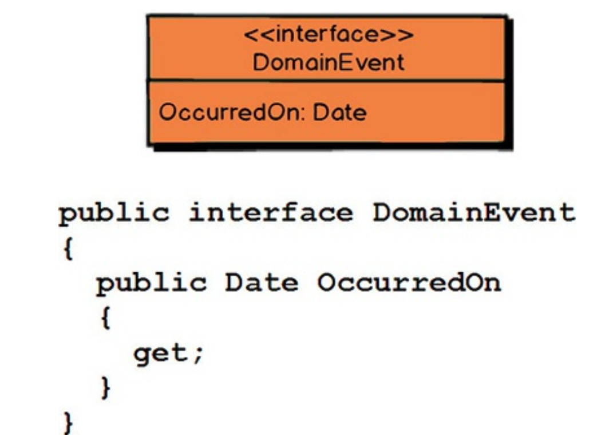
 

这段 C# 代码可被视为每个 *领域事件 (Domain Event)* 都应支持的最小接口。
你通常希望传达 *领域事件 (Domain Event)* 发生的日期和时间，这由 `OccurredOn` 属性提供。
这个细节并非绝对必要，但通常很有用。
因此，你的 *领域事件 (Domain Event)* 类型很可能会实现此接口。

你在命名 *领域事件 (Domain Event)* 类型时必须小心。
你使用的词语应反映模型中的 *通用语言 (Ubiquitous Language)* 。
这些词语将在你模型中的发生的事与外部世界之间架起一座桥梁。
将你的事件传达清楚是至关重要的。

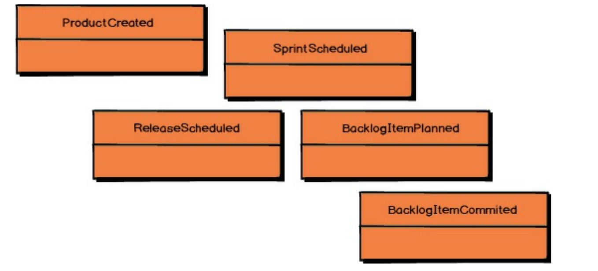
 

<ins>*领域事件 (Domain Event)* 的类型名称应该是对已发生事件的陈述，需要使用过去时态的动词</ins>。
以下是一些来自 *敏捷项目管理上下文 (Agile Project Management Context)* 的示例：

- `ProductCreated`，例如，表示某个 Scrum 产品在过去的某个时间被创建。
- 其他 *领域事件 (Domain Event)* 包括 `ReleaseScheduled`、`SprintScheduled`、`BacklogItemPlanned` 和 `BacklogItemCommitted`。

这些名称每一个都清晰、简洁地说明了在你的 *核心域 (Core Domain)* 中发生了什么。

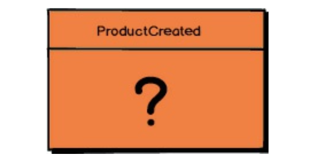
 

正是 *领域事件 (Domain Event)* 的名称与其属性的结合，完整地传达了领域模型中所发生事件的记录。
但是，*领域事件 (Domain Event)* 应该包含哪些属性呢？

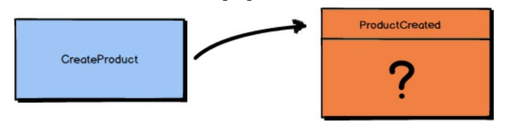
 

问你自己：“导致该 *领域事件 (Domain Event)* 被发布的应用刺激是什么？”
<ins>以 `ProductCreated` 为例，存在一个导致它的命令（命令只是方法/动作请求的对象形式）。
该命令被命名为 `CreateProduct`。
因此，你可以说 `ProductCreated` 是 `CreateProduct` 命令的结果</ins>。

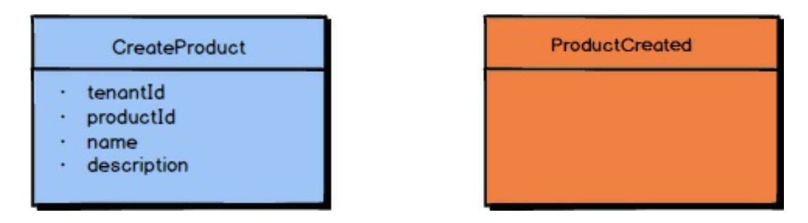
 

`CreateProduct` 命令具有多个属性：(1) `tenantId`，用于标识订阅该命令的租户；(2) `productId`，用于标识正在创建的唯一 Product；(3) `Product` 名称；以及 (4) `Product` 描述。
这些属性中的每一个对于创建 `Product` 都是必不可少的。

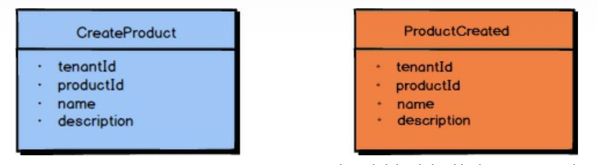
 

<ins>因此，*领域事件 (Domain Event)* `ProductCreated` 应该包含导致其被创建的命令中所提供的所有属性：(1) `tenantId`、(2) `productId`、(3) `name` 以及 (4) `description`</ins>。
这将充分且准确地告知所有订阅者模型中所发生的事情；
也就是说，一个 `Product` 已被创建，它属于由 `tenantId` 标识的租户，该 `Product` 由 `productId` 唯一标识，并且该 `Product` 被赋予了相应的 `name` 和 `description`。

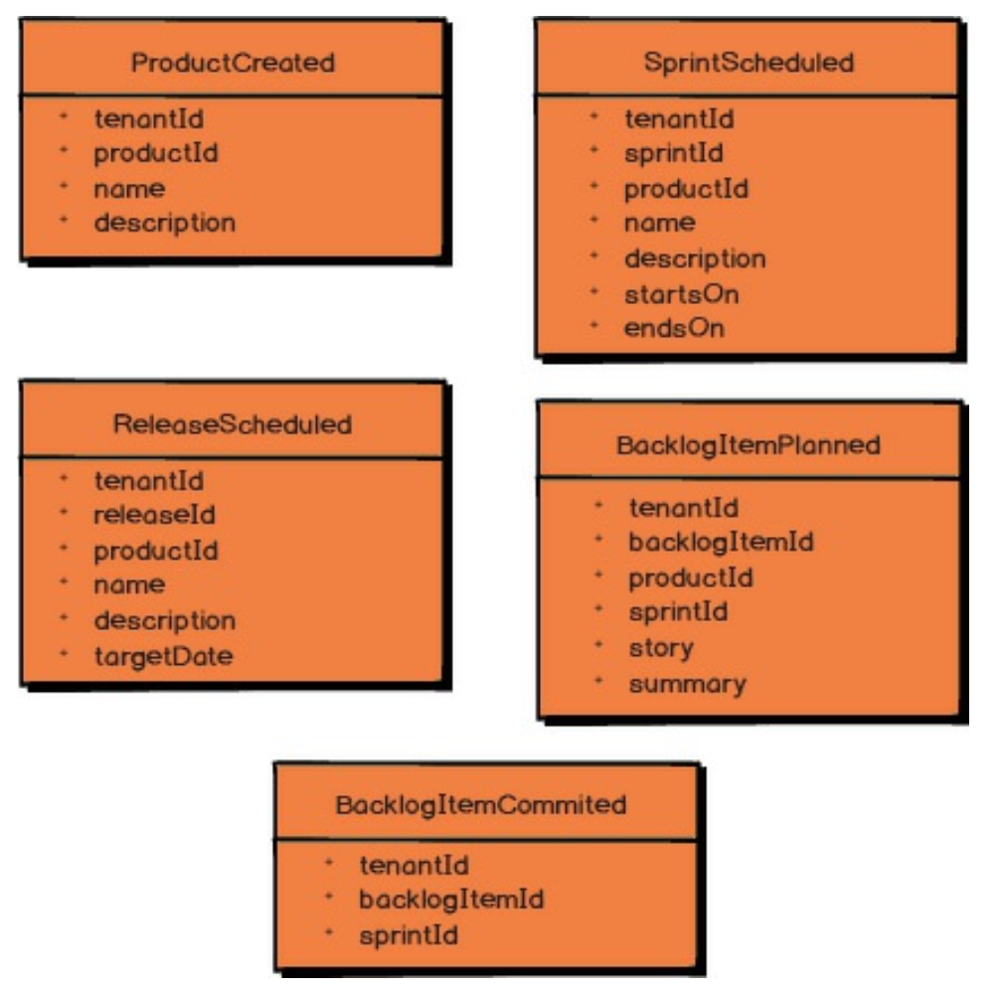
 

以上五个示例让你很好地了解了 *敏捷项目管理上下文 (Agile Project Management Context)* 所发布的各种 *领域事件 (Domain Event)* 应包含哪些属性。
例如，当一个 `BacklogItem` 被提交到一个 `Sprint` 时， *领域事件 (Domain Event)* `BacklogItemCommitted` 被实例化并发布。
该 *领域事件 (Domain Event)* 包含 `tenantId`、被提交的 `BacklogItem` 的 `backlogItemId`，以及它被提交到的 `Sprint` 的 `sprintId`。

如 [第四章](../ch4/0.md) “使用上下文映射进行战略设计” 所述，有时 *领域事件 (Domain Event)* 可以用额外的数据进行丰富（enriched）。
这对于那些不希望回调你的 *限界上下文 (Bounded Context)* 来获取所需额外数据的消费者尤其有帮助。
即便如此，你必须谨慎不要向 *领域事件 (Domain Event)* 中填充过多数据，以至于使其失去意义。
例如，考虑 `BacklogItemCommitted` 持有 `BacklogItem` 的完整状态所带来的问题。
根据这个 *领域事件 (Domain Event)* ，实际发生了什么？
所有额外的数据可能会使其变得不清楚，除非你要求消费者对你的 `BacklogItem` 元素有深入的理解。
另外，考虑使用带有 `BacklogItem` 完整状态的 `BacklogItemUpdated`，而不是提供 `BacklogItemCommitted`。
`BacklogItem` 发生了什么变得非常不清楚，因为消费者必须将最新的 `BacklogItemUpdated` 与之前的 `BacklogItemUpdated` 进行比较，才能理解 `BacklogItem` 实际发生了什么。

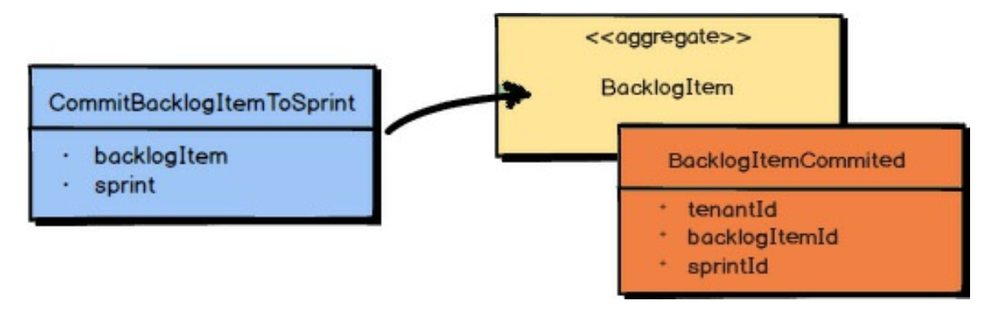
 

为了更清晰地说明如何正确使用 *领域事件 (Domain Event)*，让我们通过一个场景来走一遍。
产品负责人将一个 `BacklogItem` 提交到一个 `Sprint`。
该命令本身会导致 `BacklogItem` 和 `Sprint` 被加载。
然后，该命令在 *聚合 (Aggregate)* `BacklogItem` 上执行。
这会导致 `BacklogItem` 的状态被修改，然后 *领域事件 (Domain Event)* `BacklogItemCommitted` 作为结果被发布。

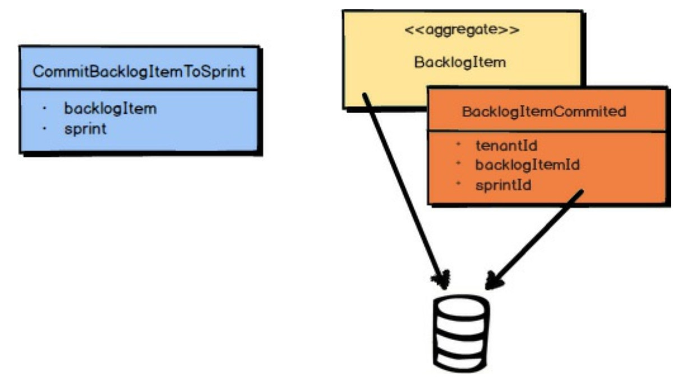
 

<ins>重要的是，修改后的 *聚合 (Aggregate)* 和 *领域事件 (Domain Event)* 必须在同一个事务中一起保存</ins>。
如果你正在使用对象关系映射工具，你会将 *聚合 (Aggregate)* 保存到一个表中，将 *领域事件 (Domain Event)* 保存到一个事件存储表中，然后提交事务。
如果你正在使用 *事件溯源 (Event Sourcing)* ，*聚合 (Aggregate)* 的状态可完全由 *领域事件 (Domain Event)* 本身来表示。
我将在本章的下一节讨论 *事件溯源 (Event Sourcing)* 。
<ins>无论采用哪种方式，将 *领域事件 (Domain Event)* 持久化到事件存储中，都能保持其相对于领域模型中所发生事件的因果顺序</ins>。

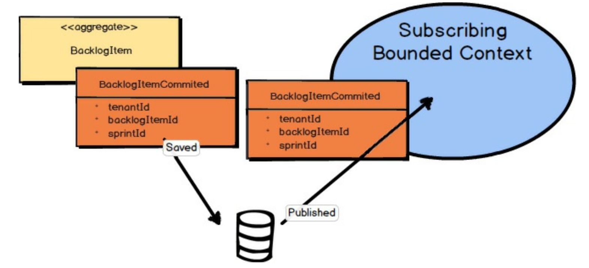
 

一旦你的 *领域事件 (Domain Event)* 被保存到事件存储中，它就可以被发布给任何感兴趣的各方。
这可能是在你自己的 *限界上下文 (Bounded Context)* 内部，也可能是向外部的 *限界上下文 (Bounded Context)* 。
这是你告知外界在你的 *核心域 (Core Domain)* 中已发生某些值得注意的事情的方式。

<ins>请注意，仅仅按因果顺序保存 *领域事件 (Domain Event)* 并不能保证它将以相同的顺序到达其他分布式节点。
因此，消费方的 *限界上下文 (Bounded Context)* 也有责任识别正确的因果性</ins>。
可能是 *领域事件 (Domain Event)* 类型本身能够指示因果性，也可能是与 *领域事件 (Domain Event)* 关联的元数据，例如序列号或因果标识符。
该序列号或因果标识符将指示是什么导致了该 *领域事件 (Domain Event)*，如果原因尚未被看到，则消费者必须等待，直到其原因到达后再应用新到达的事件。
在某些情况下，可以忽略那些已经被后续事件相关操作所取代的、延迟到达的 *领域事件 (Domain Event)*；
在这种情况下，因果性具有可忽略的影响。

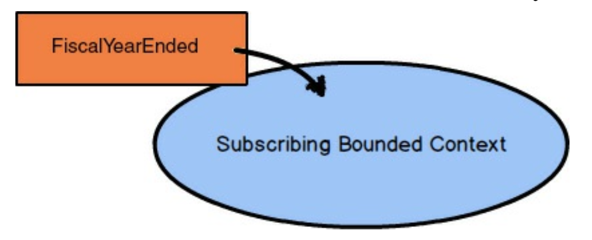
 

关于可能导致 *领域事件 (Domain Event)* 的原因，还有一点值得注意。
<ins>虽然通常是由用户界面发出的、基于用户的命令导致事件发生，但有时 *领域事件 (Domain Event)* 也可能由其他来源引起</ins>。
这可能来自一个定时器到期，例如在工作日结束时，或者一周、一个月、一年的结束时。
<ins>在这种情况下，导致事件的不会是一个命令，因为某个时间段的结束是一个既定事实。
你无法拒绝某个时间段已经结束这一事实，如果业务关心这一事实，那么时间到期被建模为一个 *领域事件 (Domain Event)*，而不是一个命令</ins>。

<ins>更重要的是，这样一个到期的时间段通常会有一个描述性的名称，
该名称将成为 *通用语言 (Ubiquitous Language)*  的一部分</ins>。
例如，“财年结束” 可能是一个你的业务需要对其作出反应的重要事件。
此外，华尔街的下午 4:00 (16:00) 被称为 “市场收盘”，而不仅仅是下午 4:00。
因此，你为那个特定的基于时间的 *领域事件 (Domain Event)* 起了一个名称。

命令与 *领域事件 (Domain Event)* 不同之处在于，在某些情况下，命令可能会因为不合适而被拒绝，
例如由于某些资源（产品、资金等）的供应和可用性，或另一种类型的业务级验证。
<ins>因此，命令可能被拒绝，但 *领域事件 (Domain Event)* 是历史事实，在逻辑上不能被否认</ins>。
即便如此，为了响应基于时间的 *领域事件 (Domain Event)* ，应用程序可能需要生成一个或多个命令，以要求应用程序执行一系列操作。
