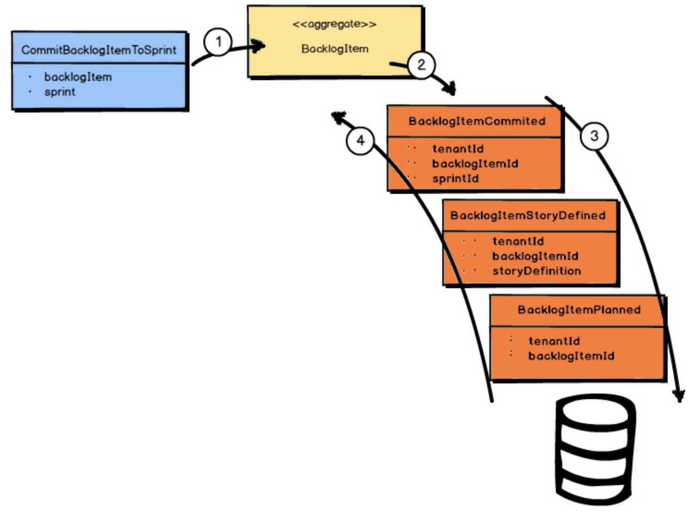
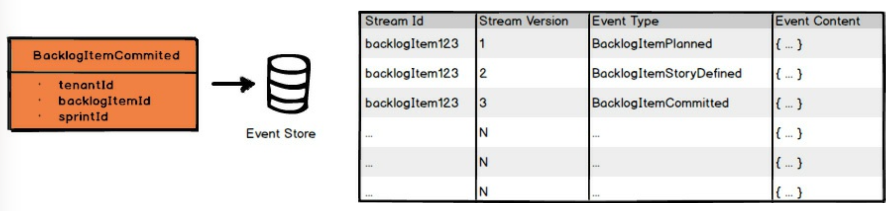

 

## 事件溯源

<ins>*事件溯源 (Event Sourcing)* 可以描述为：将某个 *聚合 (Aggregate)* 实例所发生的所有 *领域事件 (Domain Event)* 持久化，作为该聚合 (Aggregate) 实例变更的记录</ins>。
它不是将 *聚合 (Aggregate)* 状态作为一个整体来持久化，而是存储所有发生在其上的各个 *领域事件 (Domain Event)*。
让我们逐步了解这是如何支持的。

对于单个 *聚合 (Aggregate)* 实例所发生的所有 *领域事件 (Domain Event)*，
按其原始发生的顺序排列，构成了该实例的事件流。
事件流从该 *聚合 (Aggregate)* 实例发生的第一个 *领域事件 (Domain Event)* 开始，一直持续到最后一个 *领域事件 (Domain Event)*。
当给定 *聚合 (Aggregate)* 实例发生新的 *领域事件 (Domain Event)* 时，它们被追加到其事件流的末尾。
重放 (Reapplying) 事件流到 *聚合 (Aggregate)* 上，允许其状态从持久化存储中重新构建到内存中。
换句话说，当使用 *事件溯源 (Event Sourcing)* 时，无论因何种原因从内存中移除的 *聚合 (Aggregate)* ，都可以完全从其事件流中重新构建。

在上图中，发生的第一个 *领域事件 (Domain Event)* 是 `BacklogItemPlanned`；接下来是 `BacklogItemStoryDefined`；
刚刚发生的事件是 `BacklogItemCommitted`。
当前完整的事件流由这三个事件组成，并且它们遵循图中描述和显示的顺序。

对于给定的 *聚合 (Aggregate)* 实例，每个发生的 *领域事件 (Domain Event)* 都是由一个命令引起的，正如之前所述。
在上图中，正是刚刚被处理的 `CommitBacklogItemToSprint` 命令导致了 `BacklogItemCommitted` *领域事件 (Domain Event)* 的发生。

 

事件存储 (event store) 只是一个顺序存储集合或表，所有 *领域事件 (Domain Event)* 都被追加到其中。
由于事件存储 (event store) 是仅追加的，这使得存储机制非常快速，
因此你可以规划一个使用 *事件溯源 (Event Sourcing)* 的 *核心域 (Core Domain)* ，
使其具有非常高的吞吐量、低延迟，并具备高可扩展性。

---
**性能意识**

如果你主要关注的是性能，你会很高兴了解缓存和快照。
首先，你性能最高的 *聚合 (Aggregate)* 将是那些缓存在内存中的 *聚合 (Aggregate)* ，这样每次使用它们时就不需要从存储中重新构建。
使用Actor 模型，将 Actor 作为 *聚合 (Aggregate)* [Reactive](../ref.md#reactive) ，是保持 *聚合 (Aggregate)* 状态缓存的一种较简单的方法。

你还可以使用的另一个工具是快照，其中那些已从内存中淘汰的 *聚合 (Aggregate)* 的加载时间可以被最优地重新构建，而无需从事件流中重新加载每个 *领域事件 (Domain Event)* 。
这意味着在数据库中维护 *聚合 (Aggregate)*（对象、Actor 或记录）的某种增量状态的快照。
关于快照的更详细讨论，请参见《实现领域驱动设计》[IDDD](../ref.md#iddd) 和《使用 Actor 模型的响应式消息传递模式》[Reactive](../ref.md#reactive) 。

---

使用 *事件溯源 (Event Sourcing)* 的最大优势之一是，它保存了你的 *核心域 (Core Domain)* 中曾经发生的每一件事的记录，且是在单个发生级别上。
这对于你的业务可能有很多好处，一些你现在就能想到的，例如合规性和分析，还有一些你直到以后才会意识到的。
它也带来了技术上的优势。
例如，软件开发人员可以使用事件流来检查使用趋势并调试他们的源代码。

你可以在《实现领域驱动设计》[IDDD](../ref.md#iddd) 中找到关于 *事件溯源 (Event Sourcing)* 技术的详细说明。
此外，当你使用 *事件溯源 (Event Sourcing)* 时，你几乎肯定有义务使用 CQRS 。
你也可以在《实现领域驱动设计》[IDDD](../ref.md#iddd) 中找到关于这个主题的讨论。
