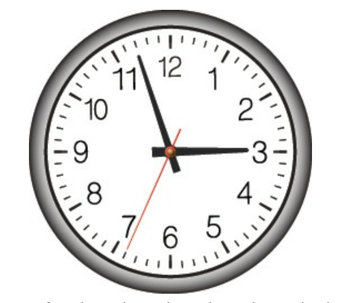

# 第七章 加速与管理工具

 

在使用 DDD 时，我们追求的是深入了解业务如何运作，然后基于我们所学的程度来建模软件。
这实际上是一个学习、实验、挑战、学习更多、再次建模的过程。
我们需要研磨和提炼大量知识，并产生一个能够有效满足组织战略需求的设计。
挑战在于我们必须快速学习。
在快节奏的行业中，我们通常与时间赛跑，
因为时间很重要，而且时间通常驱动着我们的许多决策，甚至可能比它应该驱动的还要多。
如果我们不能按时、在预算内交付，无论我们在软件方面取得了什么成就，我们似乎都失败了。
每个人都期望我们在各方面取得成功。

有些人曾努力说服管理层，认为大多数项目时间估算毫无价值，并且无法被成功使用。
我不确定这些努力在整体上效果如何，
但与我合作的每个客户仍然承受着在非常具体的时间框架内交付的压力，这迫使将时间盒融入设计/实现过程。
充其量，这只是软件开发与管理层之间的一场持续斗争。

不幸的是，对这种负面压力的一种常见反应是试图通过消除设计来节约成本、缩短时间线。
回想第一章，设计是不可避免的，
而且要么你会因为糟糕的设计而表现不佳，要么你会通过交付有效的设计（甚至可能是好的设计）而取得成功。
因此，你应该尝试的是正视时间的要求，并以加速的方式进行设计，使用能够帮助你在所面临的时间限制内交付最佳设计的方法。

为此，我在本章中提供了一些非常有用的设计加速和项目管理工具。
首先，我讨论 *事件风暴 (Event Storming)* ，
然后以一种方式来利用该协作过程产生的工件，从而创建有意义的、并且最好是可实现的估算。
