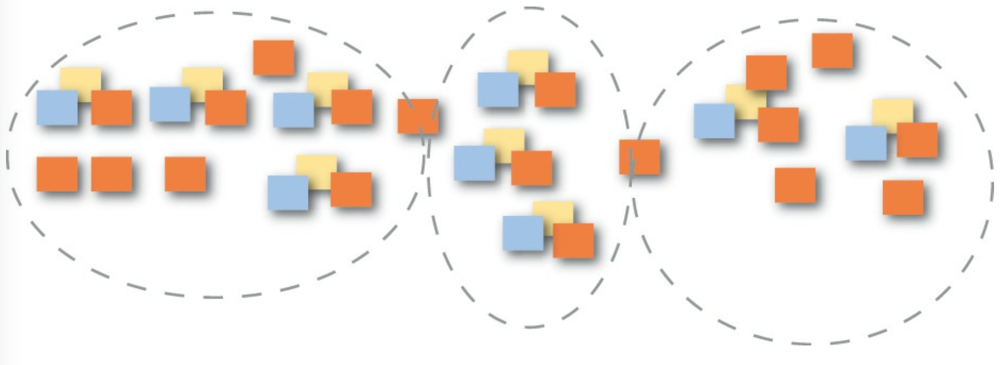
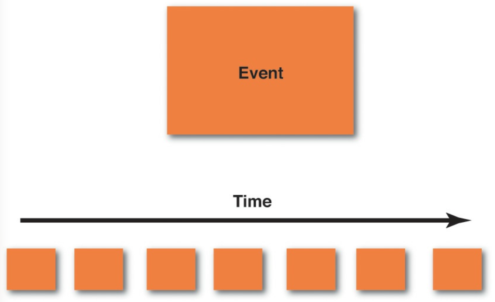
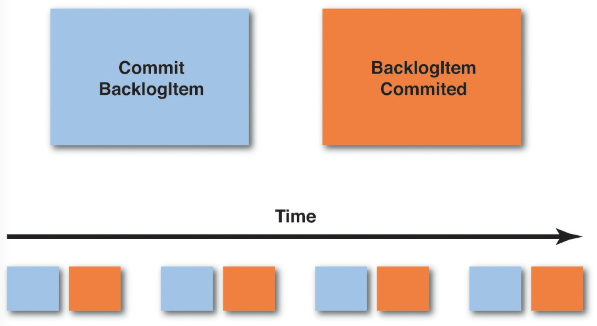
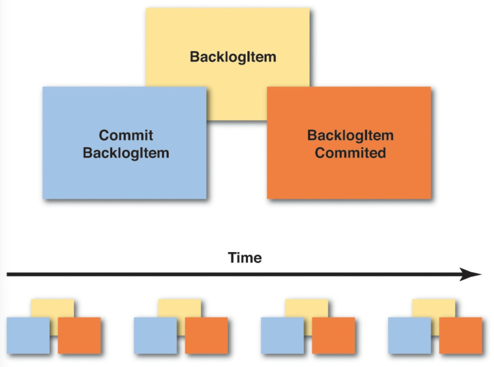
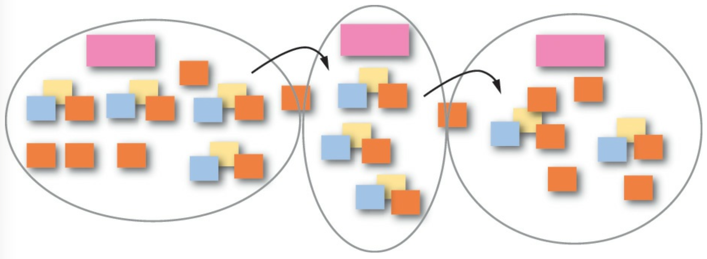
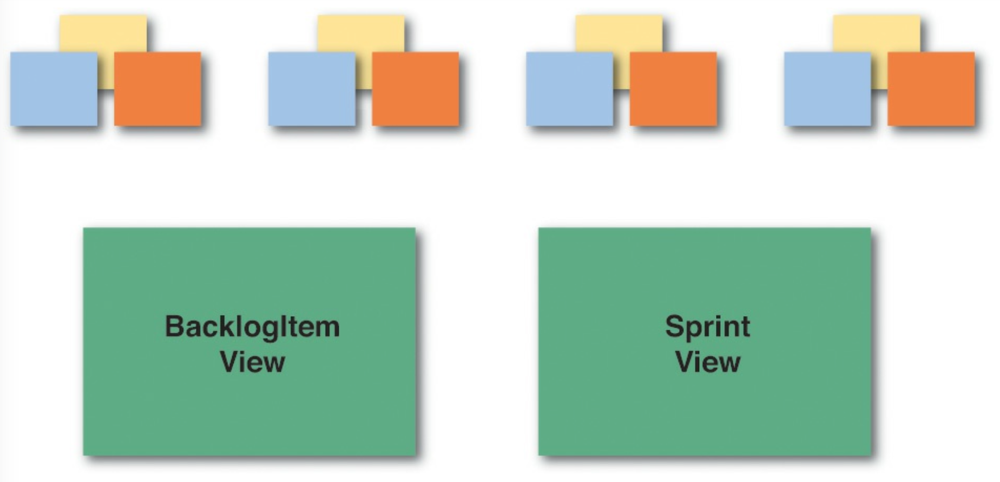

 

## 事件风暴

*事件风暴 (Event Storming)* 是一种快速设计技术，旨在让 *领域专家 (Domain Experts)* 和开发人员都参与到快节奏的学习过程中。
它专注于业务和业务流程，而不是名词和数据。

在学习 *事件风暴 (Event Storming)* 之前，我使用了一种我称之为事件驱动建模的技术。
它通常涉及对话、具体场景以及使用非常轻量级的 UML 进行以事件为中心的建模。
UML 的具体步骤可以单独在白板上完成，也可以捕获到工具中。
然而，正如你可能知道的，很少有业务人员即使对最简化的 UML 使用也具备足够的知识和熟练度。
因此，这剩下大部分的建模工作都由我或另一位了解 UML 基础的开发人员来完成。
这是一种非常有用的方法，但必须有办法让业务专家更直接地参与到过程中。
这可能意味着放弃 UML，转而使用一种更具参与性的工具。

多年前，我首先从 Alberto Brandolini [Ziobrando](../ref.md#ziobrando) 那里了解到 *事件风暴 (Event Storming)* ，他也曾尝试过另一种形式的事件驱动建模。
有一次，由于时间紧迫，Alberto 决定放弃 UML，转而使用便利贴。
这便是一种快速学习和软件设计方法的诞生，它让房间里的每个人都非常直接地参与到过程中。
以下是它的一些优势：

- 这是一种触觉性很强的方法。
每个人都拿到一叠便利贴和一支笔，并负责为学习和设计会议做出贡献。
业务人员和开发人员在共同学习时站在平等的基础上。
每个人都为 *通用语言 (Ubiquitous Language)* 提供输入。

- 它让每个人都关注事件和业务流程，而不是类和数据库。

- 这是一种视觉性很强的方法，它将代码从实验中排除，并使每个人在设计过程中处于平等的地位。

- 它非常快速且执行成本非常低。
你可以在几个小时内（而不是几周）以粗略的形式风暴出一个新的 *核心域 (Core Domain)* 。
如果你在便利贴上写了些东西，后来觉得不行，你可以把那张便利贴揉成一团扔掉。
那个错误只花了你一两分钱，而且没有人会因为已经投入的努力而拒绝改进的机会。

- 你的团队将在理解上取得突破。
这是必然的。
每次都会发生。
有些人可能会带着认为自己已经相当了解特定核心业务模型的想法来参加会议，
但无论如何，他们离开时总是带着更深的理解，甚至对业务流程有了新的见解。

- 每个人都学到了东西。
无论你是 *领域专家 (Domain Expert)* 还是软件开发人员，你都会带着对所讨论模型的清晰、明确的理解离开会议。
这与取得突破不同，并且其本身也很重要。
在许多项目中，至少有一些项目成员（可能有很多）直到为时已晚、代码中已经造成损害时，才理解他们在做什么。
风暴出一个模型有助于每个人消除误解，并以统一的方向和目的向前推进。

- 这意味着你也在尽可能早、尽可能快地识别模型和理解中的问题。
消除误解，并将结果转化为新的见解。房间里的每个人都从中受益。

- 你可以将 *事件风暴 (Event Storming)* 用于全局和设计级别的建模。
进行全局风暴会不那么精确，而设计级别的风暴将引导你走向特定的软件工件。

- 没有必要将风暴会议限制在一次。
你可以从一个两小时的风暴会议开始，然后休息一下。
带着你的成果过一夜，第二天再花一两个小时来扩展和完善。
如果你每天这样做两个小时，持续三四天，你将对你 *核心域 (Core Domain)* 以及与周围 *子域 (Subdomains)* 的集成有深入的理解。

以下是风暴出一个模型所需的人员、心态和用品清单：

- 拥有合适的人员至关重要，这意味着 *领域专家 (Domain Expert)* 和将要处理该模型的开发人员都需要在场。
每个人都会有一些问题，也会有一些答案。
为了相互支持，他们都需要在建模会议期间待在同一个房间里。

- 每个人都应该带着开放的心态，不受严格评判的束缚。
我在 *事件风暴 (Event Storming)* 会议期间看到的最大错误是，人们试图过早地过于正确。
你应该完全决心创建许多的事件。
更多的事件比更少的事件要好，因为那才是让你学到最多的方式。
之后有时间进行细化，而且细化既快速又廉价。

- 准备好各种颜色的便利贴，并且数量要充足。
至少你需要这些颜色：橙色、紫色/红色、浅蓝色、淡黄色、淡紫色和粉红色。
你可能会发现其他颜色（例如绿色；参见后面的例子）也很有用。
便利贴的尺寸可以是正方形（3 英寸 ×3 英寸，或 7.62 厘米 × 7.62 厘米），而不是较宽的长方形。
你不需要在便利贴上写太多内容；通常只需几个字即可。
考虑使用超粘性的那种。
你不希望你的便利贴掉在地板上。

- 为每个人提供一支黑色记号笔，这将使手写体显得粗体且清晰。
细尖记号笔最好。

- 找一面宽阔的墙，可以在上面建模。
宽度比高度更重要，但你的建模表面应该大约一米/码高。
宽度实际上应该是无限的，但至少应考虑 10 米/码的范围。如果没有这样的墙，你总是可以使用一张长会议桌或地板。
桌子的问题在于它最终会限制你的建模空间。
地板的问题在于可能团队中不是每个人都能使用它。
墙壁是最好的。

- 准备一大卷纸，这种纸通常可以在美术用品店、教学用品店，甚至宜家商店找到。
纸张的尺寸应如前所述，宽度至少 10 米/码，高度 1 米/码。
用强力胶带将纸张挂在墙上。
有些人可能会决定放弃纸张，直接在白板上工作。
这可能在一段时间内有效，但便利贴在白板上的粘性会随着时间的推移而减弱，尤其是如果它们被撕下来并重新粘贴到不同位置时。
便利贴贴在纸上时粘性会更持久。
如果你打算在三四天内进行短时间的建模，而不是进行一次长时间的会议，那么粘性的持久性就很重要。

有了基本的用品，并且有合适的人参加会议，你就可以开始了。
逐一考虑每个步骤。

 

1. <ins>通过在一系列便利贴上创建 *领域事件 (Domain Event)* 来风暴出业务流程。
  最常用于 *领域事件 (Domain Event)* 的颜色是橙色</ins>。
使用橙色可以使 *领域事件 (Domain Event)* 在建模表面上最为突出。

在创建你的 *领域事件 (Domain Event)* 时，应遵循以下一些基本准则：

- 首先创建 *领域事件 (Domain Event)* 应该强调，我们的首要和主要关注点是业务流程，而不是数据及其结构。
你的团队可能需要 10 到 15 分钟来适应这一点，但请按照我在此概述的步骤进行。
不要试图跳步。

- 将每个 *领域事件 (Domain Event)* 的名称写在便利贴上。
如你在前一章所学到的，名称应为过去时态的动词。
例如，一个事件可以命名为 `ProductCreated`，另一个可以命名为 `BacklogItemCommitted`。
（你当然可以将这些名称在便利贴上分成多行。）
如果你正在进行全局风暴，并且认为这些名称对参与者来说过于精确，可以使用其他名称。

- <ins>将便利贴按时间顺序放置在建模表面上，即按照每个事件在领域中发生的顺序从左到右排列</ins>。
你从建模表面最左边的第一个 *领域事件 (Domain Event)* 开始，然后逐渐向右移动。
有时你可能对时间顺序没有很好的理解，在这种情况下，你应该将相应的 *领域事件 (Domain Event)* 放在模型中的某个位置。
稍后找出 “何时” 的部分，这可能会变得很明显。

- 根据你的业务流程，与另一个 *领域事件 (Domain Event)* 并行发生的 *领域事件 (Domain Event)* 可以放置在同一时间发生的 *领域事件 (Domain Event)* 的下方。
<ins>因此，你使用垂直空间来表示并行处理</ins>。

- 在你进行这部分风暴会议时，你会发现在你现有的或新的业务流程中存在问题点。
用紫色/红色的便利贴清楚地标记这些点，并写上一些文字来解释为什么这是一个问题。
你需要在这些点上花时间以了解更多。

- <ins>有时，*领域事件 (Domain Event)* 的结果是需要运行的 *流程 (Process)* 。
这可能是一个步骤或多个复杂的步骤。
每个导致 *流程 (Process)* 被执行的 *领域事件 (Domain Event)* 都应该被捕获，并在淡紫色的便利贴上命名</ins>。
从 *领域事件 (Domain Event)* 画一条带箭头的线到已命名的 *流程 (Process)*（淡紫色便利贴）。
只有在对你的 *核心域 (Core Domain)* 很重要的情况下，才对细粒度的 *领域事件 (Domain Event)* 进行建模。
很可能用户注册流程是必要的，但可能不被认为是应用程序的核心功能。
将注册流程建模为一个粗粒度的事件 `UserRegistered`，然后继续前进。
将你的集中精力放在更重要的事件上。

如果你认为你已经穷尽了所有可能重要的 *领域事件 (Domain Event)*，可能是时候休息一下，稍后再回到建模会议了。
一天后回到建模表面，无疑会让你发现缺失的概念，并完善或抛弃你之前认为重要的、肤浅的概念。
即便如此，在某个时候，你将识别出大多数最重要的 *领域事件 (Domain Event)* 。
到那时，你应该继续下一步。

 

2. <ins>创建导致每个 *领域事件 (Domain Event)* 的 *命令 (Command)* </ins>。
有时，*领域事件 (Domain Event)* 将是另一个系统中发生的事件的结局，并因此流入你的系统。
尽管如此，通常 *命令 (Command)* 将是某个用户操作的结果，并且该 *命令 (Command)* 在执行时会导致一个 *领域事件 (Domain Event)*。
*命令 (Command)* 应以祈使语气陈述，例如 `CreateProduct` 和 `CommitBacklogItem`。
以下是一些基本准则：

- <ins>在浅蓝色便利贴上，写下导致每个相应 *领域事件 (Domain Event)* 的命令 (Command) 的名称</ins>。
例如，如果你有一个名为 `BacklogItemCommitted` 的 *领域事件 (Domain Event)*，则导致该事件的相应 *命令 (Command)* 名为 `CommitBacklogItem`。

- <ins>将 *命令 (Command)* 的浅蓝色便利贴放在它所导致的 *领域事件 (Domain Event)* 的左侧</ins>。
它们成对关联：命令/事件，命令/事件，命令/事件，依此类推。
请记住，某些 *领域事件 (Domain Event)* 会因为达到时间限制而发生，因此可能没有明确导致它们的相应 *命令 (Command)* 。

- <ins>如果有一个特定的用户角色执行某个操作，并且指定它很重要，你可以在浅蓝色 *命令 (Command)* 的左下角放置一张小的、亮黄色的便利贴，上面画一个火柴人和角色的名称</ins>。
在上图中，“Product Owner” 将是执行该 *命令 (Command)* 的角色。

- <ins>有时，*命令 (Command)* 会导致一个 *流程 (Process)* 运行。
这可能是一个步骤或多个复杂步骤。
每个导致 *流程 (Process)* 被执行的 *命令 (Command)* 都应该被捕获，并在淡紫色的便利贴上命名</ins>。
从 *命令 (Command)* 画一条带箭头的线到已命名的 *流程 (Process)*（淡紫色便利贴）。
该 *流程 (Process)* 实际上会导致一个或多个 *命令 (Command)* 及随后的 *领域事件 (Domain Event)*，
如果你现在知道这些是什么，就为它们创建便利贴，并显示它们从 *流程 (Process)* 中发出。

- 继续按照时间顺序从左到右移动，就像你最初创建每个 *领域事件 (Domain Event)* 时那样。

- 创建 *命令 (Command)* 可能会让你想到你之前未曾设想的 *领域事件 (Domain Event)* （如上面发现淡紫色 *流程 (Process)* 时，或其他事件）。
继续处理这个发现，将新发现的 *领域事件 (Domain Event)* 及其对应的 *命令 (Command)* 放置在建模表面上。

- 你也可能会发现某个 *命令 (Command)* 会导致多个 *领域事件 (Domain Event)* 。
这没问题；将该 *命令 (Command)* 建模并放置在它所导致的多个 *领域事件 (Domain Event)* 的左侧。

一旦你拥有了与它们所导致的 *领域事件 (Domain Event)* 相关联的所有 *命令 (Command)* ，你就可以继续下一步了。

 

3. <ins>关联执行 *命令 (Command)* 并产生 *领域事件 (Domain Event)* 结果的 *实体/聚合 (Entity/Aggregate)*。
这是 *命令 (Command)* 被执行和 *领域事件 (Domain Event)* 被发出的数据持有者</ins>。
*实体 (Entity)* 关系图在当今的 IT 世界中通常是第一步也是最受欢迎的一步，但从这里开始是一个巨大的错误。
业务人员不太理解它们，并且它们会很快终止对话。
事实上，这一步在 *事件风暴 (Event Storming)* 中被降级到了第三位，因为我们更关注业务流程而不是数据。
即便如此，我们确实需要在某个时刻考虑数据，而现在就是那个时刻。
在这个阶段，业务专家很可能会理解数据开始发挥作用。
以下是建模 *聚合 (Aggregate)* 的一些指南：

- 如果业务人员不喜欢 *聚合 (Aggregate)* 这个词，或者如果这个词以任何方式让他们感到困惑，你应该使用另一个名称。
通常他们可以理解 *实体 (Entity)* ，或者你可以直接称它为 *数据 (Data)* 。
重要的是，便利贴能够让团队清楚地沟通它所代表的概念。
<ins>对所有 *聚合 (Aggregate)* 使用淡黄色便利贴，并在每张便利贴上写下一个 *聚合 (Aggregate)* 的名称* </ins>。
这是一个名词，例如 `Product` 或 `BacklogItem`。
你将为模型中的每个 *聚合 (Aggregate)* 执行此操作。

- <ins>将 *聚合 (Aggregate)* 便利贴放在 *命令 (Command)* 和 *领域事件 (Domain Event)* 对的后面并略微靠上</ins>。
换句话说，你应该能够阅读 *聚合 (Aggregate)* 便利贴上写的名词，但 *命令 (Command)* 和 *领域事件 (Domain Event)* 对应该贴在 *聚合 (Aggregate)* 便利贴的下部，以表明它们是关联的。
如果你真的想在便利贴之间留一点空间，那也可以，但只需清楚哪些 *命令 (Command)* 和 *领域事件 (Domain Event)* 属于哪个 *聚合 (Aggregate)* 。

- 当你沿着业务流程时间线移动时，你可能会发现 *聚合 (Aggregate)* 被重复使用。
<ins>不要为了将所有 *命令/事件* 对移动到一个 *聚合 (Aggregate)* 便利贴下方而重新排列你的时间线</ins>。
相反，在多个便利贴上创建相同的 *聚合 (Aggregate)* 名词，并将它们重复放置在时间线上相应 *命令/事件* 对发生的位置。
要点是建模业务流程；业务流程是随时间发生的。

- 当你考虑与各种操作相关的数据时，你可能会发现新的 *领域事件 (Domain Event)* 。
不要忽略它们。
相反，将新发现的 *领域事件 (Domain Event)* 连同相应的 *命令 (Command)* 和 *聚合 (Aggregate)* 一起放置在建模表面上。
你也可能会发现某些 *聚合 (Aggregate)* 过于复杂，需要将它们分解为一个受管理的 *流程 (Process)*（淡紫色便利贴）。
不要忽略这些机会。

一旦你完成了这部分设计阶段，你正在接近一些你可以选择执行的额外步骤。
还要理解，如果你正在使用前一章描述的 *事件溯源 (Event Sourcing)*，
你已经在理解你的 *核心域 (Core Domain)* 实现方面取得了长足的进步，
因为 *事件风暴 (Event Storming)* 和 *事件溯源 (Event Sourcing)* 之间有大量的重叠。
当然，你的风暴越接近全局，它就越有可能远离实际的实现。
尽管如此，你可以使用同样的技术来达到设计级别的视图。
根据我的经验，团队倾向于在同一会议中在全局和设计级别之间来回切换。
最终，学习某些细节的需求将驱使你超越全局，达到一个设计级别的模型，在那里这是至关重要的。

 

4. <ins>在你的建模表面上绘制边界和带箭头的线条以显示流向</ins>。
你很可能已经发现，在你的 *事件风暴 (Event Storming)* 会议中，存在多个模型在起作用，以及 *领域事件 (Domain Event)* 在模型之间流动。
以下是处理这种情况的方法：

- 总而言之，在以下情况下你很可能会发现边界：
部门划分、不同的业务人员对同一术语有冲突的定义，或者当一个概念很重要但实际上不是 *核心域 (Core Domain)* 的一部分时。

- <ins>你可以使用黑色记号笔在纸制建模表面上绘制。
显示上下文和其他边界。
对 *限界上下文 (Bounded Context)* 使用实线，对 *子域 (Subdomain)* 使用虚线</ins>。
显然，在纸上绘制边界是永久性的，因此在深入之前，请确保你理解了这个级别的细节。
<ins>如果你想从使用不太永久的边界模型开始，可以使用粉红色便利贴来标记一般区域</ins>，并暂缓使用永久性记号笔绘制边界，直到你的信心证明这样做是合理的。

- <ins>将粉红色便利贴放置在各种边界内部，并在这些便利贴上写上适用于该边界内部的名称。
这将为你 *限界上下文 (Bounded Context)* 命名</ins>。

- 绘制带箭头的线条，以显示 *领域事件 (Domain Event)* 在 *限界上下文 (Bounded Context)* 之间的流动方向。
这是一种简单的方式来表达一些 *领域事件 (Domain Event)* 是如何在没有被你的 *限界上下文 (Bounded Context)* 中的 *命令 (Command)* 引起的情况下到达你的系统的。

关于这些步骤的任何其他细节应该直观地显而易见。
只需使用边界和线条来沟通即可。

 

5. <ins>识别你的用户执行其操作所需的各种视图，以及各种用户的重要角色</ins>。

- 你不一定需要展示用户界面将提供的每个视图，甚至完全不需要展示任何视图。
如果你决定展示任何视图，它们应该是那些重要的、并且在创建时需要特别关注的视图。
这些视图工件可以用建模表面上的绿色便利贴来表示。
如果有帮助，可以快速绘制最重要的用户界面视图的模拟图（或线框图）。

- 你也可以使用亮黄色便利贴来表示各种重要的用户角色。
同样，只有当你需要传达关于用户与系统交互的某些重要信息，或者系统为特定用户角色做了某些事情时，才展示这些。

很可能第 4 步和第 5 步就是你需要在 *事件风暴 (Event Storming)* 练习中纳入的所有额外内容。

### 其他工具

当然，这并不妨碍你进行实验，例如在你的建模表面上放置其他图形，并在你的 *事件风暴 (Event Storming)* 会议中尝试其他建模步骤。
请记住，这是关于学习和沟通设计的。
使用任何你需要的工具，作为一个紧密合作的团队进行建模。
只是要小心拒绝仪式感，因为那会花费很多。
以下是一些其他想法：

- 引入遵循 Given/When/Then 方法的高层可执行规范。
这些也被称为 *验收测试 (acceptance tests)* 。
你可以在 Gojko Adzic 的《Specification by Example》[Specification](../ref.md#specification) 一书中阅读更多相关信息，
我在 [第 2 章](../ch2/0.md) “使用限界上下文和通用语言进行战略设计” 中提供了一个示例。
只是要小心不要在这些方面做得过火，以至于它们变得包罗万象并凌驾于实际的领域模型之上。
我估计，与常见的基于单元测试的方法（也在 [第 2 章](../ch2/0.md) 中展示）相比，使用和维护可执行规范需要多花费大约 15% 到 25% 的时间和精力，并且当模型随时间变化时，很容易陷入保持规范与当前业务方向关联的困境中。

- 尝试 *影响地图 (Impact Mapping)* [Impact Mapping](../ref.md#impact-mapping) ，以确保你正在设计的软件是一个 *核心域 (Core Domain)* ，而不是某个不太重要的模型。
这也是 Gojko Adzic 定义的一种技术。

- 研究 Jeff Patton 的 *用户故事地图 (User Story Mapping)* [User Story Mapping](../ref.md#user-story-mapping) 。
它用于将你的注意力集中在 *核心域 (Core Domain)* 上，并理解你应该投资哪些软件功能。

以上三个附加工具与 DDD 理念有大量重叠，并且非常适合引入到任何 DDD 项目中。
它们都旨在用于全力加速的项目，仪式感低，且使用成本非常低廉。

