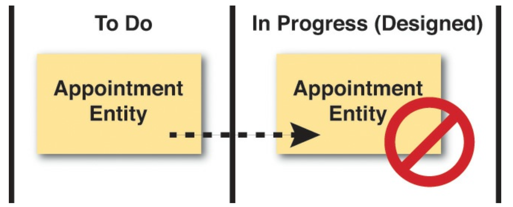
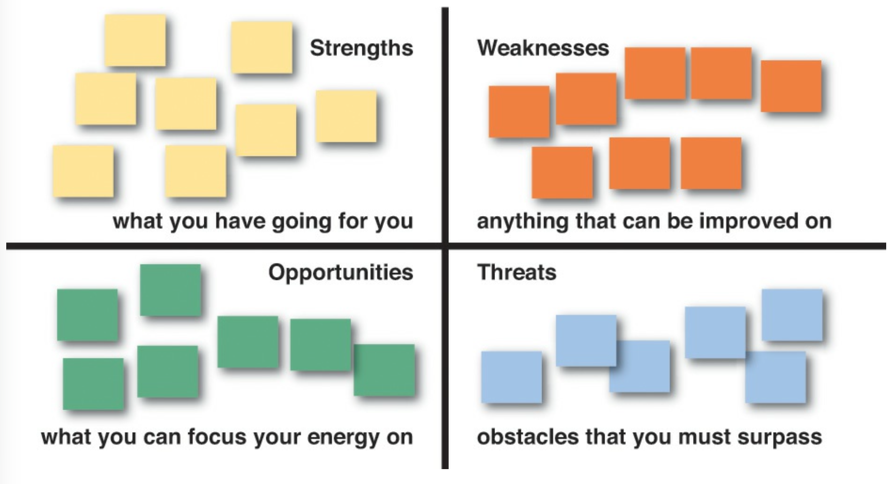
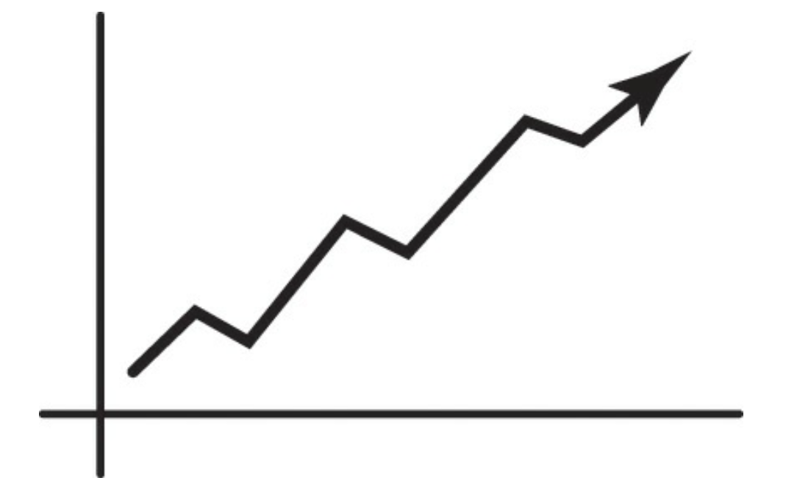
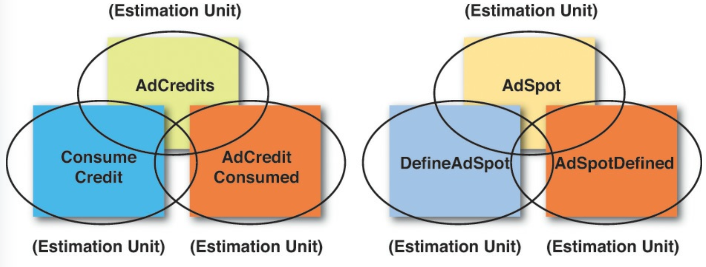

## 在敏捷项目中管理 DDD

我之前提到过，有一种被称为 *无估算 (No Estimates)* 的运动。
这种方法拒绝典型的估算方法，例如故事点或任务小时。
它侧重于交付价值，而不是控制成本，并且不估算任何可能只需要几个月就能完成的任务。
我并不是否定这种方法。
然而，在撰写本文时，与我合作的客户仍然被要求提供估算并对任务进行时间限制，比如实现细粒度功能所需的编程工作量。
如果 *无估算 (No Estimates)* 对你和你的项目情况有效，那就使用它。

我也知道，DDD 社区中的一些人基本上已经定义了他们自己的流程或流程执行框架，用于在项目中使用 DDD 并执行它。
当被给定团队接受时，这可能运作良好且有效，但要获得那些已经在敏捷执行框架（例如 Scrum）上进行了投资的组织认可则可能更加困难。

 

我观察到，最近 Scrum 受到了相当大的批评。
虽然我不在这场批评中站队，但我会公开声明 Scrum 经常被误用，甚至大多数时候都被误用了。
我已经提到过团队倾向于使用我称之为 “任务板洗牌 (task-board shuffle)” 的方式进行 “设计”。
这不是 Scrum 在软件项目上应有的使用方式。
并且，再次重申，*知识获取 (knowledge acquisition)* 既是 Scrum 的信条，也是 DDD 的主要目标，
但在 Scrum 中很大程度上被忽视了，取而代之的是无情的交付。
即便如此，Scrum 在我们行业中仍然被大量使用，我怀疑它短期内不会被取代。

因此，我在这里要做的是向你展示如何让 DDD 在基于 Scrum 的项目中工作。
我展示的技术应该同样适用于其他敏捷项目方法，例如使用 Kanban 时。
这里没有任何专属于 Scrum 的内容，尽管一些指南是以 Scrum 术语表述的。
而且由于你们中的许多人已经通过以某种形式实践 Scrum 而对它很熟悉，我在这里的大部分指南将涉及领域模型以及使用 DDD 进行学习、实验和设计。
关于使用 Scrum、Kanban 或其他敏捷方法的一般性指导，你需要到别处寻找。

在我使用术语 *任务 (task)* 或 *任务板 (task board)* 的地方，这应该与一般的敏捷甚至 Kanban 兼容。
在我使用术语 *冲刺 (sprint)* 的地方，我也会尝试包含单词 *迭代 (iteration)* 以指代一般的敏捷，以及 *WIP（在制品）* 作为对 Kanban 的引用。
这可能不总是一个完美的匹配，因为我并不试图在这里定义一个实际的过程。
我希望你能简单地从中受益，并找到一种方法在你的特定敏捷执行框架中适当地应用它们。

### 首要之事

在项目中成功应用 DDD 的最重要手段之一是招聘优秀的人才。
优秀的人才 ——以及在这方面能力出众的开发人员—— 是无可替代的。
DDD 是一种先进的软件开发理念和技术，它需要能力出众、甚至非常优秀的开发人员来付诸实践。
永远不要低估招聘具有合适技能和内在驱动力的合适人员的重要性。

 

### 使用 SWOT 分析

如果你不熟悉 SWOT 分析 [SWOT](../ref.md#swot) ，它代表优势 (Strengths)、劣势 (Weaknesses)、机会 (Opportunities) 和威胁 (Threats)。
SWOT 分析是一种让你以非常具体的方式思考项目，并尽早获得最多知识的方法。
以下是你在项目中需要识别的要点背后的基本思想：

- *优势*：使业务或项目相对于其他项目具有优势的特征。
- *劣势*：使业务或项目相对于其他项目处于不利地位的特征。
- *机会*：项目可以利用以获得优势的要素。
- *威胁*：环境中可能给业务或项目带来麻烦的要素。

在任何 Scrum 或其他敏捷项目中，你随时都可以自由地使用 SWOT 分析来确定你项目的当前状况：

1. 绘制一个包含四个象限的大矩阵。
2. 再次使用便利贴，为四个 SWOT 象限各选择一种不同的颜色。
3. 现在，识别你项目的优势、你项目的劣势、你项目的机会以及你项目的威胁。
4. 将这些写在便利贴上，并将它们放置在矩阵中相应的象限内。
5. 利用这些项目的 SWOT 特征（我们这里特别考虑领域模型）来规划你将如何应对它们。
你接下来采取的促进优势领域和缓解问题领域的步骤，可能对你的成功至关重要。

正如稍后讨论的，在进行项目规划时，你将有机会将这些行动放置在任务板上。

 

### 建模尖峰与建模债务

了解到在 DDD 项目中你可能会有建模尖峰 (Modeling Spike) 和需要偿还的建模债务 (Modeling Debt)，你是否感到惊讶？

在项目启动时你能做的最好的事情之一就是使用 *事件风暴 (Event Storming)* 。
这以及相关的建模实验将构成一次 *建模尖峰 (Modeling Spike)* 。
你将不得不 “购买” 关于你 Scrum 产品的知识，有时付出的代价就是一次尖峰 (Spike)，而项目启动期间的尖峰 (Spike) 几乎是肯定的。
不过，我已经向你展示了使用 *事件风暴 (Event Storming)* 如何能大大减少必要投资的成本。

当然，你不能期望从一开始就完美地对你的领域进行建模，即使你认为项目启动阶段是一次有价值的建模尖峰 (Modeling Spike)。
即使在使用 *事件风暴 (Event Storming)* 时，你也不会是完美的。
一方面，业务以及我们对它的理解会随着时间而变化，你的领域模型也会如此。

此外，如果你打算将建模工作作为任务板上的任务进行时间限制，那么预计在每个冲刺 (sprint)（或迭代，或 WIP）期间都会产生一些建模债务 (Modeling Debt)。
当你被时间限制时，你根本不可能有足够的时间将每一项期望的建模任务都执行到完美。
一方面，你会开始一个设计，并在实验后意识到你所拥有的设计并不像你预期的那样适合业务需求。
然而你所面临的时间限制将要求你继续前进。

你现在能做的最糟糕的事情就是完全忘记你在建模工作中所学的、而这些建模工作需要一个不同的、改进的设计。
相反，记录这些工作需要放到以后的冲刺 (sprint)（或迭代，WIP）中。
这可以在你的回顾会议 [1](#1) 中提出，并在你下一次的冲刺计划会议（或迭代计划会议，或添加到 Kanban 队列中）中转为一项新任务。

 

### 识别任务和估算工作量

*事件风暴 (Event Storming)* 是一种可以在任何时候使用的工具，而不仅仅是在项目启动期间。
当你在 *事件风暴 (Event Storming)* 会议中工作时，你会自然地创建许多工件。
你在纸质模型中风暴出的每个 *领域事件 (Domain Event)*、*命令 (Command)* 和 *聚合 (Aggregate)* 都可以用作估算单元。
如何做到呢？

|组件类型|简单（工时）|中等（工时）|复杂（工时）|
|---|---|---|---|
|领域事件|	0.1|	0.2|	0.3|
|命令|	0.1|0.2|0.3|
|聚合根 / 聚合|	1|2|4|
|…|…|…|…|

最简单和最准确的估算方法之一是使用基于度量的方法。
如你在这里看到的，为你需要实现的每种组件类型创建一个带有估算单元的简单表格。
这将消除估算中的猜测，并为创建工作量的估算过程提供科学性。
以下是表格的工作原理：

1. 为 *组件类型 (Component Type)* 创建一列，以描述定义了估算单元的特定组件种类。

2. 创建另外三列，分别对应 *简单 (Easy)* 、 *中等 (Moderate)* 和 *复杂 (Complex)* 。
这些列将反映估算单元，该单元以整数或分数小时为单位，对应于特定的单元类型。

3. 现在为你的架构中的每种组件类型创建一行。
如图所示有 *领域事件 (Domain Event)*、*命令 (Command)* 和 *聚合 (Aggregate)* 类型。
但是，不要仅限于这些。
为各种用户界面组件、服务、持久化、*领域事件 (Domain Event)* 序列化器和反序列化器等创建一行。
请随意为你将在源代码中创建的每一种工件都创建一行。
（例如，如果你通常将 *领域事件 (Domain Event)* 序列化器和反序列化器与每个 *领域事件 (Domain Event)* 一起作为一个复合步骤来创建，则在每一列中为 *领域事件 (Domain Event)* 分配一个反映所有这些组件一起创建的估算值。）

4. 现在填入每个复杂度级别所需的小时数（整数或分数）：简单、中等和复杂。
这些估算不仅包括实现所需的时间，还可能包括进一步的设计和测试工作。
使这些估算准确，并且要现实。

5. 当你知道了你将处理的待办项任务（WIP）时，找到每项任务对应的指标并明确地标识它。
你可以使用电子表格来完成这项工作。

6. 将当前冲刺 (sprint)（或迭代，WIP）中所有组件的所有估算单元相加，这将得到你的总估算。

当你在执行每个冲刺 (sprint)（或迭代，WIP）时，调整你的度量指标，以反映实际所需的小时数（整数或分数）。

如果你正在使用 Scrum，并且已经厌倦了小时估算，请理解这种方法更加宽容，也更加准确。
随着你了解你的节奏，你将微调你的估算度量，使其更加准确和现实。
可能需要几个冲刺才能使其正确。
同时也要意识到，随着时间和经验的推移，你可能会将数字调低，或者更倾向于使用 *简单 (Easy)* 或 *中等 (Moderate)* 列。

如果你正在使用 Kanban，并且认为估算完全不可靠且没有必要，
那么问自己一个问题：为了正确地限制我们的工作队列，我首先如何知道如何确定一个准确的 WIP？
无论你怎么想，你仍然在估算所涉及的工作量，并希望它是正确的。
为什么不给这个过程添加一点科学性，并使用这种简单而准确的估算方法呢？

---
**关于准确性的说明**

这种方法是有效的。
在一个大型企业项目中，组织要求对整体项目中的一个大型复杂项目进行估算。
有两支团队被分配到这个任务。
首先是一支高成本的顾问团队，他们与财富 500 强公司合作进行项目估算和管理。
他们是会计师，拥有博士学位，并配备了所有既能震慑他人又能给他们带来明显优势的东西。
第二支架构师和开发人员团队则被授权使用这种基于度量的估算过程。
该项目预算在 2000 万美元左右，最终当两份估算都出来时，它们彼此之间相差大约 20 万美元（技术团队的估算略低）。
对技术人员来说还不错。

你应该能够在长期估算中达到 20% 以内的准确度，而在短期估算中（例如冲刺、迭代和 WIP 队列）则要好得多。

---

---
#### 1
在 Kanban 中，你实际上可以每天进行回顾，所以不要等太久才提出改进模型的需求。
