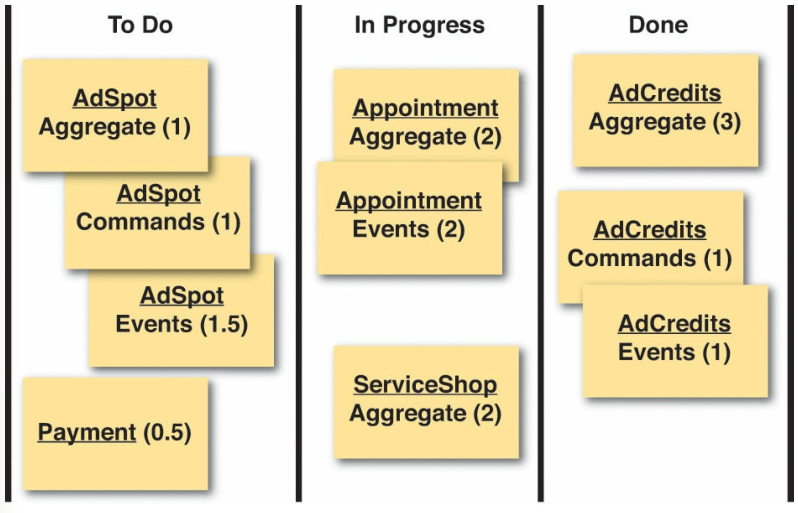
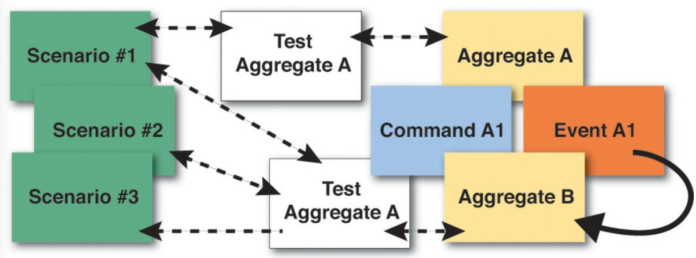
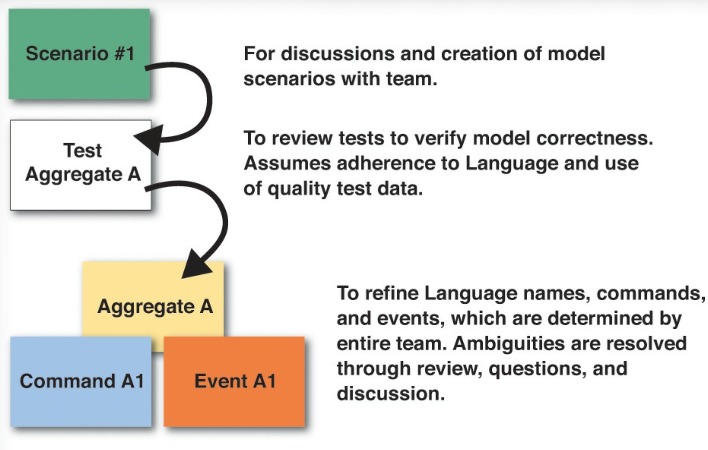

 

## 限制时间建模

既然你已经有了每种组件类型的估算，你就可以直接基于这些组件来规划你的任务。
你可以选择将每个组件作为一个单独的任务，并带有相应的小时数，也可以选择将任务进一步细分。
然而，我建议小心不要将任务分解得过于细粒度，以免使任务板过于复杂。
如前所示，甚至最好将单个 *聚合 (Aggregate)* 所使用的所有 *命令 (Command)* 和所有 *领域事件 (Domain Event)* 合并到一个任务中。

 

### 如何实施

即使有 *事件风暴 (Event Storming)* 所识别的工件，你也不一定拥有处理特定领域场景、故事和用例所需的所有知识。
如果需要更多，请务必在你的估算中为进一步的知识获取留出时间。
但为什么事情预留时间呢？
回想一下，在 [第二章](../ch2/0.md) 中，我向你介绍了围绕你的领域模型创建具体场景的方法。
除了从 *事件风暴 (Event Storming)* 中获得的之外，这可能是了解你的 *核心域 (Core Domain)* 的最佳方法之一。
<ins>具体场景和 *事件风暴 (Event Storming)* 是两个应该结合使用的工具。
以下是它的工作原理</ins>：

- <ins>进行一次快速的 *事件风暴 (Event Storming)* 会议，也许只需一个小时左右。
你几乎肯定会发现，你需要围绕你的一些快速建模发现来开发更具体的场景</ins>。

- <ins>与 *领域专家 (Domain Expert)* 合作，讨论一个或多个需要细化的具体场景</ins>。
这可以确定软件模型将如何被使用。
同样，这些不仅仅是过程，而且应该以识别实际领域模型元素（例如对象）、
这些元素如何协作以及它们如何与用户交互为目标来陈述。
（根据需要参考 [第二章](../ch2/0.md) 。）

- <ins>创建一组验收测试（或可执行规范）来执行每个场景</ins>。
（根据需要参考 [第二章](../ch2/0.md) 。）

- <ins>创建组件以允许测试/规范执行</ins>。
在细化测试/规范和组件时进行（简短且快速的）迭代，直到它们达到你的 *领域专家 (Domain Expert)* 所期望的效果。

- <ins>很可能一些（简短且快速的）迭代会让你考虑其他场景，创建额外的测试/规范，并细化现有组件和创建新组件</ins>。

继续这样做，直到你获得了满足有限业务目标所需的所有知识，或者直到你的限制时间到期。
如果你还没有达到期望的目标，请确保产生 *建模债务 (Modeling Debt)* ，以便在（理想情况下不久的）将来解决这个问题。

然而，你需要 *领域专家 (Domain Expert)* 多长时间？

 

### 与领域专家互动

应用 DDD 的主要挑战之一是如何获得与 *领域专家 (Domain Expert)* 共处的时间，同时又不至于过度占用。
很多时候，项目中的 *领域专家 (Domain Expert)* 会有大量的其他职责、数小时的会议，甚至可能需要出差。
由于这些潜在的缺席，可能很难找到足够的时间与他们在一起。
因此，我们最好确保我们使用的时间是有效的，并将其限制在必要的范围内。
除非你让建模会议变得有趣且高效，否则你很可能会在错误的时机失去他们的帮助。
如果他们发现这有价值、有启发且有益，你很可能会建立起你所需要的牢固合作关系。

<ins>所以首先要回答的问题是：“我们什么时候需要与 *领域专家 (Domain Expert)* 共处？
他们需要帮助我们执行哪些任务？”</ins>

- <ins>始终将 *领域专家 (Domain Expert)* 纳入 *事件风暴 (Event Storming)* 活动中</ins>。
开发人员总是会有很多问题，而 *领域专家 (Domain Expert)* 会有答案。
确保他们一起参与 *事件风暴 (Event Storming)* 会议。

- <ins>你将需要 *领域专家 (Domain Expert)* 参与讨论和创建模型场景</ins>。
参见 [第二章](../ch2/0.md) 的示例。

- <ins>需要 *领域专家 (Domain Expert)* 来审查测试以验证模型的正确性</ins>。
这假设开发人员已经尽职尽责地遵循了 *通用语言 (Ubiquitous Language)* 并使用了高质量、真实的测试数据。

- <ins>你将需要 *领域专家 (Domain Expert)* 来完善 *通用语言 (Ubiquitous Language)* 及其 *聚合 (Aggregate)* 名称、*命令 (Command)* 和 *领域事件 (Domain Event)*，这些由整个团队决定</ins>。
歧义通过审查、提问和讨论来解决。
即便如此，*事件风暴 (Event Storming)* 会议应该已经解决了关于 *通用语言 (Ubiquitous Language)* 的大部分问题。

<ins>那么，既然你已经知道你需要从 *领域专家 (Domain Expert)* 那里得到什么，你对于每一项职责需要他们多少时间呢</ins>？

- <ins>*事件风暴 (Event Storming)* 会议应限制在每次几个小时（两到三个）。
你可能需要在连续几天举行会议，例如三四天</ins>。

- <ins>为场景讨论和完善分配充足的时间，但尽量最大化每个场景的时间。
你应该能够在大概 10 到 20 分钟内讨论并迭代一个场景</ins>。

- <ins>对于测试，你需要一些与 *领域专家 (Domain Expert)* 共处的时间来审查你编写的内容</ins>。
但不要期望他们在你编写代码时坐在那里。
也许他们会，那是一个额外的收获，但不要期望如此。
准确的模型需要更少的审查和验证时间。
不要低估 *领域专家 (Domain Expert)* 在你的帮助下通读测试的能力。
他们可以做到，特别是如果测试数据是真实的。
<ins>你的测试应该允许 *领域专家 (Domain Expert)* 在一到两分钟左右理解并验证大约一个测试</ins>。

- 在测试审查期间， *领域专家 (Domain Expert)* 可以就 *聚合 (Aggregate)*、*命令 (Command)* 和 *领域事件 (Domain Event)* 以及可能的其他工件如何遵循 *通用语言 (Ubiquitous Language)* 提供意见。
这可以在很短的时间内完成。

这些指导应该能帮助你将与 *领域专家 (Domain Expert)* 共处的时间控制在恰到好处的程度，并限制你需要花费在他们身上的时间。
