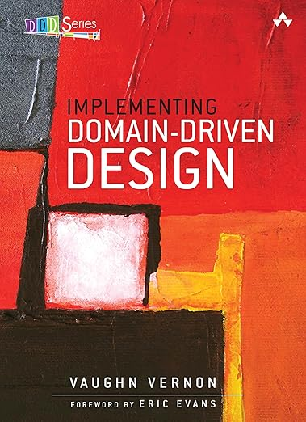

## 实现领域驱动设计（非盈利，非官方） 
---
 

Vaughn Vernon

### 目录

- [序言](foreword.md)
- [前言](preface.md)
- [致谢](ack.md)
- [关于作者](author.md)
- [本书指南](guide.md)
- [第 1 章：DDD 入门指南](ch1/0.md)
  * [我能实践 DDD 吗？](ch1/1.md)
  * [为何要采用 DDD](ch1/2.md)
  * [如何实践 DDD](ch1/3.md)
- [第 2 章：领域、子领域与有界上下文 (Bounded Contexts)](ch2/0.md)
- [第 3 章：上下文地图 (Context Maps)](ch3/0.md)
- [第 4 章：架构](ch4/0.md)
- [第 5 章：实体 (Entities)](ch5/0.md)
- [第 6 章：值对象 (Value Objects)](ch6/0.md)
- [第 7 章：服务 (Services)](ch7/0.md)
- [第 8 章：领域事件 (Domain Events)](ch8/0.md)
- [第 9 章：模块 (Modules)](ch9/0.md)
- [第 10 章：聚合体 (Aggregates)](ch10/0.md)
- [第 11 章：工厂模式 (Factories)](ch11/0.md)
- [第 12 章：存储库 (Repositories)](ch12/0.md)
- [第 13 章：整合有界上下文](ch13/0.md)
- [第 14 章：应用](ch14/0.md)
- [附录 A：聚合体与事件源：A+ES](appendix.md)
- [参考文献](bibli.md)
