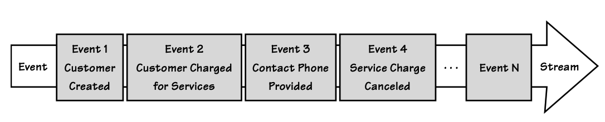

## 附录 A：`Aggregate`与`Event Sourcing`：A+ES

作者：Rinat Abdullin

#### ▶[上一节](../ch14/6.md)

`Event Sourcing`这一概念已沿用数十年，但直到近年，Greg Young 将其应用于 DDD 后，才得以广泛推广 [[Young, ES](./bibli.md#young-es)] 。

`Event Sourcing`可将一个 [Aggregate (10)](../ch10/0.md) 的全部状态，表示为自其创建以来所发生的一系列 [Events (8)](../ch8/0.md) 。
通过按照事件发生的顺序重放，即可重建`Aggregate`的状态。
该方法的核心前提是：它能简化持久化操作，并可对具备复杂行为特征的领域概念进行精准捕获。

表示每个`Aggregate`状态的事件集合，会被记录在只追加模式的事件流 (Event Stream) 中。
后续操作会不断向事件流末尾追加新的事件，从而进一步改变`Aggregate`的状态，如 [图 A.1](#figure-a1) 所示。
（在本附录中，事件以浅灰色矩形显示，以便与其他概念区分。）

每个`Aggregate`的事件流通常会被持久化到 [Event Stores (8)](../ch8/0.md) 中，一般通过根 [Entity (5)](../ch5/0.md) 的唯一标识来区分不同事件流。
本附录后续会更详细地介绍如何专门为`Event Sourcing`构建`Event Store`。

从现在开始，我们将这种使用`Event Sourcing`来维护`Aggregates`状态并进行持久化的方式简称为 A+ES 。

#### Figure A.1

*按发生顺序排列`Domain Events`的事件流*

A+ES 的主要优势包括：

- `Event Sourcing`可以确保：`Aggregate`实例每次变更的原因都不会丢失。
若采用传统方式，将`Aggregate`的当前状态序列化存入数据库，旧状态会被不断覆盖且无法恢复。
而从`Aggregate`实例创建起，保留其整个生命周期内所有变更的原因，对业务而言极具价值。
正如 [Architecture (4)](../ch4/0.md) 中所讨论的，其益处影响深远：高可靠性、短期与长期商业智能、分析挖掘、完整审计日志，以及可回溯历史以用于调试。

- 事件流的只追加特性具备极佳的性能表现，并支持多种数据复制方案。
采用类似的设计思路，已帮助 LMAX 等公司实现了极低延迟的证券交易系统。

- 以事件为中心的`Aggregate`设计方式，可让开发者更多聚焦于 [Ubiquitous
Language (1)](../ch1/0.md) 所表达的业务行为，规避对象关系映射可能带来的阻抗不匹配问题，从而构建出更健壮、更易于应对变更的系统。

话虽如此，但请务必明确：A+ES 并非银弹。我们需要正视它的一些现实缺点：

- 为 A+ES 定义事件，需要对业务领域有深入理解。
与任何 DDD 项目一样，这种投入通常只适用于复杂模型，这类模型能为组织带来竞争优势。

- 在撰写本文时，该领域缺乏成熟的工具与统一的知识体系。
这会增加成本，也会提升将该方案引入经验不足团队的风险。

- 具备相关经验的开发人员数量有限。

- 实现 A+ES 几乎必然需要某种形式的命令查询职责分离 (Command-Query Responsibility Segregation)，即 [CQRS (4)](../ch4/0.md) ，因为事件流很难进行查询。
这会增加开发人员的认知负担与学习成本。

对于不畏惧这些挑战的团队而言，采用 A+ES 实现可以带来诸多收益。
接下来我们探讨在面向对象领域中，使用这种强大方案进行实现的几种方式。

#### ▶[下一节](1.md)
