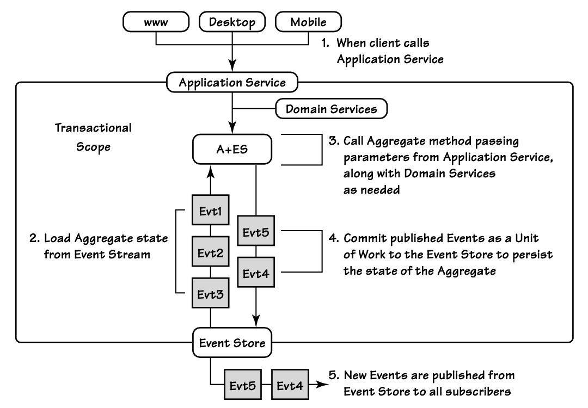
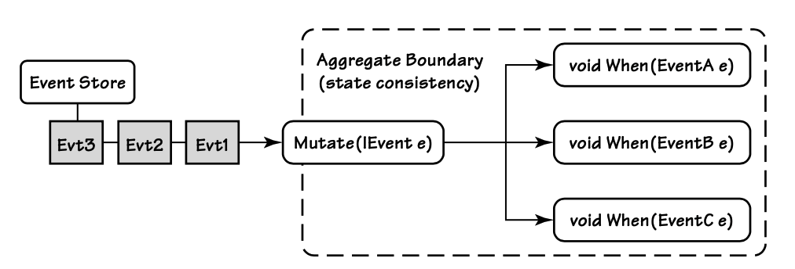
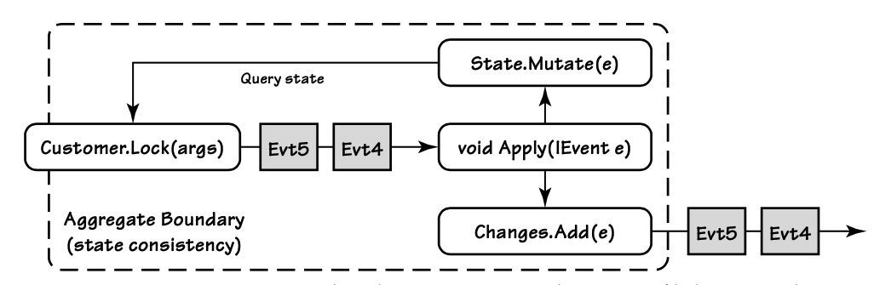
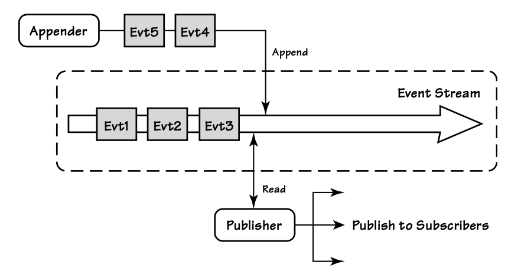
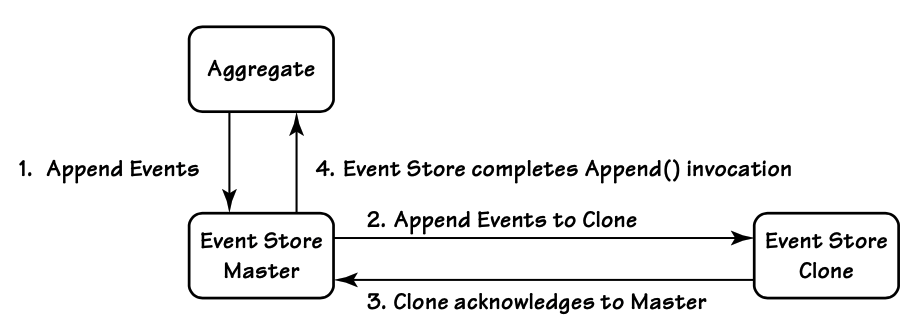
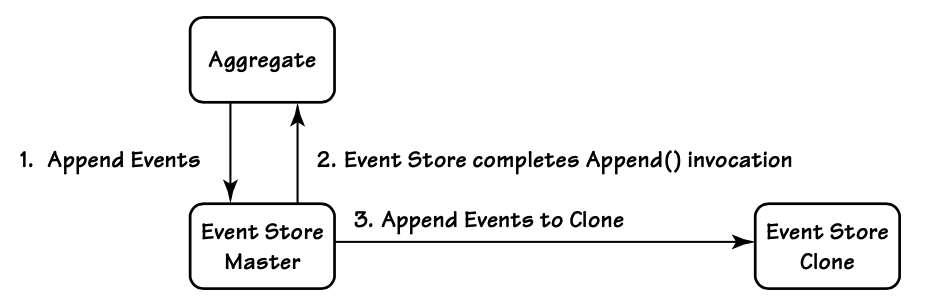

## 应用服务内部

#### ▶[上一节](0.md)

在 [Application Service (4)](../ch4/0.md) [Application Service (14)](../ch14/0.md) 内部审视 A+ES，可以清晰地展现整体设计思路。
`Aggregates`通常位于`Application Services`之后的领域模型中，而`Application Services`则作为领域模型的直接客户端。

当`Application Service`务接收到执行控制权时，它会加载一个`Aggregate`，并获取该`Aggregate`业务操作所需的所有支撑性 [Domain Services (7)](../ch7/0.md) 。
当`Application Service`将操作委托给`Aggregate`的业务方法时，该方法会产生一系列事件作为执行结果。
这些事件会改变`Aggregate`的状态，同时也会以通知形式发布给所有订阅者。
`Aggregate`的业务方法可能需要将一个或多个`Domain Service`作为参数传入。
对这类`Domain Services`的调用，可用于计算会对`Aggregate`状态产生副作用的数值。
此类`Domain Services`操作可能包括：调用支付网关、申请唯一标识，或从远程系统查询数据。
[图 A.2](#figure-a2) 展示了这一工作流程。

#### Figure A.2

*`Application Service`控制对`Aggregate`的访问与使用。*

下面这段用 C# 实现的`Application Service`，展示了如何支持 [图 A.2](#figure-a2) 中的步骤：

```java
public class CustomerApplicationService
{
    // event store for accessing event streams
    IEventStore _eventStore;

    // domain service that is needed by aggregate
    IPricingService _pricingService;

    // pass dependencies for this application service via constructor
    public CustomerApplicationService(
      IEventStore eventStore,
      IPricingService pricing)
    {
        _eventStore = eventStore;
        _pricingService = pricing;
    }

    // Step 1: LockForAccountOverdraft method of
    // Customer Application Service is called
    public void LockForAccountOverdraft(
        CustomerId customerId, string comment)
    {
        // Step 2.1: Load event stream for Customer, given its id
        var stream = _eventStore.LoadEventStream(customerId);
        // Step 2.2: Build aggregate from event stream
        var customer = new Customer(stream.Events);
        // Step 3: Call aggregate method, passing it arguments and
        // pricing domain service
        customer.LockForAccountOverdraft(comment, _pricingService);
        // Step 4: Commit changes to the event stream by id
        _eventStore.AppendToStream(
          customerId, stream.Version, customer.Changes);
    }

    public void LockCustomer(CustomerId customerId, string reason)
    {
        var stream = _eventStore.LoadEventStream(customerId);
        var customer = new Customer(stream.Events);
        customer.Lock(reason);
        _eventStore.AppendToStream(
          customerId, stream.Version, customer.Changes);
    }

    // other methods on this application service
}
```

CustomerApplicationService 通过构造函数初始化两个依赖项：IEventStore 与 IPricingService 。
基于构造函数的初始化是实现依赖注入的一种可靠方式，但这些依赖也可以通过`Service Factory`或依赖注入框架来获取。
具体取决于团队的标准与实践。

---
➜**在哪里可以找到示例代码？**

所有 A+ES 示例的源代码均可在此处下载：
http://lokad.github.com/lokad-iddd-sample/

---

我们的 IEventStore 可以定义为简单接口，EventStream 的定义方式也与此类似：

```java
public interface IEventStore
{
    EventStream LoadEventStream(IIdentity id);
    EventStream LoadEventStream(
    IIdentity id, int skipEvents, int maxCount);
    void AppendToStream(
        IIdentity id, int expectedVersion, ICollection<IEvent> events);
}

public class EventStream
{
    // version of the event stream returned
    public int Version;

    // all events in the stream
    public List<IEvent> Events;
}
```

这个`Event Store`可以很轻松地用关系型数据库（Microsoft SQL、Oracle 或 MySQL）实现，也可以使用具备强一致性保证的 NoSQL 存储（文件系统、MongoDB、RavenDB 或 Azure Blob 存储）。

我们通过待重建的`Aggregate`实例的唯一标识，从`Event Store`中加载事件。
下面以名为 Customer 的`Aggregate`为例，看看具体如何实现。
虽然唯一标识可以是任意类型，但为了表达清晰，我们使用由 CustomerId 实现的 IIdentity 接口。

我们需要加载属于特定 Customer 的事件，并将这些事件传入 Customer 的构造函数，以实例化该`Aggregate`：

```java
var eventStream = _eventStore.LoadEventStream(customerId);

var customer = new Customer(eventStream.Events);
```

如 [图 A.3](#figure-a3) 所示，`Aggregate`通过 Mutate() 方法重放事件来应用这些事件。
其工作原理如下：

```java
public partial class Customer {

    public Customer(IEnumerable<IEvent> events) {
        // reinstate this aggregate to the latest version
        foreach (var @event in events)
        {
            Mutate(@event);
        }
    }

    public bool ConsumptionLocked { get; private set; }

    public void Mutate(IEvent e) {
        // .NET magic to call one of 'When' handlers with
        // matching signature
        ((dynamic) this).When((dynamic)e);
    }

    public void When(CustomerLocked e) {
        ConsumptionLocked = true;
    }

    public void When(CustomerUnlocked e) {
        ConsumptionLocked = false;
    }

    // etc.
}
```


#### Figure A.3

*`Aggregate`状态通过按发生顺序应用事件来重建。*

Mutate() 仅通过 .NET 动态特性，根据具体事件参数类型找到对应的重载 When() 方法，然后传入事件并执行该方法。
Mutate() 执行完毕后，Customer 实例便拥有了完整重建后的状态。

我们可以编写一个可复用的查询操作，用于从`Event Store`中重建`Aggregate`实例：

```java
public Customer LoadCustomerById(CustomerId id)
{
    var eventStream = _eventStore.LoadEventStream(id);
    var customer = new Customer(eventStream.Events);
    return customer;
}
```

在了解了如何通过历史事件流重建`Aggregate`实例之后，我们很容易想到这条历史记录的其他用途。
我们可以用它来回溯历史，查看发生过什么以及何时发生。
当需要对生产环境进行调试时，这种查看能力会变得尤为强大。

业务操作是如何执行的？
一旦`Aggregate`从`Event Store`中重建完成，`Application Service`就会委托调用该`Aggregate`实例上的命令操作。
`Aggregate`会使用自身当前状态以及契约中所需的`Domain Service`来执行该操作。
在行为执行过程中，状态的变更会以新事件的形式表达出来。
每个新事件都会被传入`Aggregate`的 Apply() 方法，如 [图 A.4](#figure-a4) 所示。

#### Figure A.4

*`Aggregate`状态基于过往事件，行为的执行结果会产生新的事件。*

如以下代码所示，新事件会被归集到 Changes 集合中，随后用于变更`Aggregate`的当前状态。

```java
public partial class Customer
{
    ...
    void Apply(IEvent event)
    {
        // append event to change list for further persistence
        Changes.Add(event);

        // pass each event to modify current in-memory state
        Mutate(event);
    }
    ...
}
```

所有添加到 Changes 集合中的事件都将作为新追加的内容被持久化。
由于每个事件也会被用于立即改变`Aggregate`的状态，因此如果某个业务行为包含多个步骤，后续每个步骤都能基于最新的状态进行操作。

接下来，我们来看一下 Customer `Aggregate`中的部分业务行为：

```java
public partial class Customer
{
    // Second part of aggregate class
    public List<IEvent> Changes = new List<IEvent>();

    public void LockForAccountOverdraft(
        string comment, IPricingService pricing)
    {
        if (!ManualBilling)
        {
            var balance = pricing.GetOverdraftThreshold(Currency);
            if (Balance < balance)
            {
                LockCustomer("Overdraft. " + comment);
            }
        }
    }

    public void LockCustomer(string reason)
    {
        if (!ConsumptionLocked)
        {
            Apply(new CustomerLocked(_state.Id, reason));
        }
    }

    // Other business methods are not shown ...
    void Apply(IEvent e)
    {
        Changes.Add(e);
        Mutate(e);
    }
}
```

---
➜**考虑使用两个实现类**

为让代码更清晰，你可以将 A+ES 的实现拆分为两个独立的类：一个用于状态，一个用于行为，状态对象由行为对象持有。
两者仅通过 Apply() 方法进行协作。
这能确保状态只能通过事件来修改。

---

一旦会改变状态的业务行为执行完毕，我们必须将 Changes 集合提交到`Event Store`。
我们追加所有新的变更，并确保与其他写入线程之间不存在并发冲突。
这项检查之所以可行，是因为我们会将一个并发版本变量从 Load() 方法传递到 Append() 方法。

在最简单的实现中，会有一个后台处理器追赶新追加的事件，并将它们发布到消息中间件（如 RabbitMQ、JMS、MSMQ 或云队列），再分发给所有相关方。参见 [图 A.5](#figure-a5) 。

这种简单实现可以替换为更复杂的方案。
其中一种方案是将事件立即或最终同步到一个或多个副本，以提升容错能力。
[图 A.6](#figure-a6) 展示了将事件立即复制到一个副本的方式。

#### Figure A.5

*新追加的`Aggregate`行为结果事件会被发布给订阅者。*

#### Figure A.6

*直写模式：主`Event Store`会将所有新追加的事件立即复制到副本`Event Store`。*

在这种场景下，主`Event Store`只有在将新事件成功复制到副本`Event Store`后，才会认为自身的事件已保存，这就是直写（write-through）策略。

另一种方案是：主`Event Store`先保存变更，再通过独立线程异步将事件复制到副本，这称为后写（write-behind）策略。
该方式如 [图 A.7](#figure-a7) 所示。
这种情况下，副本`Event Store`与主`Event Store`可能出现数据不一致，在服务器宕机或网络延迟导致分区问题时尤其明显。

为总结目前所讨论的内容，我们来梳理一下从调用`Application Service`上的某个操作开始的执行流程：

1. 客户端调用`Application Service`上的某个方法。

2. 获取执行业务操作所需的任意`Domain Service`。

3. 使用客户端提供的`Aggregate`实例标识，获取其事件流。

#### Figure A.7

*后写模式：主`Event Store`最终会将所有新追加的事件复制到副本`Event Store`。*

4. 向`Aggregate`实例应用事件流中的所有事件，以此重建该`Aggregate`实例。

5. 执行`Aggregate`提供的业务操作，并传入该接口契约要求的所有参数。

6. `Aggregate`可能会对所提供的任意`Domain Service`、其他`Aggregates`实例等进行双重分派（double-dispatch），且会以该操作的执行结果生成新事件。

7. 若业务操作执行无异常，则利用事件流版本号防范并发冲突，将所有新生成的事件追加至事件流中。

8. 通过你选定的消息中间件，将`Event Store`中新追加的事件发布给所有订阅者。

我们可以通过多种方式优化 A+ES 的实现方案。
例如，我们可以引入 [Repository (12)](../ch12/0.md) 来封装对`Event Store`的访问逻辑，以及`Aggregate`实例的重建细节。
基于前文给出的代码片段，你可以轻松编写一个可复用的`Repository`基类。
接下来我们重点介绍两种实用的可选优化方案，它们能大幅改善 A+ES 的设计：`Command Handlers`与`lambda`。

#### ▶[下一节](2.md)
