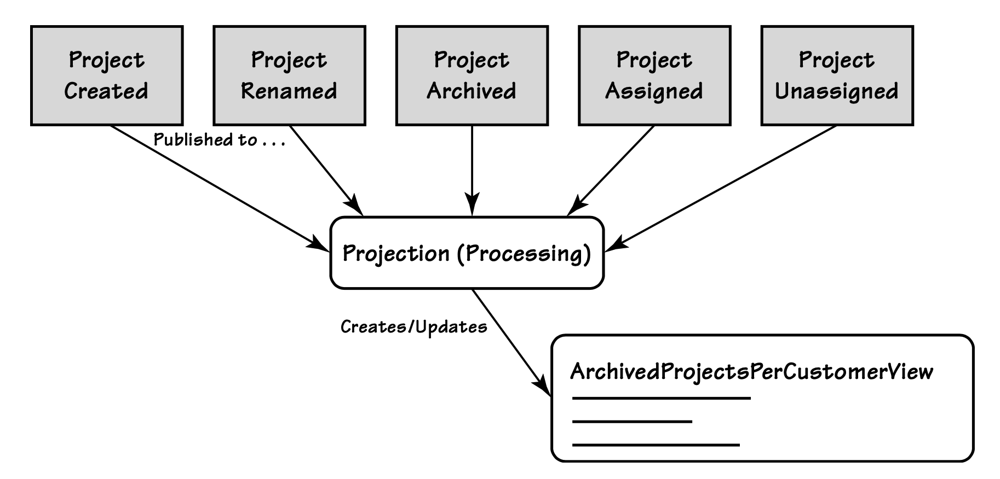
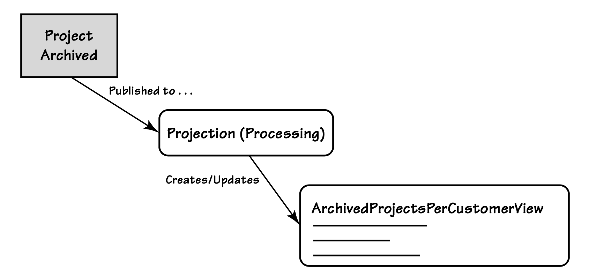

## 事件增强

#### ▶[上一节](12.md)

A+ES 设计中一个较为常见的问题源于其双重用途。
事件既被用于`Aggregate`持久化，也通过事件发布的方式，在企业内部传递领域层面的业务发生情况。

例如，考虑如下场景：一个项目管理系统允许客户创建新项目，并归档已完成的项目。
假设每当用户归档一个项目时，我们都会发布一个 ProjectArchived 事件。
该`Domain Event`可以采用如下设计：

```csharp
public class ProjectArchived {
  public ProjectId Id { get; set; }
  public UserId ChangeAuthorId { get; set; }
  public DateTime ArchivedUtc { get; set; }
  public string OptionalComment { get; set; }
}
```

#### Figure A.16
</br>
*一个投影 (Projection) 会消费多个`Domain Events`，并使用这些事件来构建读取模型 (Read Model) 的视图。*

这些信息足以通过 A+ES 重构已归档的 Project 。
然而，以这种方式设计的事件，对于订阅消费者来说可能会相当棘手。

为什么？请看用于 ArchivedProjectsPerCustomer 视图的投影 (Projection)，如 [图 A.16](#figure-a16) 所示。
该投影 (Projection) 订阅事件并维护每个客户的已归档项目列表。
为了完成这项工作，此投影 (Projection) 需要获取诸如以下内容的最新信息：

- 项目名称
- 客户名称
- 项目与客户的归属关系
- 项目归档事件

我们可以通过为 ProjectArchived 事件补充额外的数据成员来携带相关信息，从而极大简化该投影 (Projection) 。
这些额外的数据成员对于重构对应`Aggregate`的状态并非必需，但能显著简化事件消费者的逻辑。
请看这个替代的事件契约：

```csharp
public class ProjectArchived {
  public ProjectId Id { get; set; }
  public string ProjectName { get; set; }
  public UserId ChangeAuthorId { get; set; }
  public DateTime ArchivedUtc { get; set; }
  public string OptionalComment { get; set; }
  public CustomerId Customer { get; set; }
  public string CustomerName { get; set; }
}
```

有了这个经过增强的新事件，由投影生成的 ArchivedProjectsPerCustomerView 就可以像 [图 A.17](#figure-a17) 所示那样得到简化。

一条`Domain Event`的经验法则是：将事件设计成包含足够满足 80% 订阅者需求的信息，即便这样会让事件携带比大量订阅者实际所需更多的数据。
记住我们的目标是确保视图投影 (Projection) 处理器能拥有丰富的事件数据，通常应包含：

- `Entity`标识，即事件的归属/主体，例如 CustomerId 对应于 Customer
- 名称及其他通常用于展示的属性，如 ProjectName、CustomerName 等

这些只是建议，而非硬性规定。
它们通常适用于拥有众多不同`Bounded Contexts`的企业。
单体式`Bounded Contexts`从这些建议中获益较少，因为这类系统往往会维护辅助查询表和实体映射。
当然，你最清楚哪些属性应该包含在你的事件中。
有时，对于特定事件类型应包含哪些属性是显而易见的，这种情况下通常几乎不需要重构。

#### Figure A.17
</br>
*诸如 ProjectArchived 之类的`Domain Events`可由投影 (Projection) 处理器进行消费，这些处理器用于生成特定于视图和报表的读取模型 (Read Model)。*


#### ▶[下一节](14.md)
