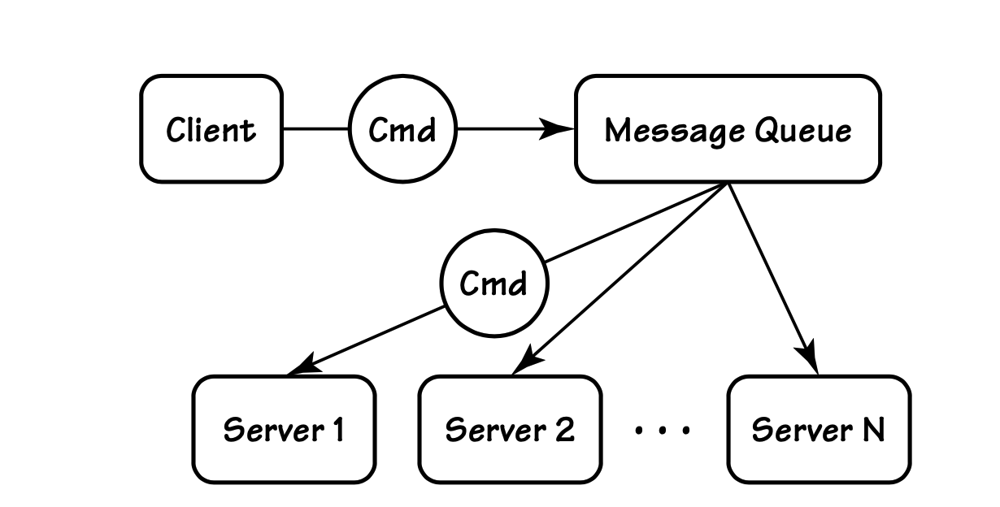
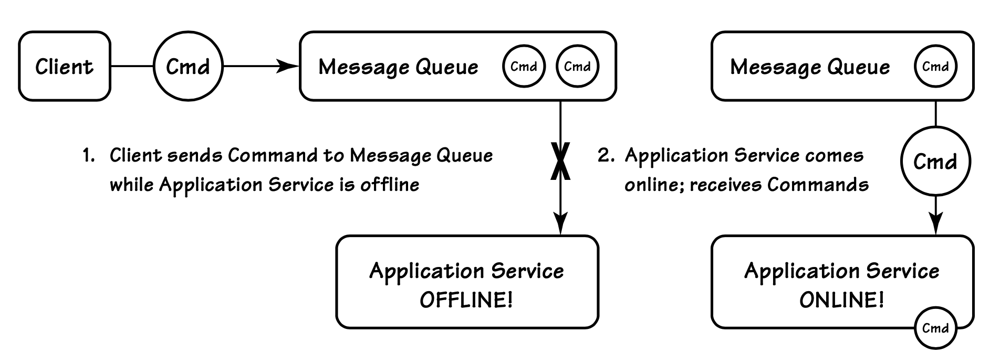

## `Command Handler`

#### ▶[上一节](1.md)

我们来探讨使用 [Command (4)](../ch4/0.md) [Command (14)](../ch14/0.md) 和命令处理器（Command Handler）来控制应用程序任务管理的优势。
首先，我们再次回顾一下我们的`Application Service`及其 LockCustomer() 方法：

```csharp
public class CustomerApplicationService
{
  ...
  public void LockCustomer(CustomerId id, string reason)
  {
    var eventStream = _eventStore.LoadEventStream(id);
    var customer = new Customer(stream.Events);
    customer.LockCustomer(reason);
    _store.AppendToStream(id, eventStream.Version, customer.Changes);
  }
  ...
}
```

现在不妨设想一下，将方法名及其参数序列化为某种结构化形式，这会是什么样的呢？
我们可以针对这个应用操作创建一个对应的类，并在该类中定义与服务方法参数相匹配的实例属性。
这个类就构成了一个`Command`：

```csharp
public sealed class LockCustomerCommand
{
  public CustomerId { get; set; }
  public string Reason { get; set; }
}
```

`Command`契约遵循与事件相同的语义，并可以类似的方式在系统间共享。
然后，该命令可以被传递到`Application Service`中的某个方法。

```csharp
public class CustomerApplicationService
{
  ...
  public void When(LockCustomerCommand command)
  {
    var eventStream = _eventStore.LoadEventStream(command.CustomerId);
    var customer = new Customer(stream.Events);
    customer.LockCustomer(command.Reason);
    _eventStore.AppendToStream(
      command.CustomerId, eventStream.Version, customer.Changes);
  }
  ...
}
```

这种简单的重构能为系统带来若干长期收益，我们来看具体原理。

由于`Command`对象可以被序列化，我们能够将其文本或二进制形式作为消息通过消息队列发送。
接收消息的对象就是消息处理器，对我们而言也就是`Command Handler`。
`Command Handler`实际上替代了`Application Service`方法，尽管二者在逻辑上大致等价，也依然可以被视作`Application Service`。
无论如何，将客户端与服务解耦，能够 *提升负载均衡能力、支持竞争消费者 (competing consumers)，并实现系统分区 (system partitioning)* 。
就拿负载均衡来说，我们可以在任意数量的服务器上启动同一个`Command Handler`（语义上等同于`Application Service`），以此分散负载。
当`Command`被放入消息队列后，`Command`消息会被分发到多个正在监听的`Command Handler`中的一个。
这一过程如 [图 A.8](#figure-a8) 所示。（在本附录中，`Command`以圆形对象表示。）
实际的消息分发可以采用简单的轮询方式，或更复杂的投递算法，这些都由消息中间件基础设施提供。

#### Figure A.8
</br>
*应用`Command`被分发到任意数量的`Command Handler`*

这种方式在客户端与`Application Service`之间创建了 *时间上的解耦 (temporal decoupling)* ，从而让系统更加健壮。
一方面，即使`Application Service`在短时间内不可用（例如维护或升级），客户端也不会被阻塞。
相反，`Commands`会被放入持久化队列，当服务器重新上线后，`Command Handler`（`Application Service`）会对其进行处理，如 [图 A.9](#figure-a9) 所示。

另一个优势是，可以在`Command`分发前根据需要链式添加额外切面 (chain additional aspects) 。
例如，我们可以轻松地接入审计、日志、授权和校验功能。

#### Figure A.9
</br>
*基于消息的`Command`及其`Command Handler`所具备的时间解耦 (temporal decoupling) 特性，为系统提供了灵活的可用性方案。*

思考一下我们可以如何接入日志功能。
首先定义一个标准接口，并在`Application Service`类中实现该接口：

```csharp
public interface IApplicationService
{
  void Execute(ICommand cmd);
}

public partial class CustomerApplicationService : IApplicationService
{
  public void Execute(ICommand command)
  {
    // pass command to a specific method When()
    // that can handle the command
    ((dynamic)this).When((dynamic)command);
  }
}
```

---
➜**执行与变更具有相似的实现方式**

需要注意，此 Execute() 方法的实现方式，与之前作为 A+ES 聚合设计一部分所描述的 Mutate() 方法，在某些特征上较为相似。

---

一旦我们为所有`Command Handlers`（`Application Services`）定义了标准接口，就可以接入各类标准的执行前与执行后功能，例如通用日志记录。

```csharp
public class LoggingWrapper : IApplicationService
{
  readonly IApplicationService _service;

  public LoggingWrapper(IApplicationService service)
  {
    _service = service;
  }

  public void Execute(ICommand cmd)
  {
    Console.WriteLine("Command: " + cmd);
    try
    {
      var watch = Stopwatch.StartNew();
      _service.Execute(cmd);
      var ms = watch.ElapsedMilliseconds;
      Console.WriteLine("  Completed in {0} ms", ms);
    }
    catch( Exception ex)
    {
      Console.WriteLine("Error: {0}", ex);
    }
  }
}
```

因为所有`Application Services`都拥有标准接口，我们可以接入任意数量的通用工具，在`Command Handler`实际执行之前和/或之后进行操作。
以下是 CustomerApplicationService 如何在执行前后进行日志记录的初始化方式：

```csharp
var customerService =
  new CustomerApplicationService(eventStore, pricingService);
var customerServiceWithLogging = new LoggingWrapper(customerService);
```

当然，`Commands`作为可序列化对象被分发到`Command Handler`这一特性，使我们能够在统一位置处理各种故障与异常情况。
对于特定类型的错误（例如由并发问题引发的资源争用），我们可以采用标准的恢复措施，比如将操作重试 X 次。
重试机制可以基于带上限的指数退避 (Capped Exponential Back-off) 策略实现，让所有重试行为统一、可靠，并在单个类中集中维护。

#### ▶[下一节](3.md)
