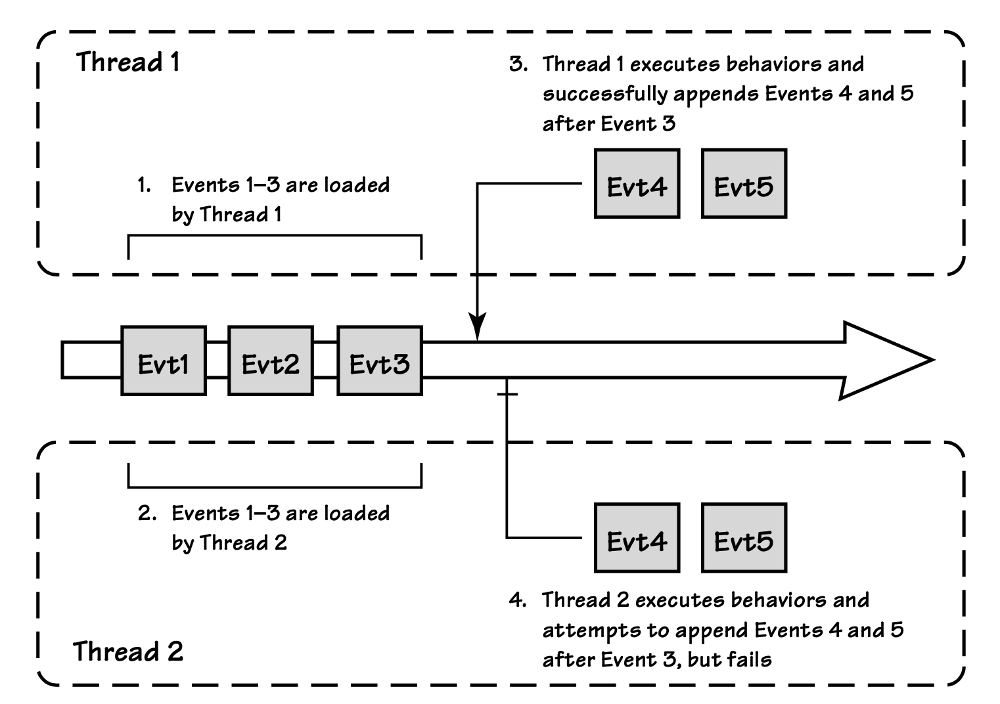
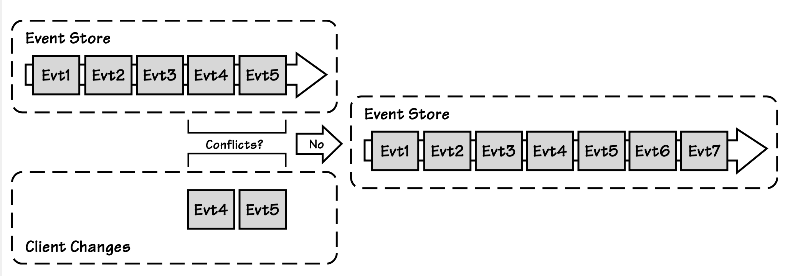

## 并发控制

#### ▶[上一节](3.md)

`Aggregate`事件流可以被多个线程同时访问和读取。
这就带来了真正的并发冲突隐患，如果不加以控制，可能会导致`Aggregate`状态出现各种非法情况。
假设有两个线程试图同时修改同一个事件流，如 [图 A.10](#figure-a10) 所示。

#### Figure A.10
</br>
*两个线程争夺同一个采用 A+ES 设计的`Aggregate`实例*

解决这种情况最简单的办法是在第 4 步使用 EventStoreConcurrencyException，并让它一直向上抛出到最终客户端。

```csharp
public class EventStoreConcurrencyException : Exception
{
    public List<IEvent> StoreEvents { get; set; }
    public long StoreVersion { get; set; }
}
```

当最终客户端捕获到此异常时，通常会提示用户手动重试操作。

但你可能会认同，与其先采用这种方式，不如使用标准化的重试方案效果更好。
因此，当`Event Store`抛出 EventStoreConcurrencyException 异常时，我们可以立即尝试自动恢复：

```csharp
void Update(CustomerId id, Action<Customer> execute)
{
  while(true)
  {
   
    EventStream eventStream = _eventStore.LoadEventStream(c.Id);
    var customer = new Customer(eventStream.Events);
    try
    {
      execute(customer);
      _eventStore.AppendToStream(
        c.Id, eventStream.Version, customer.Changes);
      return;
    }
    catch (EventStoreConcurrencyException)
    {
      // fall through and retry, with optional brief delay
    }
  }
}
```

当发生并发冲突时，我们可以增加以下步骤来解决问题：

1. 线程 2 捕获异常并继续执行，程序控制权回到 while 循环的开头。此时事件 1–5 被加载到一个新的 Customer 实例中。

2. 线程 2 在重新加载后的 Customer 对象上重新执行委托，这会生成新的事件 6–7，并将在事件 5 之后成功追加到事件流中。

如果所需的`Aggregate`行为重新执行代价过高，或因某些原因无法实现（例如需要成本高昂的第三方系统集成来下单或扣费），我们可以采用其他策略。

如 [图 A.11](#figure-a11) 所示，其中一种策略是事件冲突解决，用于减少实际并发异常的数量。
下面是一种非常简单的冲突解决机制的工作方式：

#### Figure A.11
</br>
*在`Aggregate`的事件流上使用事件冲突解决*

```csharp
void UpdateWithSimpleConflictResolution(
  CustomerId id, Action<Customer> execute)
{
  while (true)
  {
    EventStream eventStream = _eventStore.LoadEventStream(id);
    Customer customer = new Customer(eventStream.Events);
    execute(customer);

    try
    {
      _eventStore.AppendToStream(
        id, eventStream.Version, customer.Changes);
      return;
    }
    catch (EventStoreConcurrencyException ex)
    {
      foreach (var failedEvent in customer.Changes)
      {
        foreach (var succeededEvent in ex.ActualEvents)
        {
          if (ConflictsWith(failedEvent, succeededEvent))
          {
            var msg = string.Format("Conflict between {0} and {1}",
              failedEvent, succeededEvent);
            throw new RealConcurrencyException(msg, ex);
          }
        }
      }
      // there are no conflicts and we can append
      _eventStore.AppendToStream(
        id, ex.ActualVersion, customer.Changes);
    }
  }
}
```

在这种情况下，使用冲突检测方法 ConflictsWith()，将`Aggregate`的每个事件与并发追加到`Event Store`的事件（异常中会报告这些事件）进行比较，以判断是否存在冲突。

这种冲突解决方法通常是针对每个`Aggregate`根定义的，取决于它支持的具体行为类型。
然而，有一种 ConflictsWith() 的实现适用于大多数`Aggregates`：

```csharp
bool ConflictsWith(IEvent event1, IEvent event2)
{
  return event1.GetType() == event2.GetType();
}
```

这种多数情况下适用的冲突解决机制基于一条简单规则：相同类型的事件总是相互冲突，不同类型的事件则不会。

#### ▶[下一节](5.md)
