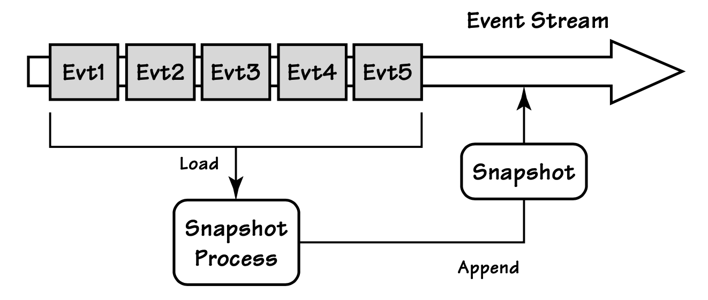

## 性能

#### ▶[上一节](5.md)

有时从大型事件流中加载`Aggregate`会引发性能问题，尤其是当单个事件流的事件数量超过数十万时。
可以在具体场景中应用几种简单的模式来解决这个问题：

#### Figure A.12
</br>
*带有状态快照的`Aggregate`事件流，以及快照生成之后发生的两个后续事件*

- 利用事件一旦写入`Event Store`便不可变的特性，在服务器内存中缓存事件流。
在向`Event Store`查询变更时，我们可以提供已知的最后一个事件版本，仅请求此后发生的事件（如果有）。
这可以提升性能，但会消耗一定内存。
- 通过为每个`Aggregate`实例创建 *快照* ，避免加载与重放事件流中的大量事件。
这样，在加载任意`Aggregate`实例时，只需找到其最新快照，然后重放快照生成之后追加到事件流的事件即可。

如 [图 A.12](#figure-a12) 所示，快照只是`Aggregate`完整状态在特定时间点的序列化副本，以特定版本形式存在于事件流中。
它们可以持久化在`Repository`中，并通过如下简单接口进行封装：

```csharp
public interface ISnapshotRepository
{
  bool TryGetSnapshotById<TAggregate>(
    IIdentity id, out TAggregate snapshot, out int version);
  void SaveSnapshot(IIdentity id, TAggregate snapshot, int version);
}
```

我们必须为每个快照记录事件流的版本号。
借助版本号，我们就可以在加载快照时，只加载从该快照创建之后发生的事件。
我们先获取快照作为`Aggregate`实例的基础状态，然后加载并重放快照生成之后发生的所有事件：

```csharp
// simple document storage interface
ISnapshotRepository _snapshots;

// our event store
IEventStore _store;

public Customer LoadCustomerAggregateById(CustomerId id)
{
  Customer customer;
  long snapshotVersion = 0;
  if (_snapshots.TryGetSnapshotById(
        id, out customer, out snapshotVersion))
  {
    // load any events since snapshot was taken
    EventStream stream = _store.LoadEventStreamAfterVersion(
      id, snapshotVersion);
    // replay these events to update snapshot
    customer.ReplayEvents(stream.Events);
    return customer;
  }
  else // we don't have any persisted snapshot
  {
    EventStream stream = _store.LoadEventStream(id);
    return new Customer(stream.Events);
  }
}
```

必须调用 ReplayEvents() 方法，根据最新快照之后发生的事件，将`Aggregate`实例的状态更新至最新。
要注意的是，`Aggregate`实例的状态是从最新快照的节点开始向前（按事件时序）变更的。
因此，（本示例中的）Customer 实例不会仅通过事件流来实例化。
同时我们也不能直接调用 Apply() 方法，因为该方法在利用指定事件变更当前状态的同时，还会将接收到的每个事件保存至 Changes 集合中。
若将已存在于事件流中的事件再次存入 Changes 集合，会引发严重的程序错误。
基于此，我们只需实现这个新方法 ReplayEvents() 即可：

```csharp
 public partial class Customer
 {
  ...
  public void ReplayEvents(IEnumerable<IEvent> events)
  {
    foreach (var event in events)
    {
      Mutate(event);
    }
  }
  ...
}
```

#### Figure A.13
</br>
*`Aggregate`的快照会在新增事件累计达到指定数量后生成。*

以下是生成 Customer 快照的简易代码示例：

```csharp
public void GenerateSnapshotForCustomer(IIdentity id)
{
  // load all events from the start
  EventStream stream = _store.LoadEventStream(id);
  Customer customer = new Customer(stream.Events);
  _snapshots.SaveSnapshot(id, customer, stream.Version);
}
```

快照的生成与持久化可以委托给后台线程执行。
只有在最新快照之后产生的事件数量达到设定值时，才会生成新的快照。
这些步骤如 [图 A.13](#figure-a13) 所示。
由于不同`Aggregate`类型的特性可能差异较大，每种类型的快照触发阈值可以根据具体的性能需求进行调优。

另一种解决 A+ES `Aggregate`性能问题的方法是：按照`Aggregate`标识将`Aggregate`分布到多个进程或多台机器上。
这种分片可以通过标识哈希或其他算法实现，并且可以与`Aggregate`实例内存缓存、`Aggregate`快照结合使用。

#### ▶[下一节](7.md)
