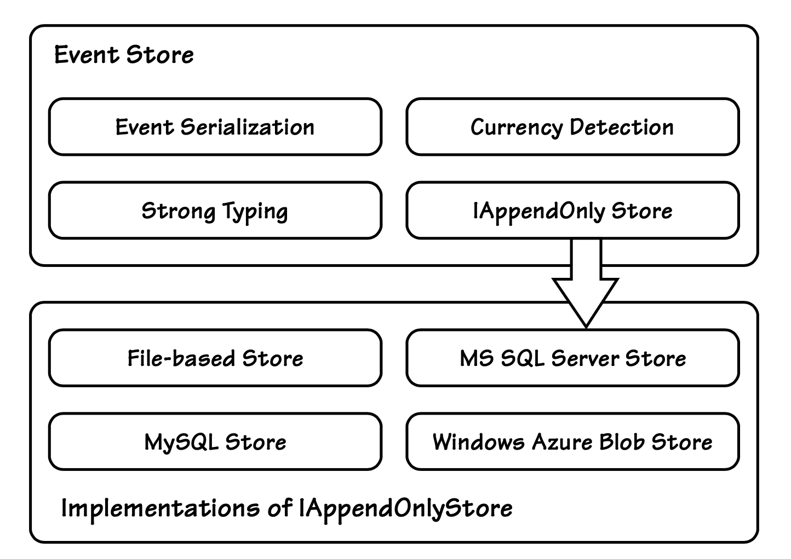

## 实现`Event Store`

#### ▶[上一节](6.md)

现在我们来实际实现几种适用于 A+ES 架构的`Event Store`。
这里实现的 Store 较为简洁，并非为极致高性能而设计，但对大多数领域场景已经足够。

尽管不同`Event Store`的具体实现各不相同，但它们约定的接口是一致的：

```csharp
public interface IEventStore
{
  // loads all events for a stream
  EventStream LoadEventStream(IIdentity id);
  // loads subset of events for a stream
  EventStream LoadEventStream(
    IIdentity id, int skipEvents, int maxCount);
  // appends events to a stream, throwing
  // OptimisticConcurrencyException another appended
  // new events since expectedversion
  void AppendToStream(
    IIdentity id, int expectedVersion, ICollection<IEvent> events);
}

public class EventStream
{
    // version of the event stream returned
    public int Version;
    // all events in the stream
    public IList<IEvent> Events = new List<IEvent>();
}
```

如 [图 A.14](#figure-a14) 所示，实现 IEventStore 接口的类是针对特定项目的包装器，封装了更通用、可复用的 IAppendOnlyStore。
IEventStore 实现负责处理序列化与强类型，而 IAppendOnlyStore 实现则提供对各类存储引擎的底层访问。

#### Figure A.14
</br>
*上层 IEventStore 与底层 IAppendOnlyStore 的特性*

---
➜**事件仓库源代码**

包含多种存储实现的全系列`Event Store`完整源代码，可作为 A+ES 示例项目的一部分下载获取： http://lokad.github.com/lokad-iddd-sample/ 。

---

以下是底层的 IAppendOnlyStore 接口代码：

```csharp
public interface IAppendOnlyStore : IDisposable
{
  void Append(string name, byte[] data, int expectedVersion = -1);
  IEnumerable<DataWithVersion> ReadRecords(
    string name, int afterVersion, int maxCount);
  IEnumerable<DataWithName> ReadRecords(
    int afterVersion, int maxCount);
  void Close();
}

public class DataWithVersion
{
  public int Version;
  public byte[] Data;
}

public sealed class DataWithName
{
  public string Name;
  public byte[] Data;
}
```

如你所见，IAppendOnlyStore 处理的是字节数组（而非事件集合），以及字符串名称（而非强类型标识）。
EventStore 类则负责这两种数据类型之间的转换。

IAppendOnlyStore 声明了两个不同的 ReadRecords() 方法：列表中第一个方法用于按名称读取单个事件流（Stream）内的事件，第二个方法用于读取 Store 中所有事件。
这两个方法的实现都必须始终按照事件持久化的顺序读取事件。
你可能已经推断出，第一个重载方法用于重建单个`Aggregate`的状态；
第二个 ReadRecords() 则由基础设施层使用，比如用于事件复制、无需两阶段提交（two-phase commit）的事件发布，以及重建持久化的读取模型（例如基于 CQRS 的用户界面所需的读取模型）。

一种简单的序列化与反序列化方案（即字节与强类型事件对象之间的转换）可借助 .NET 的 BinaryFormatter 实现：

```csharp
public class EventStore : IEventStore
{
  readonly BinaryFormatter _formatter = new BinaryFormatter();

  byte[] SerializeEvent(IEvent[] e)
  {
    using (var mem = new MemoryStream())
    {
      _formatter.Serialize(mem, e);
      return mem.ToArray();
    }
  }

  IEvent[] DeserializeEvent(byte[] data)
  {
    using (var mem = new MemoryStream(data))
    {
      return (IEvent[])_formatter.Deserialize(mem);
    }
  }
}
```

下面是我们如何使用序列化与反序列化来加载事件流：

```csharp
readonly IAppendOnlyStore _appendOnlyStore;
...
public EventStream LoadEventStream(IIdentity id, int skip, int take)
{
  var name = IdentityToString(id);
  var records = _appendOnlyStore.ReadRecords(name, skip, take).ToList();
  var stream = new EventStream();
  foreach (var tapeRecord in records)
  {
    stream.Events.AddRange(DeserializeEvent(tapeRecord.Data));
    stream.Version = tapeRecord.Version;
  }
  return stream;
}

string IdentityToString(IIdentity id)
{
  // in this project all identities produce proper name
  return id.ToString();
}
```

在这里我们可以看到如何通过 IAppendOnlyStore 接口将新事件追加到`Event Store`事件仓库中：

```csharp
public void AppendToStream(
  IIdentity id, int originalVersion, ICollection<IEvent> events)
{
  if (events.Count == 0)
    return;
  var name = IdentityToString(id);
  var data = SerializeEvent(events.ToArray());
  try
  {
    _appendOnlyStore.Append(name, data, originalVersion);
  }
  catch(AppendOnlyStoreConcurrencyException e)
  {
    // load server events
    var server = LoadEventStream(id, 0, int.MaxValue);
    // throw a real problem
    throw OptimisticConcurrencyException.Create(
      server.Version, e.ExpectedVersion, id, server.Events);
  }
}
```

#### ▶[下一节](8.md)

