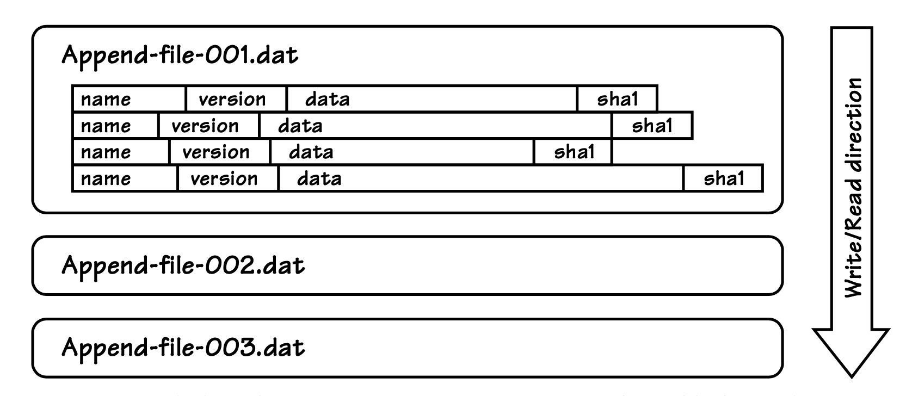

## BLOB 持久化

#### ▶[上一节](8.md)

使用数据库服务器（如 MySQL 或 Microsoft SQL Server）可以省去大量工作。
在并发管理、文件碎片、缓存和数据一致性方面，都能节省大量精力。
显然，如果不使用数据库产品，我们就需要自行处理其中许多问题。

然而，如果我们确实选择勇敢地走向`Event Store`事件存储的更艰难道路，我们还是有一些帮助的。
例如，我们可以使用 Windows Azure Blob 存储和简单的文件系统存储，并且示例项目中包含了两者的实现。

我们来了解一下在不使用数据库的情况下构建`Event Store`的一些设计准则，其中部分准则如 [图 A.15](#figure-a15) 所示：

1. 我们的自定义存储由一个或多个仅追加式二进制大对象（BLOB）文件或其等效组件构成。
向该存储写入数据的组件在执行追加操作时会对其加排他锁，但允许并发读取。

2. 根据你的策略选择，你可以为一个`Bounded Context`中的所有`Aggregate`类型与实例只使用一个 BLOB 存储；
也可以为每种`Aggregate`类型分别创建一个 BLOB 存储，用于存放该类型下所有实例的数据；
还可以按实例对每种`Aggregate`类型的 BLOB 存储进行拆分，让单个实例的事件流独立存储。

3. 写入组件在执行追加操作时，会打开对应的 BLOB 存储并向其写入数据，同时维护该存储内部的索引。

#### Figure A.15
 
*基于文件的 BLOB 存储，采用每个`Aggregate`实例对应一个文件的策略，每个事件存储为一条记录。*

4. 无论采用哪种 BLOB 存储策略，所有新事件都将追加到末尾。
每条记录由名称、版本和二进制数据字段组成。
这与我们将事件记录存储到关系型数据库的方式类似。
不过，在 BLOB 存储中，我们必须在变长字段前加上字节长度，并在读取记录时追加一个哈希码或循环冗余校验码（CRC）来验证数据完整性。

5. 基于 BLOB 的仅追加式存储允许通过遍历所有文件及其内容，来枚举所有事件流中的全部事件。
为了加快磁盘查找和读取特定事件流的速度，我们需要维护一个专用的内存索引，并且/或者在内存中缓存事件流。
如果使用内存缓存，每次追加操作都需要刷新缓存。
此外，`Aggregate`状态快照和文件碎片整理也有助于提升性能。

6. 当然，我们可在创建每个基于文件的事件流时，预先分配大块的二进制大对象（BLOB）文件空间，以此规避文件系统的诸多磁盘碎片问题。

此设计灵感源自 Riak Bitcask 存储模型，你可在 Riak Bitcask 的架构论文中查阅更多细节与解析，论文地址： http://downloads.basho.com/papers/bitcask-intro.pdf 。

#### ▶[下一节](10.md)
