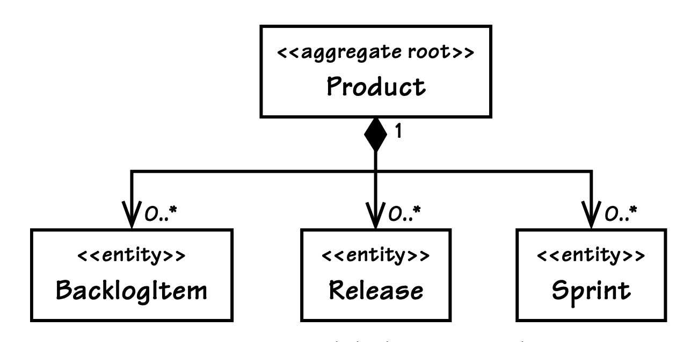
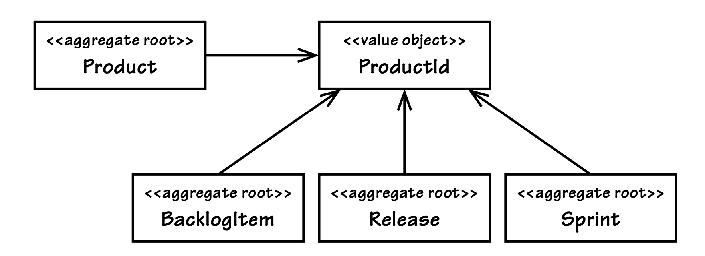

## 在 Scrum 核心领域中使用`Aggregate`

#### ▶[上一节](0.md)

我们将深入探讨 SaaSOvation 对`Aggregate`的运用方式，具体聚焦于`Agile Project Management Context`下的 ProjectOvation 应用。
该应用遵循传统的 Scrum 项目管理模式，涵盖产品、产品负责人、团队、待办事项、规划发布版本及迭代冲刺（sprint）全要素。
若你心中构想的是功能最完善的 Scrum 模式，那正是 ProjectOvation 的打造方向；这一领域对我们大多数人而言都并不陌生。
Scrum 相关术语构成了 [Ubiquitous Language](../ch1/0.md) 的起点。
由于该应用是基于 SaaS 模式部署的订阅制应用，每个订阅组织都会被注册为租户（tenant），这也是`Ubiquitous Language`中的另一核心术语。

---

| ||
|---|---|
|该公司组建了一支由资深 Scrum 专家和开发人员组成的团队。</br> 然而，由于团队成员在 DDD 方面的经验尚为有限，在攻克这一颇具难度的学习曲线过程中，他们在 DDD 的实践中难免会出现一些失误。</br> 他们将从`Aggregate`的实践经验中不断成长，我们亦能如此。 </br> 他们在实践中遇到的难题，或许能帮助我们发现并改善自身软件系统中存在的类似问题。||

该领域的各类概念，加之其性能与可扩展性方面的需求，比团队此前在首个[Core Domain (2)](../ch2/0.md)，`Collaboration Context`中面对的所有内容都更为复杂。
为解决这些问题，他们将采用的 DDD 战术工具之一便是`Aggregate`。

团队应如何选择最优的对象群 (cluster)？
`Aggregate`模式探讨了组合关系，也提及了信息隐藏，而这些实现方式团队均已掌握。
该模式同样涉及一致性边界（consistency boundary）与事务的相关内容，但团队此前并未对此给予过多关注。
他们选定的持久化机制本可助力实现数据的原子提交。
然而，正是对该模式设计指引的这一关键性误解，导致了他们的开发工作出现倒退。
具体情况如下：团队对`Ubiquitous Language`中的下述表述进行了研讨：

- 产品（Product）包含待办事项（backlog item）、发布版本（release）和迭代冲刺（sprint）。
- 规划新产品待办事项（backlog item）。
- 排期新产品发布版本（release）。
- 排期新产品迭代冲刺（sprint）。
- 已规划的待办事项（backlog item）可被排期至某一发布版本（release）。
- 已排期的待办事项（backlog item）可被纳入某一迭代冲刺（sprint）并完成提交。

---

基于这些表述，他们构思出了一个模型并完成了首次设计尝试。
我们来看具体的设计思路。

### 首次尝试：大型`Aggregate`

团队在设计时，过度看重了第一条表述中 *产品包含* 这一说法，这也直接影响了他们针对该领域的首次`Aggregate`设计。

---
在一些团队成员看来，这听来就是组合关系，意味着各类对象需要像对象图一样彼此关联。
团队认为，将这些对象的生命周期放在一起统一维护至关重要。因此，开发人员在规格说明 (specification) 中新增了以下一致性规则：

- 若某一待办事项已提交至某一迭代冲刺，则不得将该待办事项从系统中移除。
- 若某一迭代冲刺下存在已提交的待办事项，则不得将该迭代冲刺从系统中移除。
- 若某一发布版本中排期有待办事项，则不得将该发布版本从系统中移除。
- 若某一待办事项已排期至某一发布版本，则不得将该待办事项从系统中移除。

受此影响，Product 最初被建模为一个规模极大的`Aggregate`。
作为根对象的 Product ，持有与其关联的所有 BacklogItem 、所有 Release 以及所有 Sprint 实例。
接口设计层面则做了防护处理，避免客户端意外移除任意相关组件。

---

这份设计在下方代码中予以呈现，同时也以 UML 图的形式展示在 [图 10.1](#figure-101) 中。

```java
public class Product extends ConcurrencySafeEntity {
    private Set<BacklogItem> backlogItems;
    private String description;
    private String name;
    private ProductId productId;
    private Set<Release> releases;
    private Set<Sprint> sprints;
    private TenantId tenantId;
    ...
}
```

这个大型`Aggregate`看似设计合理，实际却不具备可操作性。
一旦应用在目标多用户环境中运行，就开始频繁出现事务失败的情况。
我们来深入分析几种客户端使用模式，以及这些模式与技术解决方案模型之间的交互方式。
我们的`Aggregate`实例采用乐观并发（optimistic concurrency）机制，防止不同客户端对持久化对象进行同时的重叠修改，从而避免使用数据库锁（database locks）。
正如在 [Entities (5)](../ch5/0.md) 部分所探讨的，对象会携带一个版本号，对象发生修改时版本号会递增，且在对象保存至数据库前会对版本号进行校验。
若持久化对象的版本号高于客户端副本的版本号，该客户端副本将被判定为过期，对应的更新操作也会被拒绝。

我们来考虑一个常见的多客户端并发使用场景：

- 有两位用户（比尔和乔），他们查看了同一个标记为版本 1 的 Product ，并开始对该产品进行操作。
- 比尔规划了一个新的 BacklogItem 并提交了修改。该产品 Product 的版本号随之递增至 2 。
- 乔排期了一个新的 Release 并尝试保存修改，但他的提交操作失败了，因为他的修改是基于产品 Product 的版本 1 进行的。

持久化机制（Persistence mechanisms）通常以这种方式来处理并发问题 <sup>[1](#1)</sup> 。
如果你认为可以修改默认的并发配置，请先暂缓下结论。
事实上，这种方式对于防止并发修改破坏`Aggregate`的不变量（invariants）至关重要。

#### Figure 10.1
</br>
*建模为大型`Aggregate`的产品（Product）*

#### Figure 10.2
</br>
*产品（Product）及相关概念被建模为独立的`Aggregate`类型。*

仅两名用户操作时，这类一致性问题就已出现。
若用户数量增多，问题将变得十分严重。
在 Scrum 模式下，多名用户常会在迭代冲刺规划会议和迭代冲刺执行过程中进行此类重叠修改操作。
持续驳回除其中一项外的所有请求，这一情况是完全无法接受的。

从逻辑上来说，规划新的 BacklogItem 与排期新的 Release 之间本无任何冲突！
乔的提交操作为何会失败？
问题的核心在于，这个大型`Aggregate`的设计依据是虚假的不变量（invariants），而非真实的业务规则。
这些虚假的不变量是开发人员强加的人为约束。
团队完全可以通过其他方式防止不当的移除操作，而非设置这种随意的限制性规则。
该设计除了会引发事务相关问题外，还存在性能和可扩展性方面的缺陷。

### 第二次尝试：多个`Aggregate`

现在我们来考虑另一种替代模型，如 [图 10.2](#figure-102) 所示，该模型中包含四个独立的`Aggregates`。
各类依赖关系均通过一个通用的 ProductId 进行关联推导，而这是作为另外三个父级的 Product 的唯一标识。

将单个大型`Aggregate`拆分为四个，将会改变 Product 上的部分方法契约（method contracts）。
在之前的大型`Aggregate`设计中，方法签名是如下这样的：

```java
public class Product ... {
    ...
    public void planBacklogItem(
        String aSummary, String aCategory,
        BacklogItemType aType, StoryPoints aStoryPoints) {
        ...
    }
    ...
    public void scheduleRelease(
        String aName, String aDescription,
        Date aBegins, Date anEnds) {
        ...
    }

    public void scheduleSprint(
        String aName, String aGoals,
        Date aBegins, Date anEnds) {
        ...
    }
    ...
}
```

所有这些方法均属于 CQS 命令 [[Fowler, CQS](../bibli.md#fowler-cqs)] ；也就是说，它们通过向集合中添加新元素来修改 Product 的状态，因此这些方法的返回类型为 void。
但在多`Aggregate`设计下，我们就需要

```java
public class Product ... {
    ...
    public BacklogItem planBacklogItem(
        String aSummary, String aCategory,
        BacklogItemType aType, StoryPoints aStoryPoints) {
        ...
    }

    public Release scheduleRelease(
    String aName, String aDescription,
        Date aBegins, Date anEnds) {
        ...
    }

    public Sprint scheduleSprint(
        String aName, String aGoals,
        Date aBegins, Date anEnds) {
        ...
    }
    ...
}
```

这些经过重新设计的方法具有 CQS 查询契约，同时还扮演着 [Factories (11)](../ch11/0.md) 角色；
也就是说，每个方法都会创建一个新的`Aggregate`实例，并返回该实例的引用。
如今，当客户端想要规划一个 BacklogItem 时，事务型 [Application Service (14)](../ch14/0.md) 必须执行以下操作：

```java
public class ProductBacklogItemService ... {
    ...
    @Transactional
    public void planProductBacklogItem(
        String aTenantId, String aProductId,
        String aSummary, String aCategory,
        String aBacklogItemType, String aStoryPoints) {

        Product product =
            productRepository.productOfId(
                new TenantId(aTenantId),
                new ProductId(aProductId));

        BacklogItem plannedBacklogItem =
            product.planBacklogItem(
                aSummary,
                aCategory,
                BacklogItemType.valueOf(aBacklogItemType),
                StoryPoints.valueOf(aStoryPoints));

        backlogItemRepository.add(plannedBacklogItem);
    }
    ...
}
```

我们通过 *重新建模* 解决了事务失败的问题。
如今，任意数量的 BacklogItem 、Release 和 Sprint 实例都能通过多用户的并发请求安全创建。
整个过程十分简洁。

然而，尽管这四个较小的`Aggregates`具备显著的事务优势，但从客户端使用的角度来看，其便捷性有所不足。
或许我们可以对这个大型`Aggregate`做些调整，以消除并发问题。
通过将 Hibernate 映射的乐观锁（optimistic-lock）选项设置为 false，就能消除事务失败的多米诺效应。
由于已创建的 BacklogItem、Release 和 Sprint 实例的总数并不存在不变量（invariants）约束，那为何不允许这些集合无限制增长，同时忽略 Product 上的这类特定修改呢？
保留这个大型`Aggregate`又会产生哪些额外成本？
问题在于，它的规模实际上可能会失控。
在深入分析背后原因之前，我们先来看看 SaaSOvation 团队亟需掌握的最重要的建模技巧。

#### ▶[下一节](2.md)

----

#### 1

例如，Hibernate 便是以这种方式实现乐观并发（optimistic concurrency）的。键值存储（key-value store）同样可采用该方式，因为整个聚合（Aggregate）通常会序列化为单个值，除非专门设计为将组合部分单独存储。
