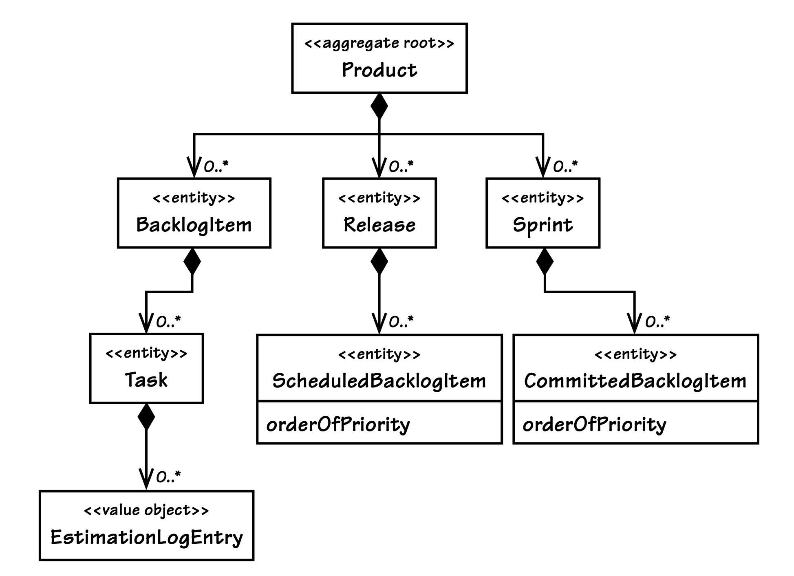
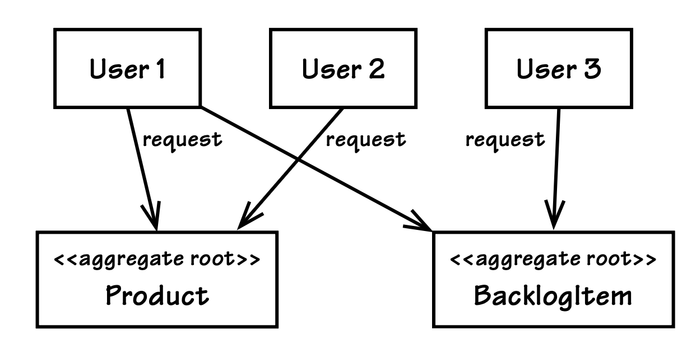

## 规则：设计小型`Aggregates`

#### ▶[上一节](2.md)

我们如今可以彻底解答这个问题：保留大型`Aggregate`会产生哪些额外成本？
即便能保证每一次事务都执行成功，大型`Aggregate`仍会制约系统的性能与可扩展性。
随着 SaaSOvation 公司的市场不断拓展，其租户数量也将大幅增加。
当每位租户都深度使用 ProjectOvation 系统时，SaaSOvation 公司需要承载的项目及配套管理工件会越来越多。
这将导致系统中产生海量的产品、待办事项、发布版本、迭代冲刺及其他相关对象。
性能与可扩展性属于系统的非功能需求，是不容忽略的。

结合性能与可扩展性的考量来看，当某一租户的用户想要为一个已存在多年、且已有数千个待办事项的产品新增一个待办事项时，会出现什么情况？
假设持久化机制支持延迟加载，比如 Hibernate 。
我们几乎不会一次性加载所有待办事项、发布版本和迭代冲刺。
但即便如此，仅仅是为这个本就庞大的集合新增一个元素，系统也会将数千个待办事项加载到内存中。
如果持久化机制不支持延迟加载，情况会更糟。
即便在考虑内存占用的情况下，某些操作仍不得不加载多个集合，例如为待办事项安排发布排期、或将待办事项提交至迭代冲刺时；
所有待办事项，再加上所有发布版本或所有迭代冲刺，都会被加载到内存中。

要清楚地理解这一点，可查看 [图 10.3](#figure-103) 中展示了放大后组合关系的示意图。
*不要被 0..\* 的标识误导，这类关联的数量几乎从未为零，还会随着时间不断增加*。
我们很可能需要一次性将成千上万个对象加载到内存中，仅仅是为了执行一项本应相对基础的操作。
而这还只是针对单个租户、单个产品下的一名团队成员的操作场景。
我们必须考虑到，成百上千个租户可能同时进行此类操作，每个租户都拥有多个团队和多款产品。
并且随着时间推移，这种情况只会愈发严重。

这种大型`Aggregate`的性能和可扩展性始终表现不佳。
更有可能沦为一场终将导致失败的噩梦。
该设计从一开始就存在缺陷，因为其设计出发点是虚假的不变量以及对组合便捷性的追求，却损害了事务执行的成功率、性能与可扩展性。

若我们要设计小型`Aggregates`，这里的 “小型” 究竟指什么？
极端情况下的`Aggregate`仅包含全局唯一标识和一个附加属性，但这 *并非* 推荐的设计方式（除非某一特定聚合确实有此需求）。
相反，应将`Aggregate`的范围限定为仅包含根`Entity`，以及数量最少的属性和/或`Value`类型 properties [3](#3)。
所需的属性数量以满足业务需求为基准，绝无多余。

#### Figure 10.3
 
*在该 Product 模型中，多项基础操作执行时都会加载多个大型集合。*

哪些属性是必需的？
简单来说：是那些必须与其他属性保持一致性的属性，即便领域专家并未将其明确列为规则。
例如，Product 包含 name 和 description 属性。
我们无法想象将本应保持一致的二者拆分到不同`Aggregates`中建模。
修改 name 时，你很可能也会同步修改 description；
若仅修改其一，大概率是为了修正拼写错误，或是让 description 更贴合 name。
<ins>尽管领域专家或许不会将此视作一条显式业务规则，但它实则是一条隐式规则</ins>。

如果你认为应当将一个被包含的部分建模为`Entity`，该如何处理？
首先要明确，这个部分本身是否必须随时间发生变更，或是在需要变更时可被完全替换。
若实例可被完全替换，说明应使用`Value Object`而非`Entity`进行建模。
诚然，有些场景下将部分建模为`Entity`是必要的。
但如果我们逐案开展这一设计分析，许多原本被建模为`Entities`的概念都能重构为`Value Objects`。
优先将`Value`类型作为`Aggregate`的组成部分，并不代表该`Aggregate`是不可变的，因为当根`Entity`的某个`Value`类型 properties 被替换时，根`Entity`本身也会发生变更。

将内部组成部分限定为`Values`具备诸多重要优势。
根据所采用的持久化机制不同，值对象可随根`Entity`一同序列化，而`Entities`则需要单独的跟踪存储。
包含`Entity`类型组成部分的开销更高，例如使用 Hibernate 读取这类实体时，往往需要执行 SQL 联表查询，
而读取单一数据库表行的速度则要快得多。
`Value`对象体积更小、使用起来也更安全，引发的程序漏洞更少；
同时得益于不可变性，单元测试能更轻松地验证其正确性。
这些优势在 [Value Objects (6)](../ch6/0.md) 中展开探讨。

在一个采用 Qi4j [[Öberg](../bibli.md#öberg)] 框架开发的金融衍生品领域项目中，Niclas
Hedhman [4](#4) 透露，其团队所设计的`Aggregates`中，约 70% 仅由一个根`Entity`搭配若干`Value`类型 properties 构成，
剩余 30% 的`Aggregates`也总共只包含两到三个`Entities`。
这一数据并非说明所有领域模型都需遵循 70/30 的比例划分，
却足以表明，绝大多数`Aggregates`都可限定为仅包含一个根`Entity`。

[[Evans](../bibli.md#evans)] 在对`Aggregates`的论述中，举了一个合理包含多个`Entities`的例子：
采购订单会被设定一个最高允许总金额，所有订单项的金额之和不得超过该总金额。
当多个用户同时添加订单项时，这一规则的执行就会变得棘手。
单次添加的金额不得超出限额，但多个用户的并发添加行为叠加后，总金额却有可能超支。
在此我不赘述该问题的解决方案，只想强调，绝大多数情况下，业务模型的不变量管理都比这个例子更为简单。
认识到这一点，能帮助我们为`Aggregates`建模时尽可能精简 properties 。

小型`Aggregates`不仅性能更优、可扩展性更强，还更易保障事务执行成功，即导致提交失败的冲突情况鲜有发生，
这能提升系统的易用性。
业务领域中，极少会存在真实的不变量约束，迫使我们采用大型组合的设计方式。
因此，限制`Aggregate`的规模无疑是明智之举。
当你偶尔遇到真正的一致性规则时，可根据需要新增少量`Entities`，或酌情添加一个集合，但仍需始终坚持将整体规模控制在最小。

### 切勿轻信所有用例

业务分析师在交付用例规格说明的过程中扮演着重要角色。
一份详尽的大型规格说明的编制需要投入大量工作，且会影响我们的诸多设计决策。
但我们必须谨记，通过这种方式推导得出的用例，并未融入核心建模团队中领域专家与开发人员的视角。
我们仍需将每个用例与当前的模型和设计进行适配，其中也包括我们针对`Aggregates`做出的各项决策。
实际工作中常出现的一个问题是，某一特定用例要求修改多个`Aggregates`实例。
在这种情况下，我们必须明确，该用例中设定的大型用户目标，是分散在多个持久化事务中完成，还是在单个事务内实现。
若属于后者，就需保持质疑的态度。无论这份用例的编写质量如何，它都可能无法准确反映模型中真正的`Aggregates`。

假设你的`Aggregate`边界与真实的业务约束是一致的，那么当业务分析师给出 [图 10.4](#figure-104) 所示的需求规格时，就很可能会引发问题。
仔细梳理各类事务提交顺序的排列组合后，你会发现存在这样的情况：三个请求中会有两个执行失败。[5](#5) 
这种尝试（在单个事务中修改多个`Aggregates`）反映出你的设计存在什么问题？
这个问题的答案或许能让你对业务领域有更深入的理解。
<ins>试图让多个`Aggregate`实例保持一致性，这可能意味着你的团队遗漏了某一项不变量</ins>。
为了满足这条新识别出的业务规则，你最终可能需要将这多个`Aggregates`整合为一个拥有新名称的全新概念
（当然，通常只有旧`Aggregates`中的部分内容会被纳入这个新聚合中）。

#### Figure 10.4
 
*三名用户同时尝试访问相同的两个`Aggregate`实例，引发并发冲突，导致大量事务执行失败。*

因此，一个新的用例或许能带来新的启发，推动我们对`Aggregate`进行重构，但在此过程中同样需要保持审慎的态度。
将多个`Aggregates`整合为一个，或许能提炼出一个拥有全新名称的完整新概念；
然而，若对这个新概念进行建模时，导致你设计出一个大型`Aggregate`，那么最终将会陷入这种设计方案所固有的各类问题之中。
有没有其他更有效的解决思路呢？

仅凭拿到的用例要求在单个事务中保持一致性，并不意味着你就应当照做。
在这类情况下，业务目标往往可通过`Aggregates`间的最终一致性来实现。
团队需审慎审视这些用例，对其隐含假设提出质疑，尤其是当严格按原文实现会导致设计臃肿难用时。
团队可能需要重新编写用例（若遇到不配合的业务分析师，至少也需重新构思）。
新的用例中应明确 *最终一致性要求，以及可接受的更新延迟时长* 。
本章后续将探讨这一问题。

#### ▶[下一节](4.md)

---

#### 3

`Value`类型 property 是持有`Value Object`引用的属性。我将其与字符串或数值类型这类简单属性区分开来，Ward Cunningham 在描述`Whole Value` [[Cunningham, Whole Value](../bibli.md#cunningham-whole-value)] 时亦是如此。

#### 4

另见网址：www.jroller.com/niclas/

#### 5

需要说明的是，本部分内容并不涉及一种合理场景：有些用例描述的是跨事务对多个`Aggregates`进行修改，这种情况是完全可行的。用户目标不应被视为与事务等同，我们在此仅关注那些明确要求在单个事务内修改多个`Aggregate`实例的用例。

