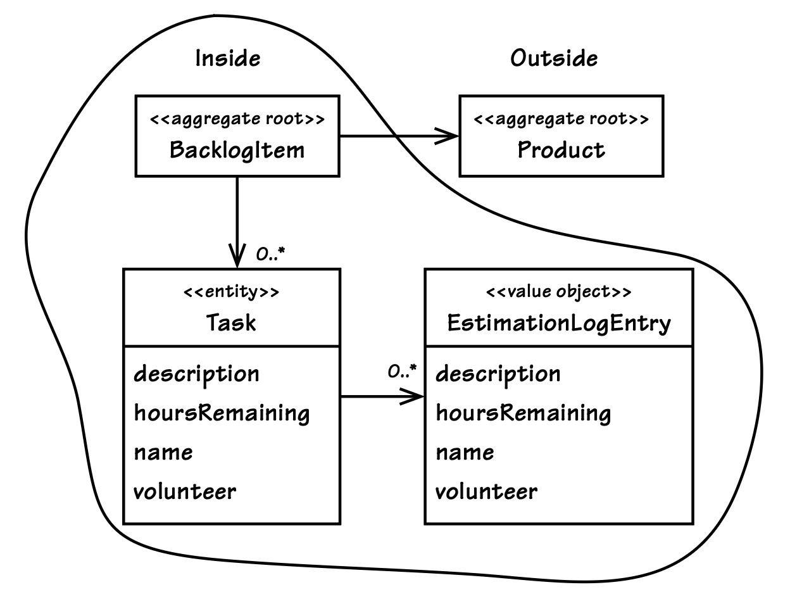
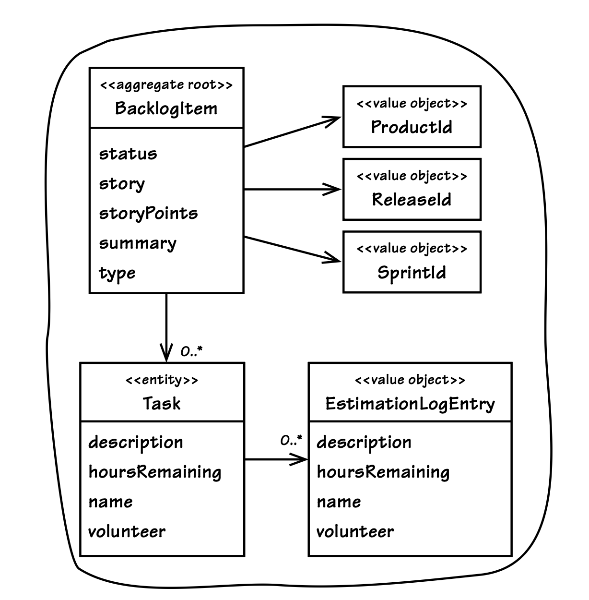

## 规则：通过标识引用其他`Aggregates`

#### ▶[上一节](2.md)

在设计`Aggregates`时，我们或许会希望构建一种支持深度遍历对象图的组合结构，但这并非该模式的设计初衷。
[[Evans](../bibli.md#evans)] 指出，一个`Aggregate`可以持有对其他`Aggregates`根的引用。
然而我们必须谨记，这种引用并不会将被引用的`Aggregate`纳入引用方的一致性边界之内，
也不会因此形成一个统一的完整`Aggregate`。
正如 [图 10.5](#figure-105) 所示，此时仍然存在两个（或更多个）相互独立的`Aggregates`。

在 Java 语言中，这种关联关系可以按如下方式建模：

```Java
public class BacklogItem extends ConcurrencySafeEntity {
    ...
    private Product product;
    ...
}
```

也就是说，BacklogItem 持有一个指向产品 Product 的直接对象关联。

结合前文已探讨的内容以及后续即将介绍的内容，这种关联关系存在以下几层含义：

1. 引用方`Aggregate`（BacklogItem）与被引用方`Aggregate`（Product） *不得在* 同一个事务中被同时修改。
单个事务内只能修改其中一方，二者不可兼得。

2. 若你需要在单个事务内修改多个`Aggregates`实例，这很可能强烈暗示你的一致性边界设计存在问题。
如果确是如此，这或许是一次被遗漏的建模机会；
你的`Ubiquitous Language`中，存在一个早已在你眼前凸显、呼之欲出却仍未被发掘的概念（详见本章前文内容）。

3. 若你尝试践行第 2 点的要求，而这么做又会导致出现一个带有前文所述所有隐患的大型`Aggregate`，那么这或许表明，你需要采用最终一致性（详见本章后续内容），而非原子一致性。

#### Figure 10.5
</br>
*存在两个`Aggregates`，而非一个。*

如果不持有任何引用，你就无法修改另一个`Aggregate`。
因此，从源头上避免这种场景，就可以遏制在同一个事务中修改多个`Aggregates`的冲动。
但这种做法的局限性过大，因为领域模型始终需要建立一些关联关系。
那么，我们该采取何种措施，才能在实现必要关联的同时，防止事务被滥用或出现过多失败，并且保障模型的性能与可扩展性呢？

### 通过标识引用实现`Aggregates`间的协同工作

仅通过全局唯一标识引用外部`Aggregates`，而非持有直接的对象引用（或 “指针”），如 [图 10.6](#figure-106) 所示。

#### Figure 10.6
</br>
*BacklogItem `Aggregate`通过标识关联其边界外的对象*

我们会对源代码进行如下重构：

```Java
public class BacklogItem extends ConcurrencySafeEntity {
    ...
    private ProductId productId;
    ...
}
```

通过这种方式推断对象关联的`Aggregates`，会自然而然地变得更精简，因为这类引用绝不会被立即加载（饿汉式加载）。
该模型的性能表现也会更优，原因是`Aggregates`实例的加载耗时更短，占用的内存也更少。
内存占用的减少，对于降低内存分配开销和优化垃圾回收性能而言，都具有积极作用。

### 模型导航

通过标识引用并非完全禁止在模型中进行导航。
部分开发人员会在`Aggregate`内部通过 [Repository (12)](../ch12/0.md) 执行查找操作，
这种技术被称为断开连接的领域模型 (Disconnected Domain Model)，本质上是懒加载的一种形式。
但另有更推荐的实现方式：在调用`Aggregate`行为前，通过`Repository`或 [Domain Service (7)](../ch7/0.md) 查找依赖对象。
由客户端`Application Service`对此进行控制，再将请求分发至`Aggregate`：

```Java
public class ProductBacklogItemService ... {
    ...
    @Transactional
    public void assignTeamMemberToTask(
        String aTenantId,
        String aBacklogItemId,
        String aTaskId,
        String aTeamMemberId) {

        BacklogItem backlogItem =
            backlogItemRepository.backlogItemOfId(
                new TenantId(aTenantId),
                new BacklogItemId(aBacklogItemId));

        Team ofTeam =
            teamRepository.teamOfId(
                backlogItem.tenantId(),
                backlogItem.teamId());

        backlogItem.assignTeamMemberToTask(
                new TeamMemberId(aTeamMemberId),
                ofTeam,
                new TaskId(aTaskId));
    }
    ...
}
```

由`Application Service`解析依赖，可让`Aggregate`不再依赖`Repository`或`Domain Service`。
但对于极为复杂且特定于领域的依赖解析场景，将`Domain Service`传入`Aggregate`的命令方法可能是最佳方案。
此时`Aggregate`可通过 *双重分派 (double-dispatch)* 调用`Domain Service`来解析引用。
需要再次强调的是，无论一个`Aggregate`以何种方式获取对其他`Aggregate`的访问权限，在一次请求中引用多个`Aggregates`，并不意味着有权对其中两个或以上的`Aggregates`进行修改。

|牛仔逻辑||
|------|---:|
|LB：“我夜里赶路全靠两个参照物。闻着有生牛肉的味道，那就是朝着牛群走；闻着有烤牛肉的香味，那就是往家赶。”||


将模型限定为仅通过标识实现引用，可能会增加组装和渲染 [User Interface (14)](../ch14/0.md) 视图的开发难度，
在单个用例中或许需要调用多个`Repositories`来填充视图数据。
若查询开销引发性能问题，不妨考虑使用 *theta joins* 或 CQRS。
以 Hibernate 为例，该框架支持将 theta joins 作为一种实现方式，通过单次联表查询整合多个存在引用关联的`Aggregate`实例，从而获取视图展示所需的各类数据。
若 theta joins 和 CQRS 式均不适用，则需要在基于标识的推断关联与直接对象引用之间寻找平衡。

倘若这些设计建议看似会让模型的使用变得更为繁琐，不妨想想其能带来的诸多额外益处。
精简`Aggregates`的规模，不仅能打造出性能更优的模型，还能进一步提升系统的可扩展性与分布式部署能力。

### 可扩展性与分布式部署

`Aggregates`并非通过直接引用指向其他`Aggregates`，而是依靠标识实现引用，因此其持久化状态可灵活迁移，以支撑更大规模扩展。
正如亚马逊的 Pat Helland 在其立场论文《Life beyond Distributed Transactions: An Apostate’s Opinion》中所述 [[Helland](../bibli.md#helland)] ，
通过对`Aggregate`数据存储进行持续的重新分区，能够实现 *近乎无限的可扩展性 (scalability)* 。
在该论文中，我们所称的`Aggregate`被他称作 *entity* ，
但无论名称如何，其描述的本质仍是`Aggregate`：一个具备事务一致性的组合单元。
部分非关系型数据库持久化机制对这种源自亚马逊的分布式存储模式提供了支持，它们在很大程度上实现了 [[Helland](../bibli.md#helland)] 所提及的底层感知扩展 (lower, scale-aware) 层。
无论是采用分布式存储，还是出于类似的扩展目的使用关系型数据库，基于标识的引用都发挥着至关重要的作用。

分布式的应用不仅限于存储层面。
在任一`Core Domain`的开发工作中，势必会涉及多个`Bounded Contexts`，而通过标识引用的方式，能让分布式领域模型实现跨域的关联。
当采用事件驱动的设计思路时，包含`Aggregate`标识、基于消息的 [Domain Events (8)](.../ch8/0.md) 件会在企业内部流转。
外部`Bounded Contexts`的消息订阅方，会利用这些标识在自身的领域模型中执行相关操作。
通过标识引用形成远程关联，也可称之为 *partners* 。
这类分布式操作由 [[Helland](../bibli.md#helland)] 所称的 *双方活动管理 (two-party activities)* ，
但在`Publish-Subscribe` [[Buschmann et al.](../#buschmann-et-al)] 或观`Observer` [[Gamma et al.](../bibli.md#gamma-et-al)] 等的术语中，它是 *多方的 (multi-party)* （两个或更多）。
跨分布式系统的事务不是原子性的。
各类系统最终会通过协调，使多个`Aggregate`达成一致的状态。

#### ▶[下一节](4.md)
