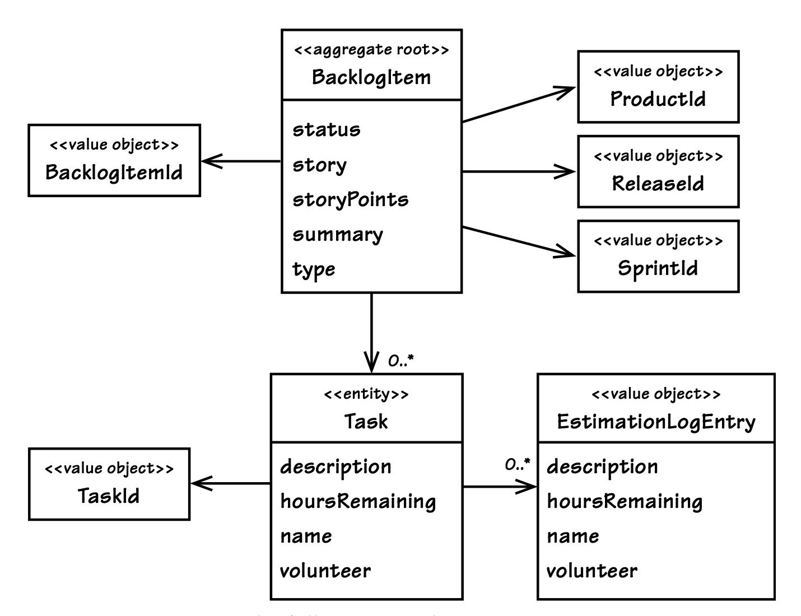
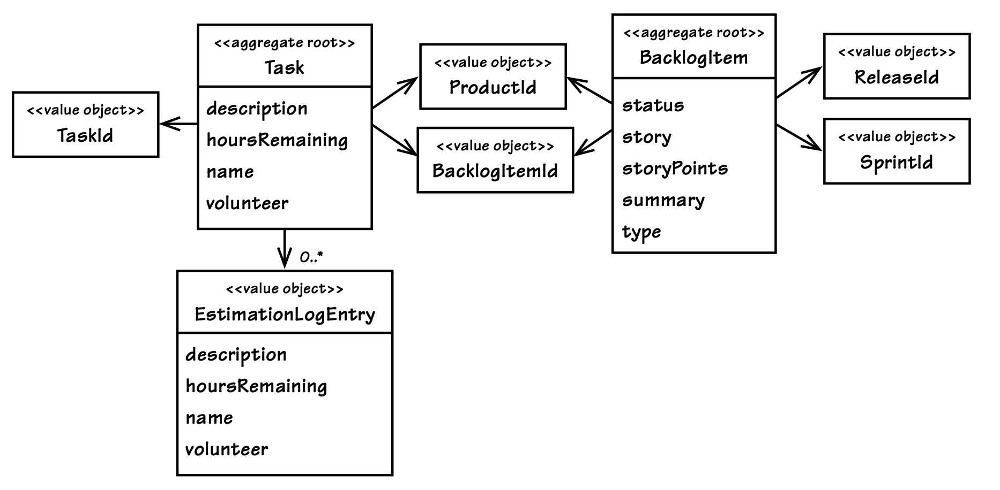

## 通过探索获得洞见

#### ▶[上一节](6.md)

在应用`Aggregates`设计规则的过程中，我们将看到恪守这些规则对 SaaSOvation Scrum 模型设计产生的影响。
我们也将看到项目团队如何运用新掌握的方法，重新思考其设计方案。
这一探索过程，让团队对该模型形成了全新的洞见。
他们尝试了各类设计思路，又在实践中不断迭代优化。

### 重新思考设计方案

在完成拆分大型 Product 的重构迭代后，BacklogItem 如今作为独立的`Aggregate`存在，
其设计对应 [图 10.7](#figure-107) 所示的模型。
团队在 BacklogItem `Aggregate`内构建了 Task 实例的集合，
每个 BacklogItem 均拥有全局唯一的标识，其 BacklogItemId。
与其他所有`Aggregates`的关联均通过标识实现，
这意味着其所属的 Product、被规划至的 Release 以及被提交至的 Sprint，均以标识作为引用依据。
该`Aggregate`的设计已相当精简。

如今团队热衷于设计小型`Aggregates`，他们是否有可能在这一方向上做得过了头？

---
| ||
|---|---|
| 尽管上一次迭代带来了不错的成果，但团队仍存有一些顾虑。例如，story 属性可支持大篇幅文本的录入。尽管开发敏捷故事 (stories) 的团队并不会撰写冗长的文字内容，但系统中仍配备了一个可选的编辑器组件，支持编写内容丰富的用例定义，而这类内容的字节数可能达到数千之多。这一情况所可能产生的额外开销，值得团队认真考量。||

#### Figure 10.7
</br>
*完整构建的 BacklogItem `Aggregate`*

考虑到这一潜在的额外开销，再加上此前在设计 [图 10.1](1.md#figure-101) 和 [图 10.3 ](3.md#figure-103) 中的大型 Product 时已出现的失误，团队当下的工作重心便是缩减该`Bounded Context`中所有`Aggregate`的规模。
一系列关键问题随之浮现：
BacklogItem 与 Task 之间是否存在需要此关联来维护的真正不变量？
这是否又是一个可进一步拆分关联、并安全构建两个独立`Aggregates`的场景？
维持现有设计会产生哪些综合成本？

团队做出合理判断的关键在于`Ubiquitous Language`，其中对一项不变量作出了如下表述：

- 当待办项的相关任务取得进展时，团队成员需预估该任务的剩余工时。

- 当团队成员预估某一具体任务的剩余工时为零时，该待办项会检查所有相关任务的剩余工时；若所有任务均无剩余工时，待办项的状态将自动变更为已完成。

- 当团队成员预估某一具体任务的剩余工时为一小时及以上，且该待办项当前状态已为已完成时，其状态将自动回退。

这显然是一项真正的不变量。
待办项的正确状态会被自动调整，且完全取决于其所有任务的剩余工时总和。
若要让任务剩余工时总和与待办项状态保持一致，那么 [图 10.7](#figure-107) 所设定的`Aggregate`一致性边界便是合理的。
然而，团队仍然应当评估当前 cluster 在性能和可扩展性方面可能产生的成本。
这将与他们可能节省的时间进行权衡，如果待办事项的状态可以与剩余任务总小时数保持最终一致的话。

---

有些人会将此视为运用最终一致性的经典场景，但我们目前暂不急于得出这一结论。
我们先分析事务一致性的实现方案，再探究通过最终一致性能够达成的效果。
之后再自行判断哪种方案更可取。

### 评估`Aggregate`成本

如 [图 10.7](#figure-107) 所示，每个 Task 均包含一个 EstimationLogEntry 实例集合。
这些日志对团队成员录入新剩余工时估算值的具体场景进行建模。
实际应用中，每个 BacklogItem 会包含多少个 Task 元素，单个 Task 又会包含多少个 EstimationLogEntry 元素。
目前无法给出确切答案。
这在很大程度上取决于单个任务的复杂程度以及迭代的持续时长。
但通过一些粗略估算 (back-of-the-envelope, BOTE) 或许能得出有价值的参考结论 [[Bentley](../bibli.md#bentley)] 。

团队成员在处理某项任务后，通常会在次日重新估算该任务的工时。
一般来说，大多数迭代的周期为两周或三周。
也会有周期更长的迭代，但两周至三周的时长是较为常见的情况。
因此我们取 10 到 15 天之间的一个数值，暂定为 12 天，毕竟实际中两周周期的迭代可能要多于三周的。

接下来考虑为每项任务分配的工时数。
要知道，任务必须被拆解为可管理的单元，因此我们通常会将单任务工时设定在 4 到 16 小时之间。
按照 Scrum 领域的专业建议，若某项任务的预估工时超过 12 小时，就需要对其进行进一步拆分。
这里我们先以 12 小时为基准进行测算，这样能更方便地模拟工时的均匀分配情况。
我们可以说，在冲刺的 12 天中，每天都会在每项任务上工作一小时。
这样做更有利于复杂任务。
因此，我们将为每个任务进行 12 次重新估算，假设每个任务最初分配了 12 个小时。

问题仍然存在：每个待办事项需要多少任务？
这也是一个很难回答的问题。
如果我们考虑每个功能切片的每一层 [Layer (4)](../ch4/0.md) 或 [Hexagonal Port-Adapter (4)](../ch4/0.md) 需要两到三个任务呢？
例如，我们可能会为 [User Interface Layer (14)](../ch14/0.md) 计算三个任务，为 [Application Layer (14)](../ch14/0.md) 计算两个任务，为`Domain Layer`计算三个任务，为 [Infrastructure Layer (14)](../ch14/0.md) 计算三个任务。
这样我们总共就有 11 个任务。
可能刚好合适，也可能略少，但我们已经倾向于对任务估算略多一点。
为了更宽松一些，我们将每个待办事项的任务增加到 12 个。
这样我们就允许每个待办事项有 12 个任务，每个任务有 12 个估算记录， *每个待办项总共收集了 144 个对象* 。
虽然这可能比常规更多，但它为我们提供了一个详细的 BOTE 计算基础。

还有一个变量需要考虑。
如果团队普遍遵循 Scrum 专家提出的拆分更细粒度任务的建议，情况会发生一定变化。
将任务数量增加一倍（24 项），同时将估算日志条目数量减半（6 条），创建的对象的总数仍为 144 个。
但这会导致在所有工时估算请求的处理过程中，需要加载更多任务（24 项而非 12 项），每次请求都会占用更多内存。
团队会尝试多种组合方式，验证其是否会对性能测试结果产生显著影响。
不过在初始阶段，团队将采用 12 项任务、每项任务对应 12 条估算日志的设定开展测试。

### 常见使用场景

现在必须考虑常见的使用场景。
单次用户请求是否需要将全部 144 个对象一次性加载至内存？
这种情况是否有可能发生？
从目前来看似乎不会，但团队仍需对此进行验证。
若并非如此，实际可能加载的对象数量上限大概是多少？
此外，是否通常会出现多客户端使用的情况，进而导致待办项产生并发冲突？
我们来逐一分析。

以下场景均基于使用 Hibernate 实现持久化，
且每种`Entity`类型均配有自身的乐观并发版本属性。
该方案具备可行性，原因在于 BacklogItem 根`Entity`负责管理状态变更的不变量规则。
当待办项状态被自动修改（变更为已完成或回退至已提交）时，根的版本号会随之递增。
因此，各项任务的修改操作可独立执行，且并非每次任务修改都会对根产生影响，除非结果是状态变更。
（如果使用例如基于文档的存储，则可能需要重新审视以下分析，因为每次修改已收集的部分时，根实际上都会被修改。）

当一个待办事项首次创建时，它包含的任务数为零。
通常，任务直到冲刺规划会议才会被定义。
在那个会议上，团队会识别出具体的任务。
每当一个任务被提出时，团队成员会将其添加到对应的待办事项中。
没有必要让两名团队成员为了`Aggregate`而相互竞争，就好像在比谁能更快地输入新任务一样。
那样会导致冲突，其中一个请求会失败（之前由于同时向 Product 添加不同部分而失败的原因也是相同的）。
然而，这两名团队成员很可能很快就会意识到他们重复工作的弊端。

如果开发人员发现，确实存在多名用户经常需要同时添加任务的场景，这将对分析结果产生重大影响。
这一发现可能会直接改变权衡的天平，使得将 BacklogItem 和 Task 拆分为两个独立`Aggregates`的方案更具优势。
另一方面，这也可能是一个优化 Hibernate 映射的绝佳时机，可以将 optimistic-lock（乐观锁）选项设置为 false。
在这种场景下，允许任务被同步新增是具有合理性的，尤其是当这些操作不会引发性能问题和可扩展性问题时。

如果任务最初估计为零小时，后来更新为准确估计，我们仍然通常不会遇到并发冲突，尽管这会增加一条额外的估算日志条目，使我们的 BOTE 总数增加到 13。
这里的同时使用不会改变待办事项的状态。
同样，任务只有在从大于零小时变为零小时时才会推进为已完成，或者如果已经完成且小时数从零变为一小时或更多时，才会回归为已提交 —— 这是两种不常见的情况。

每天的估算会引起问题吗？
在冲刺的第一天，通常在待办事项的某个任务上没有任何估算记录。
在第一天结束时，每个负责该任务的志愿团队成员将估算工时减少一小时。
这会为每个任务添加一个新的估算记录，但待办事项的状态保持不变。
由于只有一个团队成员调整工时，所以任务之间从不会产生争议。
直到第 12 天，我们才到达状态转换的临界点。
不过，即使任意 11 个任务的工时减至零，待办事项的状态也不会改变。
只有最后一次估算，即第 12 个任务的第 144 次估算，才会导致状态自动转换为完成状态。

---
这一分析使团队得出了一个重要的认识。
即使他们改变使用场景，将任务完成速度加倍（六天），甚至完全混合使用，也不会改变任何情况。
总是最后的估算会决定状态的转变，从而修改根。
这看起来是一个安全的设计，尽管内存开销仍然存在疑问。

---

### 内存占用

接下来分析内存占用问题。
关键要点在于，工时估算结果会按日期作为`Value Objects`象进行记录。
若团队成员在同一天内对工时进行多次重新估算，系统仅保留最新的一次估算结果。
集合中同一日期的最新`Value`会覆盖此前的记录。
目前系统并无追踪任务估算失误的需求。
现有假设为，单个任务的估算日志条目数不会超过迭代的实际进行天数。
如果任务是在冲刺计划会议前一天或多天定义的，并且在这些早期的某一天重新估算了小时数，那么这个假设就会改变。
每发生一天都会增加一个额外的日志。

每次重新估算时，任务和估算在内存中的总数是多少呢？
当对任务和估算日志使用延迟加载时，每个请求一次最多会在内存中收集到 12 加 12 个对象。
这是因为访问该集合时，所有 12 个任务都会被加载。
要向其中一个任务添加最新的估算日志条目，我们必须加载估算日志条目的集合。
这可能还会增加多达 12 个对象。
最终，`Aggregate`设计需要一个待办事项、12 个任务和 12 个日志条目，总计最多 25 个对象。
这并不多；这是一个小型`Aggregate`。
另一个因素是，对象数量的高端（例如 25）直到冲刺的最后一天才会达到。
在冲刺的大部分时间里，`Aggregate`甚至更小。

这种设计会因为懒加载而导致性能问题吗？
可能会，因为它实际上需要两次懒加载，一次用于任务，另一次用于其中一个任务的估算日志条目。
团队需要进行测试，以调查多次获取可能带来的开销。

还有一个因素。
Scrum 使团队能够进行实验，以确定适合其实践的正确计划模型。
正如 [[Sutherland](../bibli.md#sutherland)] 所解释的，有经验的团队如果有已知的速率，可以使用故事点而不是任务小时来进行估算。
在定义每个任务时，他们可以为每个任务只分配一小时。
在冲刺期间，他们只会对每个任务重新估算一次，当任务完成时，将一小时改为零。
因为这与`Aggregate`设计有关，使用故事点可以将每个任务的总估算记录数减少到只有一个，并几乎消除了内存开销。

| ||
|---|---|
|后续，ProjectOvation 的开发人员将能够通过分析实际生产数据，统计得出每个待办项实际对应的任务数量和估算日志条目数量的平均值。</br>上述分析已足以推动团队基于这些粗略估算结果开展测试。但测试结果并未得出明确结论，团队因此认为，仍存在太多变量，无法确信该设计能妥善解决他们所关注的问题。鉴于未知因素较多，团队决定考虑另一种设计方案。||

### 探索另一种设计方案

是否存在另一种设计，能让`Aggregate`边界更贴合实际使用场景？

#### Figure 10.8

*BacklogItem 与 Task 作为独立`Aggregates`的建模设计*

---
为做到周全详尽，团队希望全面梳理清楚：若要将 Task 设计为独立`Aggregate`，他们需要开展哪些工作，以及这样做是否真的能为团队带来收益。
他们构想的方案如 [图 10.8](#figure-108) 所示。
采用该方案能够减少 12 个关联对象带来的组合开销，同时降低延迟加载（懒加载）的开销。
事实上，倘若立即加载 (eagerly load) 估算日志条目能带来最佳性能，这种设计也赋予了团队在所有场景下都启用该方式的选择权。

开发团队一致同意，不在同一个事务中修改两个独立的`Aggregate`，即 Task 和 BacklogItem `Aggregates`。
他们必须确认，能否在可接受的时间范围内完成必要的状态自动变更。
由于待办项的状态无法通过事务保证一致性，这就意味着他们不得不弱化该不变量的一致性要求。
这种让步是否可以接受？
团队就此问题与领域专家展开了讨论，了解到：最终工时预估为零与待办项状态更新为已完成之间的些许延迟，以及反之（状态从已完成回退与工时预估大于零之间的延迟），都是可以被接受的。

---

### 实现最终一致性

看起来，在独立`Aggregates`之间存在着合理使用最终一致性的场景。以下将介绍其具体实现方式。

---

当一个 Task 处理 estimateHoursRemaining() 命令时，它会发布相应的`Domain Event`。
这一行为已经存在，但团队现在将利用该事件来实现最终一致性。
该事件的模型具有以下 properties：

```java
public class TaskHoursRemainingEstimated implements DomainEvent {
    private Date occurredOn;
    private TenantId tenantId;
    private BacklogItemId backlogItemId;
    private TaskId taskId;
    private int hoursRemaining;
    ...
}
```

专用订阅者现监听此类`Domain Event`，并委托`Domain Serviec`协调一致性处理流程。该服务将执行以下操作：

- 借助 BacklogItemRepository 获取指定的 BacklogItem。
- 借助 TaskRepository 获取与指定 BacklogItem 关联的所有 Task 实例
- 执行 BacklogItem 的 estimateTaskHoursRemaining() 命令，传入`Domain Event`的 hoursRemaining 参数及已获取的 Task 实例。
BacklogItem 可能根据传入的参数转换其状态。

团队应当找到优化此流程的方法。
三步设计要求每次重新估算时都要加载所有 Task 实例。
在使用我们的 BOTE 估算并持续推进到完成时，144 次中有 143 次这是不必要的。
这可以相当容易地优化。
与其使用`Repository`获取所有 Task 实例，他们可以直接向`Repository`请求数据库计算出的所有 Task 工时总和：

```java
public class HibernateTaskRepository implements TaskRepository {
    ...
    public int totalBacklogItemTaskHoursRemaining(
        TenantId aTenantId,
        BacklogItemId aBacklogItemId) {

        Query query = session.createQuery(
            "select sum(task.hoursRemaining) from Task task "
            + "where task.tenantId = ? and "
            + "task.backlogItemId = ?");
        ...
    }
}
```

---

最终一致性会略微增加用户界面的复杂度。
除非状态转换能在数百毫秒内完成，否则用户界面该如何展示新状态？
是否应在视图中植入业务逻辑以判定当前状态？
这会构成`smart UI`反模式。
或许视图只能展示过期状态，任由用户面对视觉上的不一致性。
而这很容易被用户视为程序缺陷，至少也会带来极差的使用体验。

---
这个视图可以使用后台的 Ajax 轮询请求，但那可能效率很低。
由于视图组件无法轻松确定何时需要检查状态更新，大多数 Ajax 请求都是不必要的。
根据我们的 BOTE 数据，144 次重新估算中有 143 次不会触发状态更新，这会在 Web 层产生大量冗余请求。
在有适当服务器端支持的情况下，客户端可以依赖 Comet（也就是 Ajax Push）。
尽管这是一个不错的挑战，但这将引入团队没有经验的新技术。

另一方面，也许最好的解决方案是最简单的。
他们可以选择在屏幕上放置一个视觉提示，告知用户当前状态不确定。
视图可以建议一个回访或刷新时间段。
或者，状态变化可能会在下一个渲染的视图中显示。
这是安全的。
团队需要进行一些用户验收测试，但前景看起来很有希望。

---

### 这是团队成员的工作吗？

到目前为止，一个重要的问题完全被忽视了：
是谁的工作将待办事项的状态与所有剩余的任务小时数保持一致？
使用 Scrum 的团队成员是否在乎，当他们将最后一个任务的小时数设为零时，父待办事项的状态是否会过渡到完成？
他们是否总是知道自己正在处理的最后一个任务还有剩余小时数？
也许他们会知道，也许让每个待办事项正式完成是每个团队成员的责任。

另一方面，如果还有其他项目干系人参与呢？
例如，产品负责人或其他某个人可能希望检查候选待办事项是否已完成得令人满意。
也许有人想先在持续集成服务器上使用该功能。
如果其他人对开发人员的完成声明感到满意，他们将手动将状态标记为完成。
这无疑改变了情况，表明既不需要事务一致性，也不需要最终一致性。
任务可以从其父待办事项中拆分出来，因为这个新用例允许这样做。
然而，如果确实应该由团队成员触发任务自动过渡到完成状态，那么这意味着任务很可能应该在待办事项内进行组合，以实现事务一致性。
有趣的是，这里也没有明确的答案，这可能表明它应该是一个可选的应用偏好。
将任务保留在其待办事项中可以解决一致性问题，这是一种建模选择，可以支持自动和手动状态过渡。

---
| ||
|---|---|
|这项有价值的练习揭示了该领域的一个全新方面。看起来团队应该能够配置工作流程偏好。他们现在不会实施这样的功能，但会将其提出以供进一步讨论。 *问 “这是谁的工作？” 让他们对自己的领域产生了一些重要的认识。* ||

接下来，其中一位开发人员提出了一个非常实用的建议，作为对整个分析的替代方案。
如果他们主要关注的是 story 属性可能带来的开销，为什么不针对这一点采取一些措施呢？
他们可以减少 story 的总存储容量，并另外创建一个新的 useCaseDefinition property。
他们可以设计它为延迟加载，因为很多时候它根本不会被使用。
或者他们甚至可以将其设计为一个独立的`Aggregate`，仅在需要时加载。
有了这个想法，他们意识到可能是一个打破 “仅通过身份引用外部`Aggregates`” 规则的好时机。
这似乎是一个合适的建模选择：使用直接对象引用，并声明其对象关系映射以实现延迟加载。
也许这样是合理的。

---

### 决策时刻

此类分析无法无休止进行，必须做出决策。
当下选定某一方向，并非意味着后续无法转向其他方案，而此刻的开放考量正成为务实推进的阻碍。

---
根据所有这些分析，目前团队对将 Task 与 BacklogItem 分开持谨慎态度。
他们无法确定现在拆分是否值得额外的努力，是否有风险导致真正的不变条件得不到保护，或让用户在视图中看到可能过时的状态。
他们理解的当前`Aggregate`相对较小。
即使在他们最常见的最坏情况下加载 50 个对象而不是 25 个，也仍然是一个合理大小的集群。
*目前他们计划围绕专门的用例定义持有者进行操作*。
这样做是一个快速见效的方法，并带来诸多好处。
风险很小，因为它现在可以正常工作，如果未来他们决定将 Task 从 BacklogItem 中拆分，也可以顺利运行。

将其拆分成两部分的选项仍然保留着，以防万一。
在对当前设计进行进一步实验、进行性能和负载测试，以及调查用户对最终一致状态的接受度后，将会更清楚哪种方法更好。
如果在生产中`Aggregate`比预想的更大，BOTE 数字可能是不准确的。
如果是这样，团队毫无疑问会把它拆分成两部分。

---

如果你是 ProjectOvation 团队的一员，你会选择哪种建模方案？
不要回避案例研究中展示的探索会话。
整个过程大约需要 30 分钟，最坏情况可能需要 60 分钟。
花时间深入了解你的`Core Domain`是非常值得的。

#### ▶[下一节](8.md)
