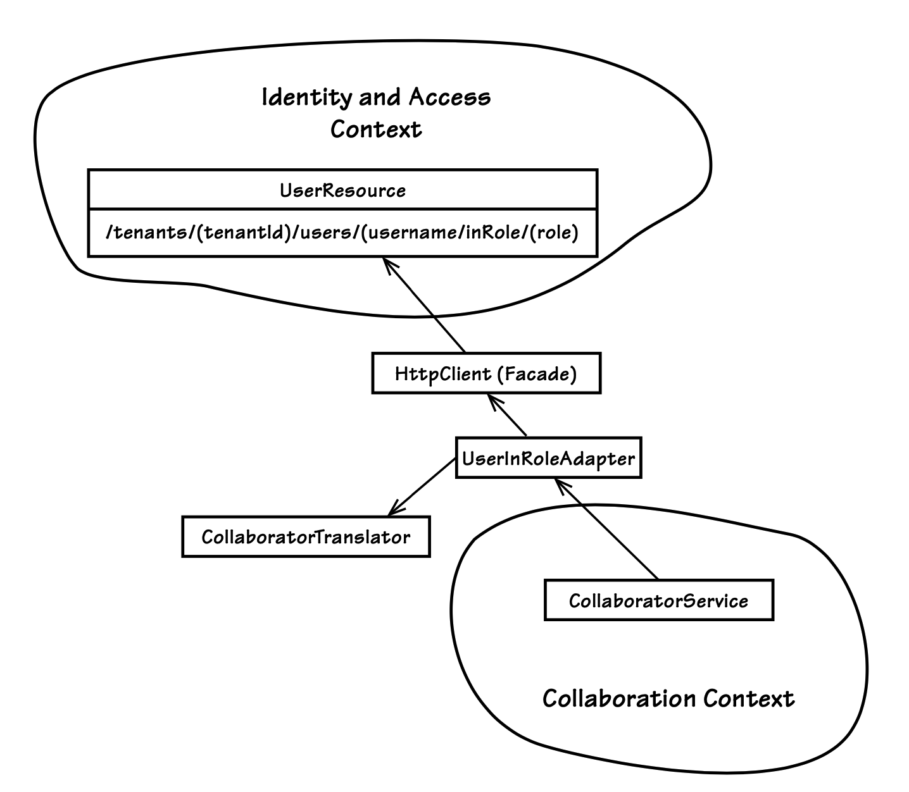

## 使用 RESTful 资源进行集成

#### ▶[上一节](1.md)

当一个`Bounded Context`通过 URI 提供一组丰富的 RESTful 资源时，它就构成了一种 [Open Host Service (3)](../ch3/0.md)：

- 定义一种协议，将你的子系统作为一组服务提供访问权限。
开放该协议，以便所有需要与你集成的对象都能使用它。
增强并扩展该协议，以处理新的集成需求。 [[Evans](../bibli.md#evans)]

我们完全可以将 HTTP 方法 ——GET、PUT、POST 和 DELETE—— 与其操作的资源结合起来，视为一组开放服务。
HTTP 和 REST 无疑构成了一种开放协议，允许所有需要与该子系统集成的对象进行集成。
事实上，可以创建几乎无限数量的资源 ——每个资源都通过 URI 拥有唯一标识—— 这使得该协议能够根据需要处理新的集成需求。
这是一种非常通用的方式，允许客户端与你的`Bounded Context`进行集成。

即便如此，由于每当操作资源时都必须与 RESTful 服务提供者直接交互，这种方式无法让客户端实现完全自治。
如果基于 REST 的`Bounded Contexts`因某种原因不可用，依赖它的客户端`Bounded Context`在其停机期间将无法执行必要的集成操作。

不过，我们可以通过降低对 RESTful 资源的依赖程度，在一定程度上克服这一障碍，减少对消费者自治性的阻碍。
即使 RESTful（或就此而言的 RPC）是你唯一的集成方式，你也可以在自身系统中使用定时器或消息机制，营造出时间解耦的假象。
这样，你的系统仅在定时器超时或接收到消息时，才会与远程系统交互。
如果远程系统不可用，可以退避 (back off) 定时器阈值，或者如果使用消息机制，可以向代理发送否定确认并重新投递消息。
这自然会给你的团队带来更多实现系统松耦合的负担，但这或许是你为实现自治性所必须付出的代价。

---
| ||
|:---|---:|
|当负责开发`Identity and Access Context`的 SaaSOvation 团队需要为集成方创建一种使用其`Bounded Context`的方式时，他们确定 RESTful HTTP 是开放其系统进行集成的最佳方式之一，同时不会直接暴露其领域模型的结构和行为细节。对他们而言，这意味着设计一组 RESTful 资源，以租户为单位提供身份和访问概念的表示形式。 ||

他们的大部分设计将允许集成的`Bounded Contexts`通过 GET 请求获取传达用户和组身份的资源，并同时表明这些身份类型的基于角色的安全权限。
例如，如果一个集成客户端需要知道给定租户内的某个用户是否可以扮演特定的访问角色，客户端应使用以下 URI 格式 GET 一个资源：

```HTTP
/tenants/{tenantId}/users/{username}/inRole/{role}
```

如果租户的用户拥有该角色，资源表示将包含在成功的 200 响应中。
否则，如果用户不存在或不拥有该指定角色，响应将是 204 No Content 状态码。
这是一个简单的 RESTful HTTP 设计。

让我们看看团队是如何暴露访问资源的，以及集成客户端如何根据自身`Bounded Context`的 [Ubiquitous Language (1)](../ch1/0.md) 来使用这些资源。

---

### 实现 RESTful 资源
当 SaaSOvation 开始将 REST 原则应用到其某个`Bounded Contexts`时，他们学到了一些重要的经验。让我们看看他们的实践历程。

---
当负责`Identity and Access Context`的 SaaSOvation 团队考虑如何为集成方提供`Open Host Service`时，他们曾考虑直接将领域模型暴露为一组 RESTful 链接资源。
这意味着允许 HTTP 客户端获取唯一的租户资源，并通过它导航到用户、组和角色。
这是个好主意吗？起初这似乎很自然。
毕竟，这能为客户端提供最大的灵活性。
客户端可以了解领域模型的所有信息，并在自己的`Bounded Context`中自行决策。

哪种 DDD `Context Mapping`模式最能描述这种设计方法？
实际上，这并非`Open Host Service`，而是根据共享模型的规模，成为`Shared Kernel`或 [Conformist (3)](../ch3/0.md)。
发布`Shared Kernel`或接受`Conformist`关系会使消费者与被消费的领域模型形成紧耦合集成。
这类关系应尽可能避免，因为它们往往与 DDD 最根本的目标背道而驰。

幸运的是，团队在过程中找到了一些好建议，避免了以这种方式将模型暴露给客户端。
他们学会了从集成方所需的用例（或用户故事）出发进行思考。
这与`Open Host Service`定义中的这部分内容相契合：“增强并扩展协议以处理新的集成需求。”
这意味着你只需提供集成方当前所需的内容，而只有通过考虑一系列用例场景，才能理解这些需求。

---

团队遵循这一建议后意识到，例如，集成方真正关心的是某个特定用户是否能担任特定角色。
让集成方无需了解领域模型的细节，最终会提高他们的工作效率，并使依赖的`Bounded Contexts`更易于维护。
从设计角度来看，这意味着他们的用户 RESTful 资源可以包含以下设计：

```java
@Path("/tenants/{tenantId}/users")
public class UserResource {
    ...
    @GET
    @Path("{username}/inRole/{role}")
    @Produces({ OvationsMediaType.ID_OVATION_TYPE })
    public Response getUserInRole(
            @PathParam("tenantId") String aTenantId,
            @PathParam("username") String aUsername,
            @PathParam("role") String aRoleName) {

        Response response = null;

        User user = null;

        try {
            user = this.accessService().userInRole(
                        aTenantId, aUsername, aRoleName);
        } catch (Exception e) {
            // fall through
        }

        if (user != null) {
            response = this.userInRoleResponse(user, aRoleName);
        } else {
            response = Response.noContent().build();
        }

        return response;
    }
    ...
}
```

在 [Hexagonal (4)](../ch4/0.md) 或`Ports and Adapters`架构中，UserResource 类是 JAX-RS 实现所提供的 RESTful HTTP 端口的适配器。
消费者以如下形式发起请求：

```
GET /tenants/{tenantId}/users/{username}/inRole/{role}
```

该适配器将请求委托给 AccessService，这是一个在六边形内部提供 API 的 [Application Service (14)](../ch14/0.md) 。
作为领域模型的直接客户端，AccessService 管理用例任务和事务。该任务包括判断用户是否存在，若存在，则判断其是否拥有指定角色：

```java
package com.saasovation.identityaccess.application;
...
public class AccessService ... {
    ...
    @Transactional(readOnly=true)
    public User userInRole(
            String aTenantId,
            String aUsername,
            String aRoleName) {
    
        User userInRole = null;

        TenantId tenantId = new TenantId(new TenantId(aTenantId));

        User user =
            DomainRegistry
                .userRepository()
                .userWithUsername(tenantId, aUsername);

        if (user != null) {
            Role role =
                DomainRegistry
                    .roleRepository()
                    .roleNamed(tenantId, aRoleName);

            if (role != null) {
                GroupMemberService groupMemberService =
                        DomainRegistry.groupMemberService();
                if (role.isInRole(user, groupMemberService)) {
                    userInRole = user;
                }
            }
        }

        return userInRole;
    }
    ...
}
```

`Application Service`会同时查找 User 和指定的 Role `Aggregate`。
当调用 Role 查询方法 isInRole() 时，会传入一个 GroupMemberService。
这并非`Application Service`，而是一个 [Domain Service (7)](../ch7/0.md) ，用于协助 Role 执行某些特定领域的检查和查询，这些职责本不应由 Role 自身承担。

UserResource 的 Response 由解析后的 User 和特定角色名构成，并使用一种自定义媒体类型：

```java
package com.saasovation.common.media;

    public class OvationsMediaType {
        public static final String COLLAB_OVATION_TYPE =
                "application/vnd.saasovation.collabovation+json";
        public static final String ID_OVATION_TYPE =
                "application/vnd.saasovation.idovation+json";
        public static final String PROJECT_OVATION_TYPE =
                "application/vnd.saasovation.projectovation+json";
    ...
}
```

当用户拥有指定角色时，UserResource 适配器会生成一个包含如下 JSON 表示形式的 HTTP 响应：

```HTTP
 HTTP/1.1 200 OK
Content-Type: application/vnd.saasovation.idovation+json
...
{
    "role":"Author","username":"zoe",
    "tenantId":"A94A8298-43B8-4DA0-9917-13FFF9E116ED",
    "firstName":"Zoe","lastName":"Doe",
    "emailAddress":"zoe@saasovation.com"
}
```

接下来你将看到，该 RESTful 资源的集成消费者可以将其转换为自身`Bounded Context`所需的特定领域对象。

### 使用`Anticorruption Layer`实现 REST 客户端

尽管`Identity and Access Context`生成的 JSON 表示对客户端集成方非常有用，但当我们聚焦于 DDD 的目标时，客户端`Bounded Context`不会直接使用该表示形式。
正如前几章所讨论的，如果消费者是`Collaboration Context`，其团队并不关心原始用户及其角色。
相反，协作模型的开发团队关注的是特定领域的角色。
在其他模型中存在一组可被分配至一个或多个角色（由 Role 对象建模）的 User 对象，这一事实并非`Collaboration Context`的核心关注点。

那么，我们如何让 “用户-角色” 表示形式服务于我们特定的协作目标呢？
让我们再看一下之前绘制的`Context Map`，这次是 [图 13.1](#figure-131) 。
上一小节已经展示了 UserResource 适配器的关键部分。
接下来需要为`Collaboration Context`专门开发接口和类。
它们是 CollaboratorService、UserInRoleAdapter 和 CollaboratorTranslator 。
还有 HttpClient，但它是由 JAX-RS 实现通过 ClientRequest 和 ClientResponse 类提供的。

#### Figure 13.1
</br>
*`Identity and Access Context`的`Open Host Service`与`Collaboration Context`用于二者集成的`Anticorruption Layer`*

CollaboratorService、UserInRoleAdapter 和 CollaboratorTranslator 三者共同构成了 [Anticorruption Layer (3)](../ch3/0.md) ，`Collaboration Context`通过该层与`Identity and Access Context`进行交互，并将 “用户-角色” 表示形式转换为特定类型 Collaborator 的`Value Object`。

以下是 CollaboratorService 接口，它定义了`Anticorruption Layer`的简单操作：

```java
public interface CollaboratorService  {
    public Author authorFrom(Tenant aTenant, String anIdentity);
    public Creator creatorFrom(Tenant aTenant, String anIdentity);
    public Moderator moderatorFrom(Tenant aTenant, String anIdentity);
    public Owner ownerFrom(Tenant aTenant, String anIdentity);
    public Participant participantFrom(
            Tenant aTenant, String anIdentity);
}
```

从 CollaboratorService 客户端的角度来看，该接口完全抽象了远程系统访问的复杂性，以及随后从`Published Language`到遵循本地`Ubiquitous Language`的对象的转换过程。
在这个特定案例中，我们确实使用了`Separated Interface` [[Fowler, P of EAA](../bibli.md#fowler-p-of-eaa)] 和一个实现类，因为实现是技术性的，不应驻留在`Domain Layer`。

所有这些 [Factories (11)](../ch11/0.md) 彼此都非常相似。
它们都创建抽象 Collaborator `Value`类型的子类，但前提是 aTenant 内具有某个 anIdentity 的用户必须扮演以下五种类型之一的安全角色：Author, Creator, Moderator, Owner 和 Participant 。
由于它们非常相似，我们只看其中一个方法实现，即 authorFrom()：

```java
package com.saasovation.collaboration.infrastructure.services;
import com.saasovation.collaboration.domain.model.collaborator.Author;
...
public class TranslatingCollaboratorService
       implements CollaboratorService  {
    ...
    @Override
    public Author authorFrom(Tenant aTenant, String anIdentity) {
        Author author =
            this.userInRoleAdapter
                .toCollaborator(
                        aTenant,
                        anIdentity,
                        "Author",
                        Author.class);
   
         return author;
    }
    ...
}
```

首先请注意，TranslatingCollaboratorService 位于基础设施层的一个 [Module (9)](../ch9/0.md) 中。
我们在六边形架构的内部创建`Separated Interface`，作为领域模型的一部分。
然而，其实现是技术性的，位于`Hexagonal`架构的外部，即`Ports and Adapters`所在的位置。

作为技术实现的一部分，`Anticorruption Layer`通常会包含一个专门的`Adapter` [[Gamma et al.](../bibli.md#gamma-et-al)] 和一个转换器。
再次查看 [图 13.1](#figure-131) ，你可以看到我们的特定适配器是 UserInRoleAdapter，而转换器是 CollaboratorTranslator。
此`Anticorruption Layer`中的专用 UserInRoleAdapter 负责访问远程系统，请求所需的用户角色资源：

```java
package com.saasovation.collaboration.infrastructure.services;

import org.jboss.resteasy.client.ClientRequest;
import org.jboss.resteasy.client.ClientResponse;
...
public class UserInRoleAdapter {
    ...
    public <T extends Collaborator> T toCollaborator(
            Tenant aTenant,
            String anIdentity,
            String aRoleName,
            Class<T> aCollaboratorClass) {

        T collaborator = null;

        try {
            ClientRequest request =
                    this.buildRequest(aTenant, anIdentity, aRoleName);

            ClientResponse<String> response =
                    request.get(String.class);

            if (response.getStatus() == 200) {
                collaborator =
                    new CollaboratorTranslator()
                        .toCollaboratorFromRepresentation(
                            response.getEntity(),
                            aCollaboratorClass);
            } else if (response.getStatus() != 204) {
                throw new IllegalStateException(
                        "There was a problem requesting the user: "
                        + anIdentity
                        + " in role: "
                        + aRoleName
                        + " with resulting status: "
                        + response.getStatus());
            }

        } catch (Throwable t) {
            throw new IllegalStateException(
                    "Failed because: " + t.getMessage(), t);
        }

        return collaborator;
    }
    ...
}
```

如果对 GET 请求的响应成功（状态码 200），则意味着 UserInRoleAdapter 已接收到 "用户-角色" 资源，现在可以将其转换为我们的 Collaborator 子类：

```java
package com.saasovation.collaboration.infrastructure.services;

import java.lang.reflect.Constructor;
import com.saasovation.common.media.RepresentationReader;
...
public class CollaboratorTranslator {
    public CollaboratorTranslator() {
        super();
    }

    public <T extends Collaborator> T toCollaboratorFromRepresentation(
            String aUserInRoleRepresentation,
            Class<T> aCollaboratorClass)
    throws Exception {

        RepresentationReader reader =
                new RepresentationReader(aUserInRoleRepresentation);

        String username = reader.stringValue("username");
        String firstName = reader.stringValue("firstName");
        String lastName = reader.stringValue("lastName");
        String emailAddress = reader.stringValue("emailAddress");
 
        T collaborator =
            this.newCollaborator(
                    username,
                    firstName,
                    lastName,
                    emailAddress,
                    aCollaboratorClass);

        return collaborator;
    }

    private <T extends Collaborator> T newCollaborator(
            String aUsername,
            String aFirstName,
            String aLastName,
            String aEmailAddress,
            Class<T> aCollaboratorClass)
    throws Exception {

        Constructor<T> ctor =
            aCollaboratorClass.getConstructor(
                    String.class, String.class, String.class);

        T collaborator =
            ctor.newInstance(
                    aUsername,
                    (aFirstName + " " + aLastName).trim(),
                    aEmailAddress);

        return collaborator;
    }
}
```

该转换器接收一个 "用户-角色" 表示文本字符串以及用于创建 Collaborator 子类实例的类。
首先，使用 RepresentationReader（与之前介绍的 NotificationReader 非常相似）从 JSON 表示中读取四个属性。
我们能够自信且可靠地执行此操作，是因为 SaaSOvation 自定义媒体类型在生产者和消费者之间形成了绑定契约。
当转换器获取到必要的字符串值后，便使用这些值实例化 Collaborator `Value Object`，在本示例中即为 Author：

```java
package com.saasovation.collaboration.domain.model.collaborator;
public final class Author
       extends Collaborator  {

    public Author(
            String anIdentity,
            String aName,
            String anEmailAddress) {
        super(anIdentity, aName, anEmailAddress);
    }
    ...
}
```

我们不会努力让 Collaborator `Value`实例与`Identity and Access Context`保持同步。
它们是不可变的，只能被完全替换，而不能被修改。
以下是`Application Service`如何获取一个 Author 并将其交给 Forum 以发起新 Discussion 的过程：

```java
package com.saasovation.collaboration.application;
...
public class ForumService ... {
    ...
    @Transactional
    public Discussion startDiscussion(
            String aTenantId,
            String aForumId,
            String anAuthorId,
            String aSubject) {

        Tenant tenant = new Tenant(aTenantId);
        ForumId forumId = new ForumId(aForumId);

        Forum forum = this.forum(tenant, forumId);

        if (forum == null) {
            throw new IllegalStateException("Forum does not exist.");
        }

        Author author =
                this.collaboratorService.authorFrom(
                        tenant, anAuthorId);

        Discussion newDiscussion =
                forum.startDiscussion(
                        this.forumNavigationService(),
                        author,
                        aSubject);

        this.discussionRepository.add(newDiscussion);

        return newDiscussion;
    }
    ...
}
```

如果`Identity and Access Context,`中的 Collaborator 姓名或电子邮件地址发生变更，这些变更不会自动在`Collaboration Context`中更新。
这类变更极少发生，因此团队决定保持这一特定设计的简洁性，不尝试将远程上下文中的变更与本地上下文中的对象进行同步。
不过，我们将会看到，`Agile Project Management Context`有着不同的设计目标。

实现`Anticorruption Layer`还有其他方式，例如通过 [Repository (12)](../ch12/0.md) 。
然而，由于`Repositories`通常用于持久化和重建`Aggregates`，通过这种方式创建`Value Objects`似乎并不合适。
如果我们的目标是从`Anticorruption Layer`生成一个`Aggregate`，那么`Repository`可能是更自然的来源。

#### ▶[下一节](3.md)
