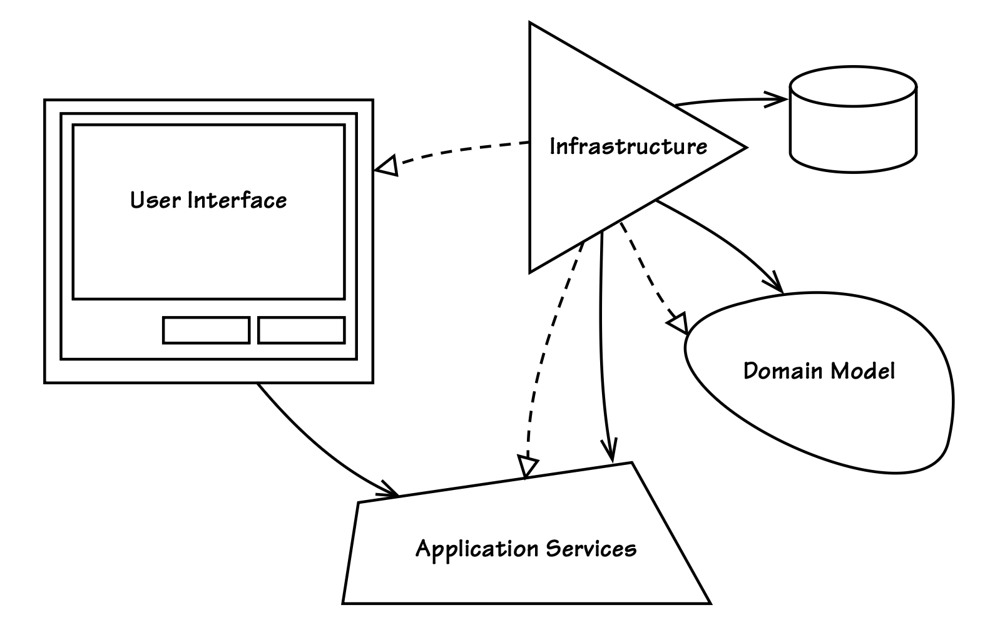

## 第 14 章：应用

#### ▶[上一节](../ch13/4.md)

*
任何程序的价值，仅取决于它的实用性。 
  ——Linus Torvalds
*

领域模型通常位于应用程序的核心。
应用程序可能拥有用户界面，用于呈现领域模型中的概念，并允许用户对模型执行各类操作。
用户界面会借助应用层服务来协调用例任务、管理事务，并执行必要的安全权限校验。
此外，用户界面、`Application Service`与领域模型还会依赖特定企业平台的基础设施支撑。
基础设施的实现细节通常包含组件容器、应用管理、消息传递与数据库等相关能力。

---
**
本章路线图
**

- 学习多种为用户界面渲染提供领域模型数据的方法。
- 了解`Application Service`的实现方式及其执行的操作类型。
- 研究将输出与`Application Service`及不同客户端类型解耦的方法。
- 思考为何需要在用户界面中组合多个模型，以及具体实现方式。
- 学习利用基础设施实现应用技术方案的多种途径。

---

有时我们会开发用于支撑应用的模型。
`Identity and Access Context`便是如此。
SaaSOvation 意识到需要将身份与访问管理相关关注点剥离出来，构建一个支撑模型，该模型未来也可作为独立的订阅制产品。
即便对于 IdOvation 而言，它也必然拥有专属的管理界面与自助服务用户界面。
诚然，[Generic Subdomains](../ch2/0.md) 与 [Supporting Subdomains (2)](../ch2/0.md) 有时会缺少完整应用所具备的各类附加能力，这并无不妥。
当一个模型用于支撑另一个模型时，该支撑模型可以非常简洁，仅由独立 [Module (9)](../ch9/0.md) 中的一组类构成，用于处理特定领域概念并提供相应算法 [1](#1) 。
另一些模型则至少需要一定的用户交互体验与应用组件。
本章重点讨论后一种、也更为复杂的类型。

在本文中，我们对 *应用 (application)* 、*系统 (system)* 和 *业务服务 (business service)* 这几个术语会在一定程度上互换使用。
我不会正式分析一个应用在何种情况下会成为系统，但可以认为：当一个应用通过集成依赖其他应用或服务时，整个解决方案便可称为系统。
有时，应用与系统这两个术语会被混用，指代同一事物；此时所谓的系统，实际上描述的就是我们通常所说的应用。
而从广义上讲，一个提供多个或大量技术服务端点的独立业务服务，也可能被称作系统。
我无意混淆这三个概念之间的明确边界，但希望使用统一的术语，来讨论三者共通的关注点与职责。

---
➜**何为应用？**

简而言之，我所使用的 *应用 (application)* 这一术语，是指为与[Core Domain (2)](../ch2/0.md) 模型交互并提供支撑而组装的最小粒度组件集合。
这通常包含领域模型本身、用户界面、内部使用的`Application Service`，以及基础设施组件。
每个部分具体包含哪些内容，会因应用不同而有所差异，且取决于所采用的具体 [Architectures (4)](../ch4/0.md) 。

---

当应用以编程方式对外提供服务时，其用户界面范围更广，包含一类应用程序编程接口（API）。
开放服务的方式有多种，但这类接口并非供人工直接使用。
此类用户界面将在 [Integrating Bounded Contexts (13)](../ch13/0.md) 中讨论。
本章主要讲解面向人类用户的界面，通常为图形化界面。

针对本主题，我尽量不偏向任何特定架构。
这一取舍体现在 [图 14.1](#figure-141) 中形式特殊的示意图里，该图刻意不遵循任何典型架构风格。
带空心箭头的虚线依照 UML 表示实现关系，体现了 [Dependency Inversion Principle (4)](../ch4/0.md)，或 DIP ；
带开放箭头的实线表示操作派发 (operation dispatching)。
例如，基础设施层实现来自用户界面、`Application Service`与领域模型的接口抽象，同时也向`Application Service`、领域模型与数据存储派发操作。

#### Figure 14.1
 
*应用的核心关注点区域，且不与任何单一架构绑定。这些区域依然强调 DIP ，即基础设施依赖于其他所有区域的抽象。*

虽然某些架构风格之间不可避免会有一些重叠，但本章的重点是任何架构为了支持应用目标而需要做的事情。对于具体架构涉及的情况，我会加以说明。

很难避免使用 *层（layer）* 这一术语，正如 [Layers Architecture (4)](../ch4/0.md) 中所指。
无论讨论何种架构风格，该术语都十分实用。
例如，以`Application Service`所处的位置为例：无论你将`Application Service`视为围绕领域模型的一环、包含模型的六边形结构、挂接在消息总线上的胶囊组件，还是位于用户界面下方、领域模型上方的一层，用`Application Layer`这一概念来描述其逻辑位置都是合理的。
尽管本章尽量避免过度使用 “层” 这一说法，但它在标注组件所处位置时依然很有帮助。
这绝不意味着 DDD 只能存在于分层架构中 [2](#2) 。

我将从用户界面开始，接着讲解`Application Service`，最后介绍基础设施。
在每个主题中，我都会说明领域模型所处的位置，但不会深入探讨模型本身，因为这与本书其他部分内容重复。

#### ▶[下一节](1.md)

---

#### 1
作为独立模型的`Generic Subdomain`示例，可参见 Eric Evans 的 “Time and Money Code Library”，网址：http://timeandmoney.sourceforge.net/ 。

#### 2
详见 [第 4 章](../ch4/0.md) 。
