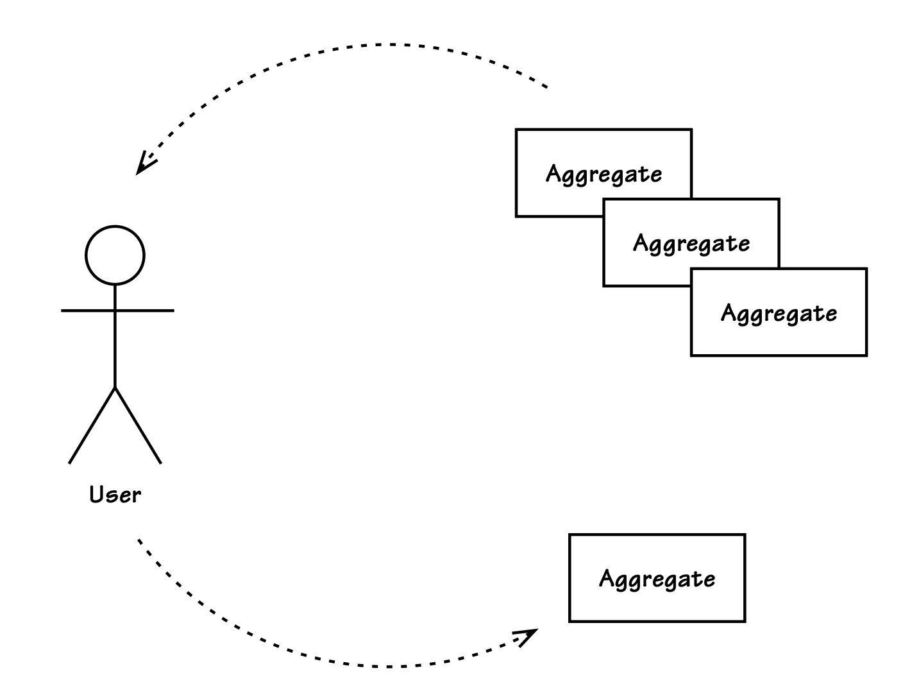

## 用户界面

#### ▶[上一节](0.md)

在 Java 平台、.NET 平台及其他平台上，面向人类用户的界面框架种类繁多，在此逐一分析其优劣既无意义，也无实际价值。

更有意义的是理解其更宽泛的分类，主要可归纳为以下几类。
这些分类是按照重量级排序，而非流行度。
在撰写本文时，几乎可以确定：第二类基于 Web 的富客户端界面是目前最主流的选择方向，且很快会受到 HTML5 的影响。
第一类纯请求-响应式 Web 界面的应用，作为遗留系统，其数量可能仍多于 Web 2.0 应用。

- 纯请求-响应式 Web 用户界面，最典型的代表即 Web 1.0。
Struts、Spring MVC 与 Web Flow、ASP.NET 等框架均支持此类界面。
- 基于 Web 的富互联网应用（RIA）用户界面，包括采用 DHTML 与 Ajax 技术的界面，即 Web 2.0。
Google GWT、Yahoo! YUI、Ext JS、Adobe Flex 及微软 Silverlight 均属于此类。
- 原生客户端图形用户界面（如 Windows、Mac、Linux 桌面界面），可使用抽象库开发（例如 Eclipse SWT、Java Swing，或 Windows 平台的 WinForms 与 WPF）。
这类界面不一定是重型桌面应用，但也存在这种可能。
例如，原生客户端 GUI 可通过 HTTP 访问服务，此时用户界面是唯一需要安装的客户端组件。

对于上述各类用户界面，都必须明确几个核心问题：
如何将领域对象呈现在界面上？
以及如何将用户操作反馈回领域模型？

### 领域对象的呈现

关于如何最有效地将领域模型对象呈现在用户界面上，业界存在诸多争议与分歧。
用户界面通常需要展示比完成直接任务所需更丰富的数据视图，这些额外数据的展示是必要的，因为它们能为用户提供辅助信息，帮助其做出合理决策以执行当前任务。
这些额外数据还可包含选择项。
因此，用户界面往往需要呈现多个 [Aggregate (10)](../ch10/0.md) 实例的属性。
尽管在大多数场景下，用户执行的状态变更操作仅作用于单一类型`Aggregate`的单个实例，但上述情况依然存在。
[图 14.2](#figure-142) 展示了这种场景。

#### Figure 14.2
</br>
*用户界面可能需要呈现多个`Aggregate`实例的属性，但一次提交请求仅修改单个实例。*

### 从`Aggregate`实例生成 DTO

将多个`Aggregate`实例渲染到单个视图的一种常用方案是使用`Data Transfer Object` ，DTO [[Fowler, P of EAA](../bibli.md#fowler-p-of-eaa)] 。
DTO 被设计为包含视图中需要展示的全部属性。
`Application Service`（参见 [应用服务](2.md) 章节）会通过 [Repositories (12)](../ch12/0.md) 读取所需的`Aggregate`实例，然后委托 `DTO Assembler`  [[Fowler, P of EAA](../bibli.md#fowler-p-of-eaa)] 将属性映射到 DTO 中。
这样，DTO 便携带了需要展示的完整信息。
用户界面组件读取 DTO 的每个属性，并将其渲染到视图上。

在该方案中，读写操作均通过`Repositories`完成。
其优势在于可以解决所有懒加载集合的问题，因为`DTO Assembler`会直接访问`Aggregate`中构建 DTO 所需的每一部分数据。
同时，它也能解决表现层与业务层物理分离的场景，此时需要序列化数据容器，并通过网络将其传输到另一层。

有趣的是，DTO 模式最初是为处理远程表现层消费 DTO 实例的场景而设计的。
DTO 在业务层构建、序列化、通过网络传输，并在表现层反序列化。
<ins>如果你的表现层并非远程部署，这种模式往往会给应用设计带来不必要的复杂度，违背了 YAGNI（ You Ain't Gonna Need it）原则。
其缺点包括：需要创建一些与领域对象结构非常相似但又不完全相同的类；
同时还会实例化额外的、可能体积较大的对象，这些对象必须由虚拟机（如 JVM）管理，而在单一虚拟机的应用架构下，这类对象其实并不适配</ins>。

你需要对`Aggregates`进行合理设计，以便`DTO Assembler`能够查询所需数据。
仔细思考如何暴露状态，同时不过多暴露`Aggregates`的内部形态与结构。
尽量降低客户端与`Aggregate`所有内部组件的耦合。
是否应该允许客户端（此处指装配器）深入遍历`Aggregates`内部？
这通常是个糟糕的做法，因为它会将每个客户端与特定的`Aggregate`实现紧密耦合。

### 使用`Mediator`模式发布`Aggregate`内部状态

为解决领域模型与其客户端之间的紧耦合问题，你可以选择设计`Mediator` [[Gamma et al.](../bibli.md#gamma-et-al)] 接口（又称`Double-Dispatch`、`Callback`模式），`Aggregate`通过该接口发布其内部状态。
客户端实现`Mediator`接口，并将实现者对`Aggregate`的对象引用作为方法参数传入接口。
`Aggregate`随后通过双重分派 (double-dispatch) 向该`Mediator`发布所需状态，整个过程不会暴露`Aggregate`的内部形态与结构。
关键在于：不要将`Mediator`接口与任何视图规范绑定，而应让其专注于呈现`Aggregates`中需要关注的状态：

```Java
public class BacklogItem ... {
    ...
    public void provideBacklogItemInterest(
            BacklogItemInterest anInterest) {
        anInterest.informTenantId(this.tenantId().id());
        anInterest.informProductId(this.productId().id());
        anInterest.informBacklogItemId(this.backlogItemId().id());
        anInterest.informStory(this.story());
        anInterest.informSummary(this.summary());
        anInterest.informType(this.type().toString());
        ...
    }

    public void provideTasksInterest(TasksInterest anInterest) {
        Set<Task> tasks = this.allTasks();
        anInterest.informTaskCount(tasks.size());
        for (Task task : tasks) {
            ...
        }
    }
    ...
}
```

各类关注状态的提供者可由其他类实现，这与 [Entities (5)](../ch5/0.md) 中将验证逻辑委托给独立验证类的方式非常相似。

需要注意的是，有些人会认为这种方式完全超出了`Aggregate`的职责范围；
而另一些人则会将其视为设计良好的领域模型的一种十分自然的扩展。
与往常一样，此类权衡取舍必须由你的技术团队成员共同讨论决定。

### 从`Domain Payload Object`渲染`Aggregate`实例

在无需使用 DTO 的场景下，有一种方案可以带来优化效果。
该方案将用于视图渲染的多个完整`Aggregate`实例，归集到单个`Domain Payload Object`中，DPO [[Vernon, DPO](../bibli.md#vernon-dpo)] 。
DPO 的设计初衷与 DTO 类似，但更适配单一虚拟机应用架构。
它的设计目标是持有对完整`Aggregate`实例的引用，而非单个属性。
一组`Aggregate`实例可通过简单的承载 (Payload) 容器对象，在逻辑层之间传递。
`Application Service`（参见 [应用服务](2.md) 章节）通过`Repositories`获取所需的`Aggregate`实例，随后实例化 DPO 来持有每个实例的引用。
表现层组件从 DPO 获取`Aggregate`实例引用，再向`Aggregates`请求可展示的属性。

|牛仔逻辑||
|:---|---:|
|LB：“要是你从没从马上摔下来过，那说明你骑马的时间还不够长。”||

这种方案的优势在于，简化了在逻辑层之间传递数据集合的对象设计。
DPO 通常更易于设计，且内存占用更小。
由于`Aggregate`实例无论如何都必须被读入内存，我们可以直接利用已存在的这些实例。

需要考虑一些潜在的负面影响。
由于与 DTO 类似，该方案同样要求`Aggregate`提供读取自身状态的方式。
为避免用户界面与领域模型形成紧耦合，此前为 DTO Assembler 推荐的`Mediator`、`Double-Dispatch`或`Aggregate`根查询接口，同样可以在此处使用。

还有另一种情况需要处理。
由于 DPO 持有对完整`Aggregate`实例的引用，任何懒加载的对象/集合都尚未初始化。
在创建 DTO 时，无需访问所有需要用到的`Aggregate`属性。
由于即便是只读事务，通常也会在`Application Service`方法执行结束时提交，因此任何引用了未初始化懒加载对象的表现层组件，都会导致异常 <sup>[3](#3)</sup> 。

为解决必要的懒加载问题，我们可以选择即时加载（eager loading）策略，或是使用`Domain Dependency Resolver`, DDR [[Vernon, DDR](../bibli.md#vernon-ddr)] 。
这是一种`Strategy`模式 [[Gamma et al.](../bibli.md#gamma-et-al)] ，通常每个用例流程对应一个策略实现。
每个策略会强制访问当前用例流程所需用到的所有`Aggregate`懒加载属性。
这种强制访问会在`Application Service`提交事务，并将 DTO 返回给客户端之前完成。
该策略既可以硬编码实现，手动访问懒加载属性；也可以使用简单的表达式语言，通过内省与反射的方式遍历`Aggregate`实例。
基于反射的遍历器的优势在于，它可以访问隐藏属性。
不过，如果条件允许，你可能更愿意通过定制查询来即时获取 (eaglerly fetch) 那些通常采用懒加载的对象。

### `Aggregate`实例的状态表示

如果你的应用提供 REST 风格的资源（如 [REST (4)](../ch4/0.md) 章节所述），则需要为客户端生成领域对象的状态表示。
基于用例而非`Aggregate`实例来创建这些表示形式至关重要。
其设计动机与 DTO 非常相似，同样是针对用例做适配。
不过，更准确的理解是：一组 REST 资源本身就是一个独立模型，即`View Model`或`Presentation Model` [[Fowler, PM](../bibli.md#fowler-pm)] 。
应避免生成与领域模型`Aggregate`状态一一对应的表示形式，即便附带可深入访问内部状态的链接也不可取。
否则，客户端不仅需要理解`Aggregates`本身，还必须理解你的领域模型，需要完全知晓行为与状态转换中的各类细节，最终会丧失抽象带来的全部优势。

### 用例最优`Repository`查询

与其读取多个不同类型的完整`Aggregate`实例，再通过代码将它们组装到单个容器（DTO 或 DPO）中，你可以采用所谓的 *用例最优查询* 。
做法是：在`Repository`中设计查询方法，将结果构造成自定义对象，作为一个或多个`Aggregate`实例的属性超集。
查询会动态将结果放入专门为满足该用例需求而设计的 [Value Object (6)](../ch6/0.md) 中。
这里设计的是`Value Object`而非 DTO，因为这类查询是面向领域的，而非像 DTO 那样面向应用用。
自定义的用例最优`Value Object`可直接被视图渲染器使用。

用例最优查询的设计思路与 [CQRS (4)](../ch4/0.md) 类似。
区别在于：用例最优查询是基于统一领域模型持久化存储的`Repository`来实现，而非对独立查询/读取库执行原始数据库（如 SQL）查询。
想要了解该方案与 CQRS 的取舍对比，可参见 [Repositories (12)](../ch12/0.md) 章节的相关讨论。
不过，一旦你开始采用用例最优查询，就已经非常接近 CQRS 架构，此时或许值得直接改用 CQRS 方案。

### 应对多种不同类型的客户端

如果你的应用必须支持多种截然不同的客户端，该如何处理？
这些客户端可能包括富互联网应用（RIA）、图形化胖客户端、基于 REST 的服务，以及消息客户端等。
你或许还会把各类测试驱动程序视作不同的客户端类型。
后续会更详细地讨论，你可以将`Application Service`设计为支持`Data Transformer`，每种客户端指定对应的数据转换器类型。
`Application Service`会对数据转换器参数执行双重分派，由转换器生成所需的数据格式。
以下是基于 REST 的客户端在用户界面层面的大致实现方式：

```Java
...
CalendarWeekData calendarWeekData =
    calendarAppService
        .calendarWeek(date, new CalendarWeekXMLDataTransformer());

Response response =
    Response.ok(calendarWeekData.value())
        .cacheControl(this.cacheControlFor(30)).build();

return response;
```

CalendarApplicationService 的 calendarWeek() 方法接收指定周内的一个日期，以及 CalendarWeekDataTransformer 接口的实现类。
此处选用的实现类是 CalendarWeekXMLDataTransformer，它会创建一份 XML 文档，作为 CalendarWeekData 的状态表示。
CalendarWeekData 上的 value() 方法返回对应数据格式的目标类型，在本例中即为 XML 文档字符串。

诚然，该示例若采用依赖注入的方式传入`Data Transformer`实例会更为合理。
此处使用硬编码只是为了让示例更易于理解。

CalendarWeekDataTransformer 可能的实现类包括（举例）：

```Java
- CalendarWeekCSVDataTransformer
- CalendarWeekDPODataTransformer
- CalendarWeekDTODataTransformer
- CalendarWeekJSONDataTransformer
- CalendarWeekTextDataTransformer
- CalendarWeekXMLDataTransformer
```

关于抽象应用输出类型以适配不同客户端，还有另一种可行方案，我会在后续 [应用服务](2.md) 一节中详细讨论。

### 呈现适配器与用户编辑处理

当你已经获取领域数据，且需要供用户查看与编辑时，有一些模式可以帮你实现职责分离。
同样，市面上框架繁多、处理方式各异，无法给出一种能适配所有场景的万能方案。
某些用户界面框架必须遵循其自带的特定模式，
这些模式有时设计合理，有时则不尽如人意；
而另一些框架则提供了更高的灵活性。

无论领域数据通过`Application Service`以何种方式提供 ——DTO、DPO 或状态表示—— 也无论你使用何种展现层框架，都可以从`Presentation Model` <sup>[4](#4)</sup> 中受益。
它的目标是将展现逻辑与视图职责分离。
虽然该模式也能用于 Web 1.0 应用，但我认为它更适合 Web 2.0 富互联网应用（RIA）或桌面客户端，也就是前面列出的第二类与第三类界面。

使用该模式时，我们希望视图保持被动性：仅负责数据展示与界面控件管理，不承担其他逻辑。
视图渲染主要有两种实现方式：

1. 视图基于`Presentation Model`自行渲染。我认为这是更自然的方式，可消除`Presentation Model`到视图的耦合。
2. 视图由`Presentation Model`负责渲染。该方式利于测试，但会让`Presentation Model`与视图产生耦合。

`Presentation Model`扮演着`Adapter` [[Gamma et al.](../bibli.md#gamma-et-al)] 的角色。
它通过提供从视图需求出发设计的属性与行为，屏蔽领域模型的细节。
这意味着它并非只是对领域对象或 DTO 属性的简单封装，而是会根据领域模型状态，在适配器中做出适用于视图的决策。
例如，启用视图上某个特定控件，可能与领域模型的任意单个属性都没有直接关联，但仍然可以从一个或多个属性中推导得出。
`Presentation Model`的职责，是从领域模型状态中派生出视图专用的标识与属性，而非要求领域模型专门去支持这些视图属性。

使用`Presentation Model`还有一个或许不那么显眼的额外好处：它可以将不支持 JavaBean 风格 getter 接口的`Aggregates`，适配到要求使用 getter 方法的用户界面框架。
几乎所有基于 Java 的 Web 框架都要求对象提供公共 getter 方法，例如 getSummary() 和 getStory()，而领域模型的设计则倾向于采用流畅、面向领域的表达式，以紧密贴合 [Ubiquitous Language (1)](../ch1/0.md) 。
二者的差异可能仅仅是 summary() 与 getSummary()、story() 与 getStory() 这样简单的命名区别，却会造成用户界面框架的阻抗不匹配。
而`Presentation Model`可以轻松地将 summary() 适配为 getSummary()、story() 适配为 getStory()，从而消除领域模型与视图之间的冲突。

```Java
public class BacklogItemPresentationModel
        extends AbstractPresentationModel {

    private BacklogItem backlogItem;

    public BacklogItemPresentationModel(BacklogItem aBacklogItem) {
        super();
        this.backlogItem = backlogItem;
    }

    public String getSummary() {
        return this.backlogItem.summary();
    }

    public String getStory() {
        return this.backlogItem.story();
    }
    ...
}
```

当然，`Presentation Model`可以在前面讨论过的多种方案之间进行适配，包括使用 DTO 或 DPO，或是通过 Mediator 发布`Aggregate`内部状态等方式。

此外，用户所做的编辑操作也会由`Presentation Model`进行跟踪。
这并不是让`Presentation Model`承担过多职责，因为它本就需要双向适配：从领域模型到视图，以及从视图到领域模型。

需要牢记的重要一点是：`Presentation Model`并非包裹在`Application Service`或领域模型之外、承担繁重逻辑的`Facade` [[Gamma et al.](../bibli.md#gamma-et-al)]  。
诚然，用户在界面上完成一项操作后，通常会执行 “应用” 或 “取消” 类动作，最好是显式的命令。
这就需要`Presentation Model`将用户操作反馈给应用，本质上这只是对`Application Service`的一层极简`Facade`：

```Java
public class BacklogItemPresentationModel
        extends AbstractPresentationModel {

    private BacklogItem backlogItem;
    private BacklogItemEditTracker editTracker;
    // following is injected
    private BacklogItemApplicationService backlogItemAppService;

    public BacklogItemPresentationModel(BacklogItem aBacklogItem) {
        super();
        this.backlogItem = backlogItem;
        this.editTracker = new BacklogItemEditTracker(aBacklogItem);
    }
    ...
    public void changeSummaryWithType() {
        this.backlogItemAppService
            .changeSummaryWithType(
                this.editTracker.summary(),
                this.editTracker.type());
    }
    ...
}
```

用户点击视图上的命令按钮，触发 changeSummaryWithType() 被调用。
BacklogItemPresentationModel 的职责是与`Application Service`交互，以应用在 editTracker 上发生的编辑操作。
没有其他旁观者 (bystander) 会接管用户的编辑并进行处理。
因此我们可以说，`Presentation Model`是代表视图面向`Application Service`的一层极简`Facade`，但这仅仅是因为 changeSummaryWithType() 是一个更高级别的接口，能让 BacklogItemApplicationService 更易于使用。
不过，我们不应该在`Presentation Model`类中看到多行代码去管理`Application Service`的复杂细节，更不应该让`Presentation Model`自身充当领域模型的`Application Service`。
那样会远远超出`Presentation Model`的职责范围。
相反，我们希望看到的是简单委托给功能更完整、职责更重的`Facade`，BacklogItemApplicationService 。

这是一种协调领域模型与 UI 的高效方案，甚至可能成为你心中最全能的 UI 管理模式。
但无论使用哪种视图管理技术，我们通常仍需要与`Application Service` API 进行交互。

#### ▶[下一节](2.md)

---

#### 3

部分开发者倾向于使用`Open Session In View`（OSIV），在用户界面上层的请求‑响应级别控制事务。
出于多种原因，我认为 OSIV 是有害的，但你的体验可能有所不同（Your Mileage May Vary, YMMV）。

#### 4

另可参考`Model-View-Presenter` [[Dolphin](../bibli.md#dolphin)] ，在 [[Fowler, PM](../bibli.md#fowler-pm)] 中将其称作`Supervising Controller`与`Passive View`。

