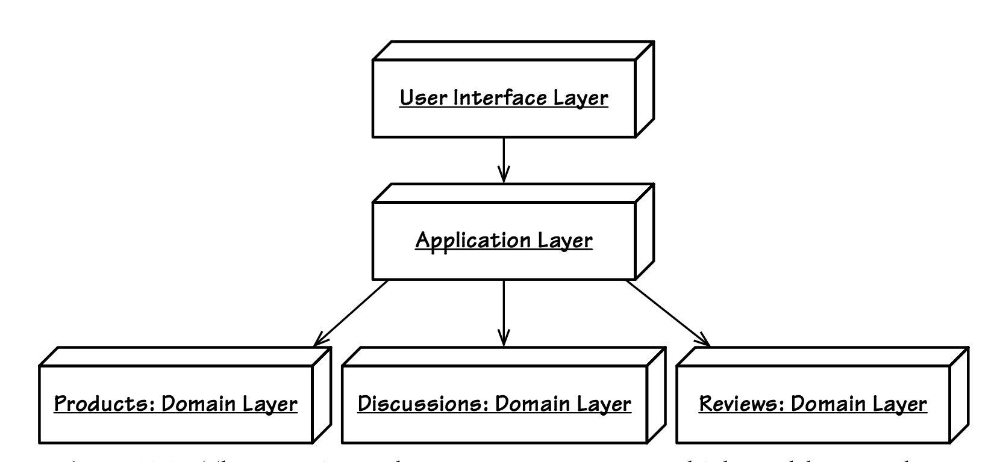

## 组合多个`Bounded Contexts`

#### ▶[上一节](2.md)

我所给出的示例并未探讨这种可能性：单个用户界面可能需要组合两个或更多领域模型。
在我的示例中，上游模型中的概念通过转换为下游模型的术语，集成到下游模型中。

这与需要将多个模型组合成统一展示层的场景不同，如 [图 14.3](#figure-143) 所示。
在本例中，外部模型包括`Products Context`、`Discussions Context`和`Reviews Context`。
用户界面不应感知到自己正在组合多个模型。
当你的应用中出现类似场景时，应考虑 [Module (9)](../ch9/0.md) 的结构与命名如何支撑需求，以及`Application Services`如何抹平不同模型之间可能存在的隔阂。

有一种方案是使用多个`Application Layer`，这与 [图 14.3](#figure-143) 所示的结构不同。
采用多个`Application Layers`时，你需要为每个`Application Layer`提供独立的用户界面组件，这些组件会与特定的底层领域模型存在一定关联。
这本质上是 portal-Portlet 风格。
但要让彼此独立的`Application Layer`与用户界面组件在用例流程上保持协调一致，难度会更高，而这正是用户界面所关注的核心。

由于`Application Layer`负责管理用例，最简单的方式可能是创建单个`Application Layer`作为模型组合的实际来源，这也是 [图 14.3](#figure-143) 所示的方案。
该单一层中的服务不包含业务领域逻辑。
仅用于将来自各个模型的对象聚集成用户界面所需的内聚对象。
在这种情况下，你通常会根据组合的用途（即一个命名上下文），为`User Interface Layer`和`Application Layer`中的模块命名：

```java
com.consumerhive.productreviews.presentation

com.consumerhive.productreviews.application
```

#### Figure 14.3
</br>
*有时用户界面必须组合多个模型。本例通过单个`Application Layer`组合了三个模型。*

Consumer Hive 提供消费品的评论与讨论功能。
它将`Products Context`与`Discussions Context`、`Reviews Context`分离开来。
但其展现层与应用层模块却在统一用户界面下体现出整合效果。
该系统的产品目录很可能来自一个或多个外部来源，而讨论与评论功能才是它的`Core Domain`。

说到`Core Domain`……说来也奇怪，你在这里察觉到了什么？
这个`Application Layer`难道不正是在充当一个内置了 [Anticorruption Layer (3)](../ch3/0.md) 的全新领域模型吗？
没错，它本质上是一个简易低成本的`Bounded Context`。
在这里，`Application Services`负责合并各种 DTO，这种方式近似于一种 [Anemic Domain Model (1)](../ch1/0.md) 。
它在`Core Domain`建模上采用了类似 [Transaction Script (1)](../ch1/0.md) 的实现方式。

如果你认为 Consumer Hive 的三模型组合迫切需要一个全新的 [Domain Model (1)](../ch1/0.md) ，即在单个`Bounded Context`中的统一对象模型，你可以按如下方式命名新模型的模块：

```java
com.consumerhive.productreviews.domain.model.product
com.consumerhive.productreviews.domain.model.discussion
com.consumerhive.productreviews.domain.model.review
```

最终，你必须决定如何为这种场景建模。
你是否会选择使用战略设计甚至战术设计来创建一个新模型？
至少，这种情况会引出一个核心问题：我们该如何界定——是将多个`Bounded Contexts`组合到单一用户界面中，还是创建一个带有统一领域模型、清晰整洁的全新`Bounded Context`？
每种情况都必须仔细考量。
重要性较低的系统会受到其他因素与优先级的影响，
但即便如此，我们也不能随意做出这类决策。
应参考 [Bounded Context 章节](../ch2/4.md) 中给出的判断标准。
归根结底，最适合的方案，是对业务带来最大价值的方案。

#### ▶[下一节](4.md)
