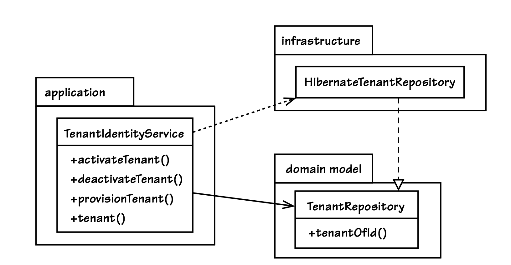

## 基础设施

#### ▶[上一节](3.md)

基础设施的职责是为应用的其他部分提供技术支撑能力。
尽管暂不讨论 [Layers (4)](../ch4/0.md) ，但秉持依赖倒置原则的设计思想依然很有价值。
因此，无论基础设施在架构中处于什么位置，若其组件依赖于用户界面、`Application Service`和领域模型中需要特定技术能力的接口，整体设计都会非常合理。
这样一来，当`Application Service`查找`Repository`时，它仅依赖领域模型中的`Repository`接口，实际使用的则是基础设施层提供的实现。
[图 14.4](#figure-144) 以 UML 静态结构图展示了这一工作方式。

#### Figure 14.4
</br>
*`Application Service`依赖领域模型中的`Repository`接口，但使用基础设施层的实现类。各个包分别封装了各自的核心职责。*

这种查找可以通过 [Dependency Injection] [[Fowler, DI](../bibli.md#fowler-di)] 隐式实现，也可以使用`Service Factory`。
本章最后一节 [企业组件容器](5.md) 会讨论这些方案。
这里再次节选我们一直用作示例的`Application Service`代码，你可以看到`Service Factory`是如何被用来获取`Repository`的：

```java
package com.saasovation.identityaccess.application;
public class TenantIdentityService {
    ...
    @Override
    @Transactional(readOnly=true)
    public Tenant tenant(TenantId aTenantId) {
        Tenant tenant =
            DomainRegistry
                .tenantRepository()
                .tenantOfId(aTenantId);

        return tenant;
    }
    ...
}
```

这款`Application Service`也可以改为直接注入`Repository`，或者通过构造函数参数来设置内部依赖。

`Repositories`的实现都放在基础设施层，因为它们负责数据存储，而这并非领域模型应当承担的职责。
你会通过基础设施来实现需要使用消息机制的接口，例如消息队列与邮件发送。
如果存在用于生成图表、地图等特殊用户界面组件，它们同样会在基础设施层实现。

#### ▶[下一节](5.md)
