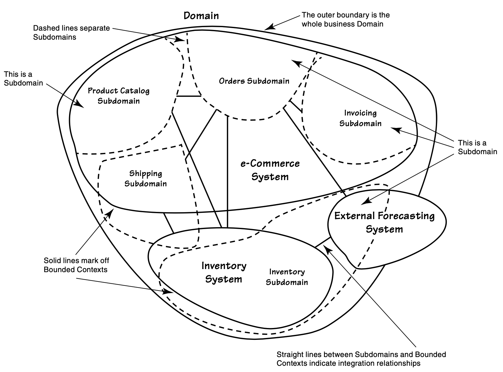
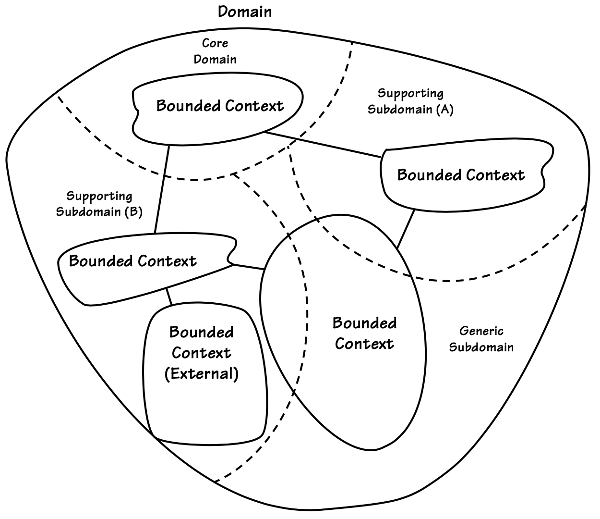

## 全局

#### ▶[上一节](0.md)

广义而言，领域指的是组织所从事的事业及其所处的环境。企业通过识别市场来销售产品与服务。每类组织都拥有独特的知识体系和运作方式。这种认知范畴及其实施方法构成了其领域。当你为组织开发软件时，就是在其领域内工作。你的领域应该显而易见——你正身处其中。

需要注意的是，术语 “领域” 可能存在多重含义。它既可以指整个业务领域，也可以仅指其中某个核心或辅助领域。我将尽力区分这些不同用法。当仅指业务的某个特定领域时，我会使用`Core Domain`、`Subdomain`等限定词进行说明。

由于领域模型（domain model）一词包含领域（domain）字样，我们可能会产生这样的想法：应该创建一个完整统一、涵盖组织整个业务领域的模型，就像企业模型那样。然而在应用 DDD 时，这并非我们的目标。DDD 强调的恰恰相反：组织的整个领域由子领域构成。在 DDD 框架下，模型是在`Bounded Contexts`中开发的。事实上，构建领域模型正是聚焦于整个业务领域中特定区域的一种方式。试图用单一、包罗万象的模型定义中等复杂度组织的业务，即便成功也极其困难，通常更会以失败告终。正如本章所阐明，对整个业务领域进行强力划分将助我们取得成功。

那么，如果领域模型不应涵盖组织所做的一切及其运作方式，它究竟应该是什么？

几乎每个软件领域都包含多个子领域。无论组织规模庞大极其复杂，还是仅由少数人员及其使用的软件构成，这都无关紧要。任何企业的成功都离不开不同职能的支持，因此将这些业务职能分别考虑更为有利。

### `Subdomain`与`Bounded Contexts`的实际应用

以下是一个相当简单的示例，用于介绍`Subdomain`的具体应用场景。设想一家在线销售产品的零售公司。其销售的商品种类繁多，因此我们不必过多关注具体商品类型。要在该领域开展业务，公司必须向购物者展示产品目录，必须支持订单提交，必须收取商品款项，还必须将商品运送给买家。这家在线零售商的领域似乎由四个主要`Subdomain`构成：`Product Catalog`、`Orders`、`Invoicing`和`Shipping`。[图 2.1](#figure-12) 上半部分展示了该`e-Commerce System`。

#### Figure 2.1

*包含`Subdomain`和`Bounded Contexts`的领域*

这一切看似相当简单，在某种程度上确实如此。然而，只要引入一个额外细节，我们的示例就会变得更复杂。试想处理`Inventory`有多困难，这是 [图 2.1](#figure-21) 中出现的额外系统和子域。我们稍后再谈复杂性增加的问题，先来观察图中物理子系统和逻辑`Subdomains`的构成。

请注意，目前仅有三套物理系统用于实现该零售商的领域，其中仅有两套部署在内部。这两套内部系统可视为两个`Bounded Contexts`。遗憾的是，当今多数系统并非采用 DDD 方法构建，因此这种情况相当普遍，少数子系统承担着大量业务功能。

在`e-Commerce Bounded Contexts`中，实际上存在着多个隐含的领域模型在运作，尽管它们并未被明确划分。这些本应独立的领域模型实际上融合成了一个软件模型，这实在令人遗憾。若零售商是从第三方购买而非自行构建这个`Bounded Context`，问题或许会小得多。<ins>但无论谁维护这个系统，都已深切体会到将`Product Catalog`、`Orders`、`Invoicing`和`Shipping`模型混为一体所导致的复杂性激增带来的负面影响。随着各类逻辑模型为支持新功能而不断扩展，相互冲突的关注点将相互制约。若需新增另一逻辑模型（即重大新功能集），这种冲突将尤为显著。这正是软件关注点未能清晰分离时必然产生的后果。</ins>

这尤其令人遗憾，因为许多软件开发者认为将所有功能都整合到一个系统中是明智之举。这套万能的电子商务系统理应满足所有人的需求。然而这种想法具有欺骗性，无论将多少功能堆砌到一个子系统中，它永远无法满足所有潜在消费者的需求。永远无法满足。<ins>更何况，若不通过`Subdomain`将原本独立的软件领域模型分离，后续变更将变得极其繁重，因为所有模块都将相互关联、彼此依赖。</ins>

然而，借助 DDD 的战略设计工具之一，我们能够通过外部剖析这些相互交织的模型，根据其实际功能将其拆解为逻辑上分离的`Subdomains`，从而在一定程度上化解复杂性。[图 2.1](#figure-21) 中的虚线标示了逻辑`Subdomain`的划分边界。这并非意味着我们已将第三方模型重构为完全分离的结构。我们只是标明了应当存在的独立模型，至少在特定零售商的业务运营场景中如此。同时我们还绘制了逻辑`Subdomains`之间乃至物理`Bounded Contexts`之间的关联，以展示集成关系。

现在让我们暂且抛开技术层面的复杂性，聚焦于我们这家小型企业面临的商业难题。公司资金有限，仓储空间也有限，始终在进行着周旋平衡。公司必须避免在滞销产品上过度投入，而某些商品在特定时段的销售表现又优于其他时期。显然，若部分产品未达销售预期，资金便会被滞销商品占用，这些商品至少当下不受客户青睐。资金就此冻结。因此，公司在任何特定时期都难以腾出足够空间储备畅销商品。

这还不是全部。最终还会出现另一个问题：如果某些产品销量超出预期，公司将无法备足库存满足客户需求。库存不足的困境可能导致客户转而向其他渠道采购急需商品。诚然，部分产品批发商愿意为零售商提供代发货服务，但这种方案成本更高且会引发其他不良后果。为降低成本，可采取策略性布局：将部分产品就近备货满足本地需求，而远销热销品则采用代发货模式。因此，代发货应成为零售商的战略利器，而非挽救失败交易的临时救场手段。毕竟畅销品并非稀缺。问题根源在于小型零售商未能优化库存管理，导致商品无法即时供应。若客户持续遭遇延迟发货，该在线销售企业将至少丧失此前积累的竞争优势中相当一部分。此案例灵感源自 Lokad 常为客户解决的典型问题。[1](#1)

需要明确的是，我们尚未深入探究库存管理所面临挑战的极限，且这些不利状况并非仅限于小型零售商。各地零售商都渴望根据实际需求精确采购和管理库存，在满足需求的同时最大限度降低成本并优化销售履约。然而，小型零售商往往比大型零售商更迅速地承受因表现欠佳而带来的损失。

对任何在线零售商而言，若能基于历史趋势预测未来库存与销售需求，将极大助力其经营。若零售商能运用预测引擎，并向其输入库存与销售历史数据，便可获得具体数值的需求预测，从而优化库存管理 —— 明确补货时机及各类商品的采购数量。

对于小型零售商而言，添加此类预测功能可能构成一个新的`Core Domain`，因为这并非易事，而成功实现将有助于企业建立新的竞争优势。事实上，[图 2.1](#figure-21) 中的第三个物理`Bounded Context`正是`External Forecasting System`。`Orders`子领域与`Inventory` `Bounded Context`通过与`Forecasting`系统集成，共同提供历史产品销售和退货信息。此外，还应让`Catalog Subdomain`提供全球通用的商品条形码，使`Forecasting`系统能够将小型零售商的产品线与全球相关及相似销售趋势进行对比，从而获得更广阔的视角。这使得`Forecasting`引擎具备计算能力，能够为小型零售商提供精准的库存数据，确保其合理备货。

如果这个新解决方案确实属于`Core Domain`（而它很可能就是），那么开发团队若能理解由逻辑`Subdomains`构成的周边业务环境以及所需的集成方案，将获益匪浅。因此，突出 [图 2.1](#figure-21) 中所示的现有集成关系，对于把握项目启动时的实际状况至关重要。

`Subdomains`并非总是具备如此规模庞大且功能鲜明的独立模型。有时`Subdomains`可能仅是一组算法集合，这些算法虽对业务解决方案至关重要，却不属于`Core Domain`范畴。运用良好的 DDD 技术，这类简单`Subdomains`可通过 [Modules (9)](../ch9/0.md) 与`Core`分离，无需置于架构上意义重大的子系统组件中。

在采用 DDD 时，我们力求每个`Bounded Context`都能明确划定领域模型中每个术语的含义边界——这些术语的含义要被充分理解，或者至少在软件建模得当的情况下应当如此。这本质上是一种语言边界。这些上下文边界是实现 DDD 的关键所在。

当我们采用 DDD 时，我们力求每个`Bounded Context`都能明确划定领域模型中使用的每个术语的含义，或者至少在我们做好软件建模的情况下应该是清楚的。这主要是一个语言上的界限。这些上下文界限是实现 DDD 的关键。

|牛仔逻辑||
|:------|---:|
|LB：“我们和邻居相处得很好，直到他们的篱笆倒塌。”   AJ：“说得对。篱笆要筑得像马一样高。”||

请注意，单个`Bounded Context`未必仅属于单个`Subdomains`，但也可能如此。在 [图 2.1](#figure-21) 中，仅有`Inventory`这一`Bounded Context`完全属于单个`Subdomain`。[2](#2) 这充分表明`e-Commerce System`开发时并未采用正确的 DDD 。该系统中我们已识别出四个`Subdomains`，实际可能更多。另一方面，`Inventory System`似乎遵循了 “每个`Bounded Context`对应一个`Subdomains`” 的原则，其领域模型仅限于产品库存管理。该系统模型看似清晰，可能是采用 DDD 的结果，也可能纯属巧合。要确切了解原因，我们需要深入研究其内部实现。无论如何，我们仍可实际利用`Inventory`来开发新的`Core Domain`。

从语言学角度看，[图 2.1](#figure-21) 中的哪些`Bounded Contexts`设计更优？换言之，哪些上下文拥有明确无歧义的领域专用术语集？考虑到`e-Commerce System`统中至少存在四个`Subdomains`，术语与含义在此处发生冲突几乎是必然的。例如`Customer`一词必然具有多重含义：当`Customer`浏览商品目录时，`Customer`指代某类对象；但在用户下单时，其含义则截然不同。原因在于：浏览目录时，`Customer`涉及历史购买记录、忠诚度、可用商品、折扣优惠及配送选项等语境；而订单本身中，`Customer`的含义则被严格限定。在有限的细节中，仅包含姓名、收货地址、账单地址、应付总额及付款条款。仅凭此基本逻辑即可看出，在`e-Commerce System`中`Customer`不存在单一明确的含义。鉴于此情况，当我们审视该系统时，理应发现其他多个术语也具有多重含义。这并非一个界限清晰的`Bounded Context`，其中每个术语都明确指代领域概念。

然而，`Inventory System`也未必拥有完全清晰的模型，其领域语言学也未必完全无歧义。即便在这个看似专注的语境中，我们仍可能面临库存中受控事物含义的差异。这是因为库存物品存在多种使用方式。订购中的物品、收货中的物品、库存中的物品以及即将售罄的物品之间，是否存在明确的界限？尚未可售的订购商品称为 “延期交货商品”。正在收货的商品常被称为 “到货商品”。库存商品可能被称为 “库存商品”。正在消耗的商品通常称为 “离库商品”。因变质或损坏而报废的库存商品常被称为 “废弃库存商品”。

通过观察 [图 2.1](#figure-12) ，我们无法判断库存概念及其相关术语的建模质量。采用 DDD 时，我们绝不依赖猜测。我们会确保每个概念都被充分理解、明确表述，并据此进行建模。领域专家对这些概念的描述方式，可能导致某些概念被划分到不同的`Bounded Contexts`中。

从表面现象来看，`Inventory System`的 DDD 健康状况似乎优于`e-Commerce System`。这或许是因为设计该系统模型的团队并未试图让单一商品实体涵盖所有库存商品的情境。虽然尚不确定，但`Inventory System`的模型可能比`e-Commerce System`更易于集成。

说到集成，[图 2.1](#figure-12) 进一步表明，企业中的`Bounded Contexts`几乎不可能完全独立存在。即使第三方`e-Commerce System`试图提供一个庞大而包罗万象的模型，它也无法满足零售商的所有需求。`e-Commerce System`、`Inventory System`和`External Forecasting System`之间以实线连接的`Subdomains`，正是必要的集成关系体现，这证明不同模型必须协同工作。集成过程中总涉及特定类型的关系，你将在 [Contexts Maps (3)](../ch3/0.md) 中深入了解可能的集成选项。

这是对某个简单业务领域的一种观点的高层级概括。我们已简要接触过`Core Domain`，并了解到它是 DDD 的重要组成部分。现在我们需要更深入地理解它。

### 聚焦`Core Domain`

在理解`Subdomain`与`Bounded Contexts`的基础上，请参考 [图 2.2](#figure-22) 中另一个领域的抽象视图。这可能代表任何领域，甚至是你所从事的领域。我刻意省略了具体名称，以便您在脑海中填补空白。显然，我们的业务目标始终处于持续优化与扩展的进程中，这体现在不断变化的`Subdomain`及其内部模型上。此图仅从特定视角捕捉了某一时刻的整体业务领域，而这种视角可能具有短暂性。

#### Figure 2.2

*一个抽象业务领域，包含子`Subdomain`和`Bounded Contexts`*

---
➜**白板时间**

- 在一列中列出你在日常工作中所知的所有`Subdomain`。在另一列中列出`Bounded Contexts`。`Subdomain`是否与多个`Bounded Contexts`存在交集？若存在，这未必是坏事，只是企业软件的常态。
- 现在，请参照 [图 2.2](#figure-22) 中的模板，填写贵企业中运行的部分软件名称，并标注其`Subdomain`、`Bounded Contexts`以及它们之间的集成关系。

这很难吗？可能吧，因为 [图 2.2](#figure-22) 中的模板很可能无法准确反映你领域中现有的边界。

- 重新开始。这次你应该绘制一张与你的领域、`Subdomain`和`Bounded Contexts`相匹配的图。使用 [图 2.2](#figure-22) 中展示的技术，但请根据你的实际情况进行调整。

当然，你可能无法掌握整个企业中所有`Subdomain`和`Bounded Context`，尤其当你的领域规模庞大且复杂时。但你或许能厘清日常工作中接触到的那些。总之，不妨尝试一下。不必害怕犯错。这将为你提供`Context Mapping`的良好练习机会，下一章会对此进行深化。若想先跳到该章节获取更多建议也无妨。但此刻不必追求完美，先掌握基本概念即可。

---

现在请看 [图 2.2](../#figure-22) 中领域边界顶部标注为`Core Domain`的`Subdomain`。
正如前文所述，这是 DDD 中至关重要的另一核心要素。
<ins>`Core Domain`是业务领域中对组织成功具有首要意义的部分。
从战略角度而言，企业必须在`Core Domain`保持 *卓越竞争力* 。
该领域对业务持续成功具有至关重要的意义</ins>。
相关项目将获得最高优先级，配备一位或多位精通该`Subdomain`的领域专家、顶尖开发人员，并赋予高度自主权与资源支持，为紧密协作的团队铺就畅通无阻的成功之路。
绝大多数 DDD 项目的精力都将聚焦于`Core Domain`。

[图 2.2](../#figure-22) 中还存在另外两种子域：`Supporting Subdomain`和`Generic Subdomain`。有时创建或获取`Bounded Context`是为了支持业务需求。<ins>若其建模了业务中某些重要但非核心的方面，则属于`Supporting Subdomain`。业务创建`Supporting Subdomain`是因为其具有一定专业性。反之，若该领域虽不具备业务特殊性，却是整体业务解决方案的必要组成部分，则属于`Generic Subdomain`</ins>。`Supporting`型或`Generic`型`Subdomain`的定位并不意味着其不重要，这些`Subdomain`对业务成功至关重要，但企业无需在这些领域追求卓越。唯有`Core Domain`需要卓越的实现能力，因为它将为业务带来显著优势。

---
➜**白板时间**

- 为确保您理解`Core Domain`概念的重要性，接下来请回到您刚绘制的白板图，尝试找出组织中正在构建的`Core Domain`所在。
- 随后，请尝试识别您所处领域中的`Supporting Subdomains`和`Generic Subdomain`。

|
记住：咨询领域专家！
||
|:---|---:|
|即使第一次未能完全准确，这个练习也能帮助你深入思考：哪些软件最能彰显企业特色？哪些支持着这些特色软件？哪些因素对企业成功毫无助益？持续练习，你将逐渐熟悉这些思维模式和技巧。  请与专注于不同领域的领域专家讨论你绘制图中的每个`Subdomain`和`Bounded Context`。  你不仅能从他们身上学到很多，更能获得 *倾听专家意见* 的宝贵经验。这正是成功实施 DDD 的关键标志。 ||

你刚刚学到的内容，正是战略设计的全局基础。

---

#### ▶[下一节](2.md)

---

#### 1
http://www.lokad.com/

#### 2
诚然，`Shipping Subdomains`使用`Inventory`模块，但这并不意味着`Inventory`模块就属于`Shipping`模块所处的`e-Commerce System`范畴。
