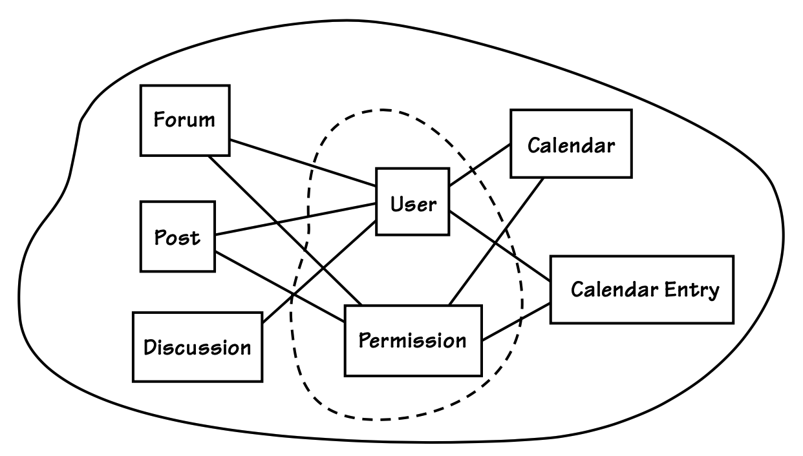

## 为何战略设计如此至关重要

#### ▶[上一节](1.md)

好的，你已经了解了一些 DDD 的术语及其含义，但关于其重要性的原因却鲜少提及。我只是断言它至关重要，并希望你能相信我。但正如大多数所谓 “事实” 的陈述，现在我最好为自己的断言提供依据。让我们回到正在进行的案例，SaaSOvation 公司的项目。他们已经陷入了真正的困境。

|||
|---|---|
|在首次尝试 DDD 的早期阶段，协作项目团队便偏离了构建清晰模型的轨道。究其根源，在于他们未能理解战略设计，甚至连最基础的层面都未能掌握。与多数开发者相似，他们过度关注 [Entities (5)](../ch5/0.md) 与 [Value Objects (6)](.../ch6/0.md) 的细节，反而模糊了全局视野。核心概念与通用概念的混淆，导致单一模型中诞生了两个模型。不久后，他们便开始承受 [图 2.3](#figure-23) 所示设计的痛苦后果。最终结果？他们未能完全实现 DDD 的实施目标。||

SaaSOvation 团队中有人坚持道：“协作概念与用户和权限紧密耦合又如何？我们必须追踪操作责任人！”
资深开发者指出，团队真正需要关注的并非耦合本身。
"归根结底，论坛、帖子、讨论、日历及日历条目终将与某种人类协作者对象产生关联。 *问题就在这里。语言表述本身就是错误的。*"
他进一步阐释道：论坛、帖子、讨论等概念都 *与错误的语言表述相关联*。
用户和权限 *与协作毫无关联，也不符合真正的协作`Ubiquitous Language`* 。
用户和权限属于身份验证与访问控制范畴 —— 本质是安全问题。
`Collaboration Context`中建模的每个概念 ——如同围绕协作领域模型的`Bounded Context`—— 
都应与协作建立语言关联，而当前显然未能实现。
“我们应聚焦于协作概念，例如作者和版主 (Moderator)。这些才是协作场景中正确的概念与术语。”

#### Figure 2.3

*团队未能理解基础战略设计，导致协作模型中概念错位。虚线圈出的部分即为问题要素。*

---
➜**命名`Bounded Context`**

注意到这里使用的名称`Collaboration Context`了吗？这是我们为`Bounded Context`命名的惯例，采用 *模型名称 Context* 的形式。
本例中采用`Collaboration Context`命名，因为该`Bounded Context`包含`Collaboration`项目的领域模型。
我们还为包含身份与访问项目模型的`Bounded Context`命名为`Identity and Access Context`，并为承载敏捷项目管理项目模型的`Bounded Context`命名为`Agile Project Management (PM) Context`。

---

重申一点，从根本上说，SaaSOvation 开发者最初并未意识到用户和权限与协作工具毫无关联。诚然，他们的软件确实存在用户群体，且需要区分不同用户以确定各自可执行的任务。但协作工具关注的应是用户角色，而非具体身份及其被允许执行的每项细微操作。然而当时的协作模型却将用户与权限细节完全交织在一起。一旦用户和/或权限机制发生变化，整个模型就会遭受连锁反应的冲击。事实上，这个问题正处于临界点。团队希望从权限管理模式转向基于角色的访问管理。当他们决定进行这种转换时，反而更清楚地意识到眼前这个战略性建模问题。

他们现在意识到，论坛不应关注谁能发布主题或在何种条件下允许发布。论坛只需知道作者正在进行或曾进行过该操作。团队逐渐理解到，确定操作权限属于完全独立的模型范畴，而核心协作模型只需确保所有权限问题已得到解答。论坛只需接收一个希望发布讨论的作者。论坛与作者显然属于协作模型`Ubiquitous Language`中的概念，即名为`Collaboration Context`的`Bounded Context`。用户与权限（或角色等类似概念）则完全属于其他范畴，必须与`Collaboration Context`隔离。

团队很容易得出结论，认为只需将与用户和权限的紧密耦合进行解耦即可。毕竟，将用户与权限/角色分离到独立模块中并无不妥，这有助于将这些概念置于同一`Bounded Context`内的独立逻辑`Security Subdomain`中。然而，真正让最佳建模方案脱颖而出的关键在于：团队意识到下一个`Core Domain`项目将面临高度相似的基于角色的访问需求，且将依赖领域特有的角色特征。显然，用户与角色本质上属于`Supporting`或`Generic Subdomain`，未来将在企业级乃至面向客户的场景中发挥作用。

采取更积极的建模清理措施，将有助于他们规避更隐蔽的问题。他们很可能正逐渐陷入 [Big Ball of Mud (3)](../ch3/0.md)。问题不仅在于用户和权限概念未得到妥善模块化。尽管模块化是 DDD 建模的核心工具，但它无法解决语言层面的错位问题。

资深开发者深感忧虑：若放任这种状况发展， *极易滋生松散的思维模式，最终导致更多混乱悄然渗透* 。随着团队着手建模另一组非协作概念，`Core Domain`将愈发模糊不清。最终他们可能仅获得隐含模型与源代码，却无法体现`Collaboration`的`Ubiquitous Language`。团队真正需要理解的是其业务领域、`Subdomain`以及正在开发的`Bounded Contexts`。唯有如此才能阻挡战略设计中最可恶的敌人`Big Ball of Mud`。因此， *团队亟需建立战略建模思维*。

---
➜**哦，不！又是那个词: 设计！**

若你认为敏捷实践中 “设计”是个禁忌词，那么在 DDD 中并非如此。将 DDD 与敏捷结合是完全自然的。始终用敏捷来约束设计。设计不必繁重。

---

是的，这确实是个重要的教训。他们通过大量研究终于攻克了难关，最终掌握了领域和`Subdomain`的管理方法。具体操作细节将在稍后呈现。

---
➜**与 DDD 社区的契合**

本书中的运行示例以三个`Bounded Contexts`的形式呈现。这些`Bounded Contexts`可能与您实际工作中接触的有所不同。示例展示了相当典型的建模场景。然而，并非所有人都认同用户与权限应当从特定`Core Domain`中分离出来。在某些情况下，将它们与核心模型交织在一起或许更为合理。这始终取决于具体团队的选择。但根据我的经验，这是 DDD 新手常遇到的基础问题之一，往往会误导实现方向，导致不必要的混乱。另一常见误区是将协作模型与敏捷项目管理模型混为一谈。以上仅列举部分典型问题，其他常见建模错误将在各章节中逐一探讨。

至少，本文提出的问题以及后续讨论的问题，都体现了团队未能理解语言驱动因素和`Bounded Contexts`重要性时所犯的典型建模错误。因此，即使您对具体示例问题存在异议，这些问题及其解决方案仍可普遍适用于所有 DDD 项目，因为它们都聚焦于特定`Bounded Context`的语言特性。

我的目标是通过尽可能简单却非浅显的示例，传授 DDD 的实践原则。我绝不能让示例成为教学与学习的障碍。若我能证明身份访问管理、协作工具和敏捷项目管理各自拥有独特的语言体系，读者便能充分领会示例所强调的核心要义。既然每个团队都有权自主探索对他们至关重要的语言驱动因素，并以此实现领域专家的愿景，那么请相信：SaaSOvation 开发者在 DDD 实践旅程中得出的 “终极正确” 结论及其建模选择，其中不存在任何谬误。

我关于`Subdomain`和`Bounded Contexts`的所有指导原则都与更广泛的 DDD 社区保持高度一致，因为这些原则反映了我自身的实践经验。其他 DDD 领袖可能侧重略有不同，但我的阐释绝对能为任何团队提供坚实基础，确保其在推进过程中避免歧义。厘清 DDD 中的模糊地带，是对社区最重要的贡献，也是我的首要目标。而你的目标，应是将这些指南以最实用的方式应用于项目实践。

---

#### ▶[下一节](3.md)
