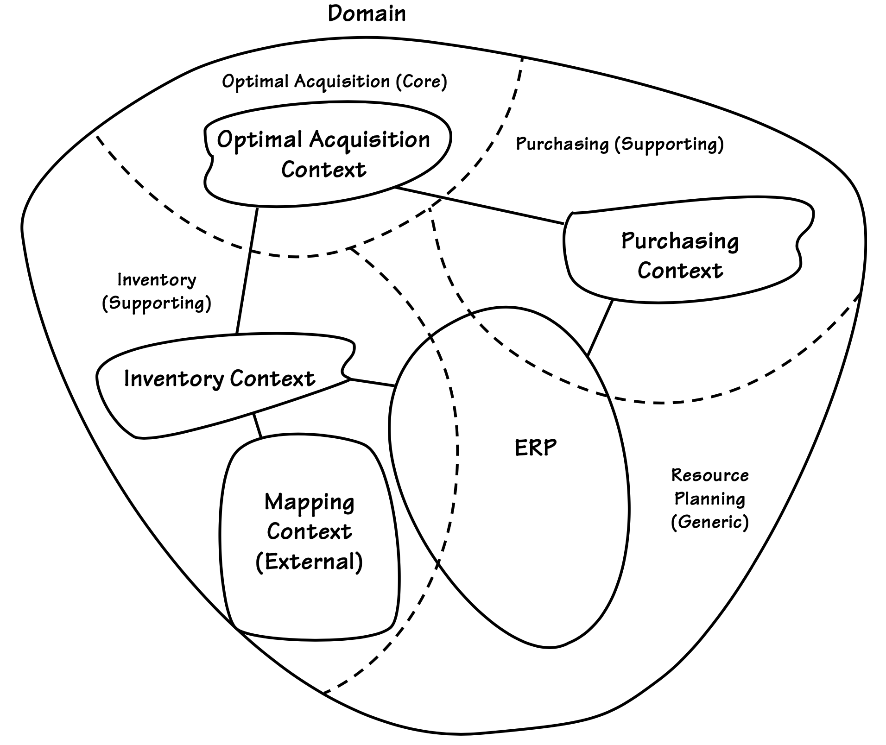

## 真实世界的领域与`Subdomains`

#### ▶[上一节](2.md)

我还有一些关于领域要告诉你的内容。
<ins>领域既有 *问题空间* ，也有 *解决方案空间* 。
问题空间使我们能够思考需要解决的战略性业务挑战，而解决方案空间则关注我们将如何实现软件以解决业务挑战的问题。</ins>
以下是它如何与你已经学到的内容关联起来的说明：

- <ins>问题空间是指需要开发以构建新`Core Domain`的部分。评估问题空间需考察 *现有及所需新增`Subdomains`* 。因此，问题空间即`Core Domain`与其必须使用的`Subdomains`的组合。</ins>问题空间中的`Subdomains`通常因项目而异，因为它们用于探索当前的战略业务问题。这使得`Subdomains`成为评估问题空间的有力工具。通过`Subdomains`，我们能够快速识别解决特定问题所需的领域不同部分。

- <ins>解决方案空间由一个或多个`Bounded Contexts`构成，即特定软件模型的集合。</ins>这是因为`Bounded Contexts`一旦开发完成，便成为 *具体的解决方案，一种实现视图* 。`Bounded Context`用于将解决方案以软件形式实现。

<ins>将`Subdomains`与`Bounded Contexts`一一对应是一个理想的目标</ins>。
这样做可以明确地将领域模型按业务目标划分到定义清晰的区域，将问题空间与解决方案空间结合起来。在实际操作中，这并不总是可行的，但在新建项目中是可行的。然而，考虑到一个遗留系统，可能是一个`Big Ball of Mud`），`Subdomains`通常会与`Bounded Contexts`相交，这与我们在 [图 2.1](1.md#figure-21) 中讨论的情况类似。在一个大型且复杂的企业中，我们可以采用 *评估视角* 来理解我们的问题空间，从而避免犯下代价高昂的错误。我们可以在概念上使用两个或更多`Subdomains`来划分一个大的`Bounded Context`，或者将多个`Bounded Contexts`作为单个`Subdomain`的一部分。考虑一个示例，有助于澄清问题空间与解决方案空间之间的区别。

想象一个庞大而单一的系统，被归类为 ERP 应用程序。严格来说，ERP 可视为单一`Bounded Context`。但由于 ERP 系统提供众多模块化业务服务，将不同模块视为独立子领域更具优势。例如，我们可以将库存模块与采购模块划分为独立的逻辑`Subdomains`。诚然，这些模块并非通过完全独立的系统提供。它们同属一个 ERP 体系。但每个模块为业务领域提供的服务集差异显著。为便于分析讨论，我们将它们命名为独立`Subdomains`：`Inventory Subdomain`与`Pruchasing Subdomain`。通过后续示例，我们将看到这种划分方式的实用价值。

作为一项核心业务举措，[图 2.4](#figure-24) 所示领域（基于[图 2.2](1.md#figure-22) 模板的具体示例）的组织开始规划专用领域模型的设计与开发，以降低业务运营成本。该模型将为采购代理提供决策工具。历经多年人工流程摸索形成的采购算法，现需通过软件实现自动化，确保所有采购专员无差错地遵循这些规则。该`Core Domain`模型将通过快速识别更优交易并保障库存需求， *提升组织竞争力* 。为精准管理库存，此前探讨的 [图 2.1](1.md#figure-21) `Forecasting System`在此同样能发挥作用。

#### Figure 2.4

*采购与库存管理涉及的`Core Domain`及其他`Subdomains`。此视图仅限于特定问题空间分析所选用的`Subdomains`，而非整个领域。*

<ins>在实施具体解决方案之前，我们需要对问题空间和解决方案空间进行评估。以下问题需要明确回答，以确保项目方向正确：</ins>

- 战略`Core Domain`的名称及其愿景是什么？
- 哪些概念应纳入战略`Core Domain`范畴？
- 必需的`Supporting Subdomains`与`Generic Subdomains`分别是什么？
- 各领域工作应由哪些人员承担？
- 能否组建合适的团队？

如果我们未能理解`Core Domain`的愿景与目标，以及支撑该领域所需的各个子领域，就无法战略性地利用它们并规避相关风险。问题空间评估应保持高层次，但务必全面彻底。确保所有利益相关方达成共识并全力以赴，共同实现愿景目标。

---
➜**白板时间**

请花片刻时间审视你的白板工作，思考：你的问题空间是什么？请记住，它是由战略`Core Domain`及其支撑的`Subdomains`共同构成的。

---

<ins>当你充分理解问题空间后，便转向解决方案空间。前者的评估将为后者提供知识支撑。解决方案空间将受到现有系统与技术（以及即将创建的新系统）的强烈影响。此时我们必须以清晰划分的`Bounded Contexts`为思考框架，因为我们正在审视各自的`Ubiquitous Language`。请思考以下关键问题：</ins>

- 现有哪些软件资产，能否重复利用？
- 需要获取或创建哪些资产？
- 这些资产如何相互关联或集成？
- 还需要进行哪些额外集成？
- 基于现有资产和待创建资产，需要投入多少工作量？
- 该战略举措及所有配套项目是否具备较高的成功概率？是否存在任何单一项目可能导致整体计划延误甚至失败？
- 哪些领域的`Ubiquitous Language`存在根本性差异？
- 哪些`Bounded Contexts`之间存在概念与数据的重叠共享？
- 共享术语及/或重叠概念在不同`Bounded Contexts`间如何映射与转换？
- 哪个`Bounded Context`包含解决`Core Domain`的概念，以及将使用哪些 [[Evans](../bibli.md#evans)] 战术模式来对其建模？

请谨记，在`Core Domain`开发解决方案的投入是关键的业务投资！

前面描述并在 [图 2.4](#figure-24) 中展示的专业采购模型，该模型涵盖了决策工具和算法，代表了`Core Domain`的解决方案。该领域模型将被实现为一个明确的`Bounded Context`：`Optimal Acquisitions Context`。这个`Bounded Context`与`Subdomain`，`Optimal Acquisitions Core Domain`一一对应。仅与一个`Subdomain`及其精心设计的领域模型对齐，将使其成为该业务领域中最优秀的`Bounded Contexts`之一。

另一个`Bounded Context`，`Purchasing Context`将被开发，以便作为`Optimal Acquisitions Context`的辅助，完善采购流程的一些技术方面。这些改进并没有揭示任何关于最优采购方法的特殊知识。它们只是让`Optimal Acquisitions Context`能够以一定的独立性更容易地与 ERP 进行交互。这只是一个方便的模型，用于操作 ERP 的公开接口。新的`Purchasing Context`和现有的 ERP 采购模块都属于`Purchasing (Supporting) Subdomain`。

ERP 采购模块整体上属于`Generic Subdomain`。这是因为只要满足基本业务需求，该`Subdomain`可被任何现成的采购系统替代。然而，当其与`Purchasing Subdomain`中的新`Purchasing Context`协同使用时，便以辅助方式发挥作用。

---
➜**你无法改变糟糕的软件设计现状**

在典型的棕地企业中，你将面临如 [图 2.1](#figure-21) 和 [图 2.4](#figure-24) 所示的不理想状况。这意味着设计不良的软件中，`Subdomains`无法以理想的一对一方式与`Bounded Contexts`对齐。你无法改变糟糕的软件设计现状。你只能期望在参与的项目中正确实施 DDD 。最终你仍需与棕地领域进行集成甚至直接在其中工作，因此请做好准备：在分析单个棕色`Bounded Context`中存在的多个隐含模型时，务必运用本章前三分之一内容所传授的技术。

---

继续参考 [图 2.4](#figure-24) ，`Optimal Acquisition Context`还需与`Inventory Context`进行交互。库存负责管理仓储物品，其采用的 ERP 库存模块隶属于`Inventory (Supporting) Subdomain`。为方便配送承包商，`Inventory Context`可借助外部地理映射服务，提供从起始地点到各仓库的路线图与导航指引。从`Inventory Context`视角看，映射服务并无特殊性。可选地理映射服务众多，且随时间推移更换系统可能带来优势。该映射服务本身属于`Generic Subdomain`，但由`Supporting Subdomain`进行调用。

请注意从开发`Optimal Acquisition Context`的公司的角度来看这些关键点。在解决方案空间中，地理映射服务不属于`Inventory Context`，尽管在问题空间中它被认为是`Inventory Subdomain`的一部分。在解决方案空间中，即使映射服务通过一个简单的基于组件的 API 提供，它也属于不同的`Bounded Context`。库存和映射的`Ubiquitous Language`是互相排斥的，这意味着它们处于不同的`Bounded Contexts`中。当`Inventory Context`使用外部`Mpping Context`的内容时，数据可能需要经过至少一些最小的转换才能被正确使用。

另一方面，从开发并提供订阅制映射服务的外部商业组织角度来看，映射属于`Core Domain`。该外部组织拥有自己的业务领域或运营范畴，必须保持竞争力，不断完善领域模型以留住现有订阅用户并吸引新用户。若您身为映射服务公司的 CEO，必然会竭力让客户，包括当前讨论的这位订阅者，获得充分理由继续使用您的服务而非转向竞争对手。但这并不会改变正在开发库存系统的订阅方视角。对库存系统而言，映射服务仍是`Generic Subdomain`。若能从中获益，该系统完全可以转而订阅其他映射服务。

---
➜**白板时间**

在你的解决方案空间中，哪些是`Bounded Contexts`？此时你应该能通过白板图获得清晰认知。不过当我们深入探讨如何正确运用`Bounded Contexts`时，你可能会有些意外。请做好随时调整的准备。毕竟我们正在进行敏捷开发。

---

因此，在本章剩余部分我们将转换思路，探讨`Bounded Contexts`作为 DDD 中关键解决方案空间建模工具的重要性。在 [Context Maps (3)](../ch3/0.md) 中，讨论主要着重于如何通过集成不同但相关的`Ubiquitous Language`的`Bounded Contexts`来处理映射问题。

#### ▶[下一节](4.md)
