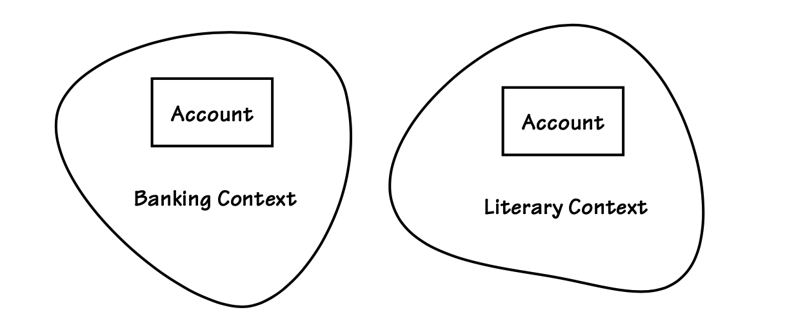
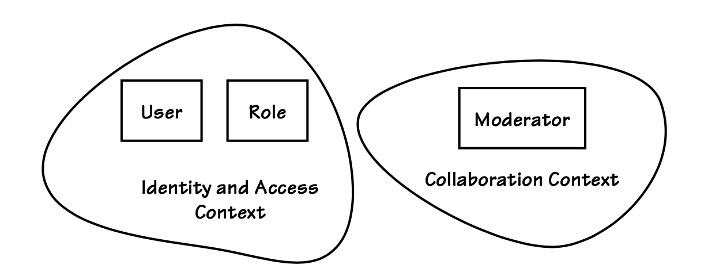

## 理解`Bounded Contexts`

#### ▶[上一节](3.md)

切记，`Bounded Context`是领域模型存在的明确边界。领域模型将`Ubiquitous Language`转化为软件模型。边界的设立源于模型内部每个概念，连同其属性与操作，都具有特殊含义。若您是建模团队成员，便会精确理解上下文内每个概念的含义。

---
**`Bounded Context`是明确且语言化的**

`Bounded Context`是领域模型存在的明确边界。在边界内，`Ubiquitous Language`的所有术语和短语都具有特定含义，且模型精确反映该语言。 

---

在两个明确不同的模型中，名称相同或相似的对象往往具有不同的含义。当为两个模型各自设置明确边界时，每个上下文中的概念含义便得以确定。因此，边界上下文本质上是一种 *语言边界* 。你应当将这些推理要点作为检验基准，以判断自己是否正确运用了`Bounded Contexts`。

某些项目陷入试图创建包罗万象的模型的陷阱，其目标是让整个组织就具有唯一全球含义的概念名称达成共识。这种建模方式实为误区。首先，要让所有利益相关方就所有概念具有单一、纯粹且明确的全球含义达成一致几乎不可能。某些组织规模庞大且结构复杂，根本无法召集所有利益相关者，更遑论达成完全有意义的共识。即便在利益相关者相对较少的小型企业中，确立单一全局概念的持久定义也难以实现。因此最佳策略是接受差异必然存在的事实，运用`Bounded Context`方法，将存在差异且差异明确可理解的领域模型分别界定。

`Bounded Context`并不强制要求创建单一类型的项目工件。它既不是独立组件，也不是文档或图表。<sup>[3](#3)</sup> 因此它不是 JAR 或 DLL 文件，但这些文件可用于部署`Bounded Context`（本章后文将详述）。

请参阅 [表 2.1](#table-21) 所示，`Banking Context`中的账户与`Literary Context`中的账户存在鲜明差异。

#### Table 2.1

|语境|含义|示例|
|---|---|---|
|`Banking Context`|银行账户记录借方与贷方交易，</br>反映客户在银行的当前财务状况。|支票账户与储蓄账户|
|`Literary Context`|文学账户则指在特定时间跨度内，</br>围绕一个或多个相关事件展开的系列文学表达。|亚马逊网站销售书籍</br>《虚无之中：珠峰灾难亲历记》。|

*术语 “账户” 的多重含义*

看看 [图 2.5](#figure-25) ，从名称上看，账户类型没有任何特征可以区分它们。只有通过查看每个概念容器的名称 —— 它的`Bounded Context`，你才能理解两者之间的区别。

这两个`Bounded Contexts`很可能不在同一个领域。关键是要说明上下文为王。

---
**上下文为王**

上下文至关重要，尤其在实施 DDD 时。

金融界常使用 “证券” 一词。美国证券交易委员会 (SEC) 将该术语限定用于股票。但需注意：期货合约属于商品范畴，不受 SEC 监管。然而部分金融机构仍以 “证券” 代称期货，同时标注 [Standard Type (6)](../ch6/0.md) 期货 (Future)。

这种表述是否最适合期货？这取决于具体应用领域。有人会断言恰当，也有人坚持不妥。语境同样承载文化属性。在某家期货交易公司内部，使用 “证券” 作为`Ubiquitous Language`或许最契合其企业文化。

---

#### Figure 2.5

*两个不同`Bounded Contexts`中的账户对象具有完全不同的含义，但你只能通过考虑每个`Bounded Context`的名称来了解这一点。*

*在企业实践中，最常见的往往是那些微妙的含义差异* 。原因在于：每个上下文中的团队在命名时，始终以`Ubiquitous Language`为准则。概念命名绝非随意为之，例如刻意与其他上下文的术语区分开来。以银行领域的两个上下文为例：一个负责支票账户，另一个负责储蓄账户。<sup>[4](#4)</sup> 我们无需将`Checking Context`中的对象命名为 “支票账户”，也无需将`Savings Context`中的对象命名为 “储蓄账户”。这两个概念均可安全地命名为 “账户”，因为每个`Bounded Context`都能区分微妙的含义差异。当然，并无规定禁止为这些名称增添更多含义。这完全取决于团队的决策。

当需要集成时，必须在`Bounded Contexts`之间进行映射。这是 DDD 中较为复杂的环节，需要相应程度的谨慎处理。我们通常不会在边界之外使用对象实例，但多个上下文中的相关对象可能共享部分共同状态。

以下是另一个示例：某个通用名称在多个`Bounded Contexts`中使用，但这次是在同一领域内。试想出版机构在处理书籍生命周期各阶段时面临的建模挑战。大致而言，随着书籍在不同上下文中的推进，出版商需要处理类似的阶段：

- 构思并策划图书
- 与作者签订合约
- 管理图书的作者团队及编辑流程
- 设计图书版式，含插图排版
- 将图书翻译成其他语言
- 制作实体印刷版及/或电子版
- 开展图书营销推广
- 向经销商及/或消费者直接销售图书
- 向经销商及消费者配送实体图书

在这些阶段中，是否存在唯一正确的图书建模方式？绝非如此。在每个阶段，图书都具有不同的定义。直到签约阶段，图书才拥有暂定书名，而该书名在编辑过程中仍可能变更。在作者创作与编辑阶段，图书由附带批注与修改的草稿集及最终定稿构成。平面设计师负责页面排版。生产部门利用排版文件生成印刷稿件、“蓝线稿”，最终制成印版。市场部门通常无需编辑或生产环节的大部分成果，仅需封面设计与概要说明。在物流环节，书籍可能仅携带标识信息、库存位置、可供数量、尺寸及重量等基本数据。

若试图为书籍设计一个贯穿其生命周期所有阶段的中心模型，将会发生什么？结果将是高度混乱、分歧与争执，且几乎无法交付可用的软件。即便偶尔能交付正确的通用模型，它也可能仅能偶尔且极其短暂地满足所有客户的需求。

为应对这种不良的频繁切换与消耗，采用 DDD 的出版商模型会为生命周期的每个阶段设置独立的`Bounded Contexts`。在多个`Bounded Contexts`中，均存在 “图书” 类型。各类图书对象将在所有或大部分上下文中共享同一身份（该身份可能在构思阶段首次确立）。然而每个上下文中的图书模型都将与其他上下文不同。这种差异完全合理，甚至应当如此。当特定`Bounded Context`的团队讨论某本书时，其含义完全契合该上下文的需求。组织应拥抱这种自然产生的差异性。这并非意味着积极成果易于实现。但通过明确划分`Bounded Context`，软件得以持续交付增量改进，精准满足业务的具体需求。

此时，让我们快速看看 SaaSOvation 协作团队用来解决建模挑战的解决方案，如 [图 2.3](2.md#figure-23) 所示。

如前所述，在`Collaboration Context`中，领域专家不会将使用协作功能的人描述为具有权限的用户。相反，他们通过这些人在上下文中所扮演的角色来谈论这些协作者，例如作者、所有者、参与者和主持人。可能会存在一些联系信息，但可能并不完整。另一方面，正是在`Identity and Access Context`中，我们会谈论用户。在该上下文中，用户对象具有用户名以及关于个人的详细信息，包括与该人联系的详细方式。

然而，我们并非凭空创建 Author 对象。每位协作者都需经过预先资质审核。我们需在`Identity and Access Context`中确认存在扮演相应角色的用户。认证描述符的属性会随请求传递至`Identity and Access Context`。创建新协作者对象（如 Moderator）时，我们仅使用用户属性的子集及角色名称。具体如何从独立`Bounded Context`中获取对象状态并不重要（尽管后续会详尽阐述）。当前关键在于：这两个概念既相似又存在差异，而差异性由`Bounded Context`决定。[图 2.6](#figure-26) 展示了在独立上下文中定义的用户与角色如何被用于在不同上下文中创建 Moderator 对象。

#### Figure 2.6

*Moderator 对象在其上下文中，基于不同上下文中的 User 和 Role 创建。*

---
**白板时间**

- 尝试识别领域中多个`Bounded Contexts`中存在的细微概念差异。
- 判断这些概念是否被合理分离，还是开发者简单地将代码复制到两个上下文中。

<ins>通常可通过相似对象的属性与操作差异来判断分离是否合理。若存在差异，则边界已恰当区分概念。但若在多个上下文中出现完全相同的对象，则很可能存在建模错误，除非两个`Bounded Contexts`使用 [Shared Kernel (3)](../ch3/0.md) 。</ins>

---

### 不止包含模型

`Bounded Context`并不必然仅包含领域模型。诚然，模型是概念容器的主要组成部分。然而，`Bounded Context`不仅限于模型本身。它通常界定一个系统、应用程序或业务服务。<sup>[5](#5)</sup> 有时`Bounded Context`的范围可能更小，例如当`Generic Subdomain`仅需领域模型即可构建时。以下是系统中通常属于`Bounded Context`的部分：

当模型驱动持久化数据库 schema 的创建时，该数据库 schema 将存在于边界内部。这是因为模式的设计、开发和维护均由建模团队负责。这意味着数据库表名和列名等元素将直接采用模型中的命名方式，而非转换为其他风格的名称。例如，假设模型中有一个名为`BacklogItem`的类，该类包含名为`backlogItemId`和`businessPriority`的`Value Object`属性：

```Java
public class BacklogItem extends Entity  {
    ...
    private BacklogItemId backlogItemId;
    private BusinessPriority businessPriority;
    ...
}
```

我们预计这些数据将以类似方式映射到数据库中：

```Java
CREATE TABLE `tbl_backlog_item` (
     ...
    `backlog_item_id_id` varchar(36) NOT NULL,
    `business_priority_ratings_benefit` int NOT NULL,
    `business_priority_ratings_cost` int NOT NULL,
    `business_priority_ratings_penalty` int NOT NULL,
    `business_priority_ratings_risk` int NOT NULL,
    ...
) ENGINE=InnoDB;

```
另一方面，如果数据库 schema 是预先存在的，或者由独立的数据建模团队强行将相互冲突的设计强加于数据库 schema，那么该 schema 就无法存在于领域模型所占据的`Bounded Context`中。

当存在 [User Interface (14)](../ch14/0.md) 视图用于呈现模型并驱动其行为执行时，这些视图同样属于`Bounded Context`。但这并不意味着我们应在用户界面中建模领域，从而导致领域模型贫血症。我们必须摒弃`Smart UI`反模式 [[Evans](../bibli.md#evans )] ，抵制将本应属于模型的领域概念拖拽至系统其他区域的诱惑。

系统/应用程序的用户不一定仅限于人类，还可能包括其他计算机系统。其中可能存在诸如 Web 服务之类的组件。我们可能采用 RESTful 资源作为 [Open Host Service (3, 13)](../ch3/0.md) 与模型进行交互，亦或部署简单对象访问协议（SOAP）或消息服务端点。在所有此类情况下，面向服务的组件均位于边界内部。

用户界面组件与面向服务的端点均委托给 [Application Services (14)](../ch14/0.md) 。这些服务类型各异，通常提供安全与事务管理功能，并作为模型的`Facade` [[Gamma et al.](../bibli.md#gamma-et-al)] 。它们充当任务管理器，将用例流程请求转化为领域逻辑的执行。`Application Services`同样位于边界内部。

---
**更多关于架构与应用层面的考量**

若需了解 DDD 如何适配各类架构风格，请参阅 [Architecture (4)](../ch4/0.md) 。此外，[Application (14)](../ch14/0.md) 章节对`Application Services`进行了专项论述。两章均包含实用图表与代码片段。

---

`Bounded Context`主要封装`Ubiquitous Language`及其领域模型，同时包含为实现领域模型交互与支持而存在的组件。需注意将各类架构关注点置于其应有的位置。

---
**白板时间**
- 审视你在白板图中标识的每个`Bounded Contexts`。当你思考这些上下文时，是否会将领域模型之外的组件也想象成位于边界内部？
- 若存在用户界面和一组`Application Services`，请确保它们位于边界内部。（这些组件的呈现方式具有灵活性。可参考 [图 2.8](5.md#figure-28)、[图 2.9](5.md#figure-29) 和 [图 2.10](5.md#figure-210) 中对各类组件的表示方案。）
- 若数据库 schema 或其他持久化存储是为该模型开发的，请确保其同样位于边界内。（ [图 2.8](5.md#figure-28)、[图 2.9](5.md#figure-29) 和 [图 2.10](5.md#figure-210) 展示了数据库 schema 的一种表示方式。）

---

### 边界上下文的规模

一个`Bounded Context`应包含多少个 [Modules (9)](../ch9/0.md)、[Aggregates (10)](../ch10/0.md)、[Events (8)](../ch8/0.md) 和 [Services (7)](../ch7/0.md) （这些是使用 DDD 创建的领域模型的主要构建块）？这有点像问 “一根绳子有多长？” `Bounded Context`的大小应足以完整表达其`Ubiquitous Language`。

不真正属于`Core Domain`的无关概念应予以剔除。若某个概念未包含在`Ubiquitous Language`中，则根本不应引入模型。即便存在一两个无关概念渗入，也应立即清除。它们很可能属于独立的`Supporting`或`Generic Subdomain`，甚至根本不该出现在任何模型中。

务必避免错误地剔除那些真正属于`Core Domain`的概念。你的模型必须完整展现`Ubiquitous Language`在语境中的丰富性，不遗漏任何关键要素。显然，这需要良好的判断力。诸如 [Context Maps (3)](../ch3/0,md) 之类的工具可帮助团队形成明智的判断。

在电影《Amadeus》<sup>[6](#6)</sup> 中，有一幕是奥地利皇帝约瑟夫二世向莫扎特传达：他刚刚演奏的乐曲虽属佳作，却 “音符实在太多”。莫扎特机智回应道：“音符恰如所需，不多不少。” 这番对话生动诠释了突破模型上下文边界时必须秉持的核心思维。在特定`Bounded Context`中，需要建模的领域概念数量恰到好处，不多不少。

当然，对我们每个人而言，要像莫扎特写信给朋友般轻松地创作交响乐那样做到这一点，往往并非易事。在任何特定时刻，我们都可能错失了对领域模型进行某种程度优化的机会。每次迭代中，我们都在挑战对模型的假设，这迫使我们增删概念，或改变概念的行为方式与协作模式。 *但关键在于我们反复面对这种挑战，并运用 DDD 原则认真审视哪些元素应被纳入，哪些不应被纳入* 。我们借助`Bounded Context`和`Context Maps`等工具，分析哪些才是`Core Domain`的真正组成部分，绝不采用基于非 DDD 原则的任意分割规则。

---
*领域模型的美妙之声*

倘若我们的模型是音乐，它们必将奏响完整、纯粹、强劲的独特旋律，甚至可能流淌出优雅与美感。

---

若对特定`Bounded Context`设限过严，关键概念的缺失将导致巨大漏洞。若持续向模型堆砌无法体现核心业务问题的概念，则会混淆视听，致使我们无法洞察和理解本质。我们的目标是什么？倘若模型是音乐，它应拥有完整、纯粹、强劲的独特韵律，甚至可能流淌着优雅与美感。音符数量 ——即内部的`Modules`、`Aggregates`、`Events`与`Services`—— 既不会超出也不会少于正确设计所需。聆听者绝不会在和谐交响乐中质疑突兀的怪异 “音调”，也不会因乐谱缺失几页导致的完全静默而分心。

什么会导致我们创建尺寸错误的`Bounded Context`？<ins>我们可能错误地让架构因素而非`Ubiquitous Language`来引导决策。或许平台、框架或某些基础设施在封装部署组件时的惯用方式，会过度影响我们对`Bounded Contexts`的认知，将它们视为技术边界而非语言边界</ins>。

<ins>另一个陷阱是将`Bounded Contexts`分割，以便将任务分配给可用开发资源</ins>。技术主管和项目经理可能认为开发人员更容易管理较小的任务。虽然情况可能如此，但为任务分配而强行划定边界，违背了上下文建模的语言动机。事实上，管理技术资源根本无需强加虚假的边界。

关键问题在于：领域专家使用的语言究竟揭示了哪些真实的上下文边界？

当为应对架构组件或开发者资源而构造虚假上下文时，语言便会支离破碎且缺乏表达力。因此，应聚焦`Core Domain`，依据领域专家的语言习惯，将自然契合的概念整合为单一`Bounded Context`。完成此步骤后，即可识别出那些能自然融入单一/内聚模型的组件。将所有此类组件保留在`Bounded Context`中。

<ins>有时通过谨慎运用`Modules`，可以避免创建微型`Bounded Contexts`的问题</ins>。当分析一组分散在多个 “Bounded Contexts” 中的服务时，你会发现合理使用`Modules`能将实际`Bounded Contexts`的总数精简为仅一个。`Modules`还可作为划分开发者职责的手段，从而采用更恰当的战术方法管理任务分配。

---
**白板时间**
- 将当前模型的`Bounded Context`绘制成一个大型不规则椭圆。

即使尚未建立明确模型，仍需思考其内部的语言。

- 在椭圆内部标注代码已实现的主要概念的名称。观察是否存在应存在却缺失的概念，以及存在却不应存在的概念。针对每类问题应采取何种措施？

---

---
**谨慎运用语言驱动实践 DDD**

核心要点：若未遵循语言驱动原则，即意味着未与领域专家协作并倾听其意见来构建`Bounded Context`。请审慎考量`Bounded Contexts`的规模，切勿草率地将其过度细分。

---

### 与技术组件的对齐

将`Bounded Context`视为承载它的技术组件来思考并无不妥。但请谨记：技术组件并不定义上下文。让我们探讨它们常见的组合与部署方式。


在使用 Eclipse 或 IntelliJ  IDEA 等 IDE 时，`Bounded Context`通常被封装在单个项目中。而使用 Visual Studio 和 .NET 时，您可能倾向于将用户界面、`Application Services`和领域模型划分为同一解决方案内的独立项目，或选择其他划分方式。项目源代码树可仅包含领域模型本身，也可包含外围的 [Layers (4)](../ch4/0.md) 或 [Hexagonal (4)](../ch4//0.md) 区域。此处存在高度灵活性。使用 Java 时，顶级包通常定义`Bounded Context`的最高层`Module`名称。参照前文示例，具体实现方式如下：

```Java
    com.mycompany.optimalpurchasing
```

该`Bounded Context`的源代码树将根据架构职责进一步划分。以下是项目可能的二级包名称示例：

```Java
    com.mycompany.optimalpurchasing.presentation
    com.mycompany.optimalpurchasing.application
    com.mycompany.optimalpurchasing.domain.model
    com.mycompany.optimalpurchasing.infrastructure
```

即使存在这些模块化划分，也应仅有一个团队在单个`Bounded Context`中工作。

---
**单一团队对应单一边界上下文**

为单一`Bounded Context`指派单一团队，并非意在限制团队组织形式的灵活性。这并非意味着团队无法根据需求进行调整，也并非指某个团队的成员不能参与其他项目。企业应根据需求灵活调配人员。此处仅强调：由领域专家与开发者组成的凝聚性强、职责明确的团队，专注于明确`Bounded Context`中建模的`Ubiquitous Language`最为理想。若将两个以上独立团队分配至同一`Bounded Context`，各团队将形成分歧且定义模糊的`Ubiquitous Language`。

另存在两种团队协作设计`Shared Kernel`的情形，这本质上并非典型的`Bounded Context`。此类`Context Mapping`模式将形成紧密的团队协作关系，当模型变更被认定必要时需持续协商。此建模方式较为罕见，通常应尽量避免采用。

---

在使用 Java 时，我们技术上可将`Bounded Context`封装在一个或多个 JAR 文件中，包括 WAR 或 EAR 文件。模块化需求在此可能产生影响。领域模型中松耦合的部分可分别封装在独立的 JAR 文件中，从而支持按版本独立部署。对于大型模型而言，这种方式尤为实用。将单一模型拆分为多个 JAR 文件的优势在于：可通过 OSGi bundles 或 Java 8 Jigsaw modules 管理其组件版本。由此，各类高层级模块及其版本与依赖关系均可作为 bundles/modules 进行管理。至少有四个这样的 bundles/modules，由前述基于 DDD 的第二层`Modules`表示，并且可能还有更多。

对于本地 Windows `Bounded Context`，例如 .NET 平台，部署将通过位于 DLL 文件中的独立 assemblies 来完成。可以将 DLL 理解为其部署动机类似于前面描述的 JAR 文件。模型也可以以类似的方式进行部署分区。所有公共语言运行时（CLR）的模块化都是通过 assemblies 来管理的。assembly 的具体版本以及所依赖 assemblies 的版本均记录在 assemblies 的清单中。参见 [[MSDN Assemblies](../bibli.md#msdn-assemblies)] 。

#### ▶[下一节](5.md)

---

#### 3
如本节及`Context Maps`所示，可绘制一个或多个`Bounded Contexts`的图示。但需注意：图示本身并非`Bounded Context`。

#### 4
此处假设存在一个领域，其中支票账户和储蓄账户分别使用独立的`Bounded Contexts`。

#### 5
诚然，系统、应用程序和业务服务的定义并非总能达成共识。但从广义上讲，我将它们理解为：通过交互实现一组重要业务用例的复杂组件集合。

#### 6
Orion 影业，华纳兄弟，1984 年。
