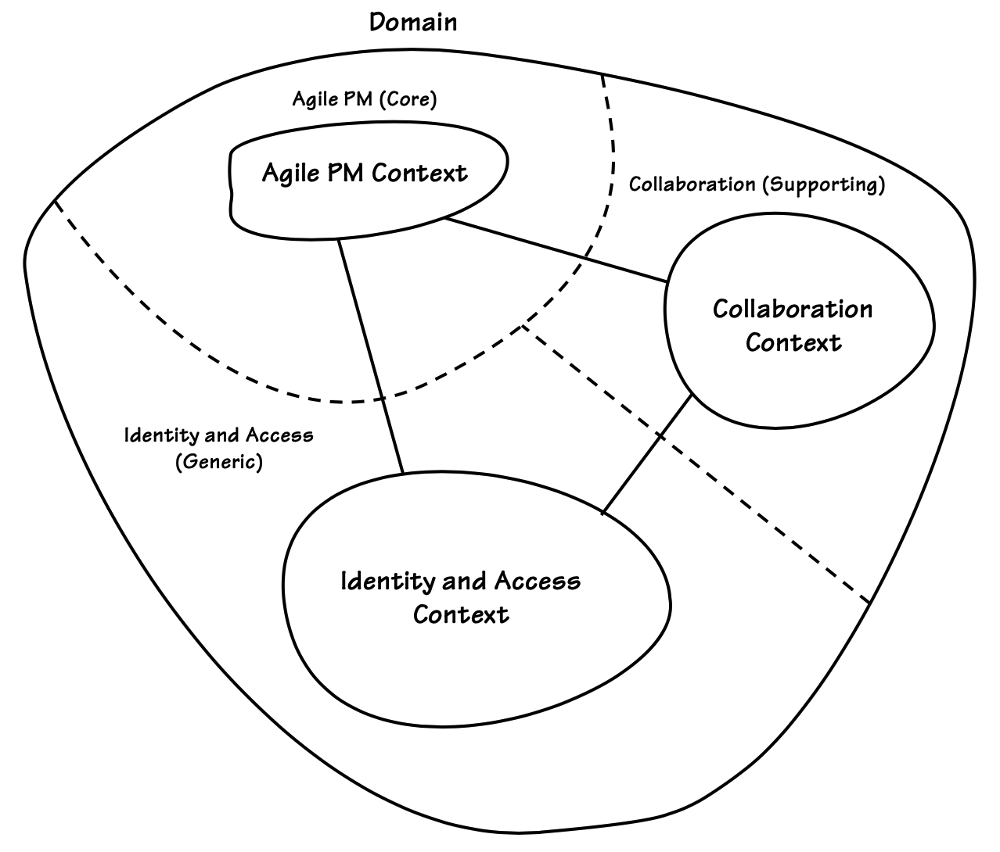
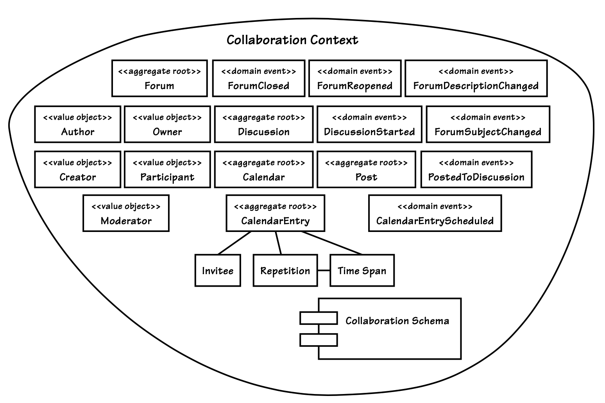
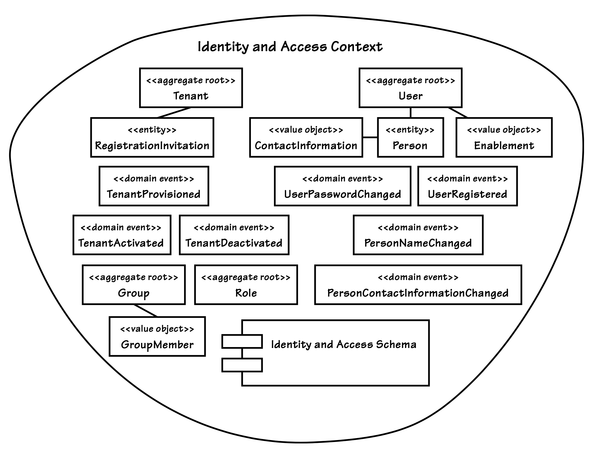

## 示例上下文

#### ▶[上一节](4.md)

由于这些示例代表了一个全新开发的环境，所选的三个`Bounded Contexts`最终以最理想的方式与各自的`Subdomains`一一对应。团队一开始并没有成功实现一一对应的对齐，这给我们上了一个重要的教训。最终结果如 [图 2.7](#figure-27) 所示。

#### Figure 2.7

*完全对齐的`Subdomains`中示例`Bounded Contexts`的评估视图*

以下内容展示了这三种模型如何构成一个现实的现代企业解决方案。在现实世界中的任何项目中，总是存在多个`Bounded Contexts`。它们之间的集成是当今企业的重要场景。除了`Bounded Context`和`Subdomains`外，我们还必须掌握带 [Integration (13](../ch13/0.md) 的`Context Mapping`。

让我们审视作为 DDD 示例实现的三个`Bounded Contexts`。<sup>[7](#7)</sup> 它们是：`Collaboration Context`, `Identity and Access Context`以及`Agile Project Management Context`。

### `Collaboration Context`

在快节奏的经济中，企业协作工具是创造和促进协同工作环境最重要的领域之一。任何能够提高生产力、传递知识、促进创意分享，并协同管理创意过程以确保结果不会丢失的工具，都是企业成功的重要助力。无论软件工具是为广泛的社区提供功能，还是为日常活动和项目目标的特定受众提供功能，企业都纷纷涌向最优秀的在线工具，而 SaaSOvation 也希望分得这块市场的份额。

负责设计和实施`Collaboration Context`的核心团队，在首次发布时被要求支持以下最基本的一套工具：论坛、共享日历、博客、即时通讯、维基、留言板、文档管理、公告和提醒、活动跟踪以及 RSS 订阅。虽然支持广泛的功能，但套件中的每个单独协作工具也可以支持针对性、较小的团队环境，然而它们仍然处于同一个`Bounded Context`内，因为它们都是协作的一部分。不幸的是，本书无法提供整个协作套件。然而，我们确实探索了 [图 2.8](#figure-28) 中所示工具的部分领域模型，即论坛和共享日历。

现在，来说说团队体验……

#### Figure 2.8

*`Collaboration Context`。其`Ubiquitous Language`决定了边界内部的构成要素。为提高可读性，部分模型元素未予展示。用户界面（UI）和`Application Service`组件亦遵循此原则。*

---

| ||
|---|---|
| 战术性 DDD 自产品开发之初便被采用，但团队仍在学习 DDD 的某些精妙之处。实际上，他们使用的更像是 DDD-Lite，主要为技术收益而运用战术模式。诚然，他们试图构建协作的`Ubiquitous Language`，却未能意识到该模型存在明确边界，不可过度扩张。结果他们犯下重大失误，将安全机制与权限管理硬性嵌入协作模型。直到项目后期团队才意识到，将安全权限设计纳入模型并非当初设想的理想方案。||

早期他们并未充分意识到构建应用程序孤岛的风险。然而在缺乏中央安全提供商的情况下，这种孤岛效应必然发生。这实质上是将两种模型强行融合。很快他们就发现，将安全机制混入`Core Domain`域导致的混乱纠缠适得其反：开发者竟要在核心业务逻辑的中间环节，即行为方法中检查客户端权限以执行请求：

```Java
public class Forum extends Entity {
    ...
    public Discussion startDiscussion(
            String aUsername, String aSubject) {
        if (this.isClosed()) {
            throw new IllegalStateException("Forum is closed.");
        }

        User user = userRepository.userFor(this.tenantId(), aUsername);

        if (!user.hasPermissionTo(Permission.Forum.StartDiscussion)) {
            throw new IllegalStateException(
                    "User may not start forum discussion.");
        }

        String authorUser = user.username();
        String authorName = user.person().name().asFormattedName();
        String authorEmailAddress = user.person().emailAddress();

        Discussion discussion = new Discussion(
                this.tenant(), this.forumId(),
                DomainRegistry.discussionRepository().nextIdentity(),
                authorUser, authorName, authorEmailAddress,
                aSubject);
        return discussion;
    }
    ... 
}
```

---
**我刚才看到一场灾难了吗？**

有些开发者认为连续串联多个表达式（例如`user.person().name().asFormattedName()`）是场 “灾难”，另一些人则视其为代码的表达力。我在此不讨论这两种观点，而是聚焦于混乱的模型本身。所谓 “灾难” 实属另一个议题。

---

这确实是糟糕的设计。开发者本不该在此处引用`User`，更不该通过 [Repository (12)](../ch12/0.md) 查询获取`User`。`Permission`对象同样不应触及。之所以能实现这些操作，是因为协作模型本身存在设计缺陷。更严重的是，这种扭曲导致他们忽略了本应建模的核心概念，`Author`。开发者本应将三个相关属性整合为显式的`Value Object`，却满足于分别处理数据元素。他们关注的是安全性而非协作性。

这并非孤立案例。每个协作对象都存在类似问题。随着形成`Big Ball of Mud`的风险日益迫近，团队决定必须改造代码。此外，团队还希望将安全策略从权限管理模式转向基于角色的访问管理。他们该如何行动？

作为敏捷开发方法的实践者和最终的敏捷项目管理工具构建者，他们毫不畏惧地及时投入重构工作。于是他们便开始迭代式重构。然而问题依然存在：究竟哪些最佳 DDD 模式能将他们从困境中解救出来，那片布满错误代码的深渊？

团队中少数成员加班加点研究 [[Evans](../bibli.md#evans)] 的战术构建块模式时，意识到这些并非解决之道。他们遵循模式指引，通过技术手段组合`Entities`对象和`Value Objects`来创建`Aggregates`，同时运用了`Repositories`和 [Domain Service (7)](../ch7/0.md) 。然而他们遗漏了关键要素，这或许正指向需要更深入关注 [[Evans](../bibli.md#evans)] 理论的后半部分。

最终，他们这样做了，并注意到了一些增强能力的技巧。当他们仔细阅读 "第三部分：朝更深刻的洞察进行重构" [[Evans](../bibli.md#evans)] 时，很明显 DDD 提供的远比他们以前认为的要多。通过从 [[Evans](../bibli.md#evans)] 的这一部分获得的技巧，他们现在知道如何通过更加关注`Ubiquitous Language`来改进当前模型。通过花更多优质时间与领域专家交流，他们可以创建一个更接近自己心理模型的模型。但这仍然无法解决扭曲他们对纯合作领域模型视角的安全问题。

书的后面有 “第四部分：战略设计” [[Evans](../bibli.md#evans)] 。团队中的一名成员找到了被证明至关重要的指导，这最终引导他们实现了`Core Domain`。使用的第一个新工具之一是`Context Maps`，这帮助他们更好地理解当前的项目情况。虽然这是一个简单的练习，但绘制第一个`Context Map`并围绕他们的困境进行讨论是一个很大的进步。它促成了有成效的分析以找到解决方案，并最终解除团队的阻碍。

他们现在有几个选项可以进行临时的改进，从而使他们日益脆弱的模型稳定下来：

1. 他们可能会将模型重构为`Responsibility Layers` [[Evans](../bibli.md#evans)] ，通过将安全和权限功能下推到现有模型的较低逻辑层来进行划分。但这似乎不是最佳方法。`Repository Layers`的使用旨在解决大规模模型，或者为那些最终将发展到大规模的模型进行规划。每一层都应保留在模型中，因为它是`Core Domain`的一部分，尽管各层应谨慎划分。另一方面，团队所处理的是被错误使用的概念 —— 那些不属于`Core Domain`的概念。

2. 另一种方案是朝着`Segregated Core` [[Evans](../bibli.md#evans)] 的方向推进。具体可通过在`Collaboration Context`中彻底排查所有安全与权限问题，随后将身份和访问组件重构为同一模型中完全独立的包来实现。虽然无法最终形成完全独立的`Bounded Context`，但能使团队更接近目标。这恰恰符合模式本身的描述：“当存在对系统至关重要的大型`Bounded Context`，但其核心模型被大量辅助功能所掩盖时，便是切割`Segregated Core`的时机。” 这些辅助功能无疑是安全与权限机制。团队最终意识到，通过这些努力将催生独立的`Identity and Access Context`，作为`Collaboration Context`的`Generic Subdomain`。

创建一个`Segregated Core`的计划并不简单。这可能需要几周的非计划工作。但如果他们不采取纠正措施并尽快进行重构，他们将因为缺乏纠正措施而支付代价，同时还会面对一个对变更响应不佳、脆弱的代码库。当业务领导确认成功将业务拆分成新的服务可能有朝一日带来新的 SaaS 产品时，他们也帮助验证了这一方向的明智性。

重要的是，团队现在认识到`Bounded Contexts`的价值，以及为维护一个内聚的`Core Domain`而努力奋斗的重要性。通过运用额外的战略设计模式，他们能够将可复用的模型分离到不同的`Bounded Contexts`中，并在适当的时候进行集成。

未来的`Identity and Access Bounded Context`很可能与嵌入式安全和权限设计有所不同。面向复用的设计将迫使团队聚焦于更通用的模型，该模型可被众多应用程序按需调用。这个专门团队 ——不同于我们的`Collaboration Context`团队，但由其中若干成员组成—— 还可能引入多种实现策略。这些策略可能包含第三方产品及客户定制化集成，而这些方案在嵌入式安全的复杂体系下已难以实现。

由于`Segregated Core`的开发已成为一个过渡步骤，本文不再重点探讨其成果。简而言之，该方案将所有安全与权限类迁移至隔离`Modules`，并要求`Application Services`客户端在调用`Core Domain`前，必须通过这些对象验证安全权限。此举使核心得以专注实现协作模型对象组合与行为，而安全机制与对象转换则由`Application Service`负责：

```Java
public class ForumApplicationService ... {
    ...
    @Transactional
    public Discussion startDiscussion(
            String aTenantId, String aUsername,
            String aForumId, String aSubject) {
        Tenant tenant = new Tenant(aTenantId);
        ForumId forumId = new ForumId(aForumId);

        Forum forum = this.forum(tenant, forumId);

        if (forum == null) {
            throw new IllegalStateException("Forum does not exist.");
        }

        Author author =
                this.collaboratorService.authorFrom(
                        tenant,
                        anAuthorId);
        Discussion newDiscussion =
                forum.startDiscussionFor(
                        this.forumNavigationService(),
                        author,
                        aSubject);
        this.discussionRepository.add(newDiscussion);
        return newDiscussion;
    }
    ... 
}
```

论坛呈现的结果如下： *（译注：修改了上述例子中部分语句: `forum.startDiscussion(...)` -> `forum.startDiscussionFor(...)`）*

```Java
public class Forum extends Entity {
    ...

    public Discussion startDiscussionFor(
        ForumNavigationService aForumNavigationService,
        Author anAuthor,
        String aSubject) {
        if (this.isClosed()) {
            throw new IllegalStateException("Forum is closed.");
        }

        Discussion discussion = new Discussion(
                this.tenant(),
                this.forumId(),
                aForumNavigationService.nextDiscussionId(),
                anAuthor,
                aSubject);

        DomainEventPublisher
            .instance()
            .publish(new DiscussionStarted(
                    discussion.tenant(),
                    discussion.forumId(),
                    discussion.discussionId(),
                    discussion.subject()));

        return discussion;
    }
    ... 
}
```

此举消除了`User`与`Permission`的纠缠，使模型严格聚焦于协作功能。虽然结果并非完美无缺，但为团队未来重构以便分离与集成`Bounded Contexts`奠定了基础。`Collaboration Context`团队最终将从其`Bounded Context`中移除所有安全与权限`Modules`及类型，欣然采用全新的`Identity and Access Context`。他们将安全机制集中化并实现复用的终极目标，此刻已近在咫尺。

确实，团队本可以从相反的方向开始。他们本可以通过创建多个独立的`Bounded Contexts`来实现微型化，最终可能会有十个或更多 —— 每个协作功能一个（例如，将论坛和日历作为不同的模型）。是什么可能让他们朝那个方向发展呢？由于大多数协作功能之间并不耦合，每个功能都可以作为独立组件进行部署。通过将每个功能放在单独的`Bounded Context`中，团队可以创建大约十个自然的部署单元。确实如此，但为了实现这些部署目标而制作十个不同的领域模型并非必要，而且可能只会与`Ubiquitous Language`的建模原则背道而驰。

相反，团队保留了单一模型，但为每个协作功能创建了独立的 JAR 文件。通过 Jigsaw 模块化技术，他们为每个功能创建了基于版本的部署单元。除了自然协作划分的 JAR 文件外，还需为共享模型对象（如`Tenant`、`Moderator`、`Author`、`Participant`等）单独创建 JAR 文件。此方案既支持统一`Ubiquitous Language`的开发，又满足了兼具架构优势与应用管理效益的部署目标。

---

基于这一理解，我们可以探讨`Identity and Access Context`是如何形成的。

### `Identity and Access Context`

当今大多数企业应用程序都需要配备某种形式的安全和权限组件，以确保尝试使用系统的用户是经过身份验证的，且具备执行操作的授权。正如我们刚才分析的那样，应用程序安全的一种简单粗暴的做法是在每个独立系统中分别构建用户和权限，这会在每个应用程序中产生孤岛效应。

|牛仔逻辑||
|---|---|
|LB：“你的谷仓和粮仓都没上锁，可没人偷你的玉米？” </br> AJ：“我的狗滚滚草负责门禁管理。这就是我的孤岛效应。” </br> LB：“我觉得你根本没读懂这本书。”||


不同系统的用户难以相互关联，即便许多使用者是重合的。为防止信息孤岛在企业环境中大量涌现，架构师需集中管理安全与权限。这可通过采购或开发身份与访问管理系统实现。具体选择取决于所需的复杂程度、可用时间以及总拥有成本。

---

| ||
|---|---|
|纠正 CollabOvation 中的身份与访问权限纠葛需要多步骤流程。团队首先采用`Segregated Core` [[Evans](../bibli.md#evans)] 进行重构，详见 [`Collaboration Contexts`](#collaboration-context) 章节。此举当时有效实现了目标，确保 CollabOvation 消除了安全与权限方面的隐患。但团队认为身份与访问管理最终应独立成为一个上下文边界，这需要投入更大的工作量。||

---

这构成了一个新的`Bounded Context` ——`Identity and Access Context`—— 并将通过标准 DDD 集成技术被其他`Bounded Contexts`所使用。对于消费上下文而言，`Identity and Access Context`是一个`Generic Subdomain`。该产品将命名为 IdOvation。

如 [图 2.9](#figure-29) 所示，`Identity and Access Context`为多租户订阅者提供支持。开发 SaaS 产品时，这一点毋庸置疑。每个租户及其拥有的所有对象资产都将拥有完全唯一的身份，从而在逻辑上将各租户彼此隔离。系统用户仅限通过邀请进行自助注册。安全访问由身份验证服务管控，密码始终采用高强度加密。用户组与嵌套组机制支持从整个组织到最小团队的精细化身份管理。系统资源访问权限通过简洁优雅却功能强大的基于角色的权限体系进行管控。

#### Figure 2.9

*`Identity and Access Context`。边界内的所有内容均遵循`Ubiquitous Language`的上下文定义。该`Bounded Context`还包含其他组件，部分位于模型层，部分位于其他层级，为保持可读性未在此处展示。UI 组件与`Application Service`组件亦遵循相同原则。*

作为更高级的步骤，当模型行为引发对观察者具有特殊意义的状态转换时，[Domain Events (8)](../ch8/0.md) 便会发布。这些事件通常采用名词与过去式动词组合的形式建模，例如：`TenantProvisioned`、`UserPasswordChanged`、`PersonNameChanged`等。

下一章 [第 3 章：上下文地图 (Context Maps)](../ch3/0.md) 将展示如何通过 DDD 集成模式，使另外两个示例上下文利用`Identity and Access Context`。

### `Agile Project Management Context`

敏捷开发轻量级方法的普及，尤其在 2001 年《敏捷宣言》发布后，使其声势大涨。SaaSOvation 在愿景声明中将开发敏捷项目管理应用列为第二项核心战略举措。事情的进展如下……

---

| ||
|---|---|
|在 CollabOvation 订阅销售取得三个季度的成功、根据客户反馈实施渐进式升级改进并实现超预期营收后，公司正式启动 ProjectOvation 计划。该项目将成为其核心业务领域，将调集 CollabOvation 顶尖开发人员，充分运用其 SaaS 多租户架构与新积累的 DDD 经验。||

该工具专注于敏捷项目管理，采用 Scrum 作为迭代与增量式项目管理框架。ProjectOvation 遵循传统 Scrum 项目管理模式，完整涵盖产品、产品负责人、团队、待办事项、计划发布及冲刺等要素。通过运用成本效益分析的商业价值计算器，为待办事项提供估算支持。

该商业计划始于双轨愿景。CollabOvation 与 ProjectOvation 不会完全分道扬镳。SaaSOvation 及其董事会设想将协作工具与敏捷软件开发相结合的创新模式。因此，CollabOvation 的功能将作为 ProjectOvation 的可选附加组件提供。由于提供附加功能，CollabOvation 成为 ProjectOvation 的辅助子域。产品负责人与团队成员将在产品讨论、版本发布与冲刺规划、待办事项讨论中互动协作，并共享日历等资源。未来计划将企业资源规划纳入 ProjectOvation，但当前必须优先实现敏捷产品目标。

技术利益相关方最初计划通过版本控制系统的源代码分支，将 ProjectOvation 功能作为 CollabOvation 模型的扩展来开发。这实际上将是一个重大错误，尽管对于那些未能在问题空间中充分关注子领域、在解决方案空间中忽视边界上下文的人而言，此类失误实属常见。

幸运的是，技术人员从早期混乱的`Collaboration Context`问题中吸取了教训。他们从这次经历中学到的经验使他们相信，即使仅仅开始尝试将敏捷项目管理模型与协作模型结合起来也是一个重大错误。现在，团队开始倾向于以 DDD 的战略设计思维方式进行思考。

[图 2.10](#figure-210) 表明，通过采用战略设计思维，ProjectOvation 团队现已恰当地将消费者视为`Product Owners`和`Team Members`。毕竟，这些正是 Scrum 实践者所扮演的项目成员角色。用户与角色在独立的`Identity and Access Context`中进行管理。借助该`Bounded Context`，自助服务使订阅者能够管理个人身份信息。管理控制机制使产品负责人等管理者能够指定其产品团队成员。通过规范角色管理，`Product Owners`和`Team Members`可在其所属的`Agile Project Management Context`中创建。随着团队专注于将敏捷项目管理的`Ubiquitous Language`转化为精心构建的领域模型，项目设计的其余部分也将受益。

#### Figure 2.10

*`Agile Project Management Context`。该`Bounded Context`的`Ubiquitous Language`聚焦于基于 Scrum 的敏捷产品、迭代与发布。为提升可读性，此处未展示部分组件r，包括来自 UI 和`Application Services`的组件。*

一项要求是 ProjectOvation 需作为一组自主应用服务运行。团队希望将 ProjectOvation 对其他`Bounded Contexts`的依赖限制在合理周期内，或至少控制在实际可行的范围内。总体而言，ProjectOvation 具备独立运行能力。即使因任何原因导致 IdOvation 或 CollabOvation 离线，ProjectOvation 仍能持续自主运作。当然，这种情况下部分数据可能出现短暂（且通常非常短暂）的同步延迟，但系统整体功能不会中断。

---

---
**上下文赋予每个术语非常具体的含义**

基于 Scrum 的`Product`包含任意数量的`BacklogItem`实例，用于描述正在构建的软件。这与电商网站中放入购物车待购的商品截然不同。我们如何知道？因为上下文。我们理解`Product`在`Agile PM Context`中的含义，而在在线商店语境中，`Product`则具有截然不同的含义。团队无需将产品命名为 ScrumProduct 来传达这种差异。

---

考虑到 SaaSOvation 的经验积累，`Product`、`Backlog Items`、`Tasks`、`Sprints`和`Release`的`Core Domain`已经有了一个更好的开端。不过，我们仍然希望了解他们在认真建模 [Aggregates (10)](../ch10/0.md) 过程中所学到的重要经验教训。

<center></center>

#### ▶[下一节](6.md)

---

#### 7
请注意，`Context Maps`提供了关于实际三个示例`Bounded Contexts`的更多细节，包括它们之间的关联方式以及集成方式。不过，更深入的分析仍集中于`Core Domain`。
