## 为何`Context Maps`如此重要

#### ▶[上一节](0.md)

在启动 DDD 时，首先绘制 *当前项目状况* 的可视化`Context Map`。绘制项目中当前涉及的`Bounded Contexts`及其集成关系的`Context Map`。[图 3.1](#figure-31) 展示了一个抽象的`Context Map`。我们将随着项目推进逐步填充细节。

#### Figure 3.1
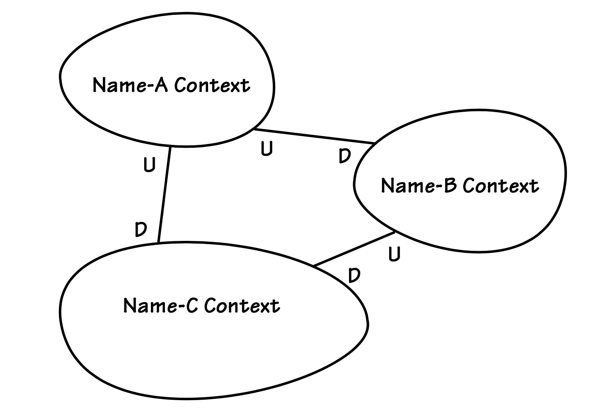
*抽象领域的`Context Map`。图中绘制了三个`Bounded Contexts`及其关联关系，其中 U 代表上游，D 代表下游。*

这张简图是你们团队的地图。其他项目团队可以参考它，但若要实施 DDD ，他们也应创建自己的地图。绘制这张地图的主要目的是为团队提供成功所需的解决方案视角。其他团队可能并未采用 DDD，或者根本不关心你们的视角。

---
**哦，不！又出现新术语了！**

我们在此引入`Big Ball of Mud`、`Customer-Supplier`和`Conformist`概念。请耐心，这些术语以及本章稍后详细讨论的其他 DDD 团队和集成关系都会有详细说明。

---

例如，当你在大型企业中整合`Bounded Contexts`时，可能需要对接一个`Big Ball of Mud`的系统。维护这个混乱单体系统的团队可能并不关心你的项目走向，只要你遵守他们的 API 规范即可。因此，他们不会从你的地图或 API 使用方式中获得任何洞察。但你的地图仍需反映与他们的协作关系，因为 *这能为团队提供必要洞察，并标明跨团队沟通的关键领域* 。这种认知将极大助力团队取得成功。

---
**通信设施**

除了为您提供必须交互的系统清单外，`Context Map`还能促进跨团队沟通。

---

试想，如果你的团队认为维护混乱单体系统的团队会提供你所依赖的新 API，但对方既无意提供，甚至根本不知晓你的需求，会发生什么？你的团队正指望与混乱系统建立`Customer-Supplier`关系。然而，遗留团队仅提供现有功能的做法，迫使你们陷入意料之外的`Conformist`关系。根据项目推进到何种阶段才得知这个坏消息，这种隐形却真实的关系可能延误交付甚至导致项目失败。通过早期绘制`Context Map`，你们将被迫认真思考与所有依赖项目的关联关系。

- 识别项目中涉及的每个模型，并定义其`BOUNDED CONTEXT`。……为每个`BOUNDED CONTEXT`命名，并将名称纳入`UBIQUITOUS LANGUAGE`。描述模型间的交互点，明确任何通信的转换规则，并突出显示数据共享关系。[[Evans, p. 345](../bibli.md#evans)]

| ||
|---|---|
|当 CollabOvation 团队最初开始开发其绿地模型时，本应采用`Context Map`。尽管他们几乎是从零起步，但若以地图形式阐明项目假设，本可促使他们思考独立的`Bounded Contexts`。他们仍可将重要建模元素列于白板，再将其归入相关术语组。这本可迫使他们识别语言边界，从而形成简洁的`Context Map`。然而当时他们对战略建模一无所知，亟需实现战略建模的突破。后来他们确实发现了这项挽救项目的关键工具，并最终从中获益。当后续`Core Domain`项目启动时，这项工具再次带来显著回报。||

让我们看看如何快速绘制一张实用的`Context Map`。

### 绘制`Context Map`

`Context Map`用于记录 *现有* 地形。首先，你应该描绘当下而非想象中的未来。如果随着当前项目推进地形将发生变化，届时可更新地图。请先聚焦现状，以便厘清当前位置并确定下一步方向。

创建图形化`Context Map`并不复杂。首选方案始终是手绘图，白板和白板笔是最佳工具。如 [[Brandolini](../bibli.md#brandolini)] 所示，这种风格易于灵活调整。若决定使用工具捕捉绘图，请务必保持非正式风格。

回顾 [图 3.1](#figure-31) ，`Bounded Context`名称与集成关系仅为占位符。它们在实际地图中均会采用具体名称。图中展示了上下游关系，其含义将在本章后文阐述。

---
➜**白板时间**

绘制当前项目状况的简易示意图，清晰传达以下信息：边界位置、边界间及其对应团队的关系、涉及的集成类型，以及必要的转换机制。

请记住，软件实现的是图纸中的内容。若需了解应绘制哪些内容，请考虑您所定义的`Bounded Context`所集成的系统。

---

有时我们需要放大并为`Context Map`的特定部分添加更多细节。这只是对相同上下文的不同视角呈现。除边界、关联和转换外，我们还可能需要纳入其他元素，例如 [Modules (9)](../ch9/0.md) 、重要 [Aggregates (10)](../ch10/0.md) 、或许还有团队分配方式，以及任何与上下文相关的信息。本章后续部分将演示这些技术。

所有图纸及文字说明若对团队具有价值，均可整合至单一参考文档中。此类工作应避免繁文缛节，保持简洁灵活。仪式感越强，使用该地图的人就越少。图表细节过多反而无益于团队协作。开放沟通才是关键。当对话中涌现战略洞见时，请及时将其纳入`Context Map`。

---
**不，这并非企业级架构**

`Context Map`既非企业架构图，亦非系统拓扑图。

---

`Context Map`并非企业架构或系统拓扑图。其传递的信息与交互模型及 DDD 组织模式相关。尽管如此，`Context Maps`仍可用于高层次架构研究，提供其他方法无法获得的企业视角。它们能揭示架构缺陷，例如集成瓶颈。由于展现了组织动态，`Context Maps`甚至有助于识别阻碍进展的棘手治理问题，以及其他团队与管理挑战，这些问题通过其他方法往往难以发现。

|牛仔逻辑||
|---|---|
|AJ：“老婆说：‘我刚才在牧场里放牛呢，你没看见我吗？’我说：‘没。’结果她整整一周没理我。”|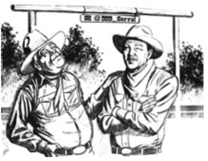|

这些图表值得在团队区域的墙上醒目张贴。若团队常使用维基平台，也可将图表上传至该处。但若维基平台基本无人问津，则不必费心。常言道维基是信息消亡之地。无论展示于何处，若团队不通过有意义的讨论定期关注，`Context Maps`终将沦为明处之暗。

### 项目与组织关系

简而言之，SaaSOvation 正致力于开发并完善三款产品：

1. 社交协作套件产品 CollabOvation 允许注册用户通过论坛、共享日历、博客、维基等流行网络工具发布具有商业价值的内容。这是 SaaSOvation 的旗舰产品，也是公司首个 [Core Domain (2)](../ch2/0.md)（尽管团队当时尚未了解 DDD 术语）。该产品是 IdOvation（第 2 点）模型最终提取的上下文环境。CollabOvation 现将 IdOvation 作为 [Generic Subdomain (2)](../ch2/0.md) 使用。CollabOvation 本身将作为 [Supporting Subdomain (2)](../ch2/0.md) 被使用，成为 ProjectOvation（第 3 点）的可选附加组件。

2. IdOvation 提供可复用的身份与访问管理模型，为注册用户实现基于角色的安全访问管理。这些功能最初与 CollabOvation（第 1 点）组合，但该实现存在局限且不可复用。SaaSOvation 对 CollabOvation 进行了重构，引入了全新的、清晰的`Bounded Context`。关键产品特性在于支持多租户架构，这对 SaaS 应用至关重要。IdOvation 作为`Generic Subdomain`，为其消费模型提供服务。

3. 敏捷项目管理产品 ProjectOvation 现已成为新的`Core Domain`。该 SaaS 产品的用户可创建项目管理资产及分析设计成果，并通过基于 Scrum 的执行框架追踪进度。与 CollabOvation 类似，ProjectOvation 将 IdOvation 作为`Generic Subdomain`使用。其创新功能之一是将团队协作（第 1 点）融入敏捷项目管理，支持围绕 Scrum 产品、版本发布、迭代周期及单项待办事项展开讨论。

---
**终于，定义来了！**

之前提到的组织与集成模式被定义为……

---

这些`Bounded Contexts`与其各自项目团队之间存在何种关系？DDD 中存在若干组织与集成模式，其中一种模式通常存在于任意两个`Bounded Contexts`之间。以下各定义主要引自 [[Evans, Ref](../bibli.md#evans-ref)] ：

- **`Partnership`** ：当两个上下文中的团队将共同成功或失败时，就需要建立合作关系。团队应建立协调开发计划和共同管理集成的流程。团队必须在接口演进方面通力合作，以满足两个系统的开发需求。相互依赖的功能应安排在同一版本中完成。

- **`Shared Kernel`** ：共享部分模型及相关代码会形成高度紧密的相互依赖关系，这种关系既能促进设计工作，也可能破坏设计。需明确划定领域模型中团队同意共享的子集边界。保持内核精简。这些明确共享的组件具有特殊地位，未经其他团队协商不得更改。建立持续集成流程以确保内核模型紧凑，并统一各团队的 [Ubiquitous Language (1)](../ch1/0.md) 。

- **`Customer-Supplier Development`** ：当两个团队处于上游-下游关系时，若上游团队的成功可能与下游团队的命运相互依存，则下游团队的需求将通过多种方式得到满足，并产生广泛影响。下游优先级将纳入上游规划考量。需就下游需求进行任务协商与预算分配，确保各方明确承诺内容与时间安排。

- **`Conformist`** ：当两个开发团队存在上游/下游关系时，若上游团队缺乏满足下游需求的动力，下游团队便束手无策。利他主义或许能促使上游开发者做出承诺，但这些承诺往往难以兑现。下游团队通过机械地遵循上游团队的模型，消除了界限上下文间转换的复杂性。

 - **`Anticorruption Layer`** ：当连接设计良好的`Bounded Contexts`与协作团队时，翻译层可以简单甚至优雅。但当控制或沟通不足以实现共享内核、合作伙伴或客户-供应商关系时，转换就变得复杂起来。此时转换层将转为防御性模式。作为下游客户端，需构建隔离层，通过自身领域模型为系统提供上游系统的功能。该层通过现有接口与其他系统通信，几乎无需修改对方系统。在内部，该层根据需要在两个模型之间进行单向或双向转换。

- **`Open Host Service`** ：定义一种协议，将子系统作为服务集提供访问权限。开放该协议，使所有需要与您集成的用户均可使用。增强并扩展协议以处理新的集成需求，但当某个团队存在特殊需求时除外。此时可使用一次性转换器为该特殊情况补充协议，从而保持共享协议的简洁与一致性。

- **`Published Language`** ：两个`Bounded Contexts`模型之间的转换需要一种通用语言。应采用一种记录完善的共享语言作为共同通信媒介，该语言能够表达必要的领域信息，并在必要时进行语言转换。`Published Language`通常与`Open Host Service`相结合。

- **`Separate Ways`** ：定义需求时必须果断决绝。若两组功能间毫无关联，便可彻底割裂彼此。集成成本高昂，收益却往往微乎其微。宣告某个界限上下文与其他上下文完全割裂，让开发者能在这个小范围内寻找简单而专业的解决方案。

- **`Big Ball of Mud`** ：在考察现有系统时，我们发现某些系统（通常是大型系统）内部存在模型混杂、边界不一致的区域。请为整个混乱区域划定边界，将其定义为 `Big Ball of Mud`。切勿在此上下文中尝试应用复杂建模技术，并警惕此类系统向其他上下文蔓延的趋势。

通过与`Identity and Access Context`集成，`Collabora- tion Context`和`Agile Project Management Context`在安全与权限方面避免了各自为政。诚然，在特定系统中可全局采用`Separate Ways`模式，但也可根据具体情况灵活运用。例如，某个团队可能拒绝使用集中式安全系统，却仍选择与其他企业标准设施进行集成。

团队将以`Customer-Supplier`的角色展开协作。SaaSOvation 的管理层绝不会允许某个团队强迫其他团队成为`Conformists`。`Conformist`关系并非总是负面的，关键在于`Customer-Supplier`模式要求供应商承诺为客户提供支持，这种模式能培育出 SaaSOvation 认为实现全面成功所必需的跨团队协作关系。当然客户并非永远正确，因此必须存在适当的妥协空间。总体而言，团队需要维系的是积极的组织关系。

团队的集成将采用`Open Host Service`和`Published Language`。令人意外的是，它们还将运用`Anticorruption Layer`。这并非矛盾之处，尽管团队在`Bounded Contexts`间建立了开放标准，仍可通过在下游上下文中运用其基本原则实现隔离翻译的优势，且复杂度远低于处理`Big Ball of Mud`所需的程度。翻译层将保持简洁优雅。

以下`Context Map`图示采用以下缩写标注关系两端所采用的模式：

- ACL 表示`Anticorruption Layer`
- OHS 表示`Open Host Service`
- PL 表示`Published Language`

在审阅以下示例`Context Maps`及其配套文本时，不妨回顾 [第 2 章：领域、子领域与界限上下文 (Bounded Contexts)](../ch2/0.md) 。三个示例`Bounded Context`的示意图在此同样具有参考价值。由于这些示意图仍保持较高抽象度，可将其纳入各上下文的地图中，但本文中不再重复展示。

### 映射三个上下文

现在让我们深入团队实践，从中汲取经验教训……

---
| ||
|--|--|
|当 CollabOvation 团队意识到自己陷入的困境时，他们深入研究 [[Evans](../bibli.md#evans)]  的理论来寻求解脱之道。在战略设计模式中，他们发现了诸多极具价值的成果，其中包括名为`Context Maps`的实用工具。他们还在线上找到 [[Brandolini](../bibli.md#brandolini)] 撰写的一篇详解该技术的文章。根据工具指引，团队首先着手绘制现有地形图，[图 3.2](#figure-32) 展示了该步骤的成果。||

团队绘制的首张地图凸显了他们对`Bounded Context`的早期认知，并将其命名为`Collaboration Context`。通过现有边界的不规则形状，他们恰当地暗示了第二个上下文的潜在存在，但该上下文与`Core Domain`之间缺乏清晰明确的界限。

#### Figure 3.2
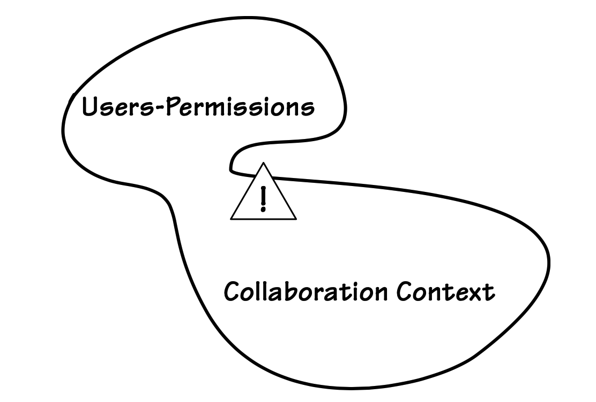</br>
*该图揭示了`Collaboration Context`中因不协调概念引发的纠缠。警示标志标注了混杂区域。*

---

顶部附近的一条狭窄通道允许外来概念几乎不受审查地自由迁移，正如警示标志所示。这并非意味着上下文边界必须完全不可渗透。如同任何边界一样，团队希望`Collaboration Context`能够在充分知情的情况下控制跨越边界的内容及其目的。否则领地将被未知且可能不受欢迎的访客侵占。在模型领域，这些不受欢迎的访客通常会引发混乱与缺陷。建模者应保持友善甚至欢迎的态度，但前提是维护秩序与和谐。任何进入边界的外部概念都需证明其存在正当性，甚至需具备与内部领地相容的特性。

---
| ||
|--|--|
|这项分析不仅加深了对模型现状的理解，更指明了项目的发展方向。当项目团队意识到安全、用户和权限等概念不应纳入`Collaboration Context`时，他们立即采取了相应措施。团队必须将这些概念与`Core Domain`分离，并确保它们仅在符合约定条款的情况下才能进入。||

---

这是 DDD 项目中至关重要的承诺。必须尊重每个`Bounded Context`的语言规范，以确保所有模型保持纯粹性。语言隔离及其严格遵循，有助于项目中每个团队专注于自身的`Bounded Context`，并使他们的视野始终聚焦于自身工作。

---
通过应用`Subdomain`分析（或称问题空间评估），团队得出了 [图 3.3](#figure-33) 所示的结构图。从单个`Bounded Context`中划分出两个`Subdomains`。由于将`Subdomains`与`Bounded Contexts`实现一对一对应是理想目标，此次分析表明需要将单个`Bounded Context`拆分为两个。

#### Figure 3.3
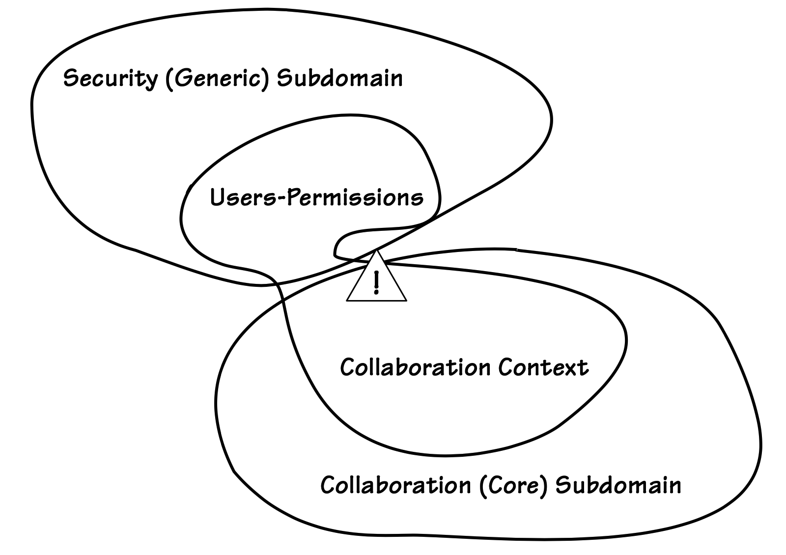</br>
*团队的`Subdomain`分析揭示了两个子领域：`Collaboration Core Domain`与`Security Generic Subdomain`。*

---

---
`Subdomain`与边界分析促成了决策。当人类用户使用 CollabOvation 时，他们以`Participants`、`Authors`、`Moderators`等身份与可用功能交互。其他多种情境划分将在后文讨论，但这已清晰展现了必要划分所形成的结构。基于此认知， [图 3.4](#figure-34) 所示的高层级`Context Maps`中呈现了清晰锐利的边界。团队采用 [[Evans](../bibli.md#evans)] 提出的`Segregated Core`重构法实现此清晰度。边界可识别的形状成为各上下文的图标或视觉提示，在不同图表中保持相对形状的一致性有助于认知理解。

#### Figure 3.4
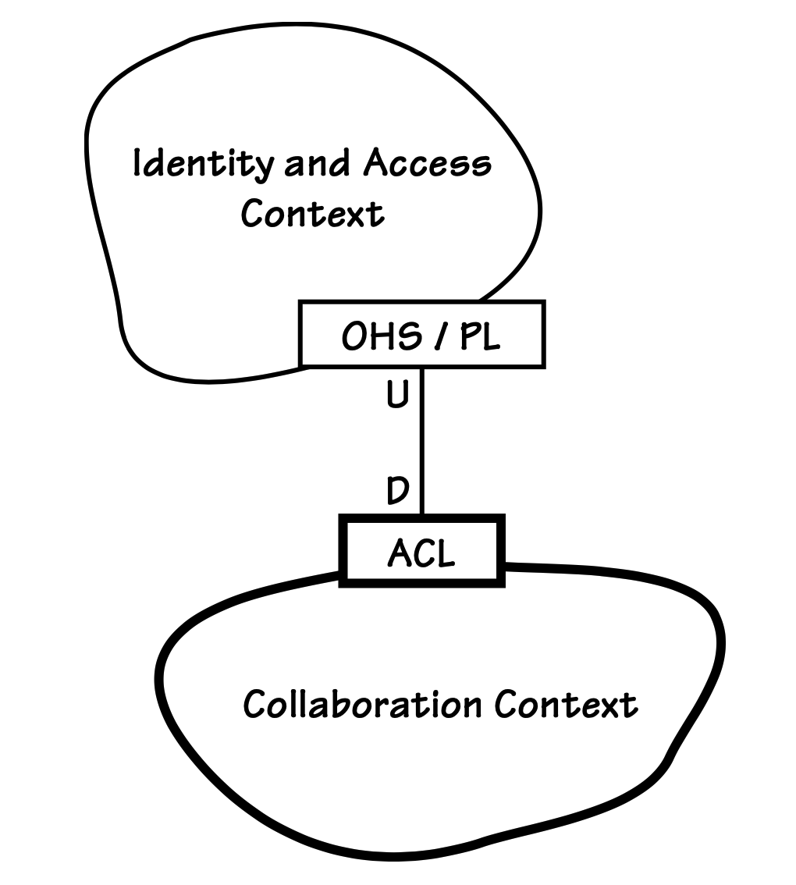</br>
*原始`Core Domain`以粗边界和集成点标注。此处 IdOvation 作为通用子域，为下游 CollabOvation 提供支持。*

---

`Context Maps`通常不会像各种草图所暗示的那样一次性呈现完整，但一旦理解其原理，制作起来并不困难。通过反复推敲与讨论，可快速迭代完善地图。部分优化可能体现在集成点上，这些节点描述了不同上下文之间的关联关系。

---
前两张地图展示了采用战略设计后的成果。在 CollabOvation 项目顺利推进后，团队将身份与访问问题独立出来。随着项目进展，他们绘制了 [图 3.4](#figure-34) 所示的`Context Map`。团队仅勾勒出`Core Domain`，`Collaboration Context`及新增的`Generic Subdomain`，`Identity and Access Context`，未描绘任何未来模型（如`Agile Project Management Context`）。过早跳跃至未来模型对团队无益，他们只需修正现有缺陷。支持后续系统的转换机制终将需要，而该地图的绘制任务应由未来团队承担。

---

---
➜**白板时间**

- 思考你自己的`Bounded Context`时，能否识别出不属于该上下文的概念？若能，请绘制新的`Context Map`，展示期望的上下文及其间关系。
- 在九种 DDD 的组织与集成关系中，你会选择哪几种？请说明理由。

---

---
当涉及 ProjectOvation 的下一个项目启动时，正是时候通过新增`Core Domain`，`Agile Project Management Context`，来扩展现有地图。该映射结果如 [图 3.5](#figure-35) 所示。尽管相关功能尚未编码实现，但此时捕捉规划中的内容并不为时过早。新上下文的细节尚未完全厘清，但这将通过讨论逐步明确。在此早期阶段应用高层次战略设计，有助于所有团队厘清各自职责边界。由于第三张高层次地图仅是对前两张的扩充，我们将重点聚焦于此。这正是 SaaSOvation 的发展方向。公司已指派经验丰富的首席开发者加入新项目。作为三种上下文中资源最丰富且当前发展方向的`Core Domain`，顶尖开发者理应在此领域施展才华。

</br>

某些关键的隔离机制已得到充分理解。类似于`Collaboration Context`，当 ProjectOvation 的用户创建产品、规划版本发布、安排冲刺周期以及处理待办事项时，他们是以`Product Owners`和`Team Members`的身份开展工作。`Identity and Access Context`已从`Core Domain`中分离。`Collaboration Context`的对其使用亦是如此，它现已成为`Supporting Subdomain`。新模型对该领域的任何调用都将通过边界约束及向`Core Domain`概念的转换机制得到保护。

---

请仔细观察这些图示的细节。它们并非系统架构图。若是架构图，鉴于`Agile Project Management Context`已成为我们的新`Core Domain`，理应将其置于图示顶部或中心位置。然而此处它却位于底部。这一看似奇特的特征直观表明核心模型处于其他模型的下游。

#### Figure 3.5
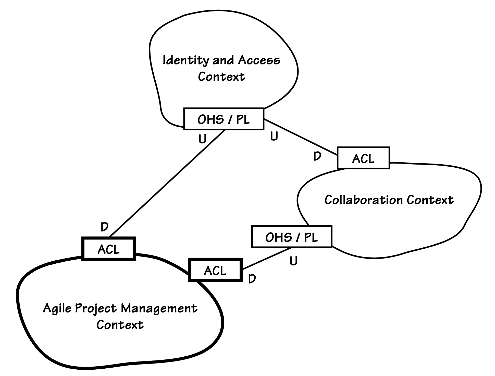
*当前核心领域以粗边界和集成点标注，协作创新支持子领域与智能创新通用子领域则位于上游。*

这种细微差别提供了另一种视觉提示。上游模型对下游模型具有影响作用，正如河流上游发生的活动往往会对下游居民产生影响，无论是积极还是消极的。试想一座大城市向河流排放的污染物：这些污染物对该城市本身影响甚微，但下游城市却可能面临严重后果。图中模型的垂直邻接关系有助于识别上游对下游模型的影响。U（上游）和 D（下游）标签在关联模型间明确标注了这种关系。这些标签使上下文的垂直定位变得次要，但采用它们仍能提升视觉美感。

| ||
|------|---|
|**牛仔逻辑**||
|LB：“当你渴得要命时，永远要往牛群上游喝水。”||

`Identity and Access Context`处于最上游位置，其影响同时作用于`Collaboration Context`和`Agile Project Management Context`。我们的`Collaboration Context`同样位于`Agile Project Management Context`的上游，因为敏捷模型依赖于协作模型及相关服务。如 [Bounded Contexts (2)](../ch2/0.md) 所述，ProjectOvation 将尽可能自主运行。其运作必须在很大程度上独立于周边系统的可用性。这并不意味着自主服务能完全脱离上游模型运行。我们必须通过设计大幅限制直接实时依赖关系。尽管具备自主性，我们的`Agile Project Management Context`仍处于其他上下文的下游位置。

为应用程序配备自主服务，并不意味着将上游上下文中的数据库简单复制到依赖上下文中。复制会迫使本地系统承担许多不必要的责任，这将需要创建`Shared Kernel`，而这实际上无法实现真正的自主性。

在最新版本的地图上，请注意每个连接的上游侧连接器盒。两个连接器均标注为 OHS/PL，该缩写代表`Open Host Service`和`Published Language`。三个下游连接器盒均标注为 ACL，即`Anticorruption Layer`的简称。相关技术实现详见 [Integrating Bounded Contexts (13)](../ch13/0.md) 。简而言之，这些集成模式具有以下技术特征：

- **`Open Host Service`**：该模式可实现为基于 REST 的资源，供客户端`Bounded Contexts`进行交互。我们通常将`Open Host Service`视为远程过程调用（RPC）API，但也可通过消息交换方式实现。

- **`Published Language`**：此功能可通过多种方式实现，但通常采用 XML schema 实现。当基于 REST 的服务表达时，`Published Language`以领域概念的表示形式呈现。表示形式可包含 XML 和 JSON 等格式，也可采用 Google Protocol Buffers 进行呈现。若发布 Web 用户界面，还可能包含 HTML 表示形式。采用 REST 架构的优势在于：每个客户端可指定首选的`Published Language`，资源将按请求的内容类型呈现表示形式。REST 还具备生成超媒体表示的特性，这有助于实现 HATEOAS（链接作为操作）。超媒体使`Published Language`极具动态交互性，支持客户端导航至关联资源集。该语言可通过标准和/或自定义媒体类型发布。`Published Language`同样应用于 [Event-Driven Architecture (4)](../ch4/0.md) ，其中 [Domain Events (8)](../ch8/0.md) 以消息形式传递给订阅的利益相关方。

- **`Anticorruption Layer`**：可在下游上下文中为每种`Anticorruption Layer`类型定义一个 [Domain Service (7)](../ch7/0.md) 。您也可在 [Repository (12)](../ch12/0.md) 接口后方部署`Anticorruption Layer`。若采用 REST，客户端`Domain Service`实现将访问远程`Open Host Service`。服务器响应以`Published Language`形式生成表示对象。下游`Anticorruption Layer`将表示形式转换为本地上下文的领域对象。例如`Collaboration Context`向`Identity and Access Context`请求 “用户-版主角色” 资源时，可能接收 XML 或 JSON 格式的资源，随后将其转换为`Moderator`，这是个`Value Object`。新创建的`Moderator`实例反映的是下游模型概念，而非上游模型概念。

所选模式均为常见类型。限制选择范围有助于使本书讨论的集成范围保持可控。我们将看到，即便在这少数精选模式中，其应用方式也存在多样性。

问题依然存在：创建上下文图是否仅此而已？或许如此。高层次视图已为项目整体提供了充分认知。但我们仍可能好奇每个上下文内部连接与命名关系中的具体运作机制。团队成员的好奇心促使我们深入挖掘细节。当我们放大观察时，三种集成模式的模糊轮廓逐渐清晰。

让我们稍作回溯。既然协作上下文是首个核心领域，就让我们深入其中。首先通过更简单的集成方案引入放大技术，再逐步推进至更复杂的案例。

#### `Collaboration Context`

现在，让我们回到协作团队的实践经历……

---
| ||
|---|---|
|协作上下文是首个模型与系统 ——首个`Core Domain`—— 其运作机制现已得到充分理解。此处采用的集成方案在可靠性与自主性方面更为简易却不够稳健。创建缩放的`Context Map`相对容易实现。||

---

作为`Identity and Access Context`发布的基于 REST 服务的客户端，`Collaboration Context`采用传统 RPC 式的资源访问方式。该上下文不会永久存储`Identity and Access Context`的任何数据以便后续本地复用，而是每次需要信息时都向远程系统发起请求。显然，这种上下文高度依赖远程服务，缺乏自主性。SaaSOvation 团队目前愿意接受这一现状。与`Generic Subdomain`的集成完全出乎意料，为满足严苛的交付周期，团队无暇投入时间设计更复杂的自主设计。当时设计初期的便捷性优势实在难以割舍。待 ProjectOvation 项目上线并积累自主化经验后，类似技术或可应用于 CollabOvation 。

[图 3.6](#figure-36) 所示的缩放地图中的边界对象会同步请求资源。当接收到远程模型的表示时，边界对象会从该表示中提取所需内容并进行转换，从而创建相应的`Value Object`实例。[图 3.7](#figure-37) 展示了将表示形式转换为`Value Object`的`Translation Map`。在此场景中，`Identity and Access Context`中担任`Moderator`角色的`User`，被转换为`Collaboration Context`中的`Moderator`值对象。

#### Figure 3.6
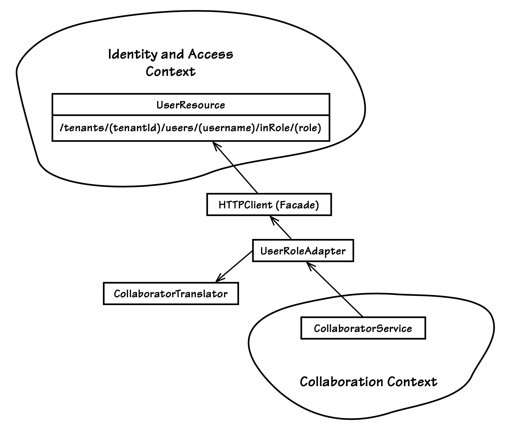
*聚焦`Collaboration Context`与`Identity and Access Context`集成中的`Anticorruption Layer`与`Open Host Service`*

#### Figure 3.7
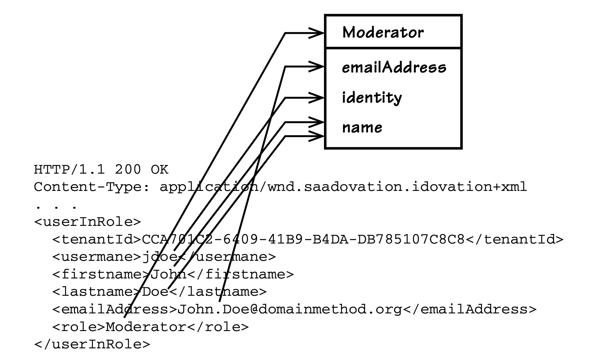
*逻辑`Translation Map`展示了如何将表示状态（此处为 XML）映射至本地模型的`Value Object`。*

---
➜**白板时间**

为项目`Bounded Context`中某个有趣的集成点创建`Translation Map`。

若发现翻译过程过于复杂，需要大量数据复制和同步，导致翻译后的对象与其他模型高度相似，该怎么办？这可能意味着你过度引用了外部`Bounded Context`，从该模型中借鉴过多内容，从而在自身模型中引发混乱冲突。

---

遗憾的是，如果由于远程系统不可用导致同步请求失败，则整个本地执行都必须失败。系统将通知用户该问题，并要求稍后重试。

系统集成通常依赖于 RPC。从高层次来看，RPC 与常规编程过程调用极为相似。各类库与工具使其易于使用且颇具吸引力。但与调用本机进程空间中的过程不同，远程调用更易因延迟导致性能下降甚至彻底失败。网络状况和远程系统负载都可能延迟 RPC 完成。当目标系统不可用时，用户对本系统的请求将无法成功完成。

虽然基于 REST 的资源使用并非真正的 RPC，但仍具有类似特性。尽管系统完全故障的情况相对罕见，但这仍是一个潜在的烦人限制。团队期待尽快改善这一状况。

#### `Agile Project Management Context`

鉴于`Agile Project Management Context`已成为新的`Core Domain`，我们需对其予以特别关注。让我们聚焦该领域及其与其他模型的关联。

为实现超越 RPC 框架的更高自主性，`Agile Project Management Context`团队需审慎限制其使用范围。因此，带外（异步）事件处理在战略层面更受青睐。

当本地系统已具备依赖状态时，可实现更高程度的自主性。有人可能将其视为完整依赖对象的缓存，但在使用 DDD 时通常并非如此。相反，我们创建从外部模型转换而来的本地领域对象，仅保留本地模型所需的最小状态量。获取初始状态时，可能需要进行有限且精准定位的 RPC 调用，或针对基于 REST 的资源发起类似请求。但与远程模型变更的必要同步，通常可通过远程系统发布的消息导向通知实现。这些通知可通过服务总线、消息队列发送，或经由 REST 发布。

---
**保持极简主义**

同步状态是指本地模型所需的远程模型中有限的、最基本的属性。这不仅是为了限制我们对数据同步的需求，更是正确建模概念的问题。

---

限制远程状态的使用是值得的，即使在设计本地建模元素时也是如此。例如，我们不希望`ProductOwner`和`TeamMember`在实际中反映`UserOwner`和`UserMember`，因为它们承袭了远程`User`对象的诸多特性，导致无意间产生了混合化现象。

#### 与`Identity and Access Context`的集成

观察 [图 3.8](#figure-38) 中的放大地图，可见资源 URI 提供了`Identity and Access Context`中发生的重大`Domain Events`通知。这些通知通过`NotificationResource`提供者发布，该提供者发布了一个 RESTful 资源。通知资源 (notifications resources) 是已发布`Domain Events`的集合。所有已发布的事件均按发生顺序持续可供消费，但每个客户端需自行防止重复消费。

自定义媒体类型表示可请求两种资源：

```Url
application/vnd.saasovation.idovation+json
//iam/notifications
//iam/notifications/{notificationId}
```

#### Figure 3.8
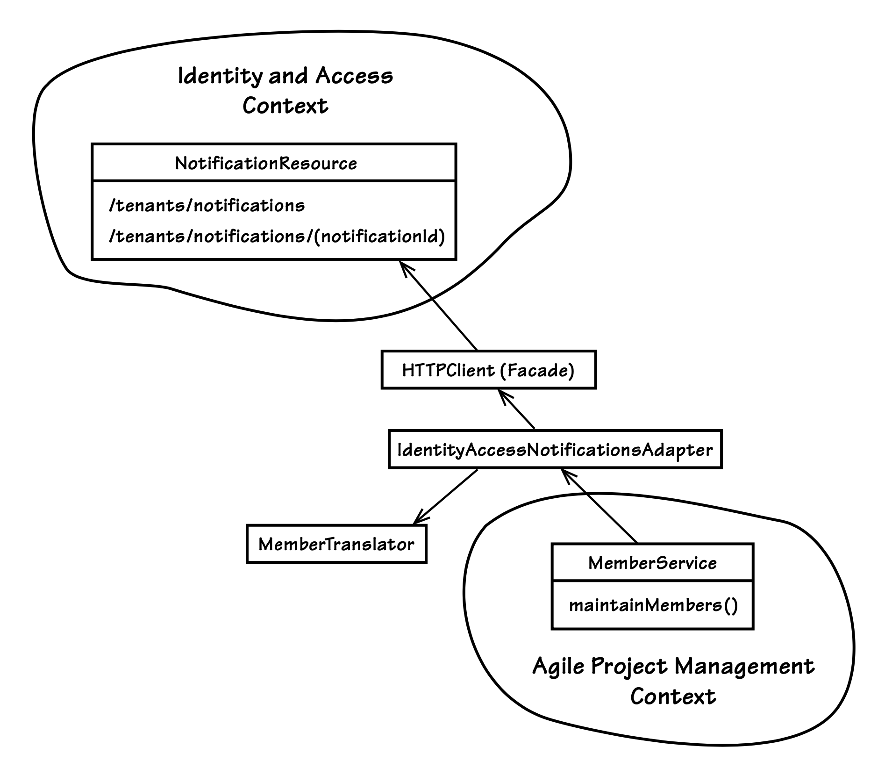
*聚焦`Agile Project Management Context`与`Identity and
Access Context`集成中的`Anticorruption Layer`与`Open Host Service`*

首个资源 URI 允许客户端获取（字面意义上的 HTTP GET）当前通知日志（一组固定的独立通知）。根据文档记录的自定义媒体类型，

```HTML
application/vnd.saasovation.idovation+json
```

该 URI 被视为已生成且稳定，因为它永不改变。无论当前通知日志包含什么内容，此 URI 都能提供。当前日志是`Identity and Access`模型中最近发生的事件集合。第二个资源 URI 使客户端能够获取并遍历所有已归档的基于事件的通知链。为何需要当前日志及任意数量的独立归档通知日志？有关基于信息流 (feed-based) 的通知如何工作的详细信息，请参见 [Domain Events (8)](../.ch8/0.md) 和 [Integrating Bounded Contexts (13)](../ch13/0.md) 。

实际上，ProjectOvation 团队目前并未承诺在所有场景中都采用 REST 架构。例如，他们正与 CollabOvation 团队商讨是否改用消息传递基础设施，其中 RabbitMQ 是正在考虑的选项之一。不过当前与`Identity and Access Context`的集成仍将基于 REST 实现。

暂且搁置技术细节，让我们聚焦于缩放地图中各交互对象的角色定位。下文将通过 [图 3.9](#figure-39) 的序列图，直观阐释集成流程的各个步骤：

- MemberService 是一个`Domain Service`，负责向其本地模型提供 ProductOwner 和 TeamMember 对象。它是基础`Anticorruption Layer`的接口。具体而言，maintainMembers() 方法会定期调用以检查`Identity and Access Context`中的新通知。该方法不会被模型的常规客户端调用。当周期性定时器触发时，被通知组件通过调用 maintainMembers() 方法使用 MemberService。[图 3.9](#figure-39) 显示定时器接收方为 MemberSynchronizer，该组件将任务委托给 MemberService。

- MemberService 将操作委托给 IdentityAccessNotification-Adapter ，该适配器在`Domain Service`与远程系统的`Open Host Service`之间充当适配器角色。适配器作为远程系统的客户端进行交互。与远程 Notification-Resource 的交互过程未在此处展示。

- 适配器收到远程`Open Host Service`的响应后，会委托 MemberTranslator 将`Published Language`媒体转换为本地系统的概念。若本地 Member 实例已存在，则转换操作将更新现有领域对象。这通过 MemberService 向其内部 updateMember() 方法的自我委托来实现。Member 的子类包括 ProductOwner 和 TeamMember ，它们分别对应本地上下文概念。

#### Figure 3.9
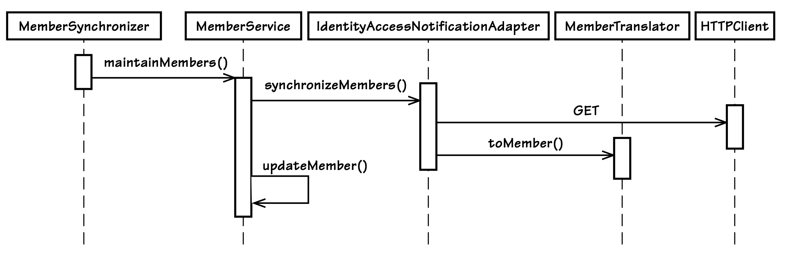
*`Agile Project Management Context`与`Identity and Access Anticorruption Layer`的内部运作示意图*

我们不应聚焦于涉及的技术或集成产品。相反，通过清晰划分`Bounded Contexts`，我们既能保持每个上下文的纯粹性，又能运用其他上下文的数据来表达自身概念。

图示与辅助文本展示了如何创建`Context Map`文档。文档无需冗长，但应提供足够的背景信息和说明，使新项目成员能快速上手。不过，仅当文档对团队有帮助时才应创建。

**与`CollabOvation Context`的整合** 接下来，让我们探讨`Agile Project Management Context`如何与`CollabOvation Context`相互作用。在此过程中，我们同样追求自主性，但这提高了门槛，为实现系统独立性的目标带来了一些有趣的挑战。

ProjectOvation 具备由 CollabOvation 提供的附加功能，包括基于项目的论坛讨论和共享日历安排等。用户无需直接与 CollabOvation 交互。ProjectOvation 需判断特定租户是否具备使用这些功能的权限，若具备，则需自主在 CollabOvation 中完成资源创建。

考虑这个 "创建产品" 用例的一部分：

前提条件：协作功能已启用（该选项已购买）。

1. 用户提供产品描述信息。
2. 用户表示希望进行团队讨论。
3. 用户请求创建已定义的产品。
4. 系统创建带有论坛和讨论的产品。

必须在`Collaboration Context`中代表产品创建论坛和讨论组。这与`Identity and Access Context`不同，后者中租户已完成配置，用户、组和角色均已定义，相关事件通知亦可获取。该场景下的对象均已预先存在。而`Agile Project Manage- ment Context`所需的对象尚未存在，且必须通过请求才能生成。这可能成为实现自主性的障碍，因为我们依赖`Collaboration Context`的可用性来远程创建资源。在追求自主性的背景下，这带来了一个有趣的挑战。

---
**为何讨论在两种上下文中同时存在？**

这种情况颇为有趣，因为在两个`Bounded Contexts`中，“讨论” 这个概念名称相同，但它们属于不同类型、不同对象，因此具有不同的状态和行为。

在`Collaboration Context`中，讨论是一个`Aggregate`，管理着一组帖子 —— 这些隐式子对象本身也是`Aggregates`。而在`Agile PM Context`中，讨论作为`Value Object`仅持有对外部上下文中实际讨论（含帖子）的引用。需注意的是，当团队在 [第 13 章](../ch13/0.md) 实现集成时，发现应为`Agile PM Context`中的不同讨论类型进行强类型化。

---

我们需要利用 [Domain Events (8)](../ch8/0.md) 和 [Event-Driven Architecture (4)](../ch4/0.md) 实现最终一致性。没有任何规定表明只有远程系统才能消费本地系统产生的通知。当模型发布 ProductInitiated `Domain Event`时，该事件由我们自己的系统处理。本地 handler  会请求远程创建论坛和讨论主题。具体实现可通过 RPC 或消息传递完成，取决于 CollabOvation 的支持方式。若采用 RPC 且远程协作系统当时不可用，本地 handler 将定期重试直至成功。若采用消息传递而非 RPC，本地 handler 将向协作系统发送消息。协作系统在资源创建完成后会返回响应消息。当 ProjectOvation 中的事件 handler 接收到该通知时，会更新产品，通过身份引用关联其新创建的讨论。

如果产品负责人或团队成员试图在讨论功能尚未存在时使用它，会发生什么？不可用的讨论是否应视为模型中的缺陷？这是否会导致系统出现不可靠状态？需考虑的是，任何订阅者最初可能并未付费使用协作附加组件。这正是设计资源不可用机制的非技术性理由。规避最终一致性绝非权宜之计。它只是另一个需要建模的有效状态。

处理所有可能的不可用场景的一种优雅方式是将其显式化。请参考 [Value Objects (6)](../ch6/0.md) 中描述的、作为`State` [[Gamma et al.](../bibli.md#gamma-et-al)] 实现的`Standard Type`：

```Java
public enum DiscussionAvailability {
    ADD_ON_NOT_ENABLED, NOT_REQUESTED, REQUESTED, READY;
}

public final class Discussion implements Serializable {
    private DiscussionAvailability availability;
    private DiscussionDescriptor descriptor;
    ...
}

public class Product extends Entity {
    ...
     private Discussion discussion;
    ...
}
```

采用此设计，Discussion `Value Object`受到保护，避免被误用，因为由 DiscussionAvailability 定义的状态对其进行了保护。当有人试图参与关于 Product 的讨论时，它可以安全地传递其 discussion 状态。若状态未达到 READY，参与者将看到以下三条消息之一：

- 要使用团队协作功能，您需要购买附加选项。
- 产品所有者尚未请求创建产品讨论。
- 讨论设置尚未完成，请稍后再试。

当 DiscussionAvailability 处于 READY 状态时，允许全体团队成员参与。

有趣的是，正如首个不可用状态消息所暗示的，企业可能选择让协作选项保持可选状态，即使这些功能尚未被购买。保持协作界面选项的可用性，可作为有效的营销提醒机制，从而促进后续购买。还有谁比那些每天被提醒“本可使用却无法启用”功能的人更适合向管理层催促购买附加选项？显然，可用性状态的应用所带来的效益远不止技术层面。

目前团队尚未确定其与协作模块的实际集成方式。为便于`Customer-Supplier`的讨论，他们绘制了 [图 3.10](#figure-310) 所示的示意图。`Agile Project Management Context`可能采用第二个`Anticorruption Layer`来管理自身与`Collaboration Context`之间的集成，其设计思路类似于`Identity and Access Context`所使用的方案。该图展示了主要边界对象，其功能与身份访问管理集成中的对应对象相似。实际上并不存在单一的 CollaborationAdapter ，此处仅作为占位符，代表当前尚未确定的多个必要适配器。

本地上下文中展示了 DiscussionService 和 SchedulingService 。这些代表`Domain Services`，可用于管理协作系统中的讨论和日历条目。具体实现机制将由团队间通过`Customer-Supplier`协商确定，并在 [Integrating Bounded Contexts (13)](../ch13/0.md) 中实现。

#### Figure 3.10
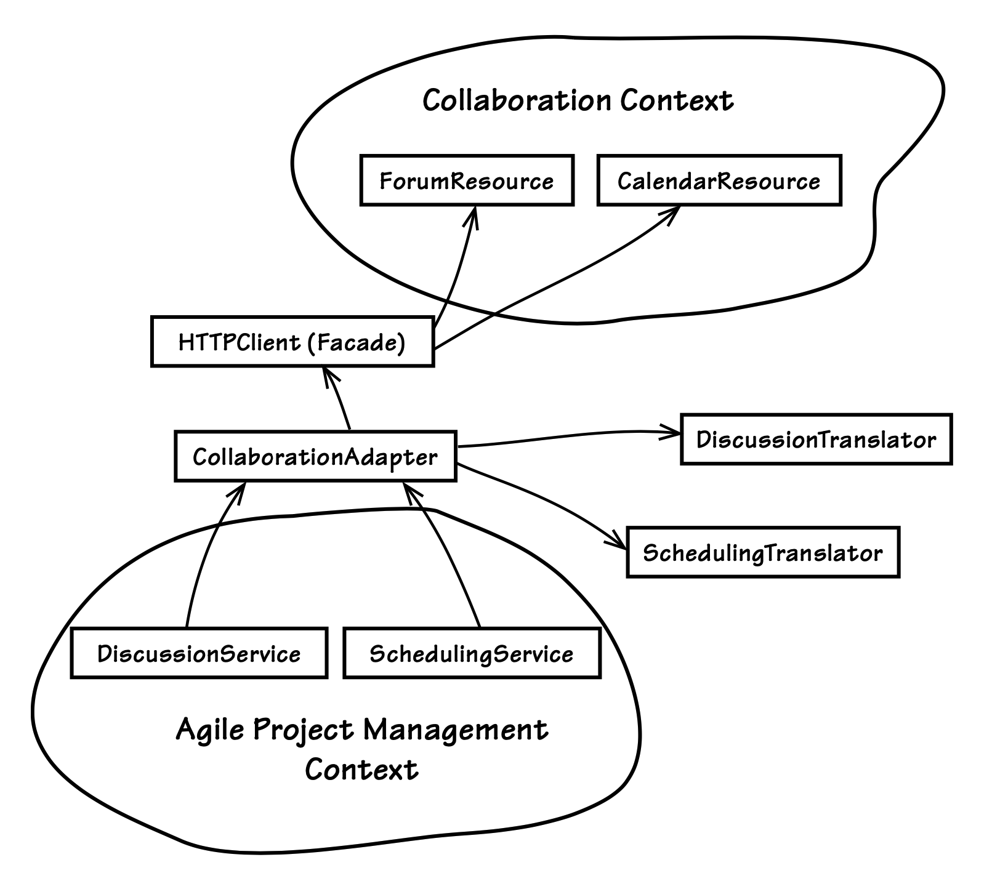
*聚焦于`Agile Project Management Context`与`Collaboration Context`之间潜在集成组件的`Anticorruption Layer`与`Open Host Service`*

团队现已理解其模型的一部分。例如，当创建讨论并将其结果传递给本地上下文时会发生什么？异步组件（无论是 RPC 客户端还是消息 handler ）会通知 Product 执行 attachDiscussion() 方法，并传递一个新的 Discussion `Value`实例。所有具有待处理远程资源关注的本地`Aggregates`都将通过此方式得到处理。

本次研讨深入探讨了`Context Maps`的若干实用细节。但我们需保持克制，以免陷入收益递减的境地。或许本可纳入 [Modules (9)](../ch9/0.md) 内容，但该主题已另设专章阐述。可包括任何能促进关键团队沟通的相关的高层级元素，反之，若细节显得繁文缛节则应果断摒弃。

制作可张贴在墙上的`Context Maps`。只要团队维基不是无人问津的项目杂物间，你就可以将地图上传至其中。将项目讨论引导回你的地图，以激发有价值的优化方案。

<center></center>

#### ▶[下一节](2.md)
