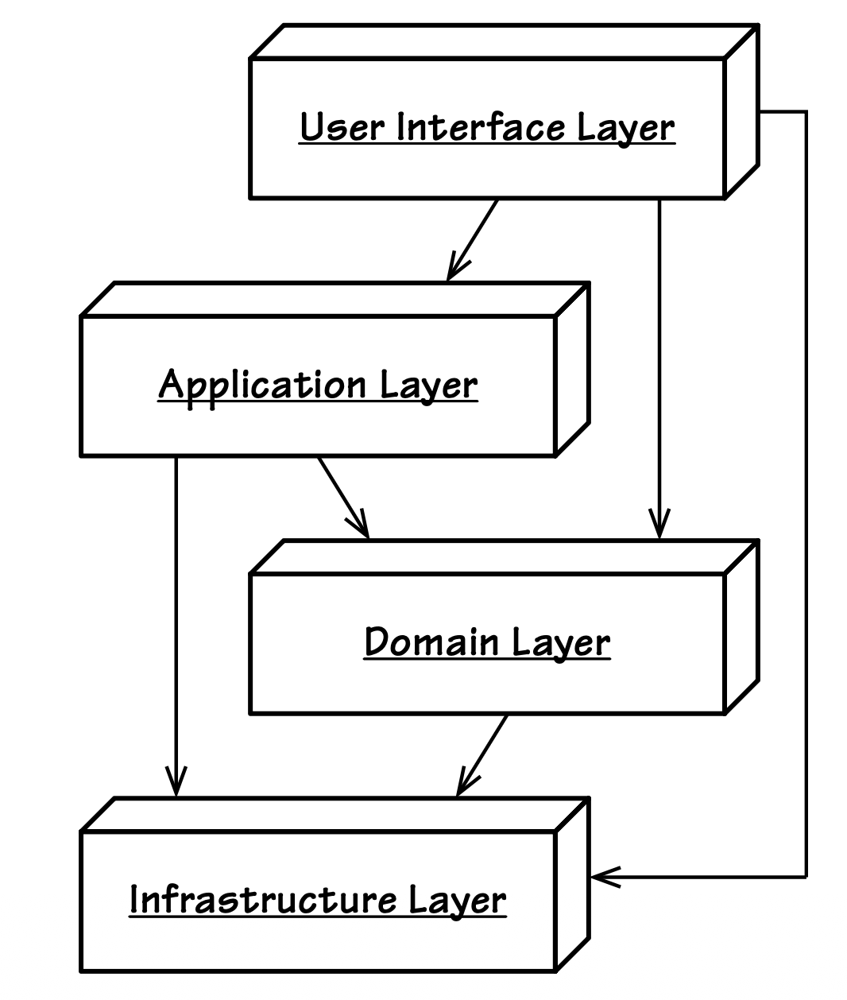
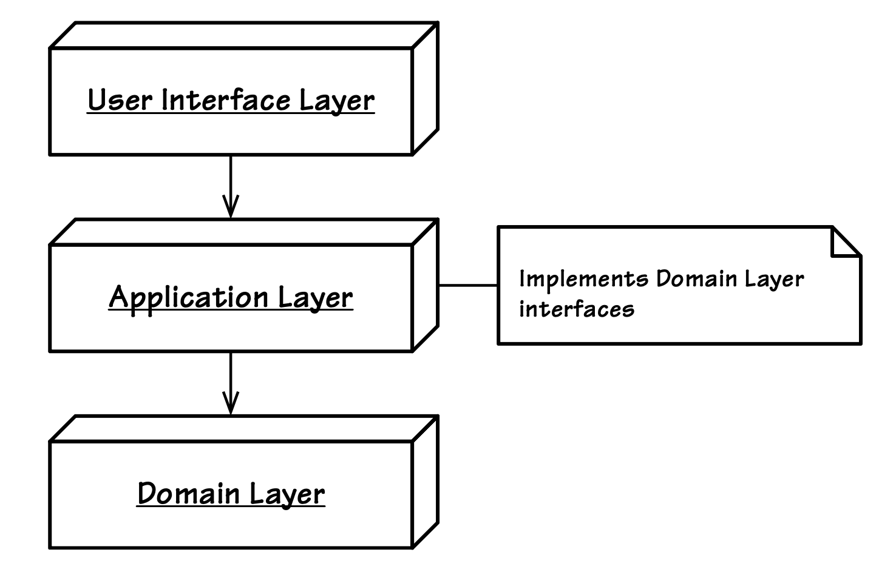
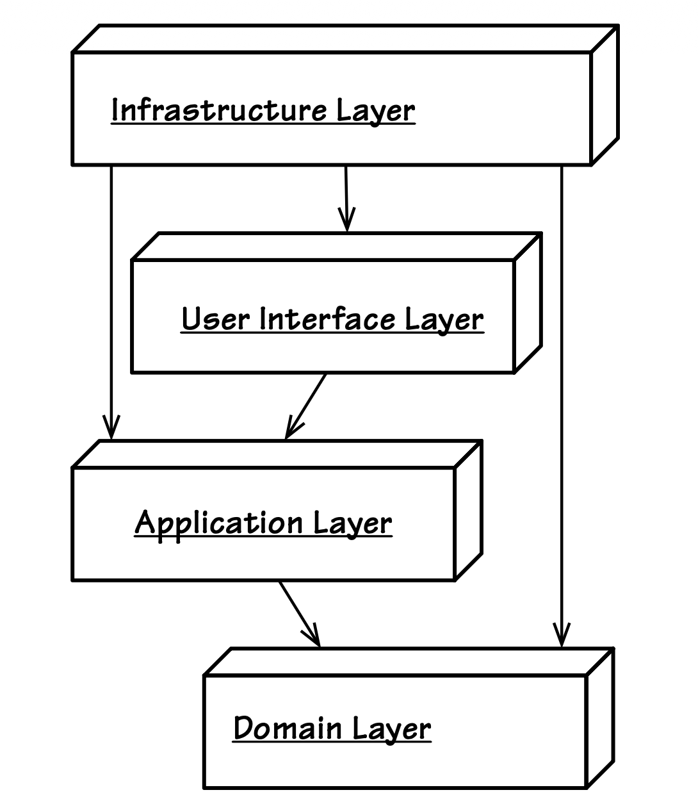

## 分层

#### ▶[上一节](1.md)

`Layers Architecture` [[Buschmann et al.](../bibli.md#buschmann-et-al)] 模式被许多人认为是所有模式中的鼻祖。它支持多层系统，因此常用于 Web、企业和桌面应用程序。在这里，我们严格地将应用程序或系统的各个关注点分离到定义良好的层中。

- 将领域模型与业务逻辑的表达进行隔离，消除对基础设施、用户界面乃至非业务逻辑的应用程序逻辑的任何依赖。将复杂程序划分为多个层级，在每个层级内构建具有凝聚力且仅依赖下层的设计。 [[Evans, Ref, p. 16](../bibli.md#evans-ref)]


[图 4.1](#figure-41) 展示了采用传统`Layers Architecture`的 DDD 应用程序中常见的分层结构。其中，独立的`Core Domain`层位于架构的单一层级中。其上层为`User Interface`和`Application Layer`层，下层则为`Infrastructure Layer`。

#### Figure 4.1
</br>
*应用 DDD 的传统`Layers Architecture`*

该架构的一项基本规则是：每层只能与其自身及下层进行耦合。该风格内部存在细分：`Strict Layers Architecture`仅允许与直接下层耦合；而`Relaxed
Layers Architecture`则允许任意上层与下层耦合。由于用户界面和应用服务通常需要调用基础架构，多数系统（即便不是全部）都基于`Relaxed Layers`构建。

<ins>底层与上层之间可能存在松耦合关系，但这种耦合仅通过`Observer`或`Mediator`等机制实现 [[Gamma et al.](../bibli.md#gamma-et-al)] ；底层与上层之间绝不存在直接引用</ins>。以`Mediator`模式为例：高层实现由底层定义的接口，再将实现对象作为参数传递给底层。底层使用该实现对象时，完全无需知晓其在架构中的具体位置。

用户界面仅应包含处理用户视图和请求的代码，
不得包含领域/业务逻辑。<ins>有人可能认为，既然用户界面需要进行验证，就必然包含业务逻辑。但用户界面中的验证类型并不属于（仅限于）领域模型范畴。正如 [Entities (5)](../ch5/0.md) 所述，我们仍需将表达深层业务知识的粗粒度验证限定在模型层。</ins>

若用户界面组件使用领域模型中的对象，其作用通常仅限于将数据呈现于屏幕。采用此方法时，可通过使用 [Presentation Model (14)](../ch14/0.md) 来防止视图本身知晓领域对象的存在。

由于用户可能是人类或其它系统，该层有时会提供以 [Open Host Service (13)](../ch13/0.md) 形式远程调用 API 服务的机制。

用户界面中的组件是应用层的直接客户端。

<ins>[Application Services (14)](../ch14/0.md) 位于应用层。它们与 [Domain Services (7)](../ch8/0.md) 不同，因此不包含领域逻辑。它们可能控制持久化事务和安全性，也可能负责向其他系统发送基于事件的通知，以及/或为用户编写待发送的电子邮件。本层的应用服务虽不具备业务逻辑，却是领域模型的直接客户端。它们保持极轻量级特性，协调针对领域对象的操作，如 [Aggregates (10)](../ch10/0.md) ，是模型中表达用例或用户故事的主要手段。因此`Application Service`常见功能包括：接收用户界面的参数，通过 [Repository (12)](../ch12/0.md) 获取`Aggregate`实例，并对其执行命令操作：</ins>

```Java
@Transactional
public void commitBacklogItemToSprint(
    String aTenantId, String aBacklogItemId, String aSprintId) {
    TenantId tenantId = new TenantId(aTenantId);

    BacklogItem backlogItem =
        backlogItemRepository.backlogItemOfId(
            tenantId, new BacklogItemId(aBacklogItemId));

    Sprint sprint = sprintRepository.sprintOfId(
        tenantId, new SprintId(aSprintId));
    backlogItem.commitTo(sprint);
}
```

<ins>如果我们的`Application Services`变得比这复杂得多，很可能表明领域逻辑正渗入`Application Services`，模型正在变得贫血。因此保持这些模型客户端非常精简是最佳实践。当需要创建新的`Aggregate`时，`Application Services`会使用 [Factory (11)](../ch11/0.md) 或`Aggregate`的构造函数进行实例化，然后使用对应的`Repository`进行持久化。`Application Service`也可借助`Domain Service`完成某些设计为无状态操作的领域特定任务。</ins>

<ins>当领域模型设计为发布 [Domain Events (8)](../ch8/0.md) 时，应用层可为任意数量的事件注册订阅者。此举使事件存储、转发及其他处理成为应用程序的职责之一，从而使领域模型仅需关注自身核心事务，并确保 [Domain Event Publisher (8)](../ch8/0.md) 保持轻量化特性，摆脱消息传递基础设施的依赖。</ins>

由于其他章节已详尽讨论了承载全部业务逻辑的领域模型，此处不再赘述。然而，领域模型与传统分层架构的结合仍存在若干挑战。<ins>采用分层架构可能要求`Domain Layer`有限度地使用`Infrastructure`层。我并非指核心领域对象会这样做，我们必须绝对避免这种情况。但严格遵循分层定义时，`Domain Layer`中某些接口的实现可能需要依赖`Infrastructure`层提供的技术。</ins>

例如，`Repository`接口需要使用基础设施层中封装的组件（如持久化机制）来实现。若直接在`Infrastructure`层实现`Repository`接口会怎样？由于`Infrastructure Layer`位于`Domain Layer`之下，从`Infrastructure`层向上引用`Domain`层将违反`Layers Architecture`规则。但避免这种引用并不意味着主要领域对象会与`Infrastructure`层耦合。为规避此问题，可采用实现 [Modules (9)](../ch9/0.md) 来隐藏技术类： *（译注：在`Infrastructure`层实现接口时，需要使用领域对象，这样就依赖了上层。）*

```Java
com.saasovation.agilepm.domain.model.product.impl
```

如 [Modules (9)](../ch9/0.md) 所示，MongoProductRepository 可置于该包中。但这并非解决此问题的唯一途径。我们亦可选择在`Application Layer`实现此类接口，以遵循分层原则。[图 4.2](#figure-42) 展示了该方案的框架。不过此做法可能略显不妥。

正如标题为 [[依赖倒置原则](#依赖倒置原则)] 的章节所述，存在更优方案。

在传统的分层架构中，`Infrastructure`位于底层。持久化机制和消息传递机制等组件都位于此层。消息可能包括由企业消息中间件系统发送的消息，或更基础的电子邮件（SMTP）及短信（SMS）。请考虑所有为应用程序提供底层服务的技术组件和框架，这些通常被视为`Infrastructure`的一部分。更高层级的架构层通过与底层组件耦合来复用其提供的技术设施。<ins>基于此，我们仍需坚决避免将核心领域模型对象与基础设施进行耦合。</ins>

#### Figure 4.2
</br>
*`Application Layer`可承载`Domain Layer`定义接口的技术实现方案。*

---
| ||
|---|---|
|SaaSOvation 团队指出，将`Infrastructure Layer`置于底层存在某些弊端。其一，这使得实现`Domain Layer`所需的技术细节变得颇为棘手，因为必须违反分层规则。实际上他们的代码难以测试。他们该如何克服这一缺陷？||

---

如果我们调整层的顺序，能否做出更甜一点的东西？

### 依赖倒置原则

通过调整依赖关系的工作方式，可以改进传统的`Layers Architecture`。依赖倒置原则（Dependency Inversion Principle, DIP）由 Robert C. Martin 提出，并在 [[Martin, DIP](../bibli.md#martin-dip)] 中阐述。其正式定义如下：

- 高级模块不应依赖低级模块。两者都应依赖抽象层。

- 抽象层不应依赖细节实现。细节实现应依赖抽象层。

该定义的核心在于传达：提供底层服务（本文讨论中指`Infrastructure`）的组件应依赖于高层组件（本文讨论中指`User
Interface`、`Application`和`Domain`）定义的接口。虽然表达采用 DIP 的架构有多种方式，但我们可以将其归结为 [图 4.3](#figure-43) 所示的结构。

---
**DIP 真的支持所有这些层吗？**

有人会认为 DIP 只有两层：顶层和底层。顶层实现底层定义的接口抽象。若按此调整 [图 4.3](#figure-43) ，`Infrastructure`层将成为顶层，而`User Interface`层、`Application`层和`Domain`层则构成底层。你可能认同也可能不认同这种 DIP 架构的解读。不必担心，`Hexagonal`六边形架构 [[Cockburn](../bibli.md#cockburn)] 或`Ports and Adapters
Architecture`正是这种设计理念的终极形态。

---

#### Figure 4.3
</br>
*当使用依赖倒置原则时可能的层次结构。我们将`Infrastructure`层置于所有其他层之上，使其能够为所有下层实现接口。*

从 [图 4.3](#figure-43) 的架构来看，我们将在`Infrastructure`中实现一个`Repository`，用于`Domain`中定义的接口：

```Java
package com.saasovation.agilepm.infrastructure.persistence;

import com.saasovation.agilepm.domain.model.product.*;

public class HibernateBacklogItemRepository
    implements BacklogItemRepository {
    ...
    @Override
    @SuppressWarnings("unchecked")
    public Collection<BacklogItem> allBacklogItemsComittedTo(
        Tenant aTenant, SprintId aSprintId) {
        Query query =
            this.session().createQuery(
              "from -BacklogItem as _obj_ "
              + "where _obj_.tenant = ? and _obj_.sprintId = ?");

        query.setParameter(0, aTenant);
        query.setParameter(1, aSprintId);

        return (Collection<BacklogItem>) query.list();
    }
    ...
}
```

聚焦`Domain`层时，采用依赖倒置原则可使`Domain`层与`Infrastructure`层均依赖于领域模型定义的抽象接口。由于`Application`层是`Domain`层的直接客户端，它依赖领域接口，并间接访问由`Infrastructure`层提供的`Repository`及任何技术性`Domain Services`实现类。`Application`层可通过多种方式获取实现类，包括：`Dependency Injection`、`Service Factory`和`Plug In` [[Fowler, P of EAA](../bibli.md#fowler-p-of-eaa)] 。全书示例采用 Spring 框架提供的`Dependency Injection`，部分场景通过 DomainRegistry 类使用`Service Factory`。实际上，DomainRegistry 利用 Spring 查找实现领域模型所定义接口的 Bean 的引用，包括`Repositories`和`Domain Services`。

有趣的是，当我们思考 DIP 对架构的影响时，我们可能会得出结论，实际上根本不存在任何层级。高层和底层的关注点都仅依赖于抽象，这似乎颠覆了原有的结构。如果我们真的考虑将这种架构颠倒过来，并增加一些对称性会怎样呢？接下来，让我们看看这将如何实现。

#### ▶[下一节](3.md)
