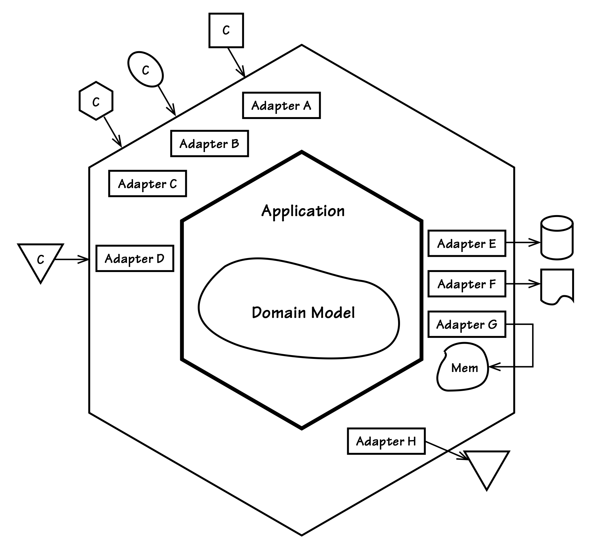

## `Hexagonal`或`Ports and Adapters`

#### ▶[上一节](2.md)

通过`Hexagonal` <sup>[2](#2)</sup> ，Alistair Cockburn 系统化了一种实现对称性的设计风格 [[Cockburn](../bibli.md#cockburn)] 。该架构通过允许众多异构客户端平等地与系统交互来推进这一目标。需要新增客户端？不成问题。只需添加`Adapter`，即可将任意客户端的输入转换为内部应用程序 API 可识别的形式。同时，系统采用的输出机制（如图形化界面、持久化存储和消息传递）
同样可实现多样化与可替换性。这得益于`Adapter`能将应用程序结果转换为特定输出机制可识别的形式。

随着讨论深入，您或许会认同这种架构具有经久不衰的潜力。

如今许多自称采用`Layers Architecture`的团队，实际上使用的是`Hexagonal`。这部分归因于当前大量项目都采用了某种形式的`Dependency Injection`。并非`Dependency Injection`必然等同于`Hexagonal`，而是它鼓励的架构构建方式自然倾向于发展`Ports
and Adapters`风格。无论如何，更深入的理解将厘清这一问题。

我们通常将用户与系统交互的界面称为其 “前端”。同样地，应用程序获取持久化数据、存储新持久化数据或发送输出的区域则被视为其 “后端”。但`Hexagonal`提倡以不同的方式看待系统的各个区域，如 [图 4.4](#figure-44) 所示。主要有两个区域： *外部* 和 *内部* 。*外部* 使不同的客户端能够提交输入，并提供机制来检索持久化数据、存储应用程序的输出（例如数据库）或将其发送到其他地方（例如消息传递）。

#### Figure 4.4
</br>
*`Hexagonal`也被称为`Ports and Adapters`。对于每种外部类型都有`Adapters`。 外部通过应用程序的 API 访问内部 。*


|牛仔逻辑||
|---|---|
|AJ：“我的马儿可真喜欢新造的六边形围栏。</br>这样我扛着马鞍时，它们就有更多角落可躲啦。”||

在 [图 4.4](#figure-44) 中，每种客户端类型都有自己的`Adapters` [[Gamma et al.](../bibli.md#gamma-et-al)] ，该`Adapters`将输入协议转换为与应用程序 API（内部）兼容的输入。每个六边形的边代表一种不同的`Ports`类型，用于输入或输出。三类客户端请求通过相同类型的输入`Port`（`Adapters` A、B、C）抵达，另一类则使用不同`Ports`（`Adapters` D）。或许三个可能采用 HTTP 协议（浏览器、REST、SOAP 等），而另一个使用 AMQP 协议（如 RabbitMQ ）。`Port`概念并无严格定义，因而具有高度灵活性。无论`Ports`如何划分，客户端请求抵达后，对应`Adapters`将转换其输入内容，随后调用应用程序操作或向应用程序发送事件。控制权由此转移至内部。

---
➜**我们通常不会亲自实现`Ports`**

实际上我们通常不会亲自实现`Ports`。可以将`Port`理解为 HTTP 协议，而`Adapter`则是接收来自容器（JEE）或框架（ RESTEasy 或 Jersey ）方法调用的 Java Servlet 或 JAX-RS 注解类。或者我们可能为 NServiceBus 或 RabbitMQ 创建消息监听器。此时`Port`本质上是消息传递机制，`Adapter`则是消息监听器，因为消息监听器需要从消息中提取数据，并将其转换为适合传递给应用程序 API（领域模型的客户端）的参数。

➜**根据功能需求设计应用程序内部**

使用`Hexagonal`架构时，我们以用例为导向设计应用程序，而非基于支持的客户端数量。任意数量和类型的客户端均可通过不同`Ports`发起请求，但每个`Adapter`都会通过相同的 API 将请求委托给应用程序处理。

---

应用程序通过其公共 API 接收请求。应用程序边界，即内侧六边形，同时也是用例（或用户故事）的边界。换言之，我们应基于应用程序功能需求创建用例，而非依据多样化客户端或输出机制的数量。当应用程序通过 API 接收请求时，它会利用领域模型处理所有涉及业务逻辑执行的请求。因此，应用程序的 API 以`Application Services`集的形式对外发布。同样地，`Application Services`是领域模型的直接客户端，这与分层架构中的情况一致。

以下展示了使用 JAX-RS 发布的 RESTful 资源。请求通过 HTTP 输入`Port`到达，处理程序作为`Adapter`，将请求委托给`Application Service`：

```Java
@Path("/tenants/{tenantId}/products")
public class ProductResource extends Resource {

    private ProductService productService;
    ...
    @GET
    @Path("{productId}")
    @Produces({ "application/vnd.saasovation.projectovation+xml" })
    public Product getProduct(
        @PathParam("tenantId") String aTenantId,
        @PathParam("productId") String aProductId,
        @Context Request aRequest) {

        Product product = productService.product(aTenantId, aProductId);

        if (product == null) {
            throw new WebApplicationException(
              Response.Status.NOT_FOUND);
        }

        return product; // serialized to XML using MessageBodyWriter
    }
    ...
}
```

各种 JAX-RS 注解构成了`Adapter`的重要组成部分，它们解析资源路径并将参数转换为 String 实例。ProductService 实例被注入，并由此请求使用，以委托给内部的应用程序。Product 被序列化为 XML 并放入 Response 中，然后通过 HTTP 输出端口发送。

---
➜**JAX-RS 并非重点**

这只是使用内部应用和领域模型的一种方式。本质上，JAX-RS并 不重要。我们同样可以使用 Restfulie，或创建运行 restify 模块的 Node.js 服务器。更进一步，用于处理其他`Ports`输入的`Adapters`将委托给相同的 API，您将在后续内容中看到。

---

那么应用程序右侧的部分呢？可将`Repository`实现视为持久化`Adapters`，既提供对先前存储的`Aggregate`实例的访问，也为新实例提供存储空间。如图所示（`Adapter` E、F 和 G），我们可能为关系型数据库、文档存储、分布式缓存和内存存储分别实现`Repository`。若应用程序向外部发送`Domain Event`消息，则需使用另一种消息`Adapter`（H）。输出消息`Adapter`与支持 AMQP 的输入`Adapter`相对应，因此其输出`Port`与持久化`Adapter`使用的`Port`不同。

<ins>`Hexagonal`的一大优势在于`Adapters`易于为测试目的开发。在客户端和存储机制尚未存在时，即可设计并测试整个应用程序和领域模型</ins>。在决定支持 HTTP/REST、SOAP 或消息`Ports`之前，便可创建测试用例来验证 ProductService 的运行。在用户界面线框图完成之前，即可开发任意数量的测试客户端。在项目选定持久化机制之前，即可通过内存`Repositories`模拟持久化功能进行测试。内存实现的开发细节参见 [Repositories (12)](../ch12/0.md) 。核心功能开发可取得显著进展，无需依赖额外的技术组件。

若采用真正的`Layers`架构，不妨考虑颠覆现有结构，转而基于`Ports and Adapters`进行开发。当设计得当，内部的六边形 ——即应用程序与领域模型—— 将不会向外部组件泄露。这有助于在内部构建清晰的应用边界，用于实现具体用例。外部可配置任意数量的客户端`Adapters`，既能支持大量自动化测试和实际客户端，又能对接存储、消息传递及其他输出机制。

| ||
|---|---|
|当 SaaSOvation 团队权衡`Hexagonal Architecture`的优势后，决定从`Layers`架构转型。实际上这并不困难，只需在使用熟悉的 Spring 框架时调整思维方式即可。||

由于`Hexagonal Architecture`具有高度灵活性，它完全可以成为支撑系统所需其他架构的基础。例如，我们可以引入面向服务的架构、REST 架构或事件驱动架构；采用 CQRS；使用 Data Fabric 或 Grid-Based Distributed Cache；或添加 Map-Reduce 分布式并行处理，其中大部分内容将在本章后文详述。`Hexagonal Architecture`构筑了坚实基础，足以支撑上述所有附加架构选项。虽然存在其他实现路径，但 *在本章剩余部分，请假设使用`Ports and Adapters`来帮助围绕讨论的每个剩余主题进行开发* 。

#### ▶[下一节](4.md)

---

#### 2
我们仍将这种架构称为`Hexagonal`，尽管其名称似乎已改为`Ports and Adapters`。尽管名称变更，技术社区仍沿用`Hexagonal`之称。`Onion Architecture`也曾浮出水面，但许多人认为`Onion Architecture`不过是`Hexagonal`的（不幸的）别称。我们可以确信它们本质相同，并沿用 [[Cockburn](../bibli.md#cockburn)] 的定义。
