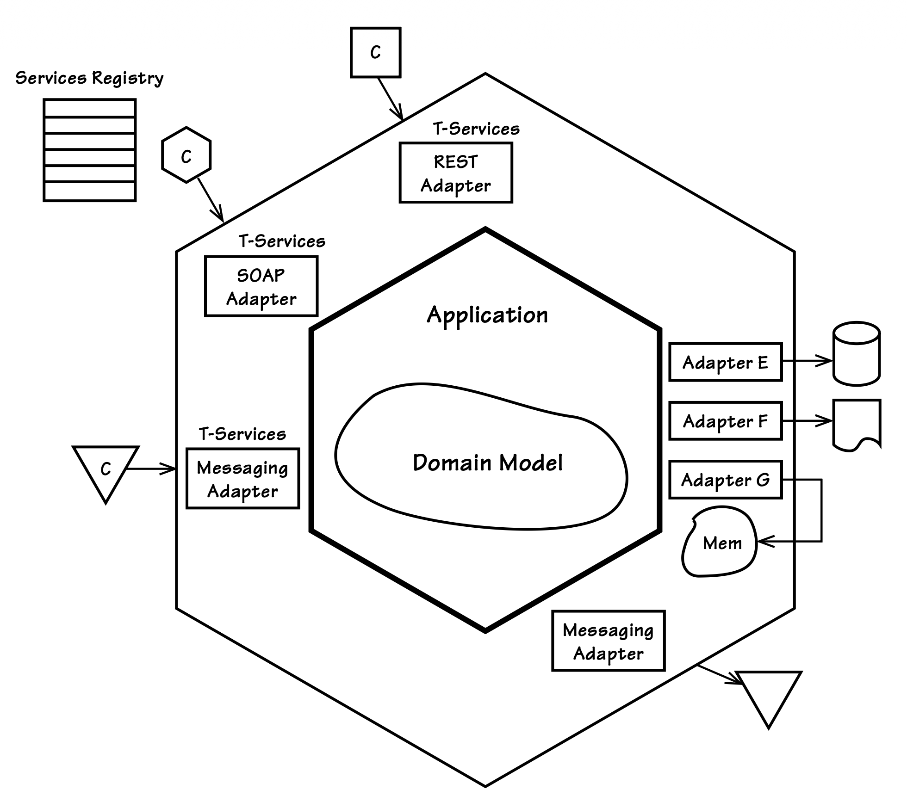

## 面向服务

#### ▶[上一节](3.md)

面向服务架构（SOA）对不同人而言具有不同含义，这使得相关讨论颇具挑战性。最佳做法是寻求共识，或至少为本次讨论设定明确边界。参考 Thomas Erl [[Erl](../bibli.md#erl)] 提出的 SOA 设计原则：除服务始终具备互操作性外，还应遵循 [表 4.1](#table-41) 所列的八项设计原则。

#### Table 4.1
|服务设计原则|描述|
|---|---|
|1. 服务契约|服务通过一份或多份描述文档中的契约来表达其目的和能力。|
|2. 服务松耦合|服务间保持最小依赖，彼此仅保持感知。|
|3. 服务抽象|服务仅对外发布其契约，对客户端隐藏内部逻辑。|
|4. 服务复用性|服务可被其他系统复用，用于构建更粗粒度的服务。|
|5. 服务自治性|服务通过自主管控底层环境与资源保持独立性，从而确保其一致性和可靠性。|
|6. 服务无状态性|服务将状态管理责任交由消费者承担，此举不与服务自主性所管控的内容相冲突。|
|7. 服务可发现性|服务通过元数据进行描述，以实现可发现性并使服务契约清晰可解，从而成为可复用的资产。|
|8. 服务组合性|服务可在更粗粒度的服务中进行组合，无论其所处组合的规模与复杂度如何。|

*服务设计原则*

#### Figure 4.5
 
*支持 SOA 的`Hexagonal Architecture`，包含 REST、SOAP 和消息服务*

我们将这些原则与`Hexagonal Architecture`相结合，服务边界位于最左侧，领域模型居于核心。基础架构如 [图 4.5](#figure-45) 所示，其中消费者通过 REST、SOAP 和消息传递访问服务。需注意基于`Hexagonal`架构的系统可支持多种技术服务端点，这将影响 DDD 在 SOA 中的应用方式。

由于人们对 SOA 的定义及其价值存在巨大分歧，若您不同意本文观点也属正常。Martin Fowler 将此现象称为 “面向服务的模糊性” [[Fowler, SOA](../bibli.md#fowler-soa)] 。因此，我在此不会勉强尝试厘清 SOA 的定义。然而，我将提供一种观点，说明 DDD 如何融入 SOA Manifesto 中所声明的一系列 *优先事项* 。[3](#3)

首先，参考 Manifesto 撰稿人之一 [[Tilkov, Manifesto](../bibli.md#tilkov-manifesto)]  提出的实用主义观点，能为我们提供重要背景。他在解读 Manifesto 时，至少让我们更接近理解 SOA 服务的本质：

- “\[该 Manifesto\]赋予我两种视角：既可将服务视为 SOAP/WSDL 接口集合，亦可理解为 RESTful 资源集合……这并非定义之举 —— 而是试图发掘我们能达成共识的价值与原则。”

Stefan 的观点值得关注。达成共识总是有益的，我们或许能认同：一项业务服务可由任意数量的技术服务提供。

技术服务可以是 RESTful 资源、SOAP 接口或消息类型。业务服务强调业务战略，是将业务与技术结合的一种方式。然而，定义单一的业务服务并不等同于定义单一的 [Subdomain (2)](../ch2/0.md) 或`Bounded Context`。毫无疑问，当我们进行问题空间和解决方案空间评估时，会发现一个业务服务包含若干个`Subdomains`或`Bounded Contexts`。因此，[图 4.5](#figure-45) 显示的仅是单一`Bounded Context`的架构，该`Bounded Context`可能通过若干 RESTful 资源、SOAP 接口或消息类型实现一套技术服务 —— 这只是整个业务服务的一部分。在 SOA 解决方案空间中，我们预计会看到很多`Bounded Contexts`，无论其中任何一个使用`Hexagonal Architecture`还是其他架构。SOA 和 DDD 都不需要具体说明每组技术服务如何设计和部署，因为存在各种各样的选项。

尽管如此，在使用 DDD 时，我们的目标是创建一个具有完整且语言上明确定义的领域模型的`Bounded Context`。正如 [Bounded Contexts (2)](../ch2/0.md) 所述，我们不希望架构影响领域模型的规模。若仅凭单个技术服务接口（如单个 REST 资源、单个 SOAP 接口或系统消息类型）来决定`Bounded Context`的规模，便可能导致这种情况发生。此举将导致大量极其微小的`Bounded Contexts`与领域模型，每个可能仅包含一个`Entity`作为单个小型`Aggregate`的根节点。这可能使单个企业中出现数百个此类微型`Bounded Contexts`。

虽然这种方法可能被认为具有技术优势，但它未必能实现战略性 DDD 的目标。它违背了基于完整而全面的 [Ubiquitous Language (1)](../ch1.md) 构建清晰、良好建模的领域模型，反而将语言割裂。此外，根据 SOA Manifesto，人为分割`Bounded Contexts`未必符合 SOA 的精神：

1. 业务价值优先于技术策略
2. 战略目标优先于项目特定收益

若我们认可这些价值的合理性，它们与战略性 DDD 高度契合。正如 [Bounded Contexts (2)](../ch2/0.md) 所述，在模型划分过程中，技术组件架构驱动因素 (technical component
architecture drivers) 的重要性相对较低。

| ||
|---|---|
|SaaSOvation 团队必须学会一个艰难而重要的教训，那就是倾听语言驱动因素 (linguistic drivers) 更符合 DDD 。他们的三个`Bounded Contexts`中的每一个都反映了 SOA 的目标 —— 无论是对于业务还是技术服务。||

在 [Bounded Contexts (2)](../ch2/0.md) 、[Context Maps (3)](../ch3/0.md) 和 [Integrating Bounded Contexts (13)](../ch13/0.md) 中讨论的三个示例模型，各自代表单一的语言上明确定义的领域模型。每个领域模型都被一组开放服务所包围，这些服务实现了符合业务目标的 SOA 。

#### ▶[下一节](5.md)

---

#### 3
SOA Manifesto 本身受到了相当多的负面批评，但我们仍然可以从中获取一些价值。
