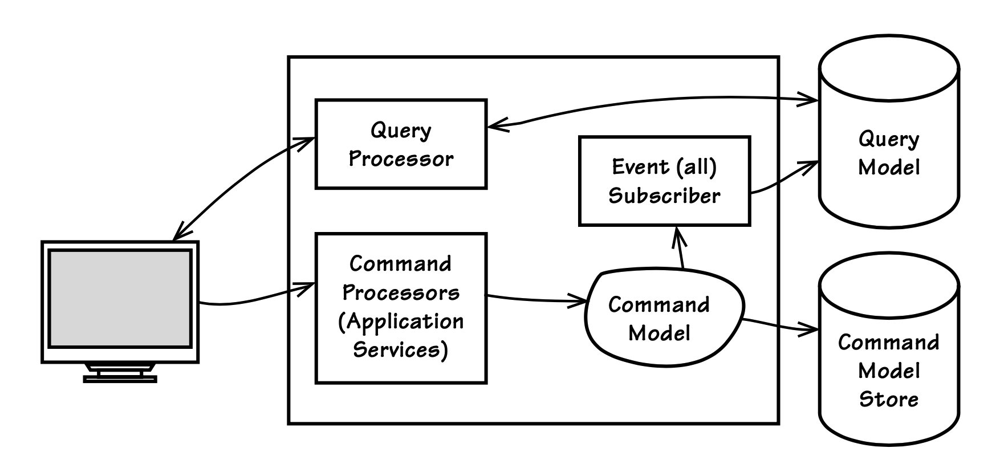

## 命令查询职责分离（CQRS）

#### ▶[上一节](5.md)

从`Repositories`中查询用户所需的所有数据可能相当困难。<ins>当用户体验设计创建的数据视图横跨多个`Aggregate`类型和实例时，这种情况尤为明显。领域模型越复杂，这种情况就越容易发生</ins>。

仅依靠`Repositories`解决此问题可能并非理想方案。我们可以要求客户端使用多个`Repositories`获取所有必要的`Aggregate`实例，然后将所需数据组装成`Data Transfer Object`（DTO） [[Fowler, P of EAA](../bibli.md#fowler-p-of-eaa)] 。或者，我们可以在不同`Repositories`上设计专用查找器，通过单次查询收集分散的数据。若上述方案均不理想，或许应在用户体验设计上作出妥协，强制视图严格遵循模型的`Aggregate`边界。但多数人认同，机械刻板的用户界面终究难以满足长期需求。

是否存在一种截然不同的方式来将领域数据映射到视图？答案在于一种名称奇特的架构模式 CQRS [[Dahan, CQRS](../bibli.md#dahan-cqrs); [Nijof, CQRS](../bibli.md#nijof-cqrs)]。这是将严格的对象（或组件）设计原则，命令查询职责分离（CQS），提升至架构模式层级的结果。

该原则由 Bertrand Meyer 提出，其核心主张如下：

- <ins>每个方法都应是执行动作的命令，或是向调用方返回数据的查询，但不能兼具两者功能。换言之，提出问题不应改变答案。更正式地说，方法只有在具有引用透明性且无副作用时才应返回值</ins>。[[Wikipedia, CQS](../bibli.md#wikipedia-cqs)]

在对象层面这意味着：

1. 若方法修改对象状态，则属于 *命令 (command)* ，其方法不得返回值。在 Java 和 C# 中，该方法必须声明为 void 类型。

2. 若方法返回某些值，则属于 *查询 (query)* ，其不得直接或间接导致对象状态的改变。在 Java 和 C# 中，该方法必须声明为其返回值的类型。

这套指导原则相当直白，且遵循它既有实践基础也有理论依据。然而在采用 DDD 时，作为一种架构模式，它为何以及如何被应用？

试想一个领域模型，例如`Bounded Contexts`中讨论的模型。通常我们会看到同时包含命令和查询方法的`Aggregates`，以及拥有多个基于特定属性过滤的查找方法的`Repositories`。而采用 CQRS 模式时，我们将摒弃这些 “常规做法”，设计一种截然不同的数据查询与展示方式。

<ins>现在设想将模型中传统上承担的所有纯查询职责，与在同一模型上执行纯命令的所有职责分离。`Aggregates`将不包含查询方法（getters），仅保留命令方法。`Repositories`将精简为仅包含 add() 或 save() 方法（支持创建和更新保存操作），以及单一查询方法（如 fromId() ）。该单一查询方法接收`Aggregates`的唯一标识符并返回对应对象。`Repository`无法通过其他方式（如按附加属性过滤）查找`Aggregates`。当传统模型中所有这些功能被移除后，我们将其定义为 *命令模型* 。我们仍需向用户展示数据的方式，为此创建了第二个模型，专为优化查询而调优的 *查询模型* 。</ins>

---
➜**这难道不是无谓的复杂性吗？**

你可能会觉得这种提议的风格工作量巨大，我们不过是用一堆问题替换了另一堆问题，还为此增加了大量代码。

但请勿过早否定这种风格。在特定情境下，增加的复杂性是合理的。<ins>请记住，CQRS 旨在解决视图复杂化的具体问题</ins>，而非作为炫技的新花样来充实简历。

➜**其他名称**

请注意，CQRS 的某些区域 (areas)/组件可能有其他名称。我所说的查询模型也称为读取模型，而命令模型也称为写入模型。

---

因此，传统的领域模型将被拆分为两部分：命令模型存储于一个 store 中，查询模型存储于另一个 store 中。最终我们得到如 [图4.6](#figure-46) 所示的一组组件。以下细节将进一步阐明该模式。

### 探究 CQRS 的各个区域

让我们逐一梳理该模式的主要区域 (areas)。可从客户端与查询支持开始，继而探讨命令模型以及查询模型的更新机制。

#### Figure 4.6

*在 CQRS 中，客户端发出的命令单向传递至命令模型。查询操作则针对独立的数据源执行，该数据源专为呈现优化，最终以用户界面或报表形式呈现。*

#### 客户端与查询处理器

客户端（图示最左侧）可以是网页浏览器或定制的桌面用户界面。它调用运行在服务器端的一组查询处理器。该图未展示服务器各层级间具有架构意义的划分。无论存在何种层级划分，查询处理器代表一个简单的组件，它只知道如何在数据库上执行基本查询，例如 SQL 存储。

这里没有复杂的层级结构。该组件最多只是向查询存储数据库执行查询操作，并在必要时将查询结果序列化为某种传输格式（可能是 DTO，也可能不是）。如果客户端运行的是 Java 或 C#，则可以直接查询数据库。但这可能需要大量数据库客户端许可证，每个连接都需要一个许可证。采用使用连接池的查询处理器才是最佳选择。

如果客户端能够直接消费数据库结果集（例如 JDBC 类型），序列化虽非必要但仍可能有益。对此存在两种观点：一种主张极致简洁性要求结果集（或一个非常基础的 wire-compatible 序列化形式如 XML/JSON ）必须由客户端直接消费。另一方则主张客户端应构建并使用 DTO 。这或许是个人偏好的问题，但我们或许能达成共识：每当引入 DTO 及 `DTO Assemblers` [[Fowler, P of EAA](../bibli.md#fowler-p-of-eaa)] 时，都会增加复杂性，若非真正必要，这些便属于 *意外复杂性* 。每个团队应根据自身项目特性选择最优方案。

#### 查询模型（或读取模型）

查询模型是一种非规范化数据模型。其目的并非实现领域行为，仅用于提供显示（及可能的报表）所需的数据。若该数据模型为 SQL 数据库，则每张表仅存储单一客户端视图（显示）所需的数据。表可包含大量列，甚至包含任何给定用户界面显示视图所需列的超集。可从表中创建表视图，每个视图作为整体的逻辑子集使用。

---
➜**创建所需数量的视图支持**

值得注意的是，基于 CQRS 的视图既能实现低成本构建，又可随时丢弃（适用于开发和维护场景）。若采用简易`Event Sourcing`模式（详见本章后续 `Event Sourcing`章节及附录 A ），并将所有事件持久化存储，则可随时重新发布事件以生成新的持久化视图数据，此时该特性尤为显著。如此设计下，单个视图可独立从零重构，或将整个查询模型迁移至截然不同的持久化技术。这使得持续满足界面需求的视图创建与维护变得轻松，从而打造出突破表格范式、更具丰富性的直观用户体验。 *TODO add link*

---

例如，可设计一张包含足够数据的表，用于向普通用户、经理和管理员展示用户界面。若为每类用户创建对应的数据库表视图，则各安全角色的数据将被合理划分。这使得安全机制融入了不同用户类型的可见数据中。普通用户视图组件将从普通用户表视图中选择所有列。管理员视图组件则从管理员表视图中选取所有列。如此便能确保普通用户无法查看管理员可见的内容。

理想情况下，SELECT 语句仅需指定所用视图的主键。此处查询处理器从产品的常规用户表视图中选取所有列：

```Java
SELECT * FROM vw_usr_product WHERE id = ?
```

顺便提一句，此处所示的表视图命名规范未必值得推荐。它只是让示例查询的操作意图更显而易见。主键对应于某个`Aggregate`类型或合并到单一表中的多个`Aggregate`类型的组合集的唯一标识。在此示例中，id 主键列是命令模型中 Product 的唯一标识。数据模型设计应尽可能遵循 “每个用户界面视图类型对应一张表” 的模式，并根据应用程序安全角色需求创建相应数量的表视图。但务必保持实用性。

---
➜**务实为上**

假设高频交易台有 25 名交易员，且每位交易员操作的证券因 SEC 合规要求而无法被其他多数人查看，我们是否需要 25 个独立视图？此时采用交易员筛选机制更为合理。否则，过多的视图维护成本将使系统难以真正实用。

---

在实际操作中，这可能难以实现，查询可能需要连接多个表或表视图以满足实际需求。跨视图/表的连接可能是必要的，或至少是实现必要过滤更实用的方式。这种情况往往会发生，尤其当您的领域中存在众多用户角色时。

---
➜**数据库表视图是否会造成开销？**

基本数据库表视图在更新底层表时不会产生开销。视图仅对应一个查询，这种情况下甚至无需执行连接操作。只有 *物化视图 (materialized views)* 会产生更新开销，因为其数据必须复制到特定位置以供查询使用。设计表和视图时需谨慎，确保查询模型更新能达到最佳性能。

---

#### 客户端驱动命令处理

用户界面客户端向服务器提交命令（或间接执行`Application Service`方法），以此在`Aggregates`上执行行为，这些`Aggregates`采用命令模型。提交的命令包含待执行的行为名称及执行所需的参数。命令包是序列化的方法调用。由于命令模型具备精心设计的契约与行为，将命令映射至契约的过程十分直接。

要实现这一目标，用户界面必须收集正确参数化命令所需的数据。这意味着必须深入思考用户体验设计，引导用户朝着提交明确命令的正确目标前进。一个 归纳 inductive) 的、任务驱动的用户界面设计最为有效 [[Inductive UI](../bibli.md#inductive-ui)] 。它能过滤掉所有不适用的选项，专注于精确的命令执行。话虽如此，设计出能生成明确命令的演绎式 (deductive) 用户界面也是可行的。

#### 命令 Processors

命令提交由命令处理器接收，其实现方式存在多种不同风格。本文将探讨这些风格及其各自的优缺点。

我们可以采用 *类别风格* ，在单个`Application Service`中实现多个`Command Handlers`。这种风格为某类命令创建`Application Service`的接口与实现。每个`Application Service`可包含多个方法，每种命令类型声明一个方法，其参数符合该类别要求。<ins>此方式的核心优势在于简洁性。这类处理器易于理解、创建和维护。</ins>

我们可以创建 *专用风格* 的 handler。每个 Handler 都将是一个包含单一方法的类。该方法契约用于处理带参数的特定命令。这种设计具有明显优势：每个 handler/processor 仅承担单一职责；各 handler 可独立于其他 handler 进行重新部署；handler 类型可进行横向扩展，以管理大量特定类型的命令。

这导致了`Command Handler`的 *消息风格* 。每个命令都作为异步消息发送，并传递给采用专用风格设计的 handler 。这不仅使每个命令处理 (processor) 组件能够接收特定类型的消息，还允许添加同类型处理器 (processor) 来应对命令处理负载。<ins>由于设计更为复杂，此方法不应作为默认方案，而应从另外两种同步命令处理器风格中任选其一作为起点。仅当可扩展性需求迫切时才切换至异步模式</ins>。不过，部分人会认为异步方法（通过时间解耦）能构建更具韧性的系统。这种观点往往会导致人们倾向于实现`Command Handlers`的消息传递风格。

<ins>无论使用何种 handler，都应将其与其他 handler 解耦。禁止任何 handler 依赖（使用）其他 handlers 。这将使任何类型的 handler 都能独立重新部署，而不会影响其他 handlers</ins> 。

`Command Handlers`通常只执行少数几项操作。若涉及创建功能，它会实例化新的`Aggregate`实例并将其添加到`Repository`中。最常见的情况是从`Repository`获取`Aggregate`实例，并在其上执行命令方法行为：

```Java
@Transactional
public void commitBacklogItemToSprint(
    String aTenantId, String aBacklogItemId, String aSprintId) {
    TenantId tenantId = new TenantId(aTenantId);

    BacklogItem backlogItem =
        backlogItemRepository.backlogItemOfId(
            tenantId, new BacklogItemId(aBacklogItemId));

    Sprint sprint = sprintRepository.sprintOfId(
            tenantId, new SprintId(aSprintId));

    backlogItem.commitTo(sprint);
}
```

当`Command Handler`完成时，单个`Aggregate`实例已被更新，且命令模型已发布`Domain Event`。这对于确保查询模型得到更新至关重要。需注意的是，正如 [Domain Events (8)](../ch8/0.md) 和 [Aggregates (10)](../ch10/0.md) 章节所述，发布的事件也可用于触发其他受此单一命令影响的`Aggregate`实例同步。但这些额外`Aggregate`实例的修改最终将与当前事务提交的结果保持一致。

#### 命令模型（或写入模型）执行行为

当命令模型上的每个命令方法被执行时，它会通过发布事件来完成操作，具体如 [Domain Events (8)](../ch8/0.md) 所述。以运行中的示例而言，BacklogItem 将按以下方式完成其命令方法：

```Java
public class BacklogItem extends ConcurrencySafeEntity  {
    ...
    public void commitTo(Sprint aSprint) {
        ...
        DomainEventPublisher
            .instance()
            .publish(new BacklogItemCommitted(
                    this.tenant(),
                    this.backlogItemId(),
                    this.sprintId()));
    }
    ...
}
```

---
➜**发布者组件背后是什么？**

这个特定的 DomainEventPublisher 是一个基于`Observer`模式 [[Gamma et al.](../bibli.md#gamma-et-al)] 的轻量级组件。有关事件如何广泛发布的详细信息，请参阅 [Domain Events (8)](../ch8/0.md) 。

---

这是将最新命令模型变更同步至查询模型的关键环节。若采用`Event Sourcing`模式，事件同样用于持久化刚被修改的`Aggregate`状态（本例中为 BacklogItem ）。但 CQRS 模式并非必须采用`Event Sourcing`。除非业务需求明确要求事件日志记录，否则命令模型可通过对象关系映射器（ORM）持久化至关系型数据库，或采用其他方案。无论采用何种方式，都必须发布`Domain Event`以确保查询模型得到更新。

---
➜**当命令未触发事件发布时**

某些情况下，命令分发不会导致事件发布。例如，若命令通过 “至少一次” 消息传递机制送达，且应用程序确保操作幂等性，则重传的消息会被静默丢弃。

还需考虑应用程序验证传入命令的情况。所有授权客户端均知晓验证规则且始终能通过验证。然而，所有未授权客户端（如攻击者）提交的无效命令将失败，可被静默丢弃而不会危及授权用户。

---

#### 事件订阅者更新查询模型

一个特殊的订阅者注册接收命令模型发布的所有`Domain Events`。该订阅者利用每个`Domain Event`更新查询模型，以反映命令模型的最新变更。这意味着每个事件必须包含足够丰富的数据，才能为查询模型生成正确的状态提供所需信息。

更新操作应采用同步还是异步方式？这取决于系统的常规负载，也可能受查询模型数据库存储位置的影响。数据一致性约束与性能要求将共同影响决策。

要实现同步更新，查询模型和命令模型通常共享同一数据库（或 schema ），并在同一事务中更新这两个模型。这样能确保两个模型完全一致。然而，这将因涉及多表更新而增加处理时间，可能无法满足服务级别协议（SLA）。若系统通常处于高负载状态且查询模型更新过程耗时较长，则应采用异步更新。这可能引发最终一致性问题，即用户界面无法即时反映命令模型中的最新变更。延迟时间虽不可预测，但为满足其他SLA要求，此权衡或许不可避免。

当创建新的用户界面视图但其数据尚未生成时，应如何处理？请参照先前所述设计表结构及相关表视图。使用以下方法之一将当前状态填充至新表：若命令模型通过`Event Sourcing`实现持久化，或存在完整历史的`Event Store`，则重放历史事件以生成更新。此方法仅在 store  中已存在正确类型的事件时可行。若不存在，则需在未来命令进入系统时填充该表。可能还存在其他方案。

若命令模型通过 ORM 实现持久化，则使用后端命令模型 store 填充新的查询模型表。此过程可采用常见的数据仓库（或报表数据库）生成技术，例如提取、转换、加载（ETL）。从命令模型 store 中提取数据，根据用户界面的需求进行转换，最后加载至查询模型 store。

### 处理查询模型的最终一致性

若查询模型采用最终一致性设计 ——即查询模型更新在写入命令模型存储后异步执行—— 则用户界面将出现需处理的特殊情况。例如：用户提交命令后，下一个用户界面视图能否立即反映查询模型中完全更新且一致的数据？这可能取决于系统负载等因素。但我们最好假设无法立即更新，并针对最坏情况进行设计，即用户界面永远无法保持一致。

一种选择是将用户界面设计为暂时显示作为刚执行命令参数成功提交的数据。这有点像一种技巧，但它使用户能够立即看到最终会在查询模型中反映的数据。这可能是确保用户界面在命令成功执行后不会显示完全过时数据的唯一方法。

如果这种方案对特定用户界面不实用怎么办？即使可行，也存在这样的情况：当某个用户执行命令时，所有查看相关数据的其他用户必然会看到过时的数据。如何应对这一挑战？

<ins>[[Dahan, CQRS](../bibli.md#dahan-cqrs)] 提出的一种技术方案是：在用户界面始终明确显示当前所查数据模型中数据的日期和时间戳。为此，查询模型中的每条记录都需要维护最新更新的时间戳</ins>。这只是一个简单的步骤，通常可通过数据库触发器实现。借助最新更新时间戳，用户界面便能告知用户数据的时效性。若用户判定数据过时无法使用，即可即时请求更新数据。诚然，此方案被部分人誉为高效模式，却遭另一些人严厉批评为权宜之计或技巧。这些对立观点恰恰表明：在将此方案应用于自身系统前，必须进行用户验收测试。

然而，延迟的视图数据同步可能根本不是关键问题。它也可能通过其他方式解决，例如`Comet`（即 Ajax push ），或是其他形式的延迟更新，如`Observer`模式 [[Gamma et al.](../bibli.md#gamma-et-al)] 的变体，或`Distributed Cache/Grid`（例如 Coherence 或 GemFire）的事件订阅。解决延迟问题甚至可能简单到只需告知用户请求已被接收，结果需要一定处理时间。需谨慎评估最终一致性延迟是否构成问题。若确实存在影响，则需在特定环境中寻找最佳解决方案。

<ins>与所有设计模式一样，CQRS 引入了诸多相互制约的力量。我们必须谨慎行事，明智抉择。若用户界面复杂度不高，或单个视图中不同`Aggregates`的交集不频繁，采用 CQRS 反而会引入非必要的复杂性。唯有当 CQRS 能消除高概率导致系统故障的风险时，它才是正确的选择。</ins>


#### ▶[下一节](7.md)

