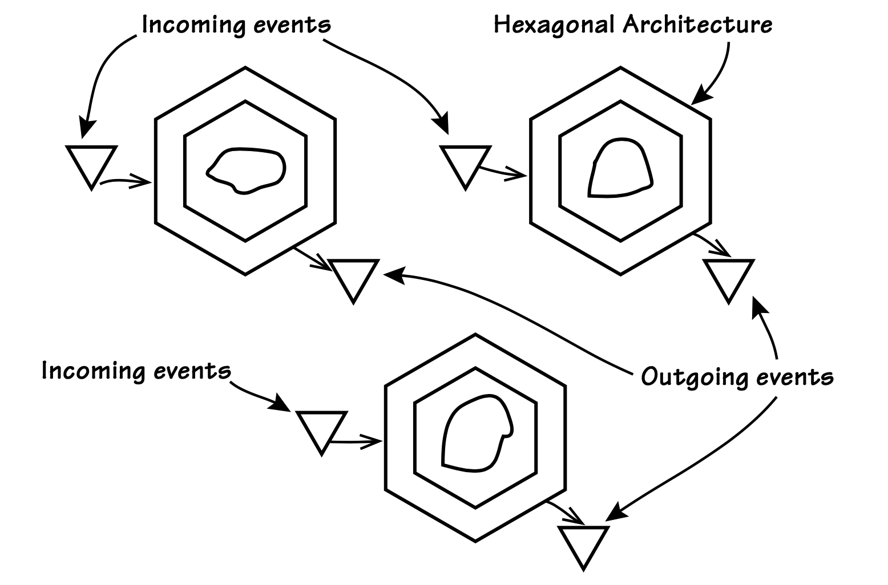
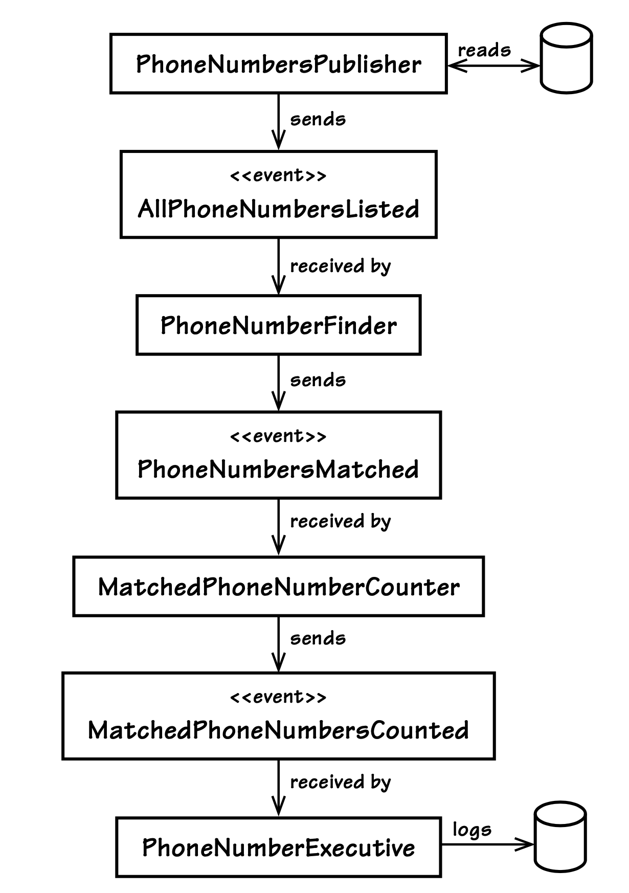
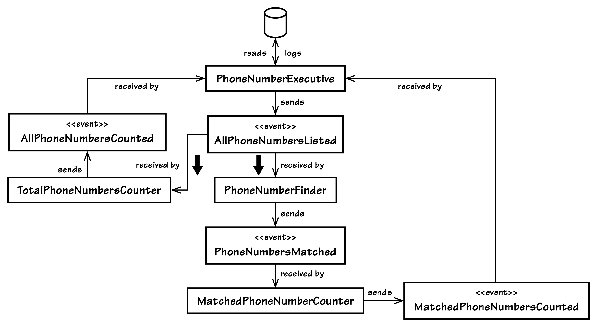
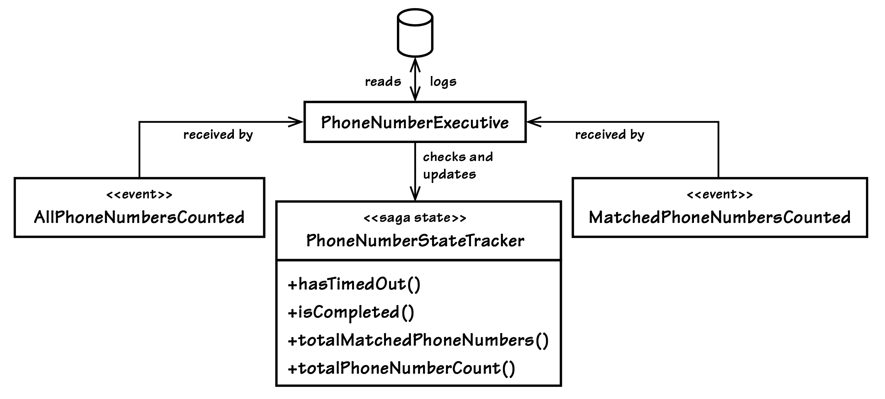
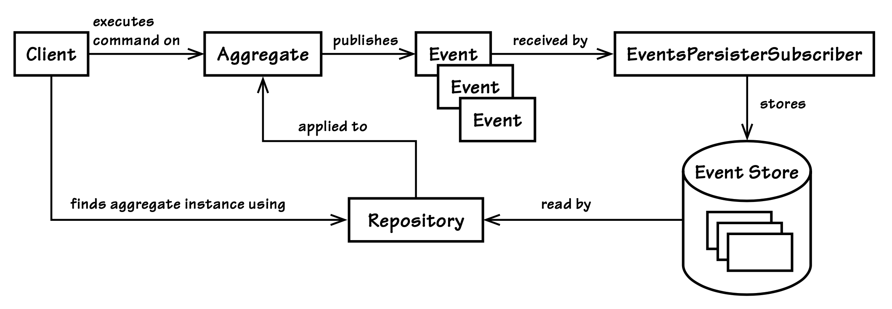

## 事件驱动架构

#### ▶[上一节](6.md)

事件驱动架构（EDA）是一种提倡事件生成、检测、消费及响应的软件架构。[[Wikipedia, EDA](../bibli.md#wikipedia-eda)] 

[图 4.4](3.md#figure-44) 所示的`Hexagonal Architecture`可体现系统通过入站与出站消息参与 EDA 的理念。EDA 并非必须采用`Hexagonal`，但这是阐释相关概念的有效方式。在新建项目中，将`Hexagonal`作为整体设计风格值得认真考虑。

观察 [图 4.4](3.md#figure-44) ，假设三角形客户端及其对应的三角形输出机制代表了`Bounded Context`所采用的消息传递机制。输入事件通过与其他三个客户端不同的`Port`进入。输出事件同样通过不同`Port`传输。如前所述，这些独立`Ports`可代表基于 AMQP 协议的消息传输机制（如 RabbitMQ 所采用），而非其他客户端普遍使用的 HTTP 协议。无论实际采用何种消息传递机制，我们均假设事件通过符号三角形实现系统进出。

进入和离开六边形的事件可能有多种类型。我们特别关注`Domain Events`。应用程序还可能订阅系统事件、企业事件或其他类型的事件，这些事件可能涉及系统健康状况监控、日志记录、动态配置等。然而，真正需要我们建模关注的，正是那些传递业务动态的`Domain Events`。

我们可以在`Hexagonal Architecture`视图中按需复制该系统，以呈现企业中支持`Event-Driven`模式的完整系统体系。如 [图 4.7](#figure-47) 所示。需要强调的是，并非所有系统都必须基于`Hexagonal`。该图仅演示了当多个系统以`Hexagonal`为基础时，如何实现对`Event-Driven`的支持。若需调整，可自由将六边形替换为分层结构或其他样式。

某个系统通过输出`Port`发布的`Domain Events`，将通过其输入`Port`传递给其他系统中的订阅者。接收到的各类`Domain Events`在每个接收的`Bounded Context`中具有特定含义，也可能毫无意义。<sup>[5](#5)</sup> 若事件类型在特定上下文中具有价值，其属性将适配应用程序的 API 并用于执行相应操作。随后，在应用程序 API 上执行的命令操作将根据其协议映射回领域模型。

#### Figure 4.7
</br>
*三个系统采用 EDA 并遵循整体`Hexagonal`风格。EDA 风格除了系统对消息传递机制本身及其订阅的事件类型的依赖之外，解耦了所有其他部分。*

接收到的特定`Domain Event`可能仅代表多任务进程的一部分。在所有预期的`Domain Event`到达之前，该多任务进程不被视为完成。但进程如何启动？如何在企业范围内进行分布？我们又如何处理任务进度直至进程完成？这些问题的答案将在后续关于 [[长期运行的进程](#长时运行进程又称-saga)] 章节中讨论。但首先需要打好基础。基于消息的系统通常体现`Pipes`与`Filters`模式。

### `Pipes`与`Filters`

在最基础的形式下，`Pipes`与`Filters`可通过 shell/console 命令行实现：

```shell
$ cat phone_numbers.txt | grep 303 | wc -l
3
$
```

这里使用 Linux 命令行来查找花哨的个人信息管理器 phone_numbers.txt 中有多少联系人拥有科罗拉多州的电话号码。诚然，这不是实现该用例的非常可靠的方法，但它确实演示了`Pipes`与`Filters`的工作原理：

1. cat 工具将 phone_numbers.txt 的内容输出到所谓的 *标准输出流* 。通常这个流是连接到控制台的。但是当使用 | 符号时，输出会被传送到下一个工具的输入。

2. 接下来，grep 从标准输入流读取其输入，这个输入是 cat 的输出结果。grep 的参数告诉它匹配包含文本 303 的行。它找到的每一行都会输出到标准输出流。和 cat 一样，grep 的输出流现在被管道传输到下一个工具的输入。

3. 最后，wc 读取其标准输入流，该输入流是从 grep 的标准输出通过管道传递过来的。wc 的命令行参数是 -l，告诉它计算所读取的行数。它输出结果，在这个例子中是 3，因为 grep 输出了三行。请注意，现在标准输出显示在控制台上，因为这一次没有管道传递给其他命令。

这可以使用 Windows 控制台近似实现，但管道操作较少：

```Shell
C:\fancy_pim> type phone_numbers.txt | find /c "303"
3
C:\fancy_pim>
```

考虑每个工具的运行情况。每个工具接收一个数据集，进行处理，并输出一个不同的数据集。输出的数据集与输入数据集不同，因为每个工具都充当了过滤器。在过滤过程结束时，输出与输入完全不同。输入最初是包含联系信息的文本文件，每行一条，最终变成了表示数字3的文本字符。

基于本例中的基本原理，我们如何将其应用于 EDA ？事实上，我们能发现某些有用的共通点。以下讨论基于 [[Hohpe, Woolf](../bibli.md#hohpe--woolf)] 提出的`Pipes and Filters`消息模式。但需注意，消息`Pipes`与`Filters`方法与命令行版本并不完全相同，且本意亦非如此。例如，EDA 中的`Filter`未必需要实际执行过滤操作。EDA `Filter`可能在保持消息数据完整的前提下执行某些处理。尽管如此，EDA 中的`Pipes`与`Filters`与命令行模式仍存在足够相似性，使得前文示例为后续内容奠定了基础。若您是资深读者，可自由 “过滤” 后续内容。

[表 4.2](#table-42) 展示了基于消息的`Pipes`与`Filters`过程的一些基本特征。

#### Table 4.2

|特征|描述|
|---|---|
|`Pipes`是消息通道|`Filters`通过入站`Pipes`接收消息，并通过出站`Pipe`发送消息。`Pipe`实质上是消息通道。|
|`Ports`连接`Filters`与`Pipes`|`Filters`通过`Port`连接入站与出站`Pipes`。`Ports`使`Hexagonal`（`Ports and Adapters`）成为契合的总体设计范式。|
|`Filters`是处理器|`Filters`可能处理消息而不实际进行过滤。|
|独立处理器|每个`Filters`处理器均为独立组件，通过精心设计实现恰当的组件粒度。|
|松耦合|每个`Filters`处理器均独立于其他处理器组成进程。`Filters`处理器组合可通过配置定义。|
|可互换|处理器接收消息的顺序可根据用例需求重新排列，同样通过配置组合实现。|
|`Filters`可多`Pipes`处理|命令行`Filters`仅读写单一`Pipe`，而消息`Filters`可读写多`Pipes`，这意味着支持并行或并发处理。|
|同类型`Filters`可并行使用|可部署多个最繁忙且可能最慢的`Filters`以提升吞吐量。|

*基于消息的`Pipes`与`Filters`过程的基本特征*

那么，如果我们将每个工具 cat、grep 和 wc（或者 type 和 find）视为 EDA 中的组件，会怎么样呢？如果我们甚至实现组件来充当消息发送者和接收者，以类似的方式处理电话号码呢？（同样，我并不是想说明一个一对一的命令行替代方案，只是一个具有相同基本目标的简单消息示例。）

下面是消息传递的`Pipes`与`Filters`方法的工作方式，步骤如 [图 4.8](#figure-48) 所示：

#### Figure 4.8
</br>
*管道是由发送事件形成的，这些事件由`Filters`进行处理。*

1. 我们可以从一个名为 PhoneNumbersPublisher 的组件开始，它读取 phone_numbers.txt 中的所有行，然后创建并发送一个包含所有文本行的事件消息。该事件名为 AllPhoneNumbersListed 。一旦发送，管道就开始运行。

2. 一个名为 PhoneNumberFinder 的消息处理组件被配置为订阅 AllPhoneNumbersListed，并接收该消息。该消息处理器是管道中的第一个`Filter`。该`Filter`被配置为搜索文本 303。该组件通过在每一行中搜索 303 文本序列来处理事件。然后，它创建一个名为 PhoneNumbersMatched 的新事件，将匹配结果的完整行放入事件中。事件消息被发送，从而继续执行管道处理。

3. 一个名为 MatchedPhoneNumberCounter 的消息处理组件被配置为订阅 PhoneNumbersMatched 消息并接收它。该消息处理器是管道中的第二个`Filter`。它的唯一职责是统计事件中的电话号码，然后在一个新事件中转发结果。在此情况下，它统计了包含电话号码的三行总数。`Filter`通过创建 MatchedPhoneNumbersCounted 事件完成操作，并将 count 属性设置为 3。事件消息被发送，继续管道的进程。

4. 最后，订阅了 MatchedPhoneNumbersCounted 的消息处理组件会接收到它。该组件名为 PhoneNumberExecutive。它的唯一职责是将结果日志记录到文件中，包括计数事件属性以及接收到的日期和时间。在本例中，它会记录：</br>
`匹配了 3 个电话号码 2012 年 7 月 15 日晚上 11:15`

此特定进程的管道现已完成。<sup>[6](#6)</sup>

这种管道具有一定的灵活性。若需向管道添加新`Filters`，我们只需创建新事件，让现有`Filter`订阅并发布这些事件。本质上，我们需要通过配置谨慎调整管道的顺序。当然，相较于命令行方式，这种进程的变更并不那么便捷。不过通常情况下，`Domain Event`管道的变更频率并不高。虽然这个特定的分布式进程本身实用性有限，但它确实展示了`Pipes`与`Filters`在消息传递、EDA 中的运作机制。

那么，我们是否真的期望看到`Pipes`与`Filters`被用于解决此类问题？理想情况下当然不应如此。（事实上，若你觉得这个例子令人困扰，很可能说明你已掌握更优解法。这无可厚非，但仍有许多人从中受益。）此例仅为概念演示，旨在突出核心原理。在真实的企业环境中，我们会运用这种模式将大型问题分解为更小的步骤，从而使分布式处理更易于理解和管理。它还能让多个系统专注于各自擅长的领域。

在实际 DDD 场景中，`Domain Events`反映的是对业务具有实际意义的名称。步骤 1 可能基于某个`Bounded Context`中`Aggregate`的行为结果发布`Domain Event`。步骤 2 至 4 可能发生在接收初始事件并发布后续事件的一个或多个不同`Bounded Contexts`中。这三个步骤可能在其各自上下文中创建或修改`Aggregates`。具体实现取决于领域，但这些是`Pipes`与`Filters`架构中处理`Domain Events`的常见结果。

正如 [Domain Events (8)](../ch8/0.md) 中所阐述的，这些并非纸上谈兵的技术通知。它们明确建模了业务进程活动事件的发生，这些事件对领域范围内的订阅者具有重要价值。事件携带唯一标识符及必要的信息传递属性，确保其含义清晰传达。然而这种同步、分步式的风格可被扩展，从而实现同时处理多项任务的能力。

### 长时运行进程，又称 Saga

合成`Pipes`与`Filters`的示例可扩展为另一种事件驱动、分布式并行处理模式，**长时运行进程 (Long-Running Processes)** 。长时运行进程有时被称为 Saga，但根据您的背景知识，该名称可能与现有模式存在冲突。Saga 的早期描述见于 [[Garcia-Molina & Salem](../bibli.md#garcia-molina--salem)] 。为避免混淆与歧义，本文采用 “长时运行进程” 作为名称，有时为简洁起见也使用`Process`一词。

|牛仔逻辑||
|---|---|
|LB：“达拉斯和王朝，这才叫传奇！”</br> AJ：“德国读者们都清楚，《王朝》在你们那儿叫《丹佛家族》。”||

在前一个示例的基础上，我们可以通过添加一个新的`Filter` TotalPhoneNumbersCounter，作为 AllPhoneNumbersListed 的附加订阅者来创建并行管道。它几乎与 PhoneNumberFinder 并行地接收事件 AllPhoneNumbersListed。这个新`Filter`的目标非常简单，即统计所有现有联系人。不过这一次，PhoneNumberExecutive 不仅启动了长时运行过程（Long-Running Pr用于追踪其完成情况。执行器 (executive) 可能会重复使用 PhoneNumbersPublisher，也可能不会，但重要的是其中的新内容。作为`Application Service`或`Command Handler`实现的执行器 (execu用于追踪长时运行过程的进度，了解何时完成以及完成后需要做什么。在逐步演示示例长时运行过程时，请参考 [图 4.9](#figure-49) 。

#### Figure 4.9

*单个长时运行进程执行器启动并行处理并追踪其直至完成。较宽的箭头标示出并行处理的起始点，当两个`Filters`接收到相同事件时。*

---
➜**设计长时运行进程的不同方式**

以下是设计长时运行进程的三种方法（可能还存在其他方案）：

- 将进程设计为复合任务，由执行组件通过持久化对象记录任务步骤和完成度。本文将重点探讨此方案。
- 将进程设计为协作执行一组活动的伙伴`Aggregates`。其中一个或多个`Aggregate`实例担任执行器 (executive) ，维护进程整体状态。此方案由 Amazon 的 Pat Helland [[Helland](../bibli.md#helland)] 提出。
- 设计无状态进程：每个接收事件消息的消息处理组件在发送下一条消息时，必须为接收到的事件补充更多任务进度信息。整个进程的状态仅通过协作方间传递的消息正文来维护。

---

由于最初的事件现在被两个组件订阅，两个`Filters`几乎同时接收相同的事件。原来的`Filters`按照往常的方式工作，匹配特定的 303 文本模式。新的`Filters`只统计所有行，当统计完成后，它会发送事件 AllPhoneNumbersCounted 。该事件包括总联系人数量的统计。例如，如果总共有 15 个电话号码，事件的 count 属性将被设置为 15。

现在由 PhoneNumberExecutive 负责订阅两个事件，分别是 MatchedPhoneNumbersCounted 和 AllPhoneNumbersCounted。在接收到这两个`Domain Events`之前，平行处理不会被视为完成。当处理完成时，平行处理的结果会合并成一个单一的结果。该执行器 (executive) 现在记录：

```
共匹配了 15 个电话号码中的 3 个 2012 年 7 月 15 日 11:27，
```

不过，这个长时运行进程存在一个问题。PhoneNumberExecutive 目前没有办法知道它已经接收到与特定对应的并行进程相关的两个完成`Domain Event`。如果许多这样的进程同时启动，并且每个进程的完成事件是乱序接收的，那么执行器 (executive) 如何知道哪个并行进程正在结束？对于我们的示例，记录不匹配的事件并不算严重。但在处理业务领域时，一个未正确对齐的长时运行进程可能会造成灾难性的后果。

解决这一棘手情况的第一步是为每个相关的`Domain Events` *分配一个唯一的过程标识符* 。这个标识符可以与触发长时运行进程开始的源`Domain Event`分配的标识符相同（例如，AllPhoneNumbersListed ）。我们可以使用专门为该进程分配的全局唯一标识符（UUID）。有关提供唯一标识符的讨论，请参阅 [Entities (5)](../ch5/0.md) 和 [Domain Events (8)](../ch8/0.md) 。PhoneNumberExecutive 现在只有在收到具有相同标识符的完成事件时才会将输出写入日志。然而，我们不能指望执行器 (executive) 一直等待，直到所有完成事件都被接收。它也是一个事件订阅者，会随着每次交付的接收和处理而来去。

---
➜**执行器与追踪器？**

有些人发现将执行器和追踪器的概念合并为一个对象 ——即`Aggregate`—— 是最简单的方法。将这样的`Aggregate`作为领域模型的一部用于追踪整个进程的一部分，这是一种解放性的技术。首先，我们可以避免开发一个单独的追踪器作为状态机，此外，还必须存在`Aggregates`。事实上，最基本的长时运行进程最好就是以这种方式实现。

在`Hexagonal Architecture`中，`Port-Adapter`消息处理器只需分发到`Application Service`（或`Command Handler`），后者会加载目标`Aggregate`并委托给其相应的命令方法。由于`Aggregate`会反过来触发`Domain Event`，该事件将被部分发布，作为`Aggregate`已完成其在进程中角色的标志。

这种方法紧密遵循 Pat Helland 推崇的做法，他称之为 *伙伴活动  (partner activities)* [[Helland](../bibli.md#helland)] ，也是侧边栏 "设计长时运行进程的不同方式" 中描述的第二种方法。然而，理想情况下，分别讨论执行器 (executive) 和追踪器是教授整体技术的更有效方式，也是学习它的更直观方法。

---

在实际的领域中，每个进程执行实例都会创建一个新的类似`Aggregate`用于追踪其最终完成情况。状态对象在进程开始时创建，并关联每个相关`Domain Event`必须携带的相同唯一身份。让其记录进程开始的时间戳也可能很有用（原因将在本章后面讨论）。进程状态追踪对象如 [图 4.10](#figure-410) 所示。

#### Figure 4.10
</br>
*PhoneNumberStateTracker 作为一个长时运行进程用于追踪进度。该追踪器被实现为一个`Aggregate`。*

随着并行处理中每个管道的完成，执行器会收到一个相应的完成事件。执行器通过匹配接收到的事件所携带的唯一进程标识来检索状态跟踪实例，并设置表示刚完成步骤的属性。

进程状态实例通常有诸如 isCompleted() 的方法。随着每个步骤的完成并在此状态追踪器上记录，执行器会检查 isCompleted() 方法。此方法会检查所有所需并行进程的完成记录。当该方法返回 true 时，如果业务需要，执行器可以选择发布最终的`Domain Event`。例如，如果完成的进程只是更大并行流程中的一个分支，则可能需要发布此事件。

特定的消息传递机制可能缺乏保证每个事件 *仅传递一次* 的功能。<sup>[7](#7)</sup> 如果消息传递机制可能将一个`Domain Event`消息传递两次或更多次，我们可以使用进程状态对象来进行去重。这是否需要消息传递机制提供特殊功能？请考虑如何在没有这些功能的情况下处理。

当收到每个完成事件时， *执行器会检查状态对象中是否已有该特定事件完成的记录* 。如果完成指示已被设置，该事件将被视为重复事件并被忽略，但仍然会被确认。<sup>[8](#8)</sup> 另一种选择是 *将状态对象设计为幂等的* 。这样，如果执行器收到重复的消息，状态对象也会同样处理重复事件的记录。虽然只有第二种方案将状态跟踪器本身设计为幂等，但这两种方法都支持幂等消息。有关事件去重的进一步讨论，请参见 [Domain Events (8)](../ch8/0.md) 。

某些进程完成追踪可能对时间敏感。我们可以以被动或主动的方式处理进程超时。请记住，进程状态追踪器可以保存其启动时间戳。在此基础上加上一个总允许时间常量（或配置）值，执行器就可以管理对时间敏感的长时运行进程。

每当执行器收到一个并行处理完成事件时，就会执行一次被动超时检查。执行器会获取状态追踪器，并询问它是否发生了超时。像 hasTimedOut() 这样的方法可以用于此目的。如果被动超时检查显示允许的时间阈值已被超越，则进程状态追踪器可以被标记为放弃。也可以发布相应的失败`Domain Event`。需要注意的是，被动超时检查的一个缺点是，如果一个或多个完成事件由于某种原因未被执行器接收，进程可能会在阈值之后仍然保持活跃。如果更大的并行过程依赖于该进程的某些成功或失败，这种情况可能是不可接受的。

可以使用外部计时器来管理主动的进程超时检查。例如，JMX TimerMBean 实例就是获得 Java 管理计时器的一种方式。计时器在进程开始时设置为最大超时阈值。当计时器触发时，监听器会访问进程状态跟踪器。如果状态尚未完成（总是会检查，以防计时器在异步事件完成进程的同时触发），则将其标记为放弃，并发布相应的失败事件。如果在计时器触发之前状态追踪器已经被标记为完成，则可以终止计时器。主动超时检查的一个缺点是它需要更多的系统资源，这可能会给高流量环境带来负担。此外，计时器和到达的完成事件之间的竞争条件可能会错误地导致失败。

长时运行进程通常与分布式并行处理相关，但与分布式事务无关。它们需要接受最终一致性的思维方式。我们必须以冷静的态度进入任何长时运行进程的设计工作，并预期当基础设施或任务本身发生故障时，良好的错误恢复是至关重要的。参与单个长时运行进程实例的每个系统，在执行器收到最终完成通知之前，都必须被视为与所有其他参与者不一致。确实，一些长时运行进程可以只完成部分任务就能成功，或者可能在完全完成前延迟数天。但如果进程遇阻，而参与系统处于不一致状态，则可能需要进行补偿。如果补偿是必须的，其复杂性可能超过设计成功路径的复杂性。也许业务流程可以允许失败，并提供工作流程解决方案。

---
| ||
|---|---|
|SaaSOvation 团队在`Bounded Contexts`中采用 EDA ，ProjectOvation 团队将使用最简单形式的长时允许进程来管理分配给`Product`实例的`Discussions`的创建。总体风格是`Hexagonal`，用于管理外部消息传递和企业范围内的`Domain Events`发布。||

---

不可忽视的是，长时运行进程执行器可以发布一个、两个或更多事件以启动并行处理。任何一个启动事件或多个启动事件不仅可能有两个订阅者，也可能有三个或更多订阅者。换句话说，一个长时运行进程可能导致许多独立的业务处理活动同时执行。因此，我们的示例在复杂性上受到限制，仅是为了便于传达长时运行进程的基本概念。

长时运行进程在与可能存在高延迟的遗留系统集成时通常很有用。即使延迟和遗留系统并不是主要关注点，我们仍然可以从优雅的分布式处理和并行性中受益，这可以带来高度可扩展、高度可用的业务系统。

一些消息机制内置了对长时运行进程的支持，这可以大大加快采用速度。其中一种是 [[NServiceBus](../bibli.md#nservicebus)] ，专门将其称为 Sagas 。另一种 Saga 实现由 [[MassTransit](../bibli.md#masstransit)] 提供。

### `Event Sourcing`

有时企业关心跟踪领域模型中对象的变化情况。对变化跟踪的关注程度各不相同，也有不同的方法来支持每种程度。通常企业选择只跟踪某个实体的创建时间、最后修改时间以及修改者。这是一种相对简单、直接的变化跟踪方法。然而，这并不能提供模型中各个具体变化的信息。

随着对更多变更跟踪需求的增加，企业对元数据的需求也在增加。它开始关心随着时间推移执行的各个操作。也许它甚至希望了解某些操作执行所需的时间。这些需求导致需要维护更细粒度用例指标的审计日志或记录。但审计日志或记录是有限的。它可以传达系统中发生的一些信息，甚至可能允许进行一些调试。但它不能让我们检查特定类型变化前后各个领域对象的状态。如果我们能够从变更跟踪中获得更多信息会怎样呢？

作为开发者，我们都以某种形式体验过更细粒度的变更跟踪。最常见的例子是使用源代码仓库，例如 CVS、Subversion、Git 或 Mercurial。这些不同版本的源代码管理系统的共同点在于，它们都能够跟踪源文件发生的变化。这类工具提供的变更跟踪功能使我们能够回溯到任何时间点，查看从第一次提交开始的源代码，并逐次查看每次修订，直到最新版本。当将所有源文件提交到版本控制系统时，它可以跟踪整个开发生命周期的变更。

现在，如果我们考虑将这个概念应用于单个`Entity`，然后应用于一个`Aggregate`，再应用于模型中的每一个`Aggregate`，我们就能理解变更跟踪对象的威力以及它在系统中能产生的价值。基于此，我们希望开发一种方法，了解模型中发生了什么，导致创建了任意一个`Aggregate`实例，同时也能了解该`Aggregate`实例在时间上的演变过程，一步步追踪每次操作。拥有所有发生事件的历史记录，我们甚至可以支持时间模型。这种级别的变更跟踪是名为`Event Sourcing`模式的核心。[图 4.11](#figure-411) 展示了该模式的高层次视图。

`Event Sourcing`有不同的定义，因此有必要进行一些澄清。我们讨论的用法是，每当在领域模型中的任何给定`Aggregate`实例上执行操作命令时，都会至少发布一个描述执行结果的`Domain Event`。每个事件都会按其发生的顺序保存到 [Event Store (8)](../ch8/0.md) 中。当从其`Repository`中检索每个`Aggregate`时，通过按事件之前发生的顺序回放事件来重建实例。<sup>[10](10)</sup> 换句话说，首先回放最早的事件，`Aggregate`将该事件应用于自身，从而修改其状态。接下来，以相同的方式回放第二古老的事件。这一过程一直持续，直到所有事件，从最古老到最新的，都被完全回放和应用。到那时，`Aggregate`的状态就与最近一次某个命令行为执行时的状态相同。

#### Figure 4.11

*`Event Sourcing`的高层视图，其中`Aggregates`发布的事件被存储并用于跟踪模型的状态变化。`Repository`从存储中读取事件，并将其应用于重建`Aggregate`的状态。*

---
➜**一个不断变化的目标？**

`Event Sourcing`的定义经历了一些审查 (scrutiny) 和完善，在撰写本文时，它仍未完全确定。与大多数前沿技术一样，完善是必要的。这里描述的内容抓住了将该模式应用于 DDD 的核心本质，并且很大程度上可能反映了未来它的常规使用方式。

---

在对任何`Aggregate`实例进行长期变更的过程中，播放数百、数千，甚至数百万个事件，会不会导致模型处理的严重延迟和开销？至少对于一些高流量模型来说，这几乎肯定是会发生的。

为了避免这个瓶颈，我们可以应用一种使用`Aggregate`状态 *快照* 的优化方法。在后台，开发了一个流程生成`Aggregate`在`Event Store`历史中特定时间点的内存状态快照。为此，`Aggregate`会被加载到内存中，并使用截至当前时间点的所有先前事件。然后将`Aggregate`状态序列化，并将序列化的快照图像保存到`Event Store`中。从那时起，`Aggregate`首先使用最新快照实例化，然后如前所述，将所有比该快照更新的事件在`Aggregate`上重新播放。

快照不是随机创建的。相反，它们可以在发生预定数量的新事件时创建。团队会根据领域启发式 (heuristics) 或其他观察来确定一个数字。例如，我们可能会发现，当快照之间的事件不超过 50 或 100 个时，`Aggregate`检索的性能最佳。

`Event Sourcing`在很大程度上偏向于技术解决方案。我们可以生成发布`Domain Events`的领域模型，而无需支持`Event Sourcing`。作为一种持久化机制，`Event Sourcing`取代了 ORM 工具，并且与其大不相同。由于事件通常以二进制形式存储在`Event Store`中，它们无法（最佳情况下）用于查询。<ins>事实上，为`Event Sourcing`模型设计的`Repositories`只需要一个 get/find 操作，而且该方法的参数仅为`Aggregate`唯一标识。此外，按照设计，`Aggregate`集合没有任何查询方法（getter）。因此，我们需要另一种查询方式，这通常会导致结合`Event Sourcing`采用 CQRS（前文讨论过）。</ins> <sup>[11](#11)</sup> *（译注：这段话不是很理解，为何不能有其他查询方法，是因为存储方式吗？）*

由于`Event Sourcing`引导我们以不同的方式思考领域模型的设计方式，所以我们需要证明其使用的合理性。在最基本的层面上，事件历史可以揭示系统中错误的解决方案。通过使用对模型中发生的一切事件的明确历史进行调试具有巨大优势。`Event Sourcing`可以导致高吞吐量的领域模型，能够扩展到每秒极大量的事务。例如，追加到单个数据库表的操作非常快速。此外，它还使 CQRS 查询模型可以扩展 (scaled out) ，因为对该数据源的更新是在`Event Store`更新新事件之后在后台进行的。这还可以进一步允许将查询模型复制到更多数据源实例，以支持不断增长的客户端数量。

但技术优势并不总能将技术推广给业务。因此，可以考虑仅列举使用`Event Sourcing`带来的一些业务优势，这些优势源于技术实现：

- 使用新的或修改过的事件修补`Event Store`，以解决问题。这可能会带来业务影响，但如果在特定情况下是合法的，修补程序可以挽救由于模型中的漏洞导致的系统严重问题。由于修补程序具有内置的审计追踪功能，使用修补程序可能会通过使问题明确和可追踪，从而减少任何法律影响。

- 除了打补丁之外，我们还可以通过重放不同的事件集来撤销和重做模型的更改。这可能会有技术上的影响和业务上的影响，并且在所有情况下可能无法支持。

- 通过对领域模型中发生的所有事件进行准确记录，企业可以考虑 “如果……会怎样？” 的问题。也就是说，通过在具有实验性增强的`Aggregates`上回放已存储的事件，企业可以获得对假设性问题的准确答案。如果企业能够使用真实的历史数据来模拟概念场景，会带来好处吗？很可能会。这是一种获取商业智能的替代方式。

企业是否会从一种或多种这些技术和非技术优势中受益？

[附录 A](../appendix.md) 提供了关于使用`Event Sourcing`实现`Aggregates`的详细信息，并讨论了如何为 CQRS 投影视图。更多详情请参见 [[Dahan, CQRS](../bibli.md#dahan-cqrs)] 和 [[Nijof, CQRS](../bibli.md#nijof-cqrs)] 。

#### ▶[下一节](8.md)
---

#### 5
如果使用消息过滤器或路由键，订阅者可以避免接收对他们无意义的事件。

#### 6
为简化起见，我不讨论`Hexagonal Architecture`的`Ports`、`Adapters`和应用程序 API 。

#### 7
这并不意味着保证消息送达，而是保证单次送达，即一次且仅一次。

#### 8
当消息机制最终收到接收确认时，消息将不会再次发送。

#### 9
关于`Event Sourcing`的讨论通常需要理解 CQRS，这在前面关于该主题的部分已有介绍。

#### 10
`Aggregate`状态是以前事件的混合，但只有按它们发生的顺序应用时才成立。

#### 11
虽然我们可以在不使用`Event Sourcing`的情况下使用 CQRS，但反过来通常不太实用。
