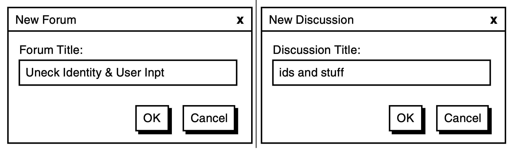
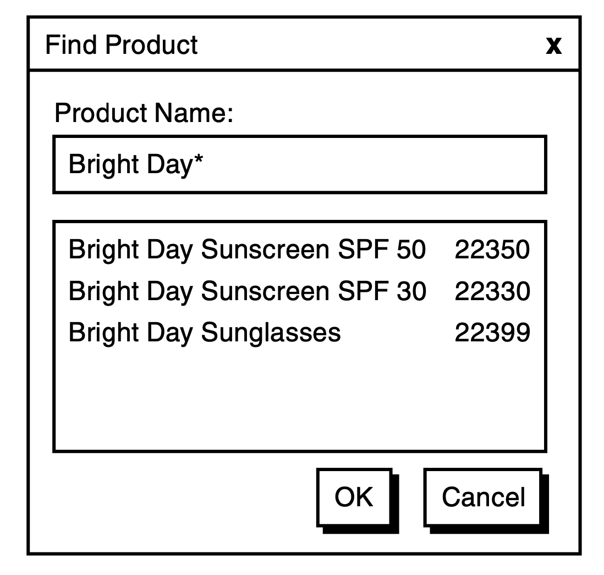
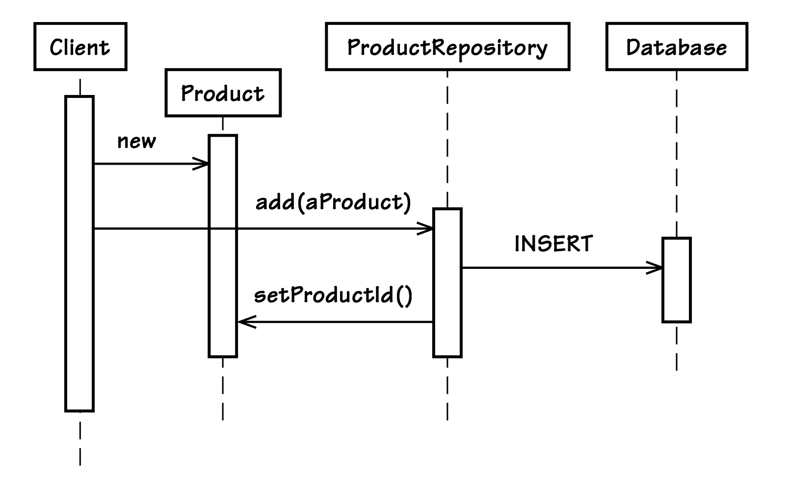
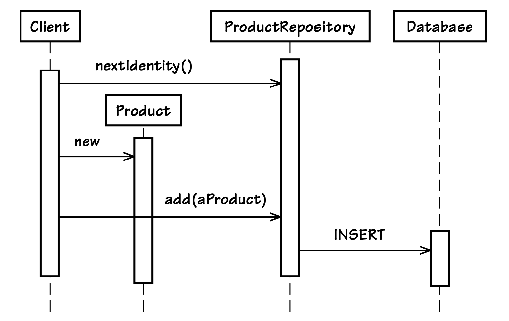

## 唯一标识

#### ▶[上一节](1.md)

在设计一个`Entity`的早期阶段，我们会刻意只关注那些对其唯一标识至关重要的主要属性和行为，以及那些对查询该`Entity`有用的属性和行为；在确定这些主要内容之前，我们会刻意忽略所有其他属性和行为。

- “与其关注属性甚至行为，不如将`Entity`对象的定义精简到最本质的特征，尤其是那些能够标识它、或通常用于查找或匹配它的特征。只添加对该概念至关重要的行为，以及该行为所必需的属性。” [[Evans, p. 93](../bibli.md#evans)]

所以，这就是我们首先要做的事情。拥有多种可用于实现标识的选项非常重要，同样重要的是那些能够确保唯一性在时间推移中得以保持的选项。

<ins>`Entity`的唯一标识不一定适合用于查找或匹配。是否使用唯一标识进行匹配，通常取决于它的可读性（对人类来说是否容易理解和使用）</ins>。例如，如果应用程序允许用户通过姓名搜索某个人，那么姓名几乎不可能被用作 Person `Entity`的唯一标识，因为人们的姓名经常重复。相反，如果应用程序允许通过公司的税务编号进行搜索，那么税务编号很可能就是 Company `Entity`的主要唯一标识，因为政府会为每个公司分配唯一的税务身份编号。

<ins>`Value Objects`可以作为唯一标识的持有者。它们是不可变的，这确保了标识的稳定性，并且任何特定于该类标识的行为都被集中管理</ins>。为标识行为提供一个焦点（无论多么简单），可以防止相关知识泄漏到模型的其他部分以及客户端中。

考虑一些常见的标识创建策略，从表面上最简单、最基础的，到复杂度逐渐增加的：

- 用户向应用程序提供一个或多个原始的唯一值作为输入。应用程序必须确保这些值是唯一的。

- 应用程序在内部使用一种能保证唯一性的算法来生成标识。我们可以借助类库或框架来完成这项工作，也可以由应用程序自己实现。

- 应用程序依赖持久化存储（例如数据库）来生成唯一标识。

- 另一个 [Bounded Context(2)](../ch2/0.md)（另一个系统或应用）已经确定了该唯一标识。它由用户从一组选项中输入或选择。

让我们来分别考察这些策略，以及与每种策略相关的特定挑战。在考虑各种技术解决方案时，几乎总会出现一些副作用。例如，当我们使用关系数据库进行对象持久化时，就会有副作用泄漏到领域模型中。我们将通过讨论标识生成时机的影响、关系数据库对领域对象的引用标识，以及对象关系映射（ORM）在这种情况下所起的作用，来完整地说明与标识创建相关的问题。我们还会提供一些关于保持唯一标识稳定性的实用指导。

### 用户提供标识

让用户手动输入唯一标识的细节，这似乎是一种简单直接的方法。用户在输入框中键入一个可识别的值或符号，或者从一组可用特征中进行选择，然后`Entity`就被创建出来。诚然，这种方法足够简单，但也可能存在一些复杂情况。

一个复杂之处在于依赖用户来生成高质量的标识。标识可能是唯一的，但并不一定正确。大多数情况下，标识必须是不可变的，因此用户不应该修改它们。但情况并非总是如此，允许用户更正标识值也可能有其好处。下面举个例子。如果我们把 Forum 和 Discussion 的标题用作唯一标识，那么如 [图 5.1](#figure-51) 所示，如果用户拼写标题错误，或者后来认为标题不够贴切，会发生什么？更改的成本是什么？尽管用户提供的标识看起来像是一种成本较低的方法，但事实可能并非如此。我们真的可以指望用户既提供唯一、又正确且长期有效的标识吗？

#### Figure 5.1
</br>
*论坛标题存在拼写错误，讨论标题也不尽如人意。*

防止这种问题要从设计讨论开始。团队需要考虑一些防错的方法，让用户能够定义唯一标识。基于工作流的标识审批方式并不适合高吞吐量的领域，但在必须使用人类可读标识的场景下效果最好。如果创建和审批一个将在企业中广泛使用多年的标识需要额外的时间和精力，而且支持工作流是可行的，那么多花几个步骤来确保标识的质量是一项值得的投资。

我们始终可以选择将用户输入的值作为`Entity`的属性，用于匹配，但**不**将其用作唯一标识。简单属性更容易作为`Entity`随时间变化的正常操作状态的一部分进行修改。在这种情况下，我们就需要使用其他方式来获取唯一标识。

### 应用程序生成标识

有一些非常可靠的方法可以自动生成唯一标识，不过当应用程序被集群化或以其他方式分布在多个计算节点上时，必须格外小心。有一些标识创建模式能够在很大程度上确保生成完全唯一的标识。 *通用唯一标识符（UUID）* 或 *全局唯一标识符（GUID）* 就是其中一种方法。下面是一种常见的变体，其中每一步的结果被连接成一个单一的文本表示形式：

1. 计算节点上的毫秒级时间
2. 计算节点的 IP 地址
3. 虚拟机中工厂对象实例的对象标识（Java）
4. 由同一虚拟机内的同一生成器生成的随机数（Java）

这样会生成一个128 位的唯一值。它最常被表示为 32 字节或 36 字节的十六进制编码文本字符串。当使用常见的连字符分段格式（例如：`f36ab21c-67dc-5274-c642-1de2f4d5e72a`）时，文本格式为 36 字节；如果不带连字符，则为 32 字节。无论哪种方式，这种标识都很长，并且不被认为是人类可读的。

在 Java 技术体系中，这一生成规则已被自 Java 1.5 版本起提供的标准 UUID 生成器取代。该生成器由`java.util.UUID`类实现，其底层基于 Leach-Salz 变体，支持四种不同的生成算法。借助 Java 标准 API，我们可以轻松生成一个伪随机的唯一标识：

```java
String rawId = java.util.UUID.randomUUID().toString();
```

这段代码使用的是 4 型 UUID，它采用了密码学安全的伪随机数生成器（基于 `java.security.SecureRandom` 实现）；而 3 型 UUID 则采用名称加密的方式，底层依赖 `java.security.MessageDigest` 实现。我们可以通过如下方式生成基于名称的 UUID：

```Java
String rawId = java.util.UUID.nameUUIDFromBytes(
        "Some text".getBytes()).toString();
```

我们也可以将伪随机数生成与加密技术结合使用：

```Java
SecureRandom randomGenerator = new SecureRandom();

int randomNumber = randomGenerator.nextInt();

String randomDigits = new Integer(randomNumber).toString();

MessageDigest encryptor = MessageDigest.getInstance("SHA-1");

byte[] rawIdBytes = encryptor.digest(randomDigits.getBytes());
```

现在，我们只剩下将`rawIdBytes`数组转换为十六进制文本表示这一步任务。我们可以免费获得这种转换：在生成随机数并将其转换为字符串之后，只需将该文本传递给 UUID `nameUUIDFromBytes()` `Factokry` 方法即可 [[Gamma et al.](../bibli.md#gamma-et-al)] 。

还有其他一些标识生成工具，例如`java.rmi.server.UID`和`java.rmi.dgc.VMID`，但它们似乎不如`java.util.UUID`，因此这里不再讨论。

UUID 是一种生成速度相对较快的标识，不需要与外部系统（例如持久化机制）进行交互。即使某种特定的`Entity`每秒被创建很多次，UUID 生成器也能跟上速度。对于更高性能的领域，我们可以缓存任意数量的 UUID 实例，并在后台重新填充缓存。如果由于服务器重启导致缓存的 UUID 实例丢失，也不会造成标识的空缺，因为它们都是基于随机生成的值。服务器重启时重新填充缓存，也不会因为废弃的值而产生任何负面影响。

由于标识如此庞大，在极少数情况下，它可能会因为内存开销而变得不切实际。在这种情况下，由持久化机制生成的 8 字节长整型标识会更合适。甚至一个更小的 4 字节整数（大约有 20 亿左右的唯一值）也可能足够使用。这些方法将在后面讨论。

考虑到以下几点，我们通常不会希望在用户界面上显示 UUID，这是可以理解的：

```
f36ab21c-67dc-5274-c642-1de2f4d5e72a
```

当 UUID 可以对用户隐藏，并且可以使用人类可读的引用方式时，完整的 UUID 通常是合适的。例如，我们可以用 URI 来设计超媒体资源，这些 URI 可以通过电子邮件发送，或通过其他用户间消息传递方式转发。链接中的文本关系部分可以用来伪装看起来神秘的 UUID，就像 HTML 中 `<a>text</a>` 里的文本可以隐藏技术链接一样。

根据你对十六进制文本 UUID 中各个分段唯一性的信任程度，你可以决定只使用其中的一个或几个分段。当这些缩短后的标识仅作为 [Aggregate (10)](../ch10/0.md) , 边界内`Entity`的 *本地标识* 时，它们会更可靠。本地标识意味着：`Aggregate`内部的`Entities`只需要在同一个`Aggregate`内部的其他`Entities`中保持唯一即可。另一方面，作为`Aggregate`根的`Entity`则需要全局唯一标识。

我们自己的标识生成器可以使用 UUID 中的一个或多个特定分段。举个人为构造的例子：APM-P-08-14-2012-F36AB21C 。这个 25 个字符的标识代表来自`Agile Project Management Context`（APM）的一个`Product`（P），创建于 2012 年 8 月 14 日。额外的文本 F36AB21C 是生成的 UUID 的第一个分段，用来将它与同一天创建的其他 Product `Entities`区分开。它既具有人类可读性，又有很高的概率实现全局唯一。受益的不只是用户。当这样的标识在不同`Bounded Contexts`之间传递时，开发人员可以立即知道它们来自哪里。对于 SaaSOvation 来说，这种方法可能很实用，因为`Aggregates`还会按租户进一步隔离。

将这种类型的标识以字符串形式保存通常不是一个好选择。使用一个自定义的标识`Value Object`会更合适：

```Java
String rawId = "APM-P-08-14-2012-F36AB21C"; // would be generated
ProductId productId = new ProductId(rawId);
...
Date productCreationDate =  productId.creationDate();
```

客户端可以请求标识的详细信息（例如产品的创建日期），并且这些信息可以很方便地提供出来。客户端不需要理解原始标识的格式。现在，Product `Aggregate`根可以公开它的创建日期，而不必向客户端说明该日期是如何获得的：

```Java
public class Product extends Entity {
    private ProductId productId;
    ...
    public Date creationDate() {
        return this.productId().creationDate();
    }
    ...
}
```

你可能会在第三方库和框架中找到标识生成功能。Apache Commons 项目中有一个 Commons Id（沙箱）组件，它提供了五种不同的标识生成器。

一些持久化存储（例如 NoSQL 数据库 Riak 和 MongoDB）也可以为你生成标识。通常，要在 Riak 中保存一个值，你需要使用 HTTP PUT 方法，并指定一个键：

```
PUT /riak/bucket/key

[object serialization]
```

你也可以改用 POST 而不提供键，从而让 Riak 强制生成一个唯一标识。不过，我们仍然需要考虑早期生成标识与晚期生成标识的问题，这一点将在本章后面讨论。

那么，在应用程序中，谁来充当生成标识的`Factory`呢？对于`Aggregate`根的标识生成，我倾向于使用它的 [Repository (12)](../ch12/0.md) ：

```Java
public class HibernateProductRepository
        implements ProductRepository  {
    ...
    public ProductId nextIdentity() {
        return new ProductId(
                java.util.UUID.randomUUID().toString().toUpperCase());
    }
    ...
}
```

这似乎是生成标识的一个很自然的位置。

### 由持久化机制生成标识

将唯一标识的生成委托给持久化机制有一些独特的优势。如果我们调用数据库来获取一个序列值或递增值，那么它始终是唯一的。

根据所需的范围，数据库可以生成 2 字节、4 字节或 8 字节的唯一值。在 Java 中：  
- 2 字节的短整型（short）最多可以提供 32,767 个唯一标识；  
- 4 字节的普通整型（int）可以提供 2,147,483,647 个唯一值；  
- 8 字节的长整型（long）则可以提供多达 9,223,372,036,854,775,807 个不同的标识。

即使是这些数值的补零文本表示，长度也很短，分别为 5 位、10 位和 19 位字符。它们也可以用于创建复合标识。

一个可能的缺点是性能。每次去数据库获取一个值，通常比在应用程序内部生成标识要慢得多。具体情况很大程度上取决于数据库负载和应用程序的需求。解决这个问题的一种方法是在应用程序中缓存序列/递增值，例如在`Repository`中缓存。这种方式通常效果不错，但当服务器节点必须重启时，我们通常会丢失大量未使用的缓存值。如果这些因缓存丢失而造成的标识空缺是不可接受的，或者你只规划了相对较少的取值范围（例如 2 字节的短整型），那么缓存预分配值可能既不实际也没有必要。理论上也可以收集并回收这些丢失的标识，但这可能得不偿失。

如果模型可以接受晚期生成标识（late identity generation），那么预分配和缓存就不是问题。下面是使用 Hibernate 和 Oracle 序列实现晚期生成标识的方式：

```xml
<id name="id" type="long" column="product_id">
    <generator class="sequence">
        <param name="sequence">product_seq</param>
    </generator>
</id>
```

下面是同一种方式的示例，但使用的是 MySQL 的自增列：

```xml
<id name="id" type="long" column="product_id">
    <generator class="native"/>
</id>
```

这种方式确实性能很好，而且在 Hibernate 的映射定义中配置起来也相当简单。问题可能在于标识生成的时机，这一点我们稍后再讨论。本节的剩余部分将介绍早期生成标识的需求。

---
➜**顺序可能很重要**

有时，`Entity`的标识生成和分配发生的时机很重要。

- *早期* 标识生成和分配发生在`Entity`被持久化 *之前* 。
- *晚期* 标识生成和分配发生在`Entity`被持久化 *之时*。

---

在这里，`Repository`支持早期生成标识，它通过一条查询语句获取下一个可用的 Oracle 序列值：

```Java
public ProductId nextIdentity() {
    Long rawProductId = (Long)
        this.session()
            .createSQLQuery(
                "select product_seq.nextval as product_id from dual")
            .addScalar("product_id", Hibernate.LONG)
            .uniqueResult();
    return new ProductId(rawProductId);
}
```

由于 Oracle 返回的序列值会被 Hibernate 映射为 BigDecimal 实例，因此我们必须通知 Hibernate，希望将 product_id 的结果转换为 Long 类型。

那么，对于像 MySQL 这样不支持序列的数据库，我们该怎么办呢？MySQL 支持自增列。通常情况下，自增列只有在新行被插入时才会生成值。不过，仍然有一种方法可以让 MySQL 的自增列像 Oracle 的序列一样工作：

```sql
mysql> CREATE TABLE product_seq (nextval INT NOT NULL);
Query OK, 0 rows affected (0.14 sec)

mysql> INSERT INTO product_seq VALUES (0);
Query OK, 1 row affected (0.03 sec)

mysql> UPDATE product_seq SET nextval=LAST_INSERT_ID(nextval + 1);
Query OK, 1 row affected (0.03 sec)
Rows matched: 1  Changed: 1  Warnings: 0

mysql> SELECT LAST_INSERT_ID();
+------------------+
| LAST_INSERT_ID() |
+------------------+
|                 1|
+------------------+
1 row in set (0.06 sec)

mysql> SELECT * FROM product_seq;
+---------+
| nextval |
+---------+
|        1|
+---------+
1 row in set (0.00 sec)
```

我们在 MySQL 数据库中创建了一个名为 `product_seq` 的表。接下来，我们向该表中插入一行数据，将其唯一的列 `nextval` 初始化为 0。这前两步操作即为 Product `Entity`搭建好了序列模拟器。接下来的两条语句演示了如何生成单个序列值：我们将唯一行的 `nextval` 列自增 1 来更新该行数据。这条更新语句使用了 MySQL 的 `LAST_INSERT_ID()` 函数来递增该列的整型（INT）值——函数的表达式参数会先执行，执行结果再赋值给 `nextval` 列。`LAST_INSERT_ID()` 函数会固定保留表达式参数 `nextval + 1` 的计算结果，因此当后续执行 `SELECT LAST_INSERT_ID()` 语句时，结果集中会返回本次执行后 `nextval` 的最终值。

最后，作为验证，我们可以执行 `SELECT * FROM product_seq`，以此确认 `nextval` 的当前值与该函数返回的结果一致。

Hibernate 3.2.3 使用 `org.hibernate.id.enhanced.SequenceStyleGenerator` 来实现可移植的序列，但它只支持晚期生成标识（即在`Entity`被插入时生成）。为了在`Repository`中支持早期生成序列值，我们必须创建一个自定义的 Hibernate 或 JDBC 查询。下面是针对 MySQL 重新实现的 `ProductRepository` 方法 `nextIdentity()`：

```Java
public ProductId nextIdentity() {
    long rawId = -1L;
    try {
        PreparedStatement ps =
            this.connection().prepareStatement(
                "update product_seq "
                + "set next_val=LAST_INSERT_ID(next_val + 1)");
        ResultSet rs = ps.executeQuery();
        try {
            rs.next();
            rawId = rs.getLong(1);
        } finally {
            try {
                rs.close();
            } catch(Throwable t) {
                // ignore
            }
        }
    } catch (Throwable t) {
        throw new IllegalStateException(
                "Cannot generate next identity", t);
    }
    return new ProductId(rawId);
}
```

使用 JDBC 时，不需要再执行第二条查询来获取 `LAST_INSERT_ID()` 函数的结果。更新语句本身就能完成所有工作。我们可以从 `ResultSet` 中获取长整型值，并用它来创建 `ProductId`。

最后一个技巧是从 Hibernate 获取 JDBC 连接。这可能有点麻烦，但还是可以做到的：

```java
private Connection connection() {
    SessionFactoryImplementor sfi =
           (SessionFactoryImplementor)sessionFactory;
    ConnectionProvider cp = sfi.getConnectionProvider();
    return cp.getConnection();
}
```

如果没有 Connection 对象，我们就无法通过执行 PreparedStatement 来获取 ResultSet。如果没有 ResultSet，就不可能使用可移植的序列。

通过在 Oracle、MySQL 和其他数据库中使用可移植序列，我们就能够生成更紧凑、且保证唯一的标识，并且支持在插入前创建。

### 由另一个`Bounded Context`分配标识

当标识是由另一个`Bounded Context`分配时，我们需要通过集成来查找、匹配并分配每个标识。DDD 中的集成方式在 [Context Maps (3)](../ch3/0.md) 和 [Integrating Bounded Contexts  (13)](../ch13/0.md) 中有详细说明。

最理想的情况是能够进行精确匹配。用户需要提供一个或多个属性（例如账号、用户名、电子邮件地址或其他唯一标识），以便精确定位到目标结果。

通常，匹配涉及模糊输入，会产生多个搜索结果，并需要用户进行人工选择。[图 5.2](#figure-52) 展示了这一过程。用户为要查找的`Entity`输入 “相似搜索”（通配符）条件。我们访问外部`Bounded Context`的 API，该 API 将搜索解析为零个、一个或多个描述相似的对象。然后，用户从多个选项中选择特定的结果。所选结果的标识将用作本地标识。外部`Entity`的一些额外状态（属性）也可能被复制到本地`Entity`中。

#### Figure 5.2
</br>
*通过匹配外部系统来查找标识所得到的搜索结果。选择界面可能会显示该标识，也可能不会。此示例中显示了该标识。*

这会带来同步方面的影响。如果外部引用的对象以某种方式发生变化，从而影响到本地`Entity`，会发生什么？我们如何知道关联的对象已经改变？这个问题可以通过 [Event-Driven Architecture (4)](../ch4/0.md) 和 [Domain Events (8)](../ch8/0.md) 来解决。我们的本地`Bounded Context`可以订阅由外部系统发布的`Domain Events`。当收到相关通知时，本地系统会转换自己的`Aggregate Entity`，以反映外部系统中那些`Entity`的状态。有时，同步必须由本地`Bounded Context`主动发起，并将变更推送到原始的外部系统。

这通常并不容易做到，但它能带来更具自治性的系统。当系统实现自治后，实际上可以将搜索范围缩小到本地对象。这并不是简单地在本地缓存外部对象，而是要像 [Context Mapping (3)](../ch3/0.md) 中所解释的那样，将外部概念转换为本地`Bounded Context`的概念。

这是所有标识创建策略中最复杂的一种。本地`Entity`的维护不仅依赖于本地领域行为所引起的状态转换，还可能受到一个或多个外部系统中发生的变化的影响。应尽可能谨慎地使用这种方式。

### 当标识生成的时机很重要时

标识的生成可以是早期的，作为对象构建的一部分；也可以是晚期的，作为对象持久化的一部分。有时必须在早期生成标识，有时则不需要。如果时机很重要，我们就需要理解其中涉及的各种因素。

可以先考虑最简单的情况：当一个新的`Entity`被持久化（也就是在数据库中插入新行）时，我们可以接受晚期分配标识。[图 5.3](#figure-53) 中的示意图展示了这一点。客户端只需实例化一个新的 Product，并将其添加到 ProductRepository 中。当 Product 实例刚被创建时，客户端并不需要它的标识。这也是一件好事，因为此时标识还不存在。只有在实例被持久化之后，标识才会变得可用。

为什么时机可能很重要？考虑这样一种场景：客户端订阅了向外发送的`Domain Events`。当一个新的 Product 实例化完成时，会触发一个事件。客户端将发布的事件保存到 [Event Store (8)](../ch8/0.md) 中。最终，这些存储的事件会作为通知发布出去，送达`Bounded Context`之外的订阅者。如果使用 [图 5.3](#figure-53) 中的方式，`Domain Event`会在客户端有机会将新 Product 添加到 ProductRepository 之前就被接收。因此，该`Domain Event`将不会包含新 Product 的有效标识。为了让`Domain Event`能够被正确初始化，标识的生成必须提前完成。[图 5.4](#figure-54) 演示了这种方式：客户端先从 ProductRepository 查询下一个标识，然后将其传递给 Product 的构造函数。

#### Figure 5.3
</br>
*分配唯一标识最简单的方法，是让数据存储在对象第一次被持久化时自动生成它。*

#### Figure 5.4
</br>
*这里的唯一标识是从`Repository`中查询得到，并在实例化期间进行分配。标识生成的复杂性被隐藏在`Repository`的实现背后。*

当标识生成被延迟到`Entity`被持久化时，还可能出现另一个问题。这个问题发生在两个或更多新`Entity`必须被添加到 `java.util.Set` 中，但它们的标识尚未被分配，从而导致它们彼此相等（例如，都为 `null`、`0` 或 `-1`）。如果`Entity`的 `equals()` 方法是通过比较标识来实现的，那么这些新添加到 Set 中的对象看起来就像是同一个对象。结果就是只有第一个对象会被包含在 Set 中，其他所有对象都会被排除。这会导致一个难以捉摸的 bug，其根本原因起初很难理解和修复。

为了避免这个 bug，我们必须采取以下两种方式之一：要么修改设计，提前分配并设置标识；要么重构 `equals()` 方法，使其比较领域标识以外的其他属性。如果选择修改 `equals()` 方法的方式，那么该方法必须像`Value Object`那样实现。在这种情况下，同一个对象的 `hashCode()` 方法也必须与 `equals()` 方法保持一致：

```java
public class User extends Entity  {
    ...
    @Override
    public boolean equals(Object anObject) {
        boolean equalObjects = false;
        if (anObject != null &&
               this.getClass() == anObject.getClass()) {
            User typedObject = (User) anObject;
            equalObjects =
                this.tenantId().equals(typedObject.tenantId()) &&
                this.username().equals(typedObject.username()));
        }
        return equalObjects;
    }

    @Override
    public int hashCode() {
        int hashCode =
            + (151513 * 229)
            + this.tenantId().hashCode()
            + this.username().hashCode();
        return hashCode;
    }
    ...
}
```

在多租户环境中，`TenantId` 实例也被视为唯一标识的一部分。不同租户（Tenant）下的两个 `User` 对象绝不能被视为相等。

更明确地说，当遇到这种要添加到 `Set` 的情况时，我更倾向于提前分配并设置标识，而不是采用`Value`相等性测试的方式。对于`Entities`来说，让 `equals()` 和 `hashCode()` 方法基于对象的唯一标识而不是其他属性，通常更为合适。

### 代理标识（Surrogate Identity）

一些 ORM 工具（例如 Hibernate）希望按照自己的方式来处理对象标识。Hibernate 更倾向于使用数据库的原生类型（例如数值型序列）作为每个`Entity`的主标识。如果领域模型需要另一种标识，就会与 Hibernate 产生不必要的冲突。为了解决这个问题，我们需要使用两种标识：一种是为领域模型设计的，并且符合领域的需求；另一种是给 Hibernate 使用的，这种标识被称为代理标识（surrogate identity）。

创建代理标识非常简单。只需在`Entity`上创建一个属性来保存代理标识的类型，通常使用 `long` 或 `int` 即可。同时，在数据库的实体表中创建一个列来保存这个唯一标识，并为其添加主键约束。然后在`Entity`的 Hibernate 映射定义中加入一个 `<id>` 元素。记住，在这种情况下，它与领域特定的标识毫无关系，只是为了 ORM（即 Hibernate）而创建的。

最好将代理属性对外部隐藏起来。因为代理标识并不是领域模型的一部分，暴露它会造成持久化泄漏（persistence leakage）。虽然某些泄漏可能不可避免，但我们可以采取一些措施，将其对模型开发者和客户端隐藏起来。

一种防护方式是使用`Layer Supertype` [[Fowler, P of EAA](../bibli.md#fowler-p-of-eaa)] ：

```java
public abstract class IdentifiedDomainObject
        implements Serializable  {

    private long id = -1;

    public IdentifiedDomainObject() {
        super();
    }

    protected long id() {
        return this.id;
    }

    protected void setId(long anId) {
        this.id = anId;
    }
}
```

这个`Layer Supertype`是 `IdentifiedDomainObject`，一个抽象基类，它通过受保护的访问方法（protected accessor methods）将代理主键对客户端隐藏起来。客户端永远不必去猜测这些方法是否是供他们使用的，因为这些方法在继承该基类的实体所在的 [Module (9)](../ch9/0.md) 之外是不可见的。我们甚至可以将其声明为 `private` 作用域。Hibernate 通过反射访问方法或字段时，对可见性级别没有任何问题，无论是 `public` 还是 `private`。还可以添加其他`Layer Supertype`来提供更多功能，例如支持乐观并发控制（optimistic concurrency），这一点在 [Aggregates (10)](../ch10/0.md) 中会看到。

我们需要通过 Hibernate 的定义，将这个代理标识（surrogate id）属性映射到数据库列。这里的 `User` 类把它的 `id` 属性映射到数据库表中名为 `id` 的列：

```xml
<hibernate-mapping default-cascade="all">
    <class
     name="com.saasovation.identityaccess.domain.model.identity.User"
     table="tbl_user" lazy="true">
        <id
            name="id"
            type="long"
            column="id"
            unsaved-value="-1">
            <generator class="native"/>
        </id>
    ...
    </class>
</hibernate-mapping>
```

以下是用于存储 `User` 对象的 MySQL 表定义：

```sql
CREATE TABLE `tbl_user` (
    `id` int(11) NOT NULL auto_increment,
    `enablement_enabled` tinyint(1) NOT NULL,
    `enablement_end_date` datetime,
    `enablement_start_date` datetime,
    `password` varchar(32) NOT NULL,
    `tenant_id_id` varchar(36) NOT NULL,
    `username` varchar(25) NOT NULL,
    KEY `k_tenant_id_id` (`tenant_id_id`),
    UNIQUE KEY `k_tenant_id_username` (`tenant_id_id`,`username`),
    PRIMARY KEY (`id`)
) ENGINE=InnoDB;
```

第一列 `id` 是代理标识。定义中的最后一条列声明将 `id` 设为该表的主键。我们可以区分代理标识和领域标识。表中有两列，`tenant_id_id` 和 `username`，它们共同构成领域模型的唯一标识，并组合成名为 `k_tenant_id_username` 的唯一键。

领域标识不需要充当数据库主键。我们可以让代理标识作为数据库主键，这样就能让 Hibernate 正常工作。

代理数据库主键可以在整个数据模型中用作其他表的外键，从而提供引用完整性。这可能是企业数据管理（例如审计）或工具支持的要求。引用完整性对 Hibernate 也很重要，因为它在连接表以实现各种任意对任意（例如一对多）映射时需要依赖它。它们还支持表连接，以便在从数据库读取`Aggregates`时优化查询。

### 标识稳定性（Identity Stability）

在大多数情况下，唯一标识必须受到保护，不允许被修改，并在其所属`Entity`的整个生命周期内保持稳定。

可以采取一些简单的措施来防止标识被修改。我们可以对客户端隐藏标识的 setter 方法。如果标识已经存在，我们还可以在 setter 中加入保护逻辑，甚至阻止`Entity`自身修改标识状态。这些保护逻辑通常以断言（assertion）的形式编写在`Entity`的 setter 方法中。下面是一个标识 setter 的示例：

```Java
public class User extends Entity  {
    ...
    protected void setUsername(String aUsername) {
        if (this.username != null) {
            throw new IllegalStateException(
                    "The username may not be changed.");
        }
        if (aUsername == null) {
            throw new IllegalArgumentException(
                    "The username may not be set to null.");
        }
        this.username = aUsername;
    }
    ...
}
```

在这个示例中，作为 User 实体的领域标识的 username 属性只能被修改一次，并且只能在内部修改。setter 方法 setUsername() 提供了对客户端隐藏的自封装（self-encapsulation）。当`Entity`的公开行为自委托（self-delegate）给这个 setter 时，该方法会检查 username 属性是否已经非空。如果已经非空，说明该属性处于不可改变的不变量状态，此时会抛出 IllegalStateException。该异常表明 username 必须保持为 “只能修改一次” 的状态。

---
➜**白板时间**

- 从你当前的领域中找出一些真正的`Entities`，并写下它们的名称。

它们的唯一标识是什么？包括领域标识（domain identity）和代理标识（surrogate identity）。对于其中某些标识，是否采用另一种标识生成方式，或调整标识分配的时机，会更合适？

- 在每个`Entity`旁边标注：你是否应该采用不同的标识分配方式 —— 用户提供、应用生成、持久化生成，或来自其他`Bounded Context` —— 并说明原因（即使你现在无法改变它）。

- 在每个`Entity`旁边注明：它是需要提前生成标识（early identity generation），还是延迟生成标识（late identity generation）就足够了，并解释原因。

同时考虑每个标识的稳定性，这是你在需要时可以改进的一个方面。

---

这个 setter 不会妨碍 Hibernate 在从持久化中重建对象状态时的操作。因为对象首先通过默认的无参构造函数被创建，此时 username 属性初始为 null。这使得重新初始化可以干净地进行，并且 setter 允许由 Hibernate 发起的一次性赋值顺利完成。当我们指示 Hibernate 在持久化和数据恢复（rehydration）时使用字段（属性）访问而不是访问器时，这个过程会被完全绕过。

一个测试可以验证：这个 “只能修改一次” 的保护逻辑能够正确保护 User 标识的状态：

```Java
public class UserTest extends IdentityTest {
    ...
    public void testUsernameImmutable() throws Exception {
        try {
            User user = this.userFixture();
            user.setUsername("testusername");
            fail("The username must be immutable after initialization.");
        } catch (IllegalStateException e) {
            // expected, fall through
        }
    }
    ...
}
```

这个示例测试展示了该模型是如何工作的。测试成功完成后，就证明了 `setUsername()` 方法能够保护已存在且非空的标识不被修改。（我们会在 “验证” 部分更深入地讨论保护逻辑和`Entity`测试。） *TODO fix links*

#### ▶[下一节](3.md)
